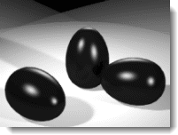

---
---
<!-- TODO: Make sure to update this page and get working in the guides section of the documentation. -->

# 摄影棚布光基础
{: #studio-lighting-bascis}
模型渲染的摄影棚设置与真实的摄影棚类似，使用数盏灯光来照明场景会有较灵活的控制。

摄影棚照明通常需要较大的明暗对比度，阴暗处与明亮处一样重要，要达到这个目的需要在场景里加入额外的灯光，并对灯光做特殊安排，让场景有明显的阴暗与明亮区域的分别。
基本的摄影棚使用三点布光- 主光（1），辅光（2）及背光（3），这样的设置常用于人像照或产品摄影，也是摄影入门技巧。三点布光通常使用聚光灯，聚光灯可以控制照明方向，它的热点区域可以让观众的目光聚焦在场景的某一部分。

## 摄像机的角度
{: #cameraangle}
摄像机的拍摄角度决定场景的照明设置，所以在摆设灯光之前必须完成摄像机的摆设。使用 **Camera** 或 **NamedView** 指令显示摄像机，以便调整摄像机的位置与角度，也有助于灯光的摆设。

## 基本的三点布光设置
{: basic-three-light-setup}
基本的摄影棚照明有三个灯光：主光、辅光、背光。

### 主光
{: #keylight}
主光是照亮场景最主要的光源，它可以控制渲染的气氛、突显物件表面的细节及投射主要阴影。主光通常放置在物件的正侧边及仰角30到45度的位置，放置位置可能因渲染的物件不同而异。
主光靠近摄像机时，物件表面细节的自体投射阴影较少，细节的深浅度较不明显；主光远离摄像机时，物件表面细节的自体投射阴影较多，细节深度会较明显。主光的位置通常会高于摄像机镜头，并向下投射阴影，但不能过高以至于在人像的眼睛部位出现阴影。
如果主光是柔光灯，辅光的亮度可以适度调低，甚至不需要辅光，这也是小型影棚常用方法。
主光会投射阴影在物件本体上，例如人像鼻子下方的阴影。

### 辅光
{: #filllight}
如果主光是放在摄像机的右侧，辅光就必须放在摄像机的左侧，辅光的高度通常比摄像机镜头高一点。辅光的目的是淡化主光投射的阴影浓度，模拟来自其他物件反射的间接光。主光与辅光的亮度相当时，可以得到对比度较低的渲染效果，但通常主光必须较为锐利。辅光是场景中的第二光源，它投射的阴影必需比主光投射的阴影淡。
请注意这个图片中人像的鼻子左侧的阴影比只有主光时要淡，而且较为模糊。

### 背光
{: #backlight}
背光的目的是用来凸显物件的边缘，让物件与背景分离，使渲染效果更有层次感。背光通常摆放在摄像机的对面，即物件后上方的位置。 
背光在物体边缘产生的效果与物件材质的反射度有关。
图片中人像的肩膀上方边缘因为背光的关系产生了一些反光，让人像可以与背景分离，背光同时可以淡化人像投影在底平面上的阴影。

## 照明质量
{: #lightquality}
渲染图片即使有正确的阴影、反光与反射，照明设置不好时将无法凸显渲染的主题。照明的设置必需考虑渲染的目的，且力求简单，过多的灯光只会造成过多的反光与阴影，徒增渲染图片的复杂度而失去重点。
照明质量考虑的要点：

>场景的对比度范围
>场景的深度（立体感）
>物件与背景的间隔
>照明锐利度或柔和程度
>照明色调的冷、暖

### 对比度范围
{: #contrastrange}
对比度范围是指场景中最亮区域至最暗区域之间的范围，人眼可以感受的对比度范围远高于底片可以记录的范围，且具有自动调整功能。
所以场景中有极亮与极暗区域时，人眼可以看到这两个区域的细节，该场景记录到底片上后会流失这两个区域的细节，这种现象也可以套用到渲染图片上，因为计算机可以显示的色彩范围也有同样的限制。

对比度范围较小的图片中的细节比较不会被极亮与极暗区域掩盖。

### 立体感
{: #three-dimensional}
以平面图片显示立体场景需要有深度感，灯光照射在物件上所产生的明暗区域具有深度感的暗示效果，就像图中的立方体一样，因为三个面的明暗度不同，可以让观看者产生立体的感受。真实世界的光源通常来之上方，物件朝上的面通常会比较亮，所以灯光摆放的位置会影响渲染图片看起来是否真实。

### 背景间隔
{: #separation}
除了立体感与对比度范围以外，要在渲染图里凸现主题物件还必需让它与其背景有所间隔，让主题物件的边缘比背景稍亮或比背景稍暗可以制造这样的效果，否则主题物件可能会融入背景而得不到观看者目光的青睐。
图片中黑色的蛋因为边缘有反光，让它可以与同样是黑色的背景有所区别，使观看者有可以看见蛋尖端附近完整轮廓的错觉。
物件的阴影也可以有类似的效果，例如物件与底平面的颜色相近时，物件的阴影可以让物件的底部与底平面之间有明显的区隔。

### 照明的锐利度
{: #hard-soft}
灯光可以使用锐利（聚光灯）与柔和（漫反射）做区别。
聚光灯投射阴影的边缘会比较“硬”。

漫射灯投射阴影的边缘会比较“糊”。
漫射灯因为阴影边缘的渐层变化让它比聚光灯的效果好。灯光的面积与距离也会影响到阴影的锐利度，光源面积越大或越靠近物体所投射的阴影边缘越模糊。大面积的光源可以用来模拟来自窗户的天光照明。

漫射照明在深色塑料物件上表现很好，因为漫射灯面积较大，在深色反光物件上可以产生较大的反光。有助于物件形状的表达。

摄影棚照明通常需要较大的明暗对比度，阴暗处与明亮处一样重要，要达到这个目的必需对灯光做特殊安排，让场景有明显的阴暗与明亮区域的分别。
渲染的照明设置基本与真实摄影相同，所以您可以使用讨论摄影的技术书籍作为渲染的参考资料。
Flamingo nXt 內建几种默认的[照明设置组](lighting-tab.html#lighting-presets)，让您可以快速完成模型的照明安排，[高级](lighting-advanced-tab.html)页面的设置已针对不同的照明组最佳化。
