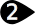
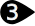
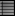

#  {{page.title}}
{: #environment-tab}
环境不仅仅是指渲染中看得见的背景，而是指包裹在整个模型周围的环境。场景中的物件上将会反射和折射出环境。 环境领域不是一种对象,您可以 选取、但参考 曲面 的背景效果。环境并不是一个可选取的物件，但它可以影响物件表面的反射以及渲染的背景效果。

环境对背景的可见部分及反射产生影响，关于影响场景照明的效果请参考帮助主题[天光](sun-and-sky.html)。

Flamingo 自带的环境称之为[默认的 Flamingo 环境](environment.html)，此环境与当前的[照明预设](lighting-tab.html)同步，使用[照明预设](lighting-tab.html)，可以将照明和环境同时设置到相应的场景预设。

{:  #panel_map height="600px" style="float: right"}

##### 在哪里可以找到这个指令？
 1. 环境选项卡
 1. 渲染工具工具列 >  环境编辑器
 1. 功能表 > 渲染下拉菜单 > 环境编辑器
 1. 指令 > EnvironmentEditor

环境编辑器由不同的几部分组成，环境类型不同，高级面板中所显示出的内容也不同。

您可以将颜色和贴图从色卡中拖放到环境编辑器、[贴图面板](texturepalette.html)或[环境编辑器](environmenteditor.html)中的其他色卡或控件上。
环境面板

 1. [背景类型](#type)
 1. [设置栏](#settings)
 1. [环境列表](#environment_list)
 1. [窗口折叠器](#divider)
 1. [环境属性栏](#properties)
 1. [名称](#name)
 1. [环境属性面板](#panels)

## [背景类型](#panel_map) 
{: #type style="clear: both;"}
为模型选取背景类型，[环境](#flamingo-environment)类型包含了其他几个类型，Flamingo 的默认背景类型是“环境”，其他三种类型通过一些简单的选项来定义背景。更多信息请参考 [Rhinoceros 简单背景](http://docs.mcneel.com/rhino/5/help/en-us/commands/environmenteditor.htm#Basic_settings)主题。

本主题主要探讨“环境”类型。

## [设置栏](#panel_map) 
{: #settings}
使用此栏浏览环境列表。

####  后退箭头
使用此箭头返回当前环境的上一级或返回上一个选择的环境，例如，环境中含有折射或反射层，使用此按钮可以从折射或反射层返回到上一层父环境。

####   向前箭头
使用此箭头前往上一个选择的环境，例如，环境中含有折射或反射层，使用此按钮可以从父环境进入刚刚访问过的折射或反射层。

####  当前选取环境的名称
显示当前环境的名称和层级，例如当前所在折射或反射层的名称显示在 “>” 标记之后，您就可以了解目前位于哪个环境的子层级下。

####  工具菜单
显示[工具菜单](#tools-menu)，这是一个扩展菜单，包含一些环境相关的设置和工具。

####  说明

## [环境列表](#panel_map) 
{: #environment_list}
列表中列出了当前模型中所有的环境，选取一个环境为当前使用的环境，该环境四周将出现黄色的角。

您可以在此列表中进行如下操作：

* 在环境上点击可以选取环境，被选取环境的属性显示在下方的面板中，更多信息请参考[渲染材质属性](#properties)。
* 在列表中上下滚动鼠标查看模型中所有的环境。
* 点击列表最下方的添加按钮可以在列表中增加新的环境。
* 在环境缩略图上点击鼠标右键可以打开快显菜单。
* 在列表中的空白区域点击鼠标右键也可以打开一个快显菜单，可以在该菜单中新建环境。

###   添加新环境
{: #add_environment}
滚动到环境列表底部，可以看到新增按钮。

弹出环境的渲染内容[材质库](libraries.html)。
可以通过此环境库中的环境作为模板建立新的材质。

### 环境快显菜单
{: environment_context}
在列表中点击鼠标右键可以打开快显菜单，该菜单中的相关选项请参考[工具菜单](#tools_menu)。

### 新建环境快显菜单
{: new_envrionment_context}
在环境列表中的空白区域点击鼠标右键可以打开此菜单。

####  建立新环境
建立一个新的 Flamingo 环境。

####  从文件导入环境
使用此功能可以导入以前导出的环境。

####  粘贴
使用剪贴板中的内容建立新的环境。

####  粘贴为引例
从剪贴板中的内容创建一个与源环境相关联的引例环境。

####  图示
以缩略图图示显示。

####  清单
以缩略图列表显示。

####  层级列表
显示为嵌套层级图。

####  水平布局
将预览显示在控制选项的左侧。

####  显示预览面板
显示当前所选材质的预览，可以设置该预览所使用的几何形状、大小、背景和旋转特性。

####  浮动
将缩略图显示在一个可调大小的浮动窗口中。

#### 缩略图

#####  小
设置为小缩略图。

#####  中
设置为中缩略图。

#####  大
设置为大缩略图。

#####  显示名称
以图示模式显示时显示缩略图名称标签。
列表模式将始终显示标签。

#####  显示单位
以模型单位显示大小。

#####  自动更新缩略图
更改设置时自动更新缩略图。

#####  更新所有缩略图
自动更新缩略图关闭时，可以通过此选项手动更新。

## [窗口折叠器](#panel_map) 
{: #divider}
在这个窗口折叠器上按下并拖动鼠标可以改变环境列表的长度， 环境列表长度增大，环境属性栏的长度就会减少。

## [环境属性栏](#panel_map) 
{: #properties}

### [环境名称](#panel_map) 
{: #name}
这是环境的名称，将环境导出到材质库时，环境名称也将作为保存文件的名称。 附注: 环境保存于 Rhino 模型当中，不同的环境，在不同的模型中可以具有相同的名称。

### [环境面板](l#panel_map) 
{: #panels}
环境属性栏中含有几个可卷展的环境面板。 点击标题所在的灰色区域可以折叠或展开环境面板。点击标题可以显示出其中的内容。

当前选择的环境类型不同，环境面板中的可设置的内容也不同， 环境面板中具体的控制参数信息，请参考 [Flamingo 环境](environment.html)。

## 工具菜单 
{: tools_menu}
在列表中的缩略图上或列表中的空白区域点击鼠标右键弹出的快显菜单中也可以访问这些设置。

####  设置为目前的环境
将目标环境设置为目前使用的环境，目前的环境将使用在之后的渲染当中。

####  建立新环境
建立一个新的 Flamingo 环境。
<!-- This comes from the page http://docs.mcneel.com/rhino/5/help/en-us/popup_moreinformation/materialthumbnail_contextmenu.htm -->
在列表中的缩略图上或列表中的空白区域点击鼠标右键弹出的快显菜单中也可以访问这些设置。

####  从文件导入环境
从已保存的 Rhino .renv 文件中导入环境。

####  保存到文件
将环境保存为 Rhino .renv 文件。

####  更改类型
将环境更改为其他类型。

####  更改类型 (复制类似的设定)
将环境更改为其他类型。
取决于[渲染选项](http://docs.mcneel.com/rhino/5/help/en-us/options/rendering.htm)  > [渲染内容发生改变时复制相似的设置](http://docs.mcneel.com/rhino/5/help/en-us/options/rendering.htm#Copy_similar_settings_when_content_type_is_changed)是否勾选，如果勾选了此项，变更渲染内容时，相互兼容的设置将会从旧的渲染内容复制到新的渲染内容。

####  重置为默认值
将环境设置重置为默认的单一颜色背景(黑色)、反射背景，可见的天空和折射背景。

####  复制
将选取的环境复制到 Windows 剪贴板，然后可以将其粘贴到环境编辑器中生成一个新的环境，也可以直接粘贴到文件夹中作为[材质库](libraries.html)中的文件。

####  粘贴
使用剪贴板中的内容建立新的环境。

####  粘贴为引例
从剪贴板中的内容创建一个与源环境相关联的引例环境。

####  删除
删除所选的环境。

####  重命名...
重命名所选的环境。

####  建立副本
通过所选环境的设置，建立一个新的环境。

####  移除引例
移除[引例环境](#paste-as-instance)与源环境之间的连接关系。



####  渲染属性过滤器
打开[渲染属性过滤器](content_filters.html)对话框。

####  属性
打开[预览属性](previewproperties.html)对话框。
