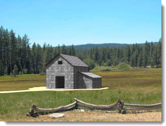

#  {{page.title}}
Rhino 中的[环境](http://docs.mcneel.com/rhino/5/help/en-us/commands/environmenteditor.htm)有很多种，这个主题里我们只介绍 Flamingo 的默认环境。

环境对背景的可见部分及反射产生影响，关于影响场景照明的效果请参考帮助主题[天光](sun-and-sky-tabs.html)。

Flamingo 自带的环境称之为**默认的 Flamingo 环境**，此环境与当前的[照明预设](lighting-tab.html)同步，使用[照明预设](lighting-tab.html)，可以将照明和环境同时设置到相应的场景预设。

Flamingo 环境设置属性有:

> [名称](#name)
> [Flamingo 环境](#environment)
> [背景颜色](#color-backgrounds)
> [高级背景](#advanced-background-reflected-sky)

## 环境名称
{: #name}
环境是储存于 Rhino 模型当中的，这是环境在 Rhino 模型中的名称， 这意味着编辑材质库中或其他模型中相同名称的环境，不会对当前模型中同名的环境产生影响。如要将环境应用在其他模型当中，需要先将环境导出到[材质库](libraries.html)，环境的名称也将作为导出文件的名称。

## Flamingo 环境
{: #environment}
环境在渲染中主要对以下三方面产生影响：

>可见的背景
>[反射的背景](#advanced-background-reflected-sky)
>[折射的背景](#advanced-background-refracted-sky)

可见背景是场景中能够被直接看到的基本背景颜色，可见背景在常规属性面板中就可以设置，[反射](#advanced-background-reflected-sky)与[折射](#advanced-background-refracted-sky)的背景可以设置为不同的内容，需要在高级背景栏中设置。

#### 强度
{: #background-intensity}
修改背景相对亮度， 将数值与背景颜色值相乘以达到调整亮度的目的。每个通道的颜色值在 0 - 255 之间，数值将与这些颜色值相乘，如果背景相对于渲染物件显得特别暗，可以适当调整此项。

#### 背景类型
{: #background-type}
设置要填充为渲染图像背景的颜色配置，背景可以是以下类型：

> [天光](#environment-sky)
> [单一与渐变颜色](#color-backgrounds)
> [图像](#environment-image)
> [HDR 与平面 HDR 图像](#hdr-background)

## 天光背景
{: #environment-sky}
天光环境使用[照明](lighting-tab.html)选项卡中的太阳与天光射。在渲染默认设置中，天光是开启的。

*自动 (左) ，HDR 图像与太阳 (右)。*

## 颜色背景
{: #color-backgrounds}
颜色背景总是会被解算，即使在颜色被图片、HDRi 或天光背景完全遮盖的情况下，颜色背景依然是存在的。

#### 单一颜色
{: #solid-color}
单一颜色背景以一种颜色填充整个背景。

*单一颜色背景*
查阅下文中的[颜色控制](#enviroment-sky-color-controls)了解更多有关单一颜色的内容。

#### 双色渐变
{: #two-color-gradient}
双色与三色渐变的背景只有在透视图工作视窗才有作用。双色渐变背景有选取的一个颜色变化至另一个颜色。

*双色渐层背景：蓝、黄。*
查阅下文中的[颜色控制](#enviroment-sky-color-controls)了解更多编辑双色渐变的详细信息。

#### 三色渐变
{: #three-color-gradient}
三色渐变背景由选取的一个颜色变化至另一个颜色，再变化至第三个颜色。

*三色渐层背景：蓝、白、黄。*
查阅下文中的[颜色控制](#enviroment-sky-color-controls)了解更多编辑三色渐变的详细信息。

### 颜色控制
{: #enviroment-sky-color-controls}
选择不同的颜色背景类型，可以设置的选项数量也不同，渐变背景最多可以选择三种颜色，包括顶部颜色，中间颜色与底部颜色。



#### 对调颜色
点击此按钮对调上方与下方的颜色。

#### 渐变映射控制
{: #gradient-mapping}
使用渐变映射将渐变背景中的颜色映射到环境球上。只有选择双色渐变或三色渐变时，渐变映射控制才会启用，渐变只能被映射在透视视图。

#### 从视图获取角度
{: #angle-from-views}
如果勾选了“从视图获取角度”，颜色渐变将与当前的渲染透视视图同步，顶部颜色将对应视图的最顶部，底部颜色对应视图的最底部， 其他颜色将均匀的填充在底部与顶部之间。

#### 改变渐变的范围
{: #colorrange}
如果目前工作视窗是使用透视投影，可以将渐变分布至视图的整个范围。

{: style="float: left; padding-right: 25px;padding-bottom: 15px;padding-top:15px;"}

* 该控制器所示即为环境的剖视图，90 度标记所示即为朝上的 Z 轴坐标， 0 坐标代表水平地面，-90 度标记表示向上 Z 坐标的反方向。
* 灰色扇形区域是目前工作视窗的纵向视野范围。
* 红色标记的角度值代表顶部颜色完全显示的角度。
* 三色渐层中的绿色标记代表中间颜色完全显示的角度。
* 蓝色标记的角度值代表底部颜色完全显示的角度。

####  从视图获取角度按钮
点击此按钮可以将渐变映射重置到当前透视视图的可见范围。

#### 顶部/中间/底部角度
当前渐变中顶部、中间、底部颜色完全呈现时的角度值，对应着控制器中的红色、绿色、蓝色标记。

## 图像背景
{: #environment-image}

以图片投影作为背景。常常用于将模型放置到一个现成的环境中或将背景呈现为窗外的景色。该图片可以是数码相片，扫描的图画作品或是以绘图软件制作的图片。做为环境背景的图片最好选用高分辨率的图片，将图片稍微做点模糊处理并提高亮度可以模拟真实世界的深度感与辽阔的场景。背景图像可以映射到平面、圆柱或球体上投影到场景中。

*一张作为背景的平面图像*

### 图像文件
{: #image-properties}
点击写着*(空 - 按此赋予)*的大按钮选择一张图片，更换一张其他图片作为背景，直接点击缩略图即可选择图片并更换。

### 投影方式
{: #backgroud-image-projection}
从下拉菜单中选取以下三种投影方式

>[平面](#planar)
>[圆柱](#cylindrical)
>[球体](#spherical)

每种投影方式都使用其特有的设置来定位图片。

### 平面投影
{: #planar}
将图像投影到当前视图后的一个平面上， 平面投影坐标总是与当前视图相关联。

#### 从视图获取角度
勾选“从视图获取角度”后，图像将于当前视图同步，图像总是完全匹配当前视图的可见范围。

#### 图像放置控制
使用图像放置控制器控制图像相对于当前视图的位置。 工作视窗的可见范围对应图示中的灰色区域，拖动粉色矩形或通过数值来调整背景图与视图的对应关系。

*当前工作视窗可见区域 1)和图片的大小形状(2)。*

#### X 缩放 / Y 缩放
设置背景图相对于视窗宽度和高度的缩放比（0 - 1.0）,都设置为 1 ，图像为视窗大小的 100%，都设置为 0.5，图像为视窗大小的 50% 。

#### X 偏移 / Y 偏移
设置背景图相对于工作视窗左下角的偏移距离，0 - 1.0 的数值对应着相对于视图宽高的比例，设置为 0.25 表示相对于视图尺寸偏移 25%，设置为 0.5 表示相对于视图尺寸偏移 50% 。

#### 图像放置控制
使用图像放置控制器控制图像相对于当前视图的位置。 工作视窗的可见范围对应图示中的灰色区域，拖动粉色矩形或通过数值来调整背景图与视图的对应关系。

*当前工作视窗可见区域 1)和图片的大小形状(2)。*

#### X 缩放 / Y 缩放
设置背景图相对于视窗宽度和高度的缩放比（0 - 1.0）,都设置为 1 ，图像为视窗大小的 100%，都设置为 0.5，图像为视窗大小的 50% 。

#### X 偏移 / Y 偏移
设置背景图相对于工作视窗左下角的偏移距离，0 - 1.0 的数值对应着相对于视图宽高的比例，设置为 0.25 表示相对于视图尺寸偏移 25%，设置为 0.5 表示相对于视图尺寸偏移 50% 。

### 圆柱投影
{: #cylindrical}
将背景图片投影至环绕模型的圆柱曲面，这个投影方式适合使用 360 度环绕拍摄的照片。

以角度值设置图片出现在渲染里的大小、位置、宽度与高度，右边的示意图形上角度标记可以使用鼠标移动，灰色扇形区域代表目前工作视窗的横向与纵向视野范围。

#### 从视图获取角度
勾选“从视图获取角度”后，图像将于当前视图同步，图像总是完全匹配当前视图的可见范围。

#### 水平控制
设置图片出现在渲染图片里的水平位置，您可以输入角度值或移动示意图上的角度标记来设置背景图出现的位置，蓝色区域表示背景图出现的位置。

{: .float-img-left}

* 图示表示整个环境的俯视图。
* 暗灰色扇形区域是目前工作视窗的水平可见范围。
* 蓝色区域表示图片将出现的范围。
* 蓝色标记表示图片的左边。
* 红点表示背景图片的中心。
* 紫色标记表示图片的右边。

#### 垂直控制
{: .clear-img}
设置图片出现在渲染图片里的垂直位置， 您可以输入角度值或移动示意图上的角度标记，上/下角度有正、负 45 度的限制。

{: .float-img-left}

* 图示表示圆柱的截面视图。
* 灰色扇形区域是目前工作视窗的纵向视野范围。
* 蓝色标记表示图片的下边缘。
* 红色标记表示图片的上边缘。

#### 旋转
{: .clear-img}
设置图像的选择，红点表示图像的中心。

#### 宽度
设置图像相对于视图的水平宽度。

#### 顶部/底部
设置图片相对于模型地平面的对顶角。

####  从视图获取角度按钮
将旋转角度与当前透视工作视窗想匹配，用它来重置投影设置很有效。

### 球体投影
{: #spherical}
以球体投影将图片分布至整个球体，这种投影方式适合全景的环境贴图。 等量矩形图像需要长宽比为 2:1 的长方形。

#### 从视图获取角度
勾选“从视图获取角度”后，图像将于当前视图同步，图像总是完全匹配当前视图的可见范围。

#### 球体控制
设置图像映射的方向，输入一个角度值或直接拖动控制器上的标记来设置，红点表示背景图像的中间。

#### 旋转
{: .clear-img}
设置图像的选择，红点表示图像的中心。

####  从视图获取角度按钮
将旋转角度与当前透视工作视窗想匹配，用它来重置投影设置很有效。

## HDRi 背景
{: #hdr-background}
使用 HDR 图像作为环境可以更进一步控制背景灯光和图像中灯光的关系。使用HDR图片作为场景的照明光源可以提供更真实、自然的照明效果，尤其是明亮的户外光源透过窗户照亮室内场景的情形特别有用。HDR 图片可以记录的亮度范围远大于一般图片，您可以赋予 HDR 图片一个独立的[照明通道](lights-tab.html#channel)，以便在渲染完成后可以再对 HDR 图片的亮度做调整。

#### 图像文件
{: #hdri-image}
点击写着*(空 - 按此赋予)*的大按钮选择一张 HDRi 贴图，更换一张其他图片作为背景，直接点击缩略图即可选择图片并更换。






## 平面 HDRi 选项
{: #planar-hdr-options}

通常平面高动态贴图(HDRi)用的较少，但是却非常有用。HDRi 能够提供更多的亮度范围和颜色信息，平面的高动态范围图片可以拿来做室内场景的窗外景观贴图与户外光源，是室内设计渲染的常用方法。

*使用一般图片（左）与平面 HDR (右) 做为窗外景观贴图渲染时场景照明的细微差异。*

#### 图像文件
{: #hdri-planar-image}
点击写着*(空 - 按此赋予)*的大按钮选择一张 HDRI 贴图，更换一张其他图片作为背景，直接点击缩略图即可选择图片并更换。



## 高级背景
{: #advanced-background}
高级背景设置控制着环境中未出现在视图中，但能够反应在物件反射和折射之中的背景，给物件反射的环境背景可以与渲染图片里看到的环境背景不同。 下面这个例子的环境背景是黑色，但在金属球上的反射是设为使用HDR图片。

*可见的背景（左）与使用HDR图片（右）做为物件的反射环境背景。*

### 反射
{: #advanced-background-reflected-sky}
反射环境不能在渲染图片中直接看到，但是能够被光亮的物件反射。

#### 天光
以[照明 > 天空与太阳](sun-and-sky-tabs.html)做为物件反射的环境背景。

#### 自定义
使用[单一颜色或渐变色](#color-backgrounds)、[一般图片](#environment-image)或 [HDR](#hdr-background) 图片做为物件反射的环境背景。

#### 可见的背景
以[环境](environment-tab.html)页面的背景设置作为物件反射的环境背景。

### 折射
{: #advanced-background-refracted-sky}

#### 天光
以[照明 > 天光与太阳](sun-and-sky-tabs.html)做为透明物件折射的环境背景。

#### 自定义
使用[单一颜色或渐变色](#color-and-gradient-backgrounds)、[一般图片](#image)或 [HDR](#hdr-background) 图片做为物件折射的环境背景。

#### 可见的背景
以[环境](environment-tab.html)页面的背景设置作为物件折射的环境背景。

#### Alpha 通道忽略材质的透明度
{: #no-transparent-alpha-objects}
打开这个选项时，使用透明材质的物件会被当作不透明的物件处理创建 Alpha 通道。
如果您想在图片合成时保留透明物件里看到的环境背景，请打开这个选项。
