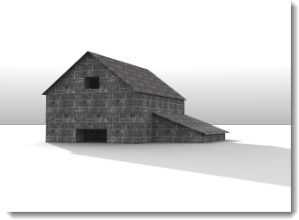

# {{page.title}}
{: #ground-plane}

底平面是一个无限延伸的水平面，在渲染中可以处于任何海拔高度位置。在渲染中使用底平面要比用一个非常大的曲面速度快很多。

### 启用
{: #groundplane-enabled}
打开底平面。

*使用 (左) 与不使用 (右) 底平面 *

### Alpha 通道
{: #groundplane-alpha}
渲染时在底平面加入 Alpha 通道（透明通道），透明通道可用于渲染图片的后处理，将渲染的物件、阴影与另一张图片合成，请参考：[维基百科：Alpha compositing](http://en.wikipedia.org/wiki/Alpha_compositing)。

 *底平面上除了阴影以外的部分都是透明的。*

### 高度
{: #groundplane-elevation}
设置底平面在原点之上的高度。 

*底平面的高度在原点之上。*

### 材质
{: #groundplane-material}
设置底平面使用的[材质](simple-material-properties.html)。

*提高的底平面加上水材质的效果。*
