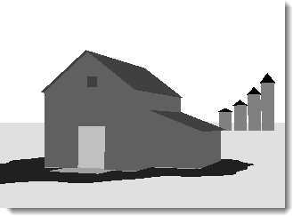
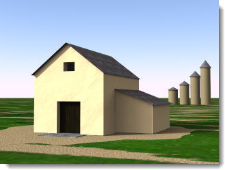
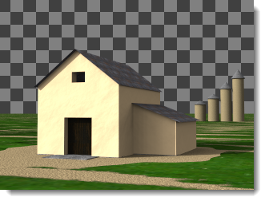
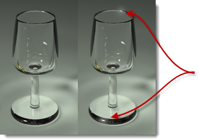

# {{page.title}}
Flamingo nXt 的渲染图片编辑器可以编辑所有 nXt 平台创建的原生图片文件 (.nXtImage) ，这种文件格式保存了渲染过程收集的信息。 
Flamingo nXt 渲染图片编辑器的功能：

> 调整[色调映射](image-editor.html#tone-mapping)。
> 变更照明通道的亮度。
> 加入特殊的图片后处理效果：[雾气](image-editor.html#haze)、[景深模糊](image-editor.html#depth-blur)、[眩光](image-editor.html#glare)...等。
> [保存](image-editor.html#save-tonemapped-image-as)色调对应处理后的图片格式：JPG、PNG、TIF...
> 保存含亮度信息的 [HDR](image-editor.html#save-hdr-image-as) 图片。
> 查看与储存 [Alpha](image-editor.html#alpha-channel)、[距离](image-editor.html#distance-channel)、[材质](image-editor.html#material-channel)通道信息，以便进行后续的图片合成处理。
> 可以储存 [Piranesi©](http://www.piranesi.co.uk/) 文件格式 (*.epx)，用来创建手绘风格的图片。
> 使用图片[运算](image-editor.html#arithmetic)功能将渲染农场分配给客户端计算得到的渲染切片组合成完整的图片。
> 修改光源的[照明](image-editor.html#save-lighting-settings-as)亮度，储存不同版本的渲染图片。

运行渲染图片编辑器

> 从 **Flamingo nXt 5.0** 功能表点击 **更多工具 &gt; Flamingo nXt 图像编辑器**。

## 文件菜单
{: #file-menu}

### 打开
打开 nXtImage 文件格式做编辑。

### 保存源图像
保存修改过的 nXtImage 文件。

### 源图像另存为
以不同名称保存目前的 nXtImage 文件。

### 色调映射后的图像另存为
{: #save-tonemapped-image-as}
将 nXtImage 文件另存为一般的图片文件。

 * JPEG (.jpg)
 * TIFF (.tif)
 * TIFF 含 Alpha 通道 (.tif)
 * PNG (.png)
 * PNG 含 Alpha 通道 (.tif)
 * [Piranesi EPix 文件 (.epx)](http://www.piranesi.co.uk/)

Piranesi 是一种 3D 绘图程序，可以创建手绘风格的图片。 

### HDR 图像另存为
{: #save-hdr-image-as}

 * HDR 文件 (.hdr)
 * EXR 文件 (.exr)
 * EXR 含 Alpha 通道 (.exr)

### 保存遮罩
{: #save-mask}
nXtImage 文件内含三种通道信息，可以在大部分的平面绘图软件里作为图片合成的遮罩使用，通道是储存在每一个像素的额外信息，以灰度值表示，每一个通道都可以独立查看与另存图片。

##### 附注:

 1. Alpha 通道可以保存到支持 Alpha 通道的图片格式。
 1. 距离与材质通道并未经过反锯齿处理，图片边缘会有锯齿的情形，以这两个通道输出的图片作为遮罩使用时做适度的模糊处理会有比较平滑的遮罩效果。
 1. 材质通道只能储存 255 种材质，当模型内含超过 255 种材质时，会有部分的材质使用相同的通道。

#### 材质通道
{: #material-channel}
用于保存材质遮罩。

#### Alpha 通道
{: #alpha-channel}
用于保存 Alpha 通道。

#### 距离通道
{: #distance-channel}
用于保存距离通道。

### 照明设置另存为
{: #save-lighting-settings-as}
保存[照明配置](lighting-tab.html#open-lighting-scheme)。

## 图像菜单
{: #renderwindowimage}

### 信息
{: #info}
显示渲染图片的信息。

### 运算
{: #arithmetic}
Allows piecing together or overlaying segments of images rendered using the [Render Farm Single Image](automate-rendering.html#single-images) function.

##### 组合渲染切片：

 1. 从**文件**菜单选择**打开**。
 1. 打开第一个渲染切片，例如：000000.nXtImage。
 1. 从**图像**菜单选择**运算** > **相加**。
 1. 打开所有其他切片。

**附注**：请勿再打开第一个渲染切片 (000000.nXtImage)，否則它会被再加入一次。

#### 相加
将渲染图片像素的 RGB 值相加，相加后的值大于 255 时都以 255 表示 。

#### 相减
将渲染图片像素的 RGB 值想减，相减后的值小于 0 时都以 0 表示。

#### 差异
将渲染图片像素的 RGB 值以大的减去小的，相减的结果一定是正数，任何颜色与黑色做差异运算时结果不变，与白色做差异运算时结果会相反。

#### 遮罩相加
除了 RGB 值相加以外， Alpha 通道也相加。

#### 结合路径追踪
结合使用路径追踪引擎渲染的图片，例如：10张以上20个处理数渲染的图片可以结合成一张处理数为 200 的渲染图片。

*20 个处理数的渲染图片（左）与10张 20 个处理数的渲染图片结合成 200 个处理数的渲染图片（右）。*

### 应用补丁
{: #apply-patch}
从已渲染的图像中选取一部分插入到当前渲染图像中。

### 动画
创建图片处理效果的渐变动画。

##### 创建动画

 1. 设置第一个图片。按**加号 (+)** 按钮加入一个新的**图框**。
 1. 编辑渲染图片，再加入其它图框。
 1. 从**图片 > 动画**打开动画对话框，按**预览**按钮。
 1. 如果预览的效果符合要求，再按**动画**按钮。

### 创建一个文件夹。
创建一连串的图片，这些图片可以使用其它程序串成视频。

## 查看菜单
{: #view-menu}
设置如何显示渲染图片。

### 图像
显示完整的渲染图片。

### 图像与 Alpha 遮罩
同时显示渲染图片与 Alpha 通道遮罩。

### 材质遮罩
显示[材质遮罩](image-editor.html#material-channel)。

### 距离遮罩
显示[距离遮罩](image-editor.html#distance-channel)。

## 使用图像编辑器

##### 载入渲染图片

 1.  将渲染图片[保存](render-window.html#export-to-nxtimage)为 **.nXtImage** 文件。
 1. 从 **Flamingo nXt** 菜单选择**工具 > Flamingo nXt 图像编辑器**。
 1. 在 nXt **图像编辑器**里，从文件菜单选择**打开**，将 .nXtImage 文件载入。

## 色调映射
{: #tone-mapping}
色调映射是将亮度信息转换为荧幕色彩显示范围（RGB）的方法。 

#### 亮度
{: #brightness}
请参考：[渲染视窗的亮度设置](render-window.html#brightness)。 


#### 加亮
请参考：[渲染视窗的加亮设置](render-window.html#burn)。

#### 饱和度
请参考：[渲染视窗的饱和度设置](render-window.html#saturation)。

#### 色阶分布图
请参考：[渲染视图的色阶分布图](render-window.html#histogram)。

## 信息栏
信息栏位于图像编辑器视窗的下方，当您在渲染图片上移动鼠标时，信息栏会显示鼠标所在像素的各种信息。

#### 像素
{: #pixel}
像素坐标，原点（0，0）为左下角。

#### 颜色
{: #color}
前三个栏为色调映射处理后的 RGB 值，第四栏是用于图片合成的 Alpha （透明）值。

#### 值
{: #value}
R、G、B 三个通道个别的亮度值。

#### 亮度
{: #lum}
储存在每个像素的加权平均流明值。 

#### 深度
{: #depth}
渲染图片里一个点距离摄像机远近的数值，-1.0代表背景。

#### 材质
{: #material}
鼠标所在位置的物体使用的材质。

## FX 设置
图像中可以加入一些特殊效果，这些效果有很多可以通过附加信息的形式储存在 NXTimage 文件中。例如眩光效果所使用的实际亮度范围以及雾气的距离等等这些信息都以附加信息的形式储存在 NXTimage 文件中。

### 雾气
{: #haze}
依据距离远近将设置的颜色加入像素，产生雾气的效果。 

*原来的（左）与加上雾气的（右）渲染图片。*

#### 强度
设置雾气的浓度。

#### 近
摄像机至雾气效果起点的距离。 

#### 指定
在渲染图片里指定距离。

#### 远
雾气效果浓度停止变化的距离，从这个距离开始雾气的浓度是固定的。 
近，远两点之间的雾气浓度是以线性变化。 

#### 指定
在渲染图片里指定距离。

#### 颜色
雾气的颜色。

#### 指定
在渲染图片里指定颜色。

### 景深模糊
{: #depth-blur}
渲染图片里的每个像素都含有距离通道，该通道的数值代表一个像素距离摄像机的远近，可以用来产生景深模糊的效果。

*原来的（左）与加上景深模糊的（右）渲染图片。*

#### 强度
设置模糊的量。

#### 焦点
{: #depthblurfocus}
设置渲染图片焦点的位置。

#### 指定
在渲染图片里指定焦点的距离。

#### 焦内区域
{: #in-focus-zone}
**焦点**前、后图片未做模糊处理的范围，单位为米，超过这个范围的图片的模糊度会随着距离提高，模拟真实摄像的景深。

#### 模糊
设置模糊处理的方向，默认值为**背景**，只会对**清晰范围**之后的图片做模糊处理。 

*前景模糊（左）与背景模糊（右）。*

#### 背景
**焦内区域**之后图片的模糊度随着远离的距离逐渐增加。

#### 前景
**焦内区域**之前图片的模糊度随着靠近的距离逐渐增加。

#### 两者
**焦内区域**前后都做模糊处理，这种处理效果的景深模糊不如渲染时直接运算的[景深](render-tab.html#depthoffieldoption)模糊精准。

### 眩光
{: #glare}
以像素的亮度值得决定是否在该像素周围产生眩光效果，渲染图片里只有高亮度的像素会有这种效果。
在渲染图片上移动鼠标可以显示像素的亮度值。

*原来的（左）与加上眩光的（右）渲染图片。*

#### 强度
调整光芒的大小。

#### 临界值
数值越低作用的范围越大，所有亮度高于临界值的像素都会产生光芒的效果。

#### 指定
在渲染图片里指定亮度值。

### 晕映
{: #vignette}
以选取的颜色在渲染图片周围产生羽化边框的效果。

*原来的（左）与加上晕映的（右）渲染图片。*
