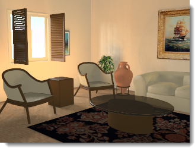

#  {{page.title}}
照明是渲染时最重要也是最容易被忽视的部分。照明不只是照亮模型这么简单，它可以营造出特殊的氛围，也是渲染成功与否的关键。

*由 Christopher Soto Gutiérrez 提供的图片。*

#### 在哪里可以找到 Flamingo 照明控制？

* 功能表 > Flamingo nXt 5.0 下拉菜单 > 显示控制面板 > Flamingo nXt。
* 在任意面板上点击鼠标右键，勾选 Flamingo nXt。

请使用下列要点渲染模型：

* 使用照明预设。
* Flamingo nXt 模拟真实世界的灯光进行计算，所以尽可能提供精确的信息。
* 避免灯光使用非真实的亮度。
* 模型单位要设置正确，模型的单位设置不正确，灯光计算就不可能正确。例如：如果您是设置毫米创建模型，请确定模型的单位也是设置为毫米。
* 提高场景的整体亮度请使用渲染视窗的[亮度](render-window.html#brightness)设置，提高场景中的每一个灯光的亮度不是好方法，因为 Flamingo nXt 的自动[曝光](render-window.html#brightness)功能会让您对灯光的调整适得其反。

要提高照明设置技巧，需要关注光线如何影响不同的曲面，材质会对阴影和反射有一定的遮蔽作用，所以一些渲染专家先设置好照明再为物件附材质，请尝试以照相机的角度客观的观察光线。

## 照明预设组
{: #lighting-presets}
Flamingo 内置的照明预设接近真实世界的照明环境，对新手来说从使用照明预设开始学习渲染照明是一个非常好的选择，Flamingo nXt 中有好几组照明预设，虽然有很多选项可以供您自定义，但默认的选项足以应对很多种渲染场景了。请选择与您要渲染场景最解决的照明预设。

Flamingo nXt 内置了下列四组默认的照明设置:

> [摄影棚照明](lighting-tab.html#studio-lighting)
> [户外日光](lighting-tab.html#exterior-daylight)
> [室内日光](lighting-tab.html#interior-daylight)
> [人工照明](lighting-tab.html#artificial-lighting)

### 摄影棚照明
{: #studio-lighting}
这个照明默认组模拟摄影棚的照明配置，常用于中小型物件单独摄影的情形，它的主要光源来自一张 HDR （高动态）图片，HDR图片的照明亮度已适当降低，以符合真实摄影棚内的照明亮度。

{: .float-img-left} 高动态(HDR)贴图能够提供照亮场景的主要照明，HDR 贴图中的照明效果可以达到摄影棚室内灯光的照明级别。HDR 的设置位于[天光](sun-and-sky-tabs.html#sky)选项卡中，您也可以在灯光页面加入其它灯光物件。此外，摄影棚照明默认背景是黑色的。

摄影棚照明默认组是针对中小型物件（珠宝与产品设计）的桌面摄影最佳化的配置。在这个默认组里，太阳是关闭的，并以一张 HDR 图片做为表面具反射性质的物件的反射图片。

使用灯光来为场景照明可以更加有效的控制照明效果。摄影棚照明通常需要较大的明暗对比度，阴暗处与明亮处一样重要，要达到这个目的需要在场景里加入额外的灯光，并对灯光做特殊安排，让场景有明显的阴暗与明亮区域的分别。

渲染的照明设置基本上是与真实的摄影没有什么不同，所以您可以将讨论摄影技术的书籍作为渲染的参考资料，更多关于摄影棚照明设置的信息请见：[摄影棚照明的基本技巧](../guides/studio-lighting-basics.html)。

### 户外日光
{: #exterior-daylight .clear-img}
此配置以太阳与天空模拟建筑物外观渲染使用的场景照明。

{: .float-img-right} [太阳](sun-and-sky-tabs.html#sun)与[天光](sun-and-sky-tabs.html#sky)的设置可以在太阳与天光页面里修改，您可以直接设置想要的[太阳角度](sun-and-sky-tabs.html#set-azimuth-and-altitude)，或以[地理位置](sun-and-sky-tabs.html#set-location-on-earth)、日期及时间计算太阳的角度，这个默认组默认的背景是虚拟的天空。

建筑外观渲染的户外照明设置最为简单，通常只需要默认的[太阳](sun-and-sky-tabs.html#sun)做为光源即可。

当[太阳](sun-and-sky-tabs.html#sun)打开时，场景设置必需区分[室內](#interior)或[户外](#exterior)，因为天空的亮度、地面反射的光线与物件反射的光线对照明的影响在室内与户外有很大的差别，正确的设置[室內/户外](#indirect)可以让渲染较有效率，效果也会较为真实。

通常室内与户外场景很容易区别，当摄像机位于建筑物之外即为户外场景；摄像机位于建筑物之内即为室内场景。但有些场景就不是那么有明显的区别，例如：建筑物的中庭、建筑物的爆炸图或剖面图。以建筑物的中庭为例，当中庭的面积大，四周建筑较低时，这样的场景会有较多的天光照明，可以把它当作户外场景看待。当中庭面积小，四周较高时，场景会比较类似室内场景，这种情形可以在中庭上摆设“日光入口”物件，将天空的照明导入场景。

户外场景除了以太阳与天空的照明外，人造灯也是不可缺的角色，尤其是在晚上或旁晚照明不足的场景都需要人造灯的辅助。但人造灯在大白天的户外场景就像真实世界一样会被户外高亮度的环境掩盖，对场景的影响微乎其微。

爆炸图、剖面图、立体正投影图这类特殊渲染的照明选择取决于需要效果，需要较快的渲染速度可以使用户外照明，效果达不到要求时可以改用室内照明，室内照明的设置会较花时间。

### 室内日光
{: #interior-daylight .clear-img}
模拟室内场景以自然光源照明的情形。

{: .float-img-left} 它的照明包含来自[太阳](sun-and-sky-tabs.html#sun)的直接照明与来自[天光](sun-and-sky-tabs.html#sky)、地面及其它物件的间接光。

它的[太阳](sun-and-sky-tabs.html#sun)和[天光](sun-and-sky-tabs.html#sky)的设置与[户外日光](lighting-tab.html#exterior-daylight)类似。
白天场景来自太阳的直接照明的设置最简单，通常只要提供日期、时间与位置就可以正确计算太阳的照射角度与方向。

室内渲染的附注：
{: .clear-img}

* 设置[灯光](lights-tab.html)、[天光](sun-and-sky-tabs.html#sky)与窗户的玻璃材质时请尽可能的使用正确数值。
* 太阳与天空的亮度远超过灯光的亮度，所以在太阳与天空打开时灯光对场景的照明不会有明显的影响，这是与真实世界相仿的正常情形，请勿因此而提高灯光的亮度。
* 您可以将[太阳](sun-and-sky-tabs.html#sun-intensity)或[天光](sun-and-sky-tabs.html#sky-intensity)的亮度调低，模拟多云或阴天的状况。
* 使用[多通道](lights-tab.html#channel)渲染可以保留各种照明的精确信息，渲染完成后可以再调整每一个光源的强弱。

### 人工照明
{: #artificial-lighting}
{: style="float: right; padding-left: 25px;"} 模拟夜间室内以人造光照明的场景，您可以使用[灯光选项卡](lights-tab.html)或 [Rhino 的灯光指令](lights-tab.html#rhino-light-commands)在模型里加入灯光物件。

间接照明是由物件表面反射光线产生的照明效果，选择“室内日光”和“人工照明”这两种预设时会自动开启间接照明，而“摄影棚照明”和“户外日光”这两种照明配置中间接照明是关闭的， 间接照明对于室内渲染来说非常重要，而对于摄影棚和户外场景渲染，打开与关闭效果不是很明显，所以默认情况下是关闭的。

### 自定义照明
{: #custom  style="clear:both;"}
可以在自定义选项卡中将预设配置改为自定义配置， 例如，先选取了“户外日光”预设配置，但是此时天光为“自动天光”，如果想改为 HDRi 天光，就可以在自定义选项卡中修改，修改预设配置时，配置会变成自定义配置。

####  [日光](sun-and-sky-tabs.html#sun)
{: #sun}
在下拉选项中选择打开或关闭太阳选项卡，[太阳选项卡](sun-and-sky-tabs.html#sun)包含修改太阳位置的一些参数。

*太阳打开与关闭。*
太阳是距离模型无限远的平行光源，使用球面坐标控制日光的方向，更多详情请参考[太阳选项卡](sun-and-sky-tabs.html#sun)主题。

####  [天光](sun-and-sky-tabs.html#sky)
{: #sky}
设置天光通道为四种类型之一。

> 自动
> HDRI
> 颜色
> 图像

更多详情请参考[天光选项卡](sun-and-sky-tabs.html#sky)主题。
是距离模型无限远的半球形光源。

#### 关闭
{: #off}
关闭天光。

#### 自动
{: #auto}
提供了一种模拟真实世界的天空，[太阳](sun-and-sky-tabs.html)选项卡中的选项控制着天空所呈现出的形态及光线的品质。

#### HDRi
{: #hdri}
HDR 贴图为反光物件提供了反射影像。

#### 颜色
{: #color}
将天空设置为单一颜色、双色渐变或三色渐变，设置与[环境：颜色与渐变](environment-tab.html#color-and-gradient-backgrounds)类似。

#### 图像
{: #image}
以图片作为背景，图片的投影方式可以有：平面、圆柱体、球体，设置与[环境背景类型：图片](environment-tab.html#image)类似。

### 摄影棚亮度
{: #studio-brightness}
降低[太阳](sun-and-sky-tabs.html)与天空的亮度，模拟摄影棚的室内照明效果。

*摄影棚亮度关闭（左）与打开（右）。*

### 灯光
{: #lights}
打开或关闭人工照明。

*灯光打开（左）与关闭（右）。*

### 间接照明
{: #indirect}
间接照明是指物体表面反射的光源，间接照明在室内日光默认是打开的，在户外日光与摄影棚照明默认是关闭的，但您可以选择在使用户外日光的场景打开间接照明。

#### 方式
间接照明的计算方法

#### 关闭
关闭

#### 室内
{: #interior}
对室内场景的间接照明最佳化。

#### 户外
{: #exterior}
对户外场景的间接光最佳化。

从物件表面反射的光源可以在户外场景加入细微的照明效果，增加渲染的真实感，尤其是在凸出物件的下方，例如：屋檐与阳台的下方可以受到间接光，不会有一片漆黑、不真实的情形。

#### 反弹数
{: #bounces}
设置光线从物件表面反弹产生间接光的反弹次数。

### 环境光
{: #ambient}
环境光可以提高场景的整体亮度，这里的设置可以控制环境光的强弱。

降低环境光的强度可以提高渲染图片的对比度，太强的环境光会让渲染图片看起来平淡无趣，太弱又会造成对比过高的问题。

#### 空
没有环境光。

#### 户外
使用针对户外场景最佳化的环境光。

#### 室内
使用针对室内场景最佳化的环境光。

#### 摄影棚
使用针对摄影棚场景最佳化的环境光。

## 保存自定义照明

### 保存自定义照明配置
{: #save-lighting-scheme}
 保存当前的照明配置。

### 打开自定义照明配置
{: #open-lighting-scheme}
 打开之前保存的照明配置。
