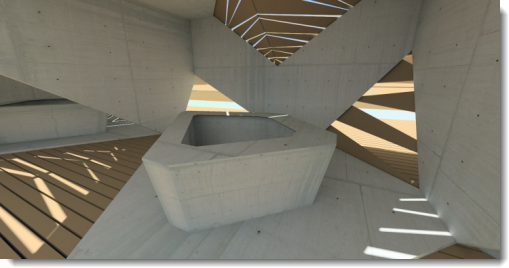
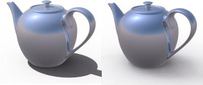
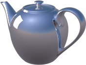

# {{page.title}}
照明是渲染时最重要也是最容易被忽视的部分。照明不只是照亮模型这么简单，它可以营造出特殊的氛围，也是渲染成功与否的关键。

*由 Christopher Soto Gutiérrez 提供的图片。*

#### 在哪里可以找到 Flamingo 照明控制？

* 功能表 > Flamingo nXt 5.0 下拉菜单 > 显示控制面板 > Flamingo nXt。
* 在任意面板上点击鼠标右键，勾选 Flamingo nXt。

请使用下列要点渲染模型：

* 使用灯光预设。
* Flamingo nXt 模拟真实世界的灯光进行计算，所以尽可能提供精确的信息。
* 避免灯光使用非真实的亮度。
* 模型单位要设置正确，模型的单位设置不正确，灯光计算就不可能正确。例如：如果您是设置毫米创建模型，请确定模型的单位也是设置为毫米。
* 提高场景的整体亮度请使用渲染视窗的[亮度](render-window.html#brightness)设置，提高场景中的每一个灯光的亮度不是好方法，因为 Flamingo nXt 的自动[曝光](render-window.html#brightness)功能会让您对灯光的调整适得其反。

To improve lighting techniques, be aware of the light and how it affects various surfaces. Materials can mask some of the effects of shadows and reflections, so some rendering experts apply lighting to their models before applying materials. Try to see light objectively, the way a camera does.

## Lighting Presets
{: #lighting-presets}
A great starting place for lighting is the included Lighting presets that correspond to real-world lighting situations. Flamingo nXt provides lighting presets that can get you started lighting your model. There are many more lighting options available, but the presets are often enough for many different renderings. Choose the Preset scheme that most closely resembles your scene.

Flamingo nXt 内置了下列四组默认的照明设置:

>[摄影棚照明](lighting-tab.html#studio-lighting)
>[户外日光](lighting-tab.html#exterior-daylight)
>[室内日光](lighting-tab.html#interior-daylight)
>[人工照明](lighting-tab.html#artificial-lighting)

### 摄影棚照明
{: #studio-lighting}
这个照明默认组模拟摄影棚的照明配置，常用于中小型物件单独摄影的情形，它的主要光源来自一张 HDR （高动态）图片，HDR图片的照明亮度已适当降低，以符合真实摄影棚内的照明亮度。

{: .float-img-left}高动态(HDR)贴图能够提供照亮场景的主要照明，HDR 贴图中的照明效果可以达到摄影棚室内灯光的照明级别。HDR 的设置位于[天光](sun-and-sky-tabs.html#sky)选项卡中，您也可以在灯光页面加入其它灯光物件。此外，摄影棚照明默认背景是黑色的。

摄影棚照明默认组是针对中小型物件（珠宝与产品设计）的桌面摄影最佳化的配置。在这个默认组里，太阳是关闭的，并以一张 HDR 图片做为表面具反射性质的物件的反射图片。

使用灯光来为场景照明可以更加有效的控制照明效果。摄影棚照明通常需要较大的明暗对比度，阴暗处与明亮处一样重要，要达到这个目的需要在场景里加入额外的灯光，并对灯光做特殊安排，让场景有明显的阴暗与明亮区域的分别。

渲染的照明设置基本上是与真实的摄影没有什么不同，所以您可以将讨论摄影技术的书籍作为渲染的参考资料，更多关于摄影棚照明设置的信息请见：[摄影棚照明的基本技巧](../guides/studio-lighting-basics.html)。

### 户外日光
{: #exterior-daylight .clear-img}
此配置以太阳与天空模拟建筑物外观渲染使用的场景照明。

{: .float-img-right}[太阳](sun-and-sky-tabs.html#sun)与[天光](sun-and-sky-tabs.html#sky)的设置可以在太阳与天光页面里修改，您可以直接设置想要的[太阳角度](sun-and-sky-tabs.html#set-azimuth-and-altitude)，或以[地理位置](sun-and-sky-tabs.html#set-location-on-earth)、日期及时间计算太阳的角度，这个默认组默认的背景是虚拟的天空。

建筑外观渲染的户外照明设置最为简单，通常只需要默认的[太阳](sun-and-sky-tabs.html#sun)做为光源即可。

当[太阳](sun-and-sky-tabs.html#sun)打开时，场景设置必需区分[室內](#interior)或[户外](#exterior)，因为天空的亮度、地面反射的光线与物件反射的光线对照明的影响在室内与户外有很大的差别，正确的设置[室內/户外](#indirect)可以让渲染较有效率，效果也会较为真实。

通常室内与户外场景很容易区别，当摄像机位于建筑物之外即为户外场景；摄像机位于建筑物之内即为室内场景。但有些场景就不是那么有明显的区别，例如：建筑物的中庭、建筑物的爆炸图或剖面图。以建筑物的中庭为例，当中庭的面积大，四周建筑较低时，这样的场景会有较多的天光照明，可以把它当作户外场景看待。当中庭面积小，四周较高时，场景会比较类似室内场景，这种情形可以在中庭上摆设“日光入口”物件，将天空的照明导入场景。

户外场景除了以太阳与天空的照明外，人造灯也是不可缺的角色，尤其是在晚上或旁晚照明不足的场景都需要人造灯的辅助。但人造灯在大白天的户外场景就像真实世界一样会被户外高亮度的环境掩盖，对场景的影响微乎其微。

爆炸图、剖面图、立体正投影图这类特殊渲染的照明选择取决于需要效果，需要较快的渲染速度可以使用户外照明，效果达不到要求时可以改用室内照明，室内照明的设置会较花时间。

### 室内日光
{: #interior-daylight .clear-img}
模拟室内场景以自然光源照明的情形。

{: .float-img-left}它的照明包含来自[太阳](sun-and-sky-tabs.html#sun)的直接照明与来自[天光](sun-and-sky-tabs.html#sky)、地面及其它物件的间接光。

它的[太阳](sun-and-sky-tabs.html#sun)和[天光](sun-and-sky-tabs.html#sky)的设置与[户外日光](lighting-tab.html#exterior-daylight)类似。
白天场景来自太阳的直接照明的设置最简单，通常只要提供日期、时间与位置就可以正确计算太阳的照射角度与方向。

室内渲染的附注：
{: .clear-img}

* 设置[灯光](lights-tab.html)、[天光](sun-and-sky-tabs.html#sky)与窗户的玻璃材质时请尽可能的使用正确数值。
* 太阳与天空的亮度远超过灯光的亮度，所以在太阳与天空打开时灯光对场景的照明不会有明显的影响，这是与真实世界相仿的正常情形，请勿因此而提高灯光的亮度。
* 您可以将[太阳](sun-and-sky-tabs.html#sun-intensity)或[天光](sun-and-sky-tabs.html#sky-intensity)的亮度调低，模拟多云或阴天的状况。
* 使用[多通道](lights-tab.html#channel)渲染可以保留各种照明的精确信息，渲染完成后可以再调整每一个光源的强弱。

### 人工照明
{: #artificial-lighting}
{: style="float: right; padding-left: 25px;"}模拟夜间室内以人造光照明的场景，您可以使用[灯光选项卡](lights-tab.html)或 [Rhino 的灯光指令](lights-tab.html#rhino-light-commands)在模型里加入灯光物件。

间接照明是由物件表面反射光线产生的照明效果，有室内和室外两种预设的配置， is on when one of the two interior presets is selected and off for studio and exterior. This type of lighting is a significant component of an interior simulation. For exteriors and studio models the effects of indirect lighting is more subtle and is thus turned off by default.

### 自定义照明
{: #custom  style="clear:both;"}
Custom is the tab to mix and match parts of the lighting prelights together.  For instance, if the scene is Exterior daylight, but lit with the addition of an HDRi environment, use the Custom tab to turn off and on parts of the lighting model.  When the values change from the defaults for the presets, the scheme becomes a custom scheme.

#### [太阳](sun-and-sky-tabs.html#sun)
{: #sun}
Turn on and off the Sun tab in the drop down. The [Sun tab](sun-and-sky-tabs.html#sun) contains the controls for altering the parameters of the sun position.

*Sun on and off.*
The sun is a very bright directional light source infinitely far from the model. The controls for the sun specify its direction using spherical coordinates. For more details, see the [Sun tab](sun-and-sky-tabs.html#sun) topic.

#### [天光](sun-and-sky-tabs.html#sky)
{: #sky}
Set the Sky channel to one of four options:

>Auto
>HDRI
>颜色
>图像

For details, see the [Sky tab](sun-and-sky-tabs.html#sky) topic.
Defines a hemispherical light source infinitely far away from the model.

#### Off
{: #off}
Turns the sky off.

#### Auto
{: #auto}
Provides an analytical model based on real-world sky conditions. The settings on the [Sun](sun-and-sky-tabs.html) tab control the appearance and light qualities of the sky.

#### HDRi
{: #hdri}
An HDR image provides something for shiny objects to reflect.

#### 颜色
{: #color}
Sets the sky to a solid color or a two- or three-color gradient using controls similar to [Environment: Color and Gradient Backgrounds](environment-tab.html#color-and-gradient-backgrounds).

#### 图像
{: #image}
Uses an image background with a planar, cylindrical, or spherical projection similar to [Environment: Image](environment-tab.html#image).

### Studio Brightness
{: #studio-brightness}
Reduces the brightness of the [sun](sun-and-sky-tabs.html) and sky to mimic the interior lighting levels of a photographer's studio.

*Studio Brightness off (left) and on (right).*

### 灯光
{: #lights}
Turns artificial lighting on and off.

*Lights on (left) and off (right).*

### 间接照明
{: #indirect}
Defines the lighting reflected from surfaces. By default, it is on for interior lighting and off for exterior and studio lighting preset schemes. It is possible to turn on indirect lighting for exterior renderings.

#### Method
Sets the calculation method for indirect lighting.

#### Off
Turns indirect lighting calculation off.

#### Interior
{: #interior}
Optimizes the indirect lighting for indoor situations.

#### Exterior
{: #exterior}
Optimizes the indirect lighting for outdoor situations.

Indirect lighting reflected from other surfaces can add subtlety and realism to your exterior rendering. In particular, the undersides of overhanging features such as eaves or balconies render more accurately with indirect lighting.

#### Bounces
{: #bounces}
Specifies the number of reflections caused by an indirect light.

### Ambient
{: #ambient}
Ambient light is a constant light added to the rendering. These settings control the intensity of the ambient light as a percentage of the total estimated ambient light in the scene.

Decreasing the amount of ambient light generally produces images with more contrast. Too much ambient light can make a rendered image seem flat and uninteresting; too little can cause excessive contrast.

#### None
No ambient light.

#### Exterior
Optimizes ambient light for exterior scenes.

#### Interior
Optimizes ambient light for interior scenes.

#### Studio
Optimizes ambient light for studio scenes.

## Saving Custom Lighting

### Save lighting scheme
{: #save-lighting-scheme}
Saves the current lighting scheme.

### Open lighting scheme
{: #open-lighting-scheme}
Opens a saved lighting scheme.
