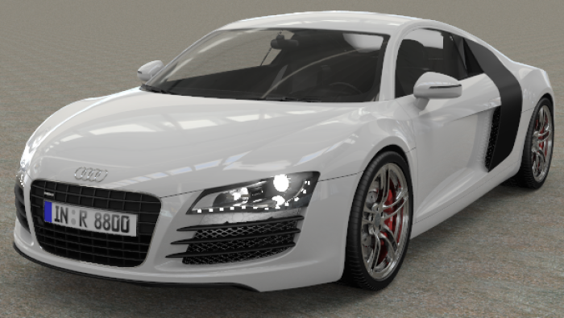

#  {{page.title}}
人造灯光源使用标准的 Rhino 灯光和灯光上附加的 Flamingo 属性控制灯光分布。搭建渲染模型过程中选用灯光源时，请选择最能够反应场景在现实世界真实情况的灯光。

## 灯光选项卡
{: #light-tab}
灯光选项卡中列出了场景中所有的人造灯光，这个主题将讨论 Flamingo 中的灯光选项卡，Rhino 中还有一个 [Rhino 灯光选项卡](http://docs.mcneel.com/rhino/5/help/en-us/index.htm#commands/lights.htm)，Flamingo 和 Rhino 灯光选项卡中的设置是同步的，Flamingo 中的灯光选项卡有一些更详细的[灯光属性](#light-properties)设置。

灯光选项卡必须通过载入[照明预设](lighting-tab.html#lighting-presets)来开启或在[自定义照明设置](lighting-tab.html#sun)中开启。

<!-- #### Is this supposed to be a code? It's showing up as ####. To fix this, there needs to be a new line above the headline for the markdown to work.-->

#### 在哪里可以找到 Flamingo 照明控制？
如果在[照明预设](lighting-tab.html#lighting-presets)或[自定义照明设置](lighting-tab.html#sun)中打开了灯光选项，就可以通过以下途径找到灯光选项卡：

 1. 工具列 >Flamingo nXt 工具列
 1. 功能表 > Flamingo nXt 5.0 下拉菜单 > 显示控制面板 > Flamingo nXt 选项卡 > 灯光选项卡

在灯光选项卡中，您可以插入，关闭或打开灯光，修改每个灯光的强度及通道。

Flamingo 支持这些灯光类型:

> [标记物件为灯光](#tag-objects-as-lights)
> [聚光灯](#spotlight)
> [点光源](#pointlight)
> [矩形灯光](#rectangularlight)
> [管状灯](#linearlight)

**附注:** 不支持 Rhino 平行光 ，在场景中添加 Rhino 平行光以后不会出现在灯光列表里，也无法对其进行 Flamingo nXt 附加属性设置。

列表中同时也以表格形式显示出一些通用的灯光属性以方便您快速编辑。

表格中的属性包括：

 >[打开/关闭](#on)
 >[名称](#name)
 >[照明方式](#light-distribution)
 >[目标](#aim-light)
 >[瓦特](#watts)
 >[通道](#channel)

在灯光选项卡列表中点击鼠标右键可以打开[附加选项](#additional-options)菜单。

也可以点击[物件属性面板](http://docs.mcneel.com/rhino/5/help/en-us/commands/properties.htm)上的灯光属性图标  进入[灯光属性](#light-properties)。

## 灯光类型
{: #light-types}
可以从 Rhino 工具列或 Flamingo 灯光选项卡上向场景添加灯光，物件也可以通过 Flamingo 标记为灯光。

####  标记物件为灯光
{: #tag-objects-as-lights}
任意可渲染的物件(曲面、实体等)都可以标记为光源，并赋予[照明方式](#light-distribution)、[方向](#aim-light)、[强度](#watts)等属性。 tagged as lights may display a preview widget showing direction of the light and its center location.

*LED 日间行车灯及大灯都是直接将模型标记为光源*

####  聚光灯
{: #spotlight}
灯光的形状为圆锥体，模拟有方向与角度的射灯。灯光属性包括[光源半径](#radius)、[投射角度](#beam-angle)、衰减半径以及方向。光源半径越大，该光源产生的阴影越柔和。默认情况下灯光所在位置有一个可见的圆盘。编辑位置、方向、投射角度等信息，请参考 [Rhinoceros 聚光灯](http://docs.mcneel.com/rhino/5/help/en-us/commands/spotlight.htm)帮助主题。

*一个指向红色方体的聚光灯。*

####  点光源
{: #pointlight}
点光源是一个照明方式为所有方向的小球体，这个光源的灯光属性包括[光源半径](#radius).。光源半径越大，该光源产生的阴影越柔和。默认情况下，渲染图片中光源位置会有一个可见的发光球体。使用点光源的时候请注意不要让物件和点光源相交，不然可能会出现一些不正常的效果。

*靠近右侧墙壁的小点光源*

####  矩形灯光
{: #rectangularlight}
灯光形状为矩形平面，模拟灯光经过矩形灯罩的照明效果。灯光的照明方式由矩形的方向决定，矩形灯光的中间有一个小箭头， 具有完整亮度的光线从矩形发出，然后沿着一个角度向周围扩散并衰减， 默认情况下在渲染图像中能够看到光源处白色的矩形。设置矩形灯光时有一种常见的错误，就是把矩形灯光的高度设置的和天花板完全一样，矩形灯光和天花板重叠，会渲染出不正常的灯光，所以矩形灯光要设置的比天花板略微低一些。可以在屏幕上通过控制杆来编辑矩形灯光的位置、方向、投射角度等，详情请参考 [Rhinoceros 矩形灯光](http://docs.mcneel.com/rhino/5/help/en-us/commands/rectangularlight.htm)帮助主题。

*天花板上的矩形灯光*

####  管状灯
{: #linearlight}
灯光的形状为圆柱体，模拟日光灯管。该灯光的灯光属性有[光源半径](#radius)和长度，光源半径越大，该光源产生的阴影越柔和。默认情况下，渲染图片中光源位置会有一个可见的发光圆柱体，使用管状灯的时候请注意不要让物件和管状灯相交，不然会出现一些不正常的效果。可以打开 Rhino 控制点在屏幕上编辑管状灯。

## 灯光属性
{: #light-properties}
将 Flamingo 设置为 Rhino 目前的渲染器之后，就可以为灯光设置一些附加属性。灯光的有些属性是公有的，而有些是特定的灯光才有的。

#### 名称
{: #name}
灯光物件的名称。有助于区分模型中相同类型的灯光。

####  打开/关闭
{: #on}
切换灯光的打开与关闭状态，在灯光列表中，如果灯光的图标为黄色，说明灯光在渲染中是打开的，如果是灰色，说明灯光是关闭的。在图标上双击可以切换打开与关闭状态，在属性对话框中，可以通过设置勾选状态来打开或关闭灯光。

#### 可见
{: #visible}
默认情况下,灯光自身也将显示为一盏明亮的灯源。 取消选中“可视”属性，在渲染中将不会出现灯光物件本身，但灯光依然可以照亮场景。

#### 照明方式 *([仅用于标记为灯光的物件](#tag-objects-as-lights))*
{: #light-distribution}
当物件标记为灯光时，设置灯光投射到场景中的方式。在灯光面板， 双击照明方式将出现下拉选项，照明方式包括: [所有方向](#pointlight), [聚光](#spotlight)以及[漫射](#rectangularlight)。聚光和漫射都需要设置照明的[方向](#aim-light)。

#### 灯光方向 *([仅用于标记为灯光的物件](#tag-objects-as-lights))*
{: #aim-light}
标记为灯光的物件如何照明方式为聚光或漫射，就需要为其指定灯光方向，双击“灯光方向 >>”选项，根据提示进行操作。

#### 瓦特
{: #watts}
设置灯光的使用功率。 建议以实际场景的亮度值进行设置。在灯光列表中,双击表示该灯光瓦特值的单元格来更改此值。

#### 投射角度 *([仅适用于聚光灯](lights-tab.html#spotlight))*
{: #beam-angle}
控制光线从光源发出以后发散的角度，也可以在屏幕上通过该灯光上的控制杆来修改，通过控制杆编辑的具体方式请参考 [Rhinoceros 聚光灯](http://docs.mcneel.com/rhino/5/help/en-us/commands/spotlight.htm)帮助主题。

#### 半径
{: #radius}
可见光源的大小，越小的光源投射产生的阴影越锐利。

#### 颜色
{: #color}
灯光的颜色。

#### 使用材质颜色 *([仅适用于标记为灯光的物件](#tag-objects-as-lights))*
以物件材质的颜色为灯光的颜色。 

#### 通道
{: #channel}
设置灯光照明通道，共有8个通道可以选择。这个功能让您可以在渲染结束后对渲染图像中的灯光进行实时调节。当使用多个光源进行渲染时，可以通过这个强大的功能调节各个灯光的光照平衡。更多信息请参考[渲染通道](render-channel.html)主题。

#### IES 文件
{: #iesfile}
IES (Illuminating Engineering Society) 是一种“测光”文件，用来定义灯光散发的光线，灯具制造商会提供 IES 文件对光源做精准的描述。灯光如何散发光线由测光文件定义，与标记为灯光的物件几何形状无关。

附注:

* Flamingo nXt 支持 Type C 的测光文件，大部分的 IES 文件都属于 Type C 格式。汽车工业在设计汽车大灯时会使用 Type A 格式，泛光灯具的设计会使用 Type B格式，Flamingo nXt 不支持这两种格式。
* IES 可以模拟羽板、反射板、柔光灯罩...等等各种灯具的照明效果。
* IES 的照明效果常常是不对称的，所以调整照明时除了调整目标点的位置之外，可能也要对灯光做旋转。

#### 从文件获取亮度
使用储存在 IES 文件里的亮度设置，未勾选这个选项时则使用灯光物件的[瓦特](lights-tab.html#watts)设置。

## 附加选项菜单
{: #additional-options}
在灯光列表中的灯光上点击鼠标右键可以打开附加选项菜单。

####  打开
切换灯光的[打开/关闭](#on)状态。

#### 删除
删除所选的灯光。

#### 移除灯光标记
移除被标记为灯光物件上的灯光[标记](#tag-objects-as-lights)。

#### 属性
打开该灯光的[灯光属性](#light-properties)。

#### 选取物件并匹配列表条目
从工作视窗中选取灯光，在灯光列表中找到对应的灯光条目。
