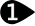

#  {{page.title}}
材质控制材料表面的颜色、折射率、纹理贴图、凹凸映射等。 所有的材质都具有基本的设置，默认材质是白色无光泽的，不透明也不会产生反射效果，为了得到最好的效果，请使用 Flamingo 来设置材质。

材质可以赋予给图层、物件以及图块，可以直接将材质拖放到物件上以赋予物件材质，也可以通过其他途径赋予材质，详细信息请参考[材质赋予](material_assignment.html)。

一旦赋予了材质，材质就保存到模型中了，在[渲染选项](http://docs.mcneel.com/rhino/5/help/en-us/index.htm#options/rendering.htm)中做了正确的设置以后，材质、贴图、以及渲染用到的所有文件都可以保存于 Rhino 模型中。

材质、环境以及贴图都保存于模型中，但是渲染相关内容可以保存到文件中，这样就可以和其他模型共享了，渲染内容可以从 Rhino 窗口拖放到文件夹，颜色色卡也可以使用同样的方式拖放，[材质库面板](libraries.html)显示出默认的渲染内容文件夹，通过此对话框可以将渲染内容拖放到模型中或拖放到外部文件夹中。

{:  #panel_map .float-img-right}

##### 在哪里可以找到这个指令？
可以通过以下几种方式找到材质选项卡

* 材质选项卡
* 渲染工具工具列 >  材质编辑器
* 功能表 > 渲染下拉菜单 > 材质编辑器
* 在指令行输入指令 MaterialEditor

材质编辑器由不同的几部分组成，材质类型不同，高级面板中所显示出的内容也不同。

您可以将颜色和贴图从色卡中拖放到材质编辑器、[贴图面](texturepalette.html)板或[环境编辑器](environmenteditor.html)中的其他色卡或控件上。

##### 材质面板

 1. [设置栏](#settings)
 1. [材质列表](#material_list)
 1. [窗口折叠器](#divider)
 1. [材质属性栏](#properties)
 1. [名称](#name)
 1. [材质属性面板](#panels)

## [设置栏](#panel_map) 
{: #settings .clear-img}
使用此栏浏览材质。

####  后退箭头
使用此箭头返回当前材质的上一级或返回上一个选择的材质，例如，材质中含有嵌套的贴图，使用此按钮可以从贴图中返回上一层父材质。

####   向前箭头
使用此箭头进入当前材质的下一级或进入下一个材质，例如，材质中含有嵌套的贴图，使用此按钮从父材质进入刚刚进入过的贴图中。

####  当前选取材质的名称
显示当前材质的名称和层级，例如当前的材质名称显示在 “>” 标记之后，您就可以了解目前位于哪个材质的子层级下。

####  工具菜单
显示[工具菜单](#tools-menu)，这是一个扩展菜单，包含一些材质相关的设置和工具。

## [材质列表](#panel_map) 
{: #material_list}
列表中列出当前模型中所有的材质，您可以进行如下操作：

* 在列表中上下滚动鼠标查看模型中所有的材质。
* 从列表中将材质拖放到[图层面](http://docs.mcneel.com/rhino/5/help/en-us/index.htm#commands/layer.htm)板或直接拖放到物件上为物件赋予材质，更多相关信息请参考[材质赋予](material_assignment.html)。
* 点击列表最下方的添加按钮可以在列表中增加新的材质。

* 在材质上点击可以选取材质，被选取材质的属性显示在下方的面板中，更多详细信息请参考[渲染材质属性](#properties)。
* 在材质缩略图上点击鼠标右键可以打开快显菜单。
* 在列表中的空白区域点击鼠标右键也可以打开一个快显菜单，可以在该菜单中新建材质。

###   添加新材质
{: #add_material}
滚动到材质列表底部，可以看到新增按钮。

弹出材质的渲染内容[材质库](libraries.html)。
可以通过此材质库中的材质作为模板建立新的材质。

### 材质快显菜单
{: material_context}
在列表中点击鼠标右键可以打开快显菜单，该菜单中的相关选项请参考[工具菜单](#tools_menu)。

### 新建材质快显菜单
{: new_material_context}
在材质列表中的空白区域点击鼠标右键可以打开此菜单。

####  建立新材质
创建一个白色无光泽基本材质。

####  粘贴
使用剪贴板中的内容创建一个新材质。

####  粘贴为引例
从剪贴板中的内容创建一个与源材质相关联的引例材质。

####  图示
以缩略图图示显示。

####  清单
以缩略图列表显示。

####  层级列表
显示为嵌套层级图。

####  水平布局
将预览显示在控制选项的左侧。

####  显示预览面板
显示当前所选材质的预览，可以设置该预览所使用的几何形状、大小、背景和旋转特性。

####  浮动
将缩略图显示在一个可调大小的浮动窗口中。

#### 缩略图

#####  小
设置为小缩略图。

#####  中
设置为中缩略图。

#####  大
设置为大缩略图。

#####  显示名称
以图示模式显示时显示缩略图名称标签。
列表模式将始终显示标签。

#####  显示单位
以模型单位显示大小。

#####  自动更新缩略图
更改设置时自动更新缩略图。

#####  更新所有缩略图
自动更新缩略图关闭时，可以通过此选项手动更新。

## [窗口折叠器](#panel_map) 
{: #divider}
在这个窗口折叠器上按下并拖动鼠标可以改变材质列表的长度， 材质列表长度增大，材质属性栏的长度就会减少。

## [材质属性栏](#panel_map) 
{: #properties}

#### [材质名称](#panel_map) 
{: #name}
这是材质的名称，将材质导出到材质库时，材质名称也将作为保存文件的名称。 附注: 材质保存于 Rhino 模型当中，不同的材质，在不同的模型中可以具有相同的名称。

#### [材质面板](material-editor.html#panel_map) 
{: #panels}
材质属性栏中含有几个可卷展的材质面板。 点击标题所在的灰色区域可以折叠或展开材质面板。

当前选择的材质类型不同，材质面板中的可设置的内容也不同， 材质面板中具体的控制参数信息，请参考 [Flamingo 材质](material-type-simple.html)。

## 工具菜单 
{: #tools-menu}
<!-- This comes from the page http://docs.mcneel.com/rhino/5/help/en-us/popup_moreinformation/materialthumbnail_contextmenu.htm -->
在材质列表中的材质缩略图上或材质列表中的空白区域点击鼠标右键弹出的快显菜单中也可以访问这些设置。

####  赋予给选取的物件
将当前材质赋予给选取的物件。

##### 赋予材质给物件
 1. 点击“赋予给选取的物件”。
 1. 在 Rhino 工作视窗中，选取目标物件。

##### 赋予给已选取的物件
 1. 在 Rhino 工作视窗中，选取目标物件。
 1. 点击“赋予给选取的物件”。
可以在点击“赋予给选取的物件”之前选取物件，也可以点击之后在选取要赋材质的物件。

##### 拖放材质至物件
 * 直接从材质列表中将材质拖放到目标物件上。
拖放材质一次只能为一个物件赋予材质。

####  赋予给图层
将当前材质赋予给图层。

##### 将一个材质赋予给多个图层
 1. 点击“赋予给图层”。
 1. 在选择图层对话框，勾选要赋予材质的图层。

##### 从图层面板中赋予材质
 1. 在[图层](http://docs.mcneel.com/rhino/5/help/en-us/index.htm#commands/layer.htm)面板中，选择一个或多个图层，然后点击[材质](http://docs.mcneel.com/rhino/5/help/en-us/commands/layer.htm#Material)栏。
 1. 在图层材质对话框中，选取要赋予给图层的材质。

##### 拖放材质至图层
 * 直接从材质列表中将材质拖放到目标图层上。
拖放材质一次只能为一个图层赋予材质。

####  选取物件
选取场景中使用了该材质的物件。

####  建立新材质
弹出材质的渲染内容[材质库](libraries.html)。
可以通过此材质库中的材质作为模板建立新的材质。

####  从文件导入材质
从已保存的 Rhino .rmtl 文件中导入材质。

####  保存到文件
将材质保存为 Rhino .rmtl 文件。

####  更改类型
将材质更改为其他类型。

####  更改类型 (复制类似的设定)
将材质更改为其他类型。
取决于[渲染选项](http://docs.mcneel.com/rhino/5/help/en-us/index.htm#popup_moreinformation/materialpanel_toolsmenu.htm) &gt;  [渲染内容发生改变时复制相似的设置](http://docs.mcneel.com/rhino/5/help/en-us/index.htm#popup_moreinformation/materialpanel_toolsmenu.htm)是否勾选，如果勾选了此项，变更材质类型时，相互兼容的设置将会从旧的材质复制到新的材质。

####  重置为默认值
将所有材质设置恢复到默认的白色无光泽无贴图且不反射的状态。

####  复制
将选取的材质复制到 Windows 剪贴板，然后可以将其粘贴到材质编辑器中生成一个新的材质，也可以直接粘贴到文件夹中作为[材质库](libraries.html)中的文件。

####  粘贴
使用剪贴板中的内容创建一个新材质。

####  粘贴为引例
从剪贴板中的内容创建一个与源材质相关联的引例材质。

####  删除
删除所选的材质。

####  重命名...
重命名所选的材质。

####  建立副本
通过所选材质的设置，建立一个新的材质。

####  移除引例
移除[引例材质](http://docs.mcneel.com/rhino/5/help/en-us/index.htm#popup_moreinformation/materialpanel_toolsmenu.htm)与源材质之间的连接关系。


####  渲染属性过滤器
打开[渲染属性过滤器](content_filters.html)对话框。

####  属性
打开[预览属性](http://docs.mcneel.com/rhino/5/help/en-us/index.htm#popup_moreinformation/materialpanel_toolsmenu.htm)对话框。
