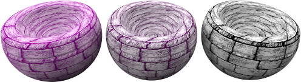
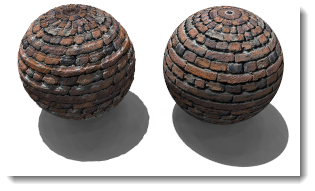

#  {{page.title}}

材质使用的贴图可以从照片或真实的材质（例如：壁纸或毡子）扫描得到，也可以是绘图软件创建的图片或其他各种来源的图片。

材质可以在空间的四个方向重复出现无限延伸，但只有一部分会出现在物件上。

细碎纹理的图片通常比较可以拼贴排列而没有明显的接缝，如果图片拼贴有明显的接缝使纹理看起来不连续，可以使用镜像拼贴选项。

**附注:** 如果您不想让图片在物件上重复出现（例如：酒瓶瓶身上的标签或某个产品上的商标），请改用[印花](properties-decal.html)功能来做这样的贴图。

图片贴图有很多种用法，常见的用法是以真实世界的材质照片作为材质的颜色贴图。

## 名称
图像贴图可以命名，名称仅用于 RDK 中的贴图库，对 Flamingo 没有实际影响。

## Flamingo 图片

### 图片预览
{: #image-preview}
显示选取图片文件的预览，鼠标停留在图片上将弹出图片的文件名，点击图片可以选取另一张图片。

#### 图片分辨率
{: #image-resolution}
显示当前图片文件的分辨率。

### 拼贴
{: #tiles}
材质使用的贴图一定会重复拼贴，这里的设置是指拼贴中的一个单位的尺寸（模型单位）。

#### 宽度/高度
{: #width-height}
以模型单位设置图片的宽度与高度。




### 贴图类型
{: #mapping-type}
图片通常都应用在颜色通道上作为贴图，但是图片也可以用于以下用途：

> [标准](#standard)
> [法线向量](#normal)
> [置换](#displacement)

### 标准
{: standard}
以图片取代材质的颜色，也可以在材质上产生视觉上的凹凸效果。强度和凹凸的值决定了图片如何影响材质。

#### 颜色强度
{: #color}
设置贴图的透明度，以这个例子而言，材质的底色是洋红色，颜色的数值越高，材质的底色透出贴图的量就越少，数值为1.0时，底色完全被贴图遮住。

*颜色强度 0.2、0.5、1.0。*

#### 凹凸
{: #bump}
以贴图的颜色在物件上产生视觉的凹凸效果。下图左边的球体是使用置换贴图，因为物件表面真的变化，所以它的阴影边缘也变得不平滑。右边的球体是使用凹凸效果，物件并未真的变形，所以它的阴影边缘并没有改变，还是非常平滑。请参考：[维基百科: 凹凸贴图](http://en.wikipedia.org/wiki/Bump_mapping)。

*凹凸强度, 0.5 (左) 与 1.0 (右)。*

### 法线向量
{: #normal}
法线向量贴图可以使低网格面数的模型有高网格面数的细节。请参考：[维基百科: 法线贴图](http://en.wikipedia.org/wiki/Normal_mapping)。

法线向量贴图与凹凸贴图类似，这两种贴图都是以改变渲染网格的法线方向增加物件的渲染细节。不同在于：凹凸贴图只是使用图片的灰阶值，所以凹凸效果只有单一方向（法线）的变化；法线向量贴图是以 RGB 代表 XYZ 三个方向，比起凹凸贴图更能表现物件形状变化的丰富细节。

### 置换
{: #displacement}
细分物件网格，对物件网格做真实的凹凸变化，不像凹凸贴图只是视觉上的效果。请参考：[维基百科: 置换贴图](http://en.wikipedia.org/wiki/Displacement_mapping)。

 **附注**：置换贴图会使渲染网格的数目以倍数增加，请小心使用，以免造成内存不足。

#### 高度
{: #height}
变形距离的最大限制。

#### 偏移
{: #offset}
设置置换贴图在曲面法线反向上偏移的百分比，置换可以完全位于曲面外或曲面内，也可以一部分在内一部分在外。

*Z 偏移 = -1.0*

*Z 偏移 = -0.5*

*Z 偏移 = 0.0*

#### 细分面大小
{: #facet-size}
置换贴图网格面的大小。这可以增加置换的细节，但同时也会增加渲染时间和内存占用。

## Flamingo 高级贴图
{: #advanced}
Flamingo 通常都是将图片应用在颜色通道上作为贴图，在 Flamingo 高级编辑器中可以使用贴图制作一些其他效果。

####  基本颜色
这是默认设置，图片可以作为材质的[颜色](advanced-material-properties-main.html#color)。

####  反光颜色
将会使用贴图控制[反射通道](advanced-material-properties-main.html#highlight-color)的颜色。

####  反光强度
图片各个位置的灰度值将更改材质上对应位置的[反射总量](advanced-material-properties-main.html#intensity)。此项常常用在贴图组中作为反光贴图。

####  高光锐利度
图片各个位置的灰度值将更改材质上对应位置[高光](advanced-material-properties-main.html#intensity)的锐利度与模糊度。

#### 高光形状
{: #advanced-highlight-shape}
影响高光的形状。

####  透明度
图片各个位置的灰度值将更改材质上对应位置的[透明度](advanced-material-properties-main.html#intensity)。

####  半透明
图片各个位置的灰度值将更改材质上对应位置的[半透明](advanced-material-properties-transparency.html#translucency)。

####  衰减
图片各个位置的灰度值将更改材质上对应位置的[衰减](advanced-material-properties-transparency.html#attenuation)。

#### 偏移 X/Y
{: #advanced-x-y-offset}
材质在 X/Y 方向的偏移量。

####  旋转
设置图像贴图的旋转角度。例如贴图在物件上方向不对，可以使用 90 或 180 度将图像转正。
