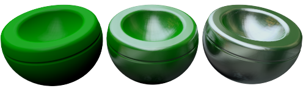
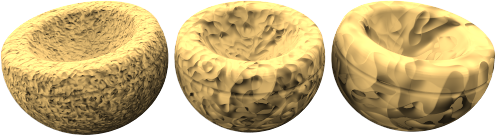

# {{page.title}}

Flamingo 既有[简易材质](material-type-simple.html)类型也有高级材质类型，高级材质包含一系列完整的材质属性设置组， 使用高级材质，可以最大限度的控制和灵活设置材质。

高级材质设置组有:

>[名称](#name)
>[程序材质](#procedures)
>[高级材质属性](#advanced-materials-properties)
>[反射](#reflective-finish-and-highlight)
>[透明属性](#transparency)
>[程序贴图](#bump-patterns)
>[位图贴图](#textures)
>[附注](#notes)

## 材质名称
{: #name}
材质是储存于 Rhino 模型当中的，这是材质在 Rhino 模型中的名称， 这意味着编辑材质库中或其他模型中相同名称的材质，不会对当前模型中同名的材质产生影响。如要将材质应用在其他模型当中，需要先将材质导出到[材质库](libraries.html)，材质的名称也将作为导出文件的名称。

## 程序材质
{: #procedures}
程序材质由一种或多种材质复合而成，程序材质中的层级设置通过一组规则决定了要合并的材质之间是如何互相影响并合并在一起的。层级中显示出了材质的构成元素，您可以在层级列表中添加材质元素。对于标准材质，列表中只有一个元素：基础材质。

每一种程序材质都有两个元素（子材质），一个元素可以由有另一个程序材质的两个元素组成，因此，复杂的材质可以由简单的材质组合而成，Flamingo nXt 的程序材质有下列几种：[角度混合](procedural-materials.html#angular-blend)、[混合](procedural-materials.html#blend)、[大理石](procedural-materials.html#marble)、[花岗岩](procedural-materials.html#granite)、[拼贴](procedural-materials.html#tile)、[木纹](procedural-materials.html#wood)。

举个例子，[大理石](procedural-materials.html#marble)程序材质由基础材质和脉络材质构成。

##### 添加程序材质
1. 在程序材质窗口中的基础材质上点击鼠标右键。
1. 在功能表中，点击程序材质类型。
  * [基础材质](procedural-materials.html#base)
  * [角度混合](procedural-materials.html#angular-blend)
  * [混合](procedural-materials.html#blend)
  * [花岗岩](procedural-materials.html#granite)
  * [大理石](procedural-materials.html#marble)
  * [拼贴](procedural-materials.html#tile)
  * [木纹](procedural-materials.html#wood)

##### 移除程序材质
 1. 在程序材质窗口中，右键点击程序材质的名称。
 2. 在功能表中，点击移除。

## 高级材质属性
{: #advanced-materials-properties}



#### 反射与高光
{: #reflective-finish-and-highlight}
这里的设置可以改变材质反射光源与物件的特性，高光是材质反射光源的亮点，反射是材质上其他物件的反射影像。铬以及其他具有反射特性的金属如果没有反射出一些影像的话就不会有好的表现效果。当使用具有反射特性的材质时，为了表现的生动，一定要认真考虑让这些材质反射环境或其他物件。
 附注: 为了让这些设置起作用，强度值必须大于 0 。

#### 高光颜色
{: #highlight-color}
材质上的高光往往受材质色彩的影响呈现出一些其他的颜色，通过高光颜色可以实现这样的效果。可以通过这三种控制特性来设置高光颜色：白色、金属、自定义。

#### 白色
具有白色高光的材质，其高光中不会含有其他颜色，塑料类、油漆、抛光镜面等材质通常高光为白色。

#### 金属
{: #metallic}
将高光颜色设置为与基础材质相同的颜色，很多抛光金属的高光颜色与其本身的颜色相同，此选项将材质的基础材质颜色设置为高光颜色。

#### 自定义
有些材质在经过很专业的抛光以后，其高光会呈现出与其本色不相同的颜色，这种现象在经过多层处理的金属上很常见。使用“自定义”，可以将高光设置为不同的颜色，使用[颜色选择器](select-color.html) 选择反射颜色。

#### 强度
{: #intensity}
Adjusts the strength of the highlight. Lower values tend to make glossy objects that reflect light, but not the surrounding objects. Larger values increase the size and strength of the highlight and reflections.  The highest values will make the material mirror-like, reflecting other objects and the environment in the scene.

#### Fresnel
{: #fresnel}
Frnsenl的发音近似（fray-NELL），它是以[菲涅耳](http://en.wikipedia.org/wiki/Fresnel_equations)原理控制物件表面的反射特性，它将物件表面的法线方向加入反射度的计算，例如渲染一个表面光滑、低反射度的球体时，球体正对视图的部分反射度较低，球体轮廓附近的部分因为法线偏离视图的方向，会产生类似镜面的高反射效果。

软性的材质可以将这个数值调低，光滑的材质可以将这个数值调高，因为光滑的材质（例如：打磨过的木头）会有明显的菲涅耳原理的现象。

#### 锐利度
{: #sharpness}
设置物件表面的高光／反射的锐利度，数字越小，高光／反射的面积越大、越模糊。数值越大，高光／反射面积越小、越锐利。

#### 类型
{: #type}
反射的计算使用两种方式：*光线投射*与*高光*，这两种方式最终得到的结果很类似，但某些情形下其中一种方式可能可以比较快得到好的效果。物件也可能因为光源的反射太强烈遮盖了材质的外观，影响物件的渲染效果。

下面这个使用均衡类型的例子中，最左边的物件因为大片的反光掩盖了材质纹理。

光源因模糊反射产生光斑的问题通常发生在室內光源较小的场景，将形式设为[模糊](advanced-material-properties-main.html#glossy)、[没有光源反射](advanced-material-properties-main.html#no-light-source-reflection)或[蒙特卡洛](advanced-material-properties-main.html#monte-carlo)可以排除这类的问题。

#### 均衡
{: #balanced}
因锐利度的设置而异，自动在高光与光源反射之间平衡。

#### 模糊
{: #glossy}
使高光更模糊，并关闭对人造光与其他物件的反射计算，渲染速度会因此大幅提高，但也会降低渲染的真实感。

#### 蒙特卡洛
{: #monte-carlo}
只使用光线投射法计算的反射，渲染一开始时光源的反射会是许多杂点，随着时间的加长反射效果会逐渐变均匀，这个形式比较适合用于光源反射不模糊的情形。

#### 无高光
{: #no-highlight}
关闭反光，只计算对人造光与其他物件的反射。这个设置可以用在光源面积很大与反射不模糊的情形，因为这种情形会让反光的计算变得很慢。

#### 无光源反射或高光
{: #no-light-source-reflection-and-no-highlight}
关闭对人造光的反射与高光的计算，但仍然计算其他物件的反射。

#### 无光源反射
{: #no-light-source-reflection}
不以光线投射法计算光源的反射，只计算高光，这个方法可以用来避免场景有模糊材质与高亮度小光源时可能产生光斑的问题。

## 透明度
{: #transparency}
透明度设置控制光线穿过材质的属性特征。

#### 透明度的强度
更改材质的透明程度，使用透明的材质会增加渲染时间。

#### 折射率
{: #index-of-refraction}
决定了透过材质观察其他物件时产生折射的程度。

以下表格列出了一些材质的折射率:

 | 材质      |     | 折射率         |
 |:--------------|:---:|:------------|
 | 真空        |     | 1.0         |
 | 空气           |     | 1.0029      |
 | 冰           |     | 1.309       |
 | 水         |     | 1.33        |
 | 玻璃         |     | 1.52 to 1.8 |
 | 绿宝石       |     | 1.57        |
 | 红宝石/蓝宝石 |     | 1.77        |
 | 钻石       |     | 2.417       |
{: .grided-table}

#### 半透明
{: #translucency}
当光线穿过混浊的透明材质时，某些光线会被反射、被吸收或在材质里面产生漫射的情形，使物件看起来呈半透明状。这是一个非常敏感的效果，微小的调节就会使效果有非常不同的表现。

#### 散射
{: #scattering}
设置光线穿透每个单位距离遇到的粒子。这个设置只有在使用[路径追踪](render-tab.html#path-tracer)引擎渲染时才有作用。

材质内部散射让光线穿过物件的过程中往所有方向散射，半透光材质可以使用这个效果，像玉石、蜡烛或人体皮肤等材质让光线进入物件内一小段距离可以增加真实感。

一个材质必需有少许透明度，使用这个材质的物件也必需是封闭的才能产生材质内部的散射效果。

#### 衰减
{: #attenuation}
设置当光线穿过透明物件时光线被物件吸收的量，设置为液体材质时，清澈的液体的衰减量比较低，浓稠的液体的衰减量比较高。

#### 色散
{: #dispersion}
控制白色光线通过透明材质时分离出不同颜色光谱的特征。

#### 饱和度
{: #saturation}
设置色散的量。

#### 模糊透明
{: #blurry-transparency}
当材质不完全透明时，使透过该材质看到的影像有些模糊，用以增加真实感。

#### 模糊度
控制模糊的量。

#### 光晕
{: #glow}
产生发光的效果。

## 贴图
{: #textures}
贴图有图片贴图与凹凸贴图两种，图片贴图是以图片文件增加材质的细节，图片贴图内有许多细节项可以设置；凹凸贴图可以在材质加上不规则与类似滚花的凹凸细节。

### 图像
{: #images}
Up to four bitmap images can be used to add detail to a material. Image maps can be used many ways including the surface color and apparent three-dimensional surface quality. Image maps are two-dimensional patterns created using raster-based paint programs, by scanning photographs or other materials. A common method is to use a picture of a real-world material as the materials color. Images can consist of up to four images. Sometimes one image controls the color and another image may control the bump properties of the texture. To control how an image affects a material, go to the [Image Properties](material-image-properties.html) Dialog.



### 凹凸图案
{: #bump-patterns}
凹凸贴图内建了几种以数学运算产生的特殊凹凸效果，不需要使用置换贴图或其他图片就可以快速制造材质上的凹凸纹理，每种凹凸图案都有不同的设置，一种凹凸图案启用后才可以对其选项做调整，并允许同时使用数种凹凸图案。凹凸图案有：

>[砂纸](#sandpaper)
>[碎石](#rubble)
>[棱锥](#pyramid)
>[褶皱](#wrinkled)
>[大理石](#marbled)

像是灰泥、混泥土、泥土表面的纹理非常细微，除非要做非常近距离的渲染以外，通常不值得用扫描或照相的方式制作这类材质的贴图，只要在[基础材质颜色](advanced-material-properties-main.html#color)上套用砂纸凹凸图案即可模拟这类的材质效果。制作这类材质的方法是先将[基础材质颜色](advanced-material-properties-main.html#color)设为该材质的颜色，凹凸图案使用砂纸做为细纹理，使用碎石做为粗纹理。

当勾选一种凹凸贴图后，该贴图对应的控制选项就可以使用了，每个材质可以添加多个凹凸贴图。

#### 砂纸
{: #sandpaper}
产生不规则的细小颗粒纹理。可以更改[缩放](#scale), [强度](#strength), 和[旋转](#rotation)设置来编辑砂纸。

*修改[缩放](#scale)和[强度](#strength)时砂纸颗粒由小变到大。*

#### 碎石
{: #rubble}
产生坑坑洞洞的凹凸纹理，将比例放大可以产生类似海面、沙洲波浪起伏的效果，设置较大的[缩放](#scale)值与较小的[强度](#strength)值可以产生污点一样的效果，碎石与砂纸相较是属于比较大型的凹凸纹理。

*修改[缩放](#scale)和[强度](#strength)时碎石颗粒由小变到大。*

#### 棱锥
{: #pyramid}
产生菱形的滚花凹凸纹理。 修改[缩放](#scale)值将会改变菱形在 X 和 Y 方向的大小，修改[强度](#strength)将会改变棱锥的“高度”。

*强度和[缩放](#scale)值设置较大时呈现出棱锥的形状。*

#### 褶皱
{: #wrinkled}
产生类似皱纹的凹凸纹理。可以通过修改[缩放](#scale), [强度](#strength), 和[旋转](#rotation)来编辑褶皱。

*调大[缩放](#scale)值时褶皱发送变化， [强度](#strength)值保持不变。*

#### 大理石
{: #marbled}
产生类似大理石花纹的凹凸纹理。可以通过修改[缩放](#scale), [强度](#strength), 和[旋转](#rotation)来编辑大理石。

*调大[缩放](#scale)值时大理石发送变化， [强度](#strength)值保持不变。*

### 缩放
{: #scale}
控制凹凸纹理的粗细。

#### X/Y/Z
可以分别设置每一个轴向的比例。

#### 锁定
维持不同轴向之间的比例。

### 强度
{: #strength}
控制凹凸纹理的深浅。

### 旋转
{: #rotation}
设置凹凸纹理的旋转角度。通常只有在 X、Y、Z 轴向的比例不相等或是凹凸纹理有方向性时才会用到这个旋转设置。

