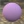
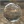

#  {{page.title}}
Flamingo 材质由一系列材质属性分组构成，有一些属性是简易材质类型所共有的。简易材质的设置非常简单，不需要进行复杂的设置就可使材质呈现出不同的效果，对多数简易材质而言，修改颜色就可以让它看起来显得不同。

#### 简易材质类型:

> [单一颜色](#solid-color)
> [塑胶](#plastic)
> [金属](#metal)
> [玻璃](#glass)
> [模糊](#glossy)
> [亮光漆面](#clearfinish)
> [Flamingo 贴图](#flamingo-textured)
> [贴图组](#texture-set)

任何材质都可以转化为高级材质，高级材质提供了 Flamingo nXt 中所有可编辑的材质特性。 为了在最大程度上控制材质，您可以直接使用高级材质或将现有的材质转化为高级材质。

#### 高级材质包含如下属性组：

> [名称](material-type-advanced.html#name)
> [程序材质](material-type-advanced.html#procedures)
> [高级材质属性](material-type-advanced.html#advanced-materials-properties)
> [反射](material-type-advanced.html#reflective-finish-and-highlight)
> [透明属性](material-type-advanced.html#transparency)
> [程序贴图](material-type-advanced.html#bump-patterns)
> [位图贴图](material-type-advanced.html#textures)
> [附注](material-type-advanced.html#notes)

材质保存于 Rhino 模型当中，相同名称的不同材质可以存在于不同的模型中。

## 单一颜色
{: #solid-color}
单一颜色材质只有[名称](material-type-advanced.html#name)与[颜色](material-type-advanced.html#color)。





## 塑料
{: #plastic}
塑料材质默认的[高光](material-type-advanced.html#highlight-color)颜色为白色。



 使用高级编辑器修改[高光颜色](material-type-advanced.html#highlight-color), [强度](material-type-advanced.html#intensity), [Fresnel](material-type-advanced.html#fresnel), 以及[锐利度](material-type-advanced.html#sharpness)的预设。

## 金属
{: #metal}
金属材质的高光颜色与金属的[颜色](material-type-advanced.html#color)一致，金属材质的材质属性里有控制反射与高光[锐利度](material-type-advanced.html#sharpness)的设置。



#### 锐利度
控制反射的锐利度与模糊强度，更多详细信息请查阅[锐利度](material-type-advanced.html#sharpness)主题。

 使用高级编辑器修改[高光颜色](material-type-advanced.html#highlight-color), [强度](material-type-advanced.html#intensity), [Fresnel](material-type-advanced.html#fresnel) 以及[类型](material-type-advanced.html#type)的预设。

## 玻璃
{: #glass}
玻璃材质有可以调整的[颜色](material-type-advanced.html#color)和[折射率](advanced-material-properties-main.html#index-of-refraction) (Index of Refraction, IOR) 设置。



#### 折射率
控制光线通过材质发生折射的程度，获得更多详细请查阅[折射率](advanced-material-properties-main.html#index-of-refraction)主题。

 使用高级编辑器修改[高光颜色](material-type-advanced.html#highlight-color), [强度](material-type-advanced.html#intensity), [Fresnel](material-type-advanced.html#fresnel), [锐利度](material-type-advanced.html#sharpness)以及[透明度](material-type-advanced.html#transparency)的预设。

## 模糊
{: #glossy}
模糊材质通常有[低强度](material-type-advanced.html#intensity)的高光以及[锐利度](material-type-advanced.html#sharpness)。



#### 强度
控制表面反射的高光强度，获得更多信息请查阅[强度](material-type-advanced.html#intensity)主题。

#### 高光锐利度
控制表面高光的锐利度与模糊强度，获得更多信息请查阅[高光锐利度](material-type-advanced.html#sharpness)主题。

 使用高级编辑器修改 [Fresnel](material-type-advanced.html#fresnel) 和[类型](material-type-advanced.html#type)预设。

## 亮光漆面
{: #clearfinish}
亮光漆面材质模拟汽车烤漆、瓷器、陶瓷、上了亮漆的木头或任何表面有透明涂层的物件，亮光漆面材质使用 [Fresnel](material-type-advanced.html#fresnel) 设置依据物件表面的法线方向与视图方向的夹角改变材质颜色，物件正对视图的部分的材质颜色比较深，偏离视图方向的部分反射度会提高。汽车烤漆就是很好的例子。



 使用高级编辑器修改[高光颜色](material-type-advanced.html#highlight-color), [强度](material-type-advanced.html#intensity), [Fresnel](material-type-advanced.html#fresnel), 以及[锐利度](material-type-advanced.html#sharpness)的预设。

## Flamingo 贴图
{: #flamingo-textured}
贴图材质以图片取代材质的颜色，贴图材质的简易材质属性里有使用的图片的名称与分辨率信息及调整拼贴、反光强度与锐利度的设置。



#### 强度
控制表面镜面反射的强度，请查阅[强度](material-type-advanced.html#intensity)主题以获得更多信息。

#### 锐利度
控制反射的锐利度与模糊强度，更多详细信息请查阅[锐利度](material-type-advanced.html#sharpness)主题。

#### 图像
设置材质的图像映射以及属性，这里有许多设置选项，请查阅[图像](material-type-advanced.html#texture)主题获取更多信息。


 使用高级编辑器修改此材质的预设。

## 贴图组
{: #texture-set}
[贴图组材质](texture-set-materials.html)贴图组材质支持包含置换、法线向量、凹凸等效果的第三方贴图映射，通过组合这些贴图映射可以创建出特别复杂的材质，[PixPlant 软件](http://www.pixplant.com/) 可以使用标准的位图创建出具有这些特性的贴图。
<!-- TODO: This dialog Needs a page.-->


#### 宽度与高度
控制设置中所有贴图的大小，使用此项同时调整所有的位图尺寸。

#### 强度
控制表面镜面反射的强度，请查阅[强度](material-type-advanced.html#intensity)主题以获得更多信息。

#### 锐利度
控制反射的锐利度与模糊强度，更多详细信息请查阅[锐利度](material-type-advanced.html#sharpness)主题。

#### 类型
控制表面的反射类型，查阅[类型](material-type-advanced.html#type)主题以获得更多信息。

 使用高级编辑器修改此材质的预设。 **附注:** 这是一个多种默认材质组合而成的复合材质，使用高级编辑器修改并不会同步所有属性。

## 高级材质
[Flamingo 高级](material-type-advanced)材质包含了 Flamingo 材质所有的可设置属性，如果简易材质不满足您的使用需求，使用 [Flamingo 高级](material-type-advanced)材质可以让您更加灵活的创建材质。
