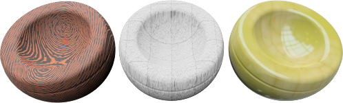
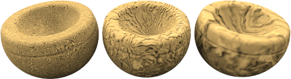
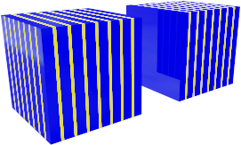
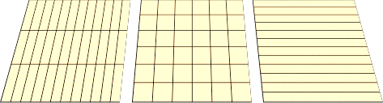

#   {{page.title}}
程序材质由一种或多种材质复合而成，程序材质中的层级设置通过一组规则决定了要合并的材质之间是如何互相影响并合并在一起的。层级中显示出了材质的构成元素，您可以在层级列表中添加材质元素。对于标准材质，列表中只有一个元素：底色。

每一种程序材质都有两个元素（子材质），一个元素可以由有另一个程序材质的两个元素组成，因此，复杂的材质可以由简单的材质组合而成，Flamingo nXt 的程序材质有下列几种：

> [底色](#base)
> [角度混合](#angular-blend)
> [混合](#blend)
> [大理石](#marble)
> [花岗岩](#granite)
> [拼贴](#tile)
> [木纹](#wood)

##### 添加程序材质
1. 在程序材质窗口中的基础材质上点击鼠标右键。
1. 在功能表中，点击程序材质类型。

##### 移除程序材质
 1. 在程序材质窗口中，右键点击程序材质的名称。
 2. 在功能表中，点击移除。

## 底色
{: #base}
基础材质是程序材质的默认材质，只有基本颜色，不包含其他材质。

## 角度混合
{: #angular-blend}
有很多材质从不同角度观察，颜色、反射、透明度也不同，角度混合程序将两种材质混合后，观察角度的不同也将观察到不同效果。

角度混合材质将两种材质进行混合从而产生特殊的效果， 需要分别设置内侧材质与外侧材质。

#### 内侧材质
物件正对视图的部分（０度）至起始角度之间是以纯内侧材质显示，可以将它视为物件的底色材质。

#### 外侧材质
终止角度至偏离视图 90 度之间的部分是以纯外侧材质显示，可以将它视为类似亮光漆的涂层。

#### 起始角度
外侧材质开始淡入的角度。

#### 终止角度
内侧材质完全淡出的角度。
起始角度与终止角度之间是内侧材质与外侧材质渐变的部分。

下图中的起始角度 是 30 度 (绿色圆圈)，终止角度 是 60 度 (红色圆圈)。

右图中内侧材质用白色表示，外侧材质用黑色表示。

 

* 0 至 30 度之间完全是白色。
* 30 至 60 度之间是白色渐变至黑色的渐层范围。
* 60 至 90 度之间完全是黑色。

## 混合
{: #blend}
混合程序贴图由两个基本材质组成，可以控制两个材质的混合比例。Flamingo nXt 内建的材质库里的木纹材质有许多都是从混合程序贴图创建的，以混合数值控制木纹材质的反射度( 材质二具反射性质)。

混合程序贴图可以用混合值做整体的混合控制，或以一张图片来控制混合度。

#### 混合
调整整个材质中两个材质混合量。例如， 下图中的材质是由一个条纹材质与一个单一的绿色材质混合而成，左侧图片中条纹材质占有很大的比例，绿色只占很小很小的比例，中间图片中两种材质各占 50%，右边的图片条纹材质占很小的比例，绿色材质占很大比例。

#### 使用图片
使用图片像素的灰度值决定两个材质的显示比例，图片黑色的部分是显示材质一的部分，白色的部分是显示材质二的部分，灰色的部分是两个材质混合的部分。

图例中的物件使用的混合程序贴图的两个材质完全一样，但两个材质的混合以三张不同的图片控制。

控制材质混合的图片（遮罩）的分辨率会影响到材质的品质，使用高分辨率的图片会有较好的效果，但也会使用较多的内存。

#### 使用 Alpha 通道
如果使用的图片含有 Alpha 通道，可以使用 Alpha 通道来混合两种材质，不使用图片的灰阶值。

#### 反转
对调两种材质在物体上的显示部分。

#### 拼贴
图片显示在物件上的大小是以模型单位计算，与图片的像素多少无关，例如您想让一张图片在一个 100X100 模型单位的平面上显示 5X10 的拼贴数，可以将拼贴的宽度设为 20，高度设为 10。

#### 宽度
图片在物件上显示的模型单位宽度。

#### 高度
图片在物件上显示的模型单位高度。

## 花岗岩
{: #granite}
创建模拟花岗岩纹理的 3D 程序贴图，它是由底色与杂点两个材质组成，噪点是以随机值分布在底色上，有不规则纹理的材质都以使用这个程序贴图。

#### 底色/杂点
底色与杂点两个材质的设置与一般材质完全一样。



#### 密度
设置杂点占材质面积的比例，数值越大杂点就越大。



## 大理石
{: #marble}
创建模拟大理石纹理的 3D 程序贴图，它是由底色与脉络两个材质组成。

大理石程序贴图可以控制底色与脉络如何结合，物件未设置[贴图轴](properties-object.html#mapping)时，物件上的大理石纹理会因为物件的定位而改变。

*没有贴图轴（左）与有贴图轴（右）。*

#### 底色/脉络
底色与脉络两个材质的设置与一般材质完全一样。


#### 脉络宽度
这个设置是底色与脉络的宽度比例，例如将脉络宽度设为 0.9 时，底色的宽度为 0.1。将脉络宽度设置为 1 时完全没有底色，设为 0 时完全没有脉络。




*使用（左）与未使用（右）饰片选项。*

## 拼贴
{: #tile}
拼贴是一种 2D 程序贴图，使用[贴图轴](properties-object.html#mapping)可以控制拼贴方格的走向，它由底色与贴缝两个元件组成，这两个元件可以是材质或程序贴图。

宽度与高度使用不同的比例可以做出一些特殊的效果，例如细长的拼贴可以用来做为房子外墙的材质使用。

#### 拼贴
设置拼贴方格的大小，宽度与高度可以分开设置。

#### 宽度/高度
设置拼贴中的一格的宽度与高度。


#### 贴缝
拼贴的贴缝设置。

#### 水平/垂直贴缝的宽度
设置水平贴缝与垂直贴缝的宽度。

#### 锁定
维持水平贴缝与垂直贴缝宽度的比例。

#### 偏移
将相邻的拼贴方格错开，设置 0.5 可以产生类似砖墙上砖块排列的方式。将大理石程序贴图代入元件可以产生大理石地砖的材质。

#### 拼贴变化
拼贴的每一格的花样不规则变化，产生类似马赛克瓷砖的效果。

#### R/G/B
使拼贴的每一格的颜色随机变化。

#### X/Y/Z
使拼贴的每一格的图片随机偏移。

## 木纹
{: #wood}
底色是木头的原色，环状纹是木头的年轮，您可以控制环状纹的宽度与变化度及两個材质如何混合。

如果不是近距离观察物件，就可以使用这种方法创建木纹，如果需要渲染木纹的细节，请使用[贴图材质](material-type-simple.html#textured)创建木纹。木纹程序贴图的渲染与物件的距离远近有关，物件很远时，木纹会以单一颜色取代，这样可以在不牺牲渲染品质的情况下加快渲染速度。这个木纹程序贴图的优点是可以做出木纹横剖面纹理（年轮）与纵剖面纹理（平行纹）对齐的效果。

#### 底色/环状纹
底色与环状纹两个材质的设置与一般材质完全一样。


#### 环状纹宽度
这个设置是底色与环状纹的宽度比例，将环状纹宽度设置为 1 时完全没有底色，设置为 0 时完全没有环状纹。




使用（左）与未使用（右）饰片选项。
