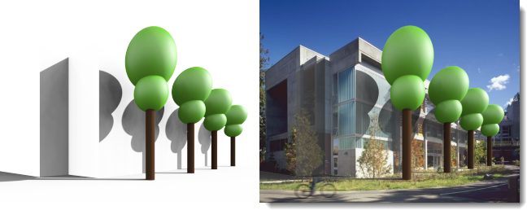
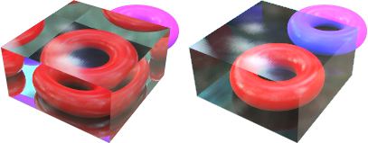

#   {{page.title}}
物件属性里与 Flamingo nXt 相关的设置只有在以 Flamingo nXt 渲染时才有作用。

###  材质来源
{: #material-source}
材质可以赋予给图层、图块以及物件，赋予材质的更多详情请参考[材质赋予](material_assignment.html)主题。材质赋予方式如果选为“物件”，材质属性也将显示在物件属性对话框中，编辑材质的更多详情请参考[材质属性](material-type-simple.html)。

###  贴图轴
{: #texture-mapping}
贴图轴决定了材质如何附着在物件上。 无论材质赋予方式是以物件还是以图层，都会受到贴图轴的影响，当材质没有可辨别性的纹理时，通常不必设置贴图轴，需要控制贴图轴的方向时才需要设置贴图轴，即便需要设置贴图轴，预设的几种贴图轴类型也足以应付大多数情况。对物件执行移动、旋转、缩放等操作贴图轴也跟着变动，不会影响材质附着在物件上的相对关系。了解贴图轴类型的详细信息请参考[贴图轴](http://docs.mcneel.com/rhino/5/help/en-us/index.htm#properties/texturemapping.htm)主题。

 
*两个不同方向的贴图轴*

###  印花
{: #decals}
印花是直接在物件上贴图的方法，这种贴图方法不需要依靠材质，可以在物件的局部贴图。使用印花可以修改物件局部的颜色、反射或凹凸。创建与放置印花的详细信息请参考[Rhino 印花](http://docs.mcneel.com/rhino/5/help/en-us/index.htm#properties/decal.htm)。

 
 
*四个不同的印花*

###  自定义网格
{: #custom-meshes}
在 Rhino 中有几种自定义网格可以在渲染模型时渲染出细节。这些自定义网格可以为渲染网格增加圆角、渲染圆管、装饰线、置换。

详细信息请参考下列主题:

>[渲染圆角](http://docs.mcneel.com/rhino/5/help/en-us/index.htm#commands/applyedgesoftening.htm)
>[渲染圆管](http://docs.mcneel.com/rhino/5/help/en-us/index.htm#commands/applycurvepiping.htm)
>[装饰线](http://docs.mcneel.com/rhino/5/help/en-us/index.htm#commands/applyshutlining.htm)
>[置换](http://docs.mcneel.com/rhino/5/help/en-us/index.htm#commands/applydisplacement.htm)

###  Flamingo 属性
{: #flamingo-properties}

#### Alpha 通道
{: #alpha-channel}
使物件在渲染中不可见，但该物件仍然可以投射阴影与接受阴影投射，这样渲染图片可以用来将阴影合成至其他图片上。

这个例子是在模型中创建一些树的模型与用来代替真实图片里建筑物的几个平面，这些平面可以接受树模型的阴影投射。在这些平面的物件属性打开 Alpha 通道，让他们不会出现在渲染图片里，经过一些 Alpha 通道的应用处理后可以将树与树的阴影加到原来的照片上。

#### 焦散
{: #caustics}
光线经过有弧度的物件的反射或折射后，可能会聚焦在其他物件的表面，这种情形称为焦散。焦散只有在一些特定情况下才使用。焦散只能使用[路径追踪](render-tab.html#path-tracer)渲染引擎或[混合](render-tab.html#hybrid)渲染引擎，需要经过很多队列的计算才能得到焦散效果。更多信息请参考[维基百科: Caustic (optics)](http://en.wikipedia.org/wiki/Caustic_(optics))。

*由玻璃杯和水产生的焦散。*

*没有焦散（左）与有焦散（右）的渲染图片。*

#### 薄片
{: #thin}
实体物件赋予玻璃材质时通常会被当成实心的玻璃物件渲染，在物件的属性打开薄片选项，渲染时曲面会被视为双面的薄片物件，所以实体会被视为空心物件。此设置用于将面作为薄片而非实体的一个面时使用，例如建筑模型的玻璃。

 
*立方体未使用（左）与使用（右）薄片选项渲染时的差别。*

#### 日光入口
{: #daylight-portal}
室内渲染时可以打开日光入口使用[太阳和天光照明](lighting-tab.html#interior-daylight)照亮室内场景。日光入口物件可以协助将室外的自然光导入室内，使室内场景有充分的自然照明亮度，日光入口只有在[太阳](sun-and-sky-tabs.html#sun)打开时才有作用。使用[室內日光](lighting-tab.html#interior-daylight)预设组时，所有透明的物件会自动当作日光入口物件，使用摄影棚照明与户外日光默认组时则不会，如果您仍想将太阳与天光导入室内，可以打开窗户玻璃物件的日光入口选项。

*使用（左）与未使用（右）日光入口。0*
