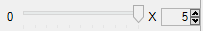

#  {{page.title}}
{: #channel}
Flamingo nXt 5 中一个非常实用的功能就是可以把灯光设置到八个通道中的一个，包括太阳和天空在内的每个光源都可以设置到通道上，渲染时每个通道都使用其各自的图层，渲染完成后，不需要再重新渲染就可以在渲染完成的图像上调节灯光平衡。  

在下列情况使用通道非常有效：

* 需要调节 HDRI 环境与日光之间的平滑时，将日光和 HDRi 天光分别设置到一个通道上，渲染完成后实时调整它们之间的亮度平衡关系。
* 使用主光、辅光与背光等进行摄影棚渲染时，将每个灯光设置到不同的通道，渲染完成后实时调整它们之间的亮度平衡关系。
* 使用多组灯光进行室内或室外渲染时，每组中的灯光都使用一个专用于该组的通道，这样就可以分别控制每组灯光的强度了。
* 打开所有的灯光进行一次渲染，渲染完成后通过通道打开或关闭相应的灯光，不用重新渲染，就能搭配出白天和夜晚的不同效果。

图像渲染完成后就可以在渲染窗口中调节，也可以保存到 .nXtImage 文件中稍后进行调节。

通道用于单独调整每个灯光的强度，而不是用于整体调亮图片，如果您需要把整个图像调亮，请使用“调整图片”中的控制选项。

<video id="channelsvideo" src="images/flamingo-lights-onoff.mp4" poster="images/flamingo-lights-onoff.jpg" controls preload></video>
*点击播放视频。*

通过多个通道调整图像必须注意以下几点：

 1. 灯光必须是打开的渲染完成后才可以调节。
 2. 想要调节的光源必须指定通道，默认情况下太阳和天光的通道为 0，人造灯光的通道为 1。
 3. 渲染开始后通道就可以使用了。
 3. 唯一可以保存这些通道信息的格式是.nXtImage 格式，调整完成以后可以再从.nXtImage 格式保存为位图格式。

## 设置通道
{: setting}
进行多通道渲染的第一步是设置每个灯光的通道，通常在灯光属性中设置通道号，特定灯光设置通道的方法请参考：

>[日光通道](sun-and-sky-tabs.html#sun-channel)
>[天光通道](sun-and-sky-tabs.html#sky-channel)
>[人工照明通道](lights-tab.html#channel)
>[材质光晕](documentproperties-flamingo.html#channel)

任意数量的灯光可以使用相同的灯光通道，该通道就可以同时控制多个灯光，调整时该通道中的所有灯光将保持彼此之间的相对亮度关系。

## 调整通道
{: adjusting}
渲染完成后可以直接在渲染窗口中调整，也可以保存为 nXtImage 文件后在 Flamingo 图像编辑器中编辑。Flamingo 渲染过程中就可以使用通道，但我们还是建议您在渲染过程中不要做调整。

#### 在哪里可以找到 Flamingo 照明控制？
可以在[渲染窗口](render-window.html)中的 Flamingo 选项卡下的“通道”里找到。

八个通道的编号分别为 0-7，只有当中含有灯光是才会生效。

每个通道都有一个滑杆和一个可变数值，该数值表示滑杆的最大值，如果滑杆位于最右侧，表示照明亮度为该可变数值与原始亮度的乘积，滑块位于中间表示该通道中所有灯光的亮度为它们原始亮度乘以该可变数值的一半，滑块位于最左侧将关闭该通道中所有灯光。

可变数值非常重要，因为太阳和天光的亮度是人造灯光的好多倍，可能在太阳和天光的影响下，该值增加到 20 或 50 也看不出任何调整效果。

通道调整完成以后，可以将最终的渲染结果保存为 JPG 或 PNG 文件。
