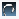

#  {{page.title}}
渲染选项卡控制最终渲染图像的主要属性。使用此选项卡设置渲染的质量以及控制渲染所耗费的时间，渲染图像的分辨率也是影响渲染时间最大的因素。

附注: 测试渲染时最好设置为小分辨率，渲染最终图像时再使用高分辨率。

#### 在哪里可以找到 Flamingo 照明控制？

 1. 工具列 >Flamingo nXt 工具列 > 渲染选项
 1. 功能表 > Flamingo nXt 5.0 下拉菜单 > 显示控制面板 > Flamingo nXt 选项卡 > 渲染选项

## 渲染的工作视窗
{: #viewtorender}
设置 Flamingo nXt 5 将渲染的视图。例如，有好几个透视视图，通过此项来设置要渲染的视图，就不用再去考虑每次渲染之前都要把要渲染的透视视图设置为当前视图了。

#### 使用中的视图
使用此选项将当前使用中的视图设置为要渲染的视图，默认设置是这一项。

#### 可用工作视窗的列表
列出了当前模型中所有已命名视图，选取始终要渲染视图的名称。

## 渲染分辨率
{: #resolution}
渲染分辨率是最重要的渲染设置之一。 此选项设置图像的尺寸和分辨率并保存在 Rhino 文件中。 增加分辨率渲染时间将以指数级增加，所以请小心设置此项。

#### 总像素数
{: #resolutionimagepixels}
设置渲染像素的总数，最好设置为当前视图高度和宽度乘积的倍数，渲染时用总像素数来设置渲染分辨率是一个很好的选择，用此数值匹配要渲染的视图，只需要更改此值就可以增加或降低分辨率。

### 工作视窗分辨率
使用工作视窗的像素尺寸作为渲染图像的尺寸，这样渲染图像和工作视窗的比例就是 1:1。此渲染虽然很实用，但如果要渲染的工作视窗是全屏显示的，渲染速度就比显示为四视图时要慢。

### 图片大小
{: #resolutionprintedsize}
可以通过多种不同的单位来设置图片的大小，这是精确设置图片分辨率最好的方法。如果渲染图片的宽高比设置与要渲染视图的宽高比不同，可能会对渲染图像或视图的顶部和底部或两侧进行一些修剪。附注: 设置为高分辨率会导致渲染非常长的时间，建议最终渲染时再设置为高分辨率。

有四种可用单位：

>像素
>英寸
>毫米
>厘米

#### 像素
设置渲染图像的单位为像素，使用此选项只需指定渲染图像的长宽像素数即可。

#### 英寸
设置图像尺寸单位为英寸，需要通过英寸宽高值结合分辨率设置共同确定渲染图像最终的分辨率。最终分辨率是英寸宽高值和每英寸的像素数的乘积。

#### 毫米
设置图像尺寸单位为毫米，需要通过毫米宽高值结合分辨率设置共同确定渲染图像最终的分辨率。最终分辨率是毫米宽高值和每单位毫米的像素数的乘积。

#### 厘米
设置图像尺寸单位为厘米，需要通过厘米宽高值结合分辨率设置共同确定渲染图像最终的分辨率。最终分辨率是厘米宽高值和每单位厘米的像素数的乘积。

#### 应用视图长宽比
使用此设置使渲染图片长宽比和当前视图的长宽比保持一致。

#### 宽度
当前单位的图像的打印宽度。此值乘以分辨率设置的像素数就可以得到图像宽度方向的总像素数。

#### 高度
当前单位的图像的打印高度。此值乘以分辨率设置的像素数就可以得到图像高度方向的总像素数。

### 分辨率
{: #printsizepixelsperunit}
{: #printsizedpi}
{: #printsizeresolution}

#### 显示
使用每单位像素数渲染图像，表示设备上像素的密度，通常显示器使用[每英寸像素数(DPI)](https://en.wikipedia.org/wiki/Dots_per_inch)来表述分辨率。

#### 自定义
使用自定义分辨率渲染图像，在**每...像素数:**选项输入每单位的像素数。

#### 打印机，草图品质
分辨率设置为 100 像素每英寸或 4 像素每毫米。

#### 打印机，一般品质
分辨率设置为 150 像素每英寸或 6 像素每毫米。

#### 打印机，高质量
分辨率设置为 300 像素每英寸或 12 像素每毫米。对渲染来说这个分辨率很高，对渲染小图像来说效果很好，但渲染大尺寸图像，这个分辨率显得非常高，高分辨率渲染将需要更长的时间。

#### 每...像素数
当分辨率设置为自定义时，使用此项设置每单位的像素数，单位为图片大小所使用的单位，当选择一个预设的分辨率时，此处显示所选分辨率的具体数值。

## 景深
{: #depthoffieldoption}
模拟摄像机镜头景深的模糊效果，焦距的距离是渲染图片最清晰的点，渲染图片会随着距离的增、减逐渐变模糊。 

#### 启用
打开景深模糊效果。

#### 强度
设置渲染图片在焦距前后随着距离增加变模糊的速率，设置为 0 时等于关闭景深模糊的效果。

#### 焦距
{: #focaldistance}
设置渲染图片焦点的距离，假设焦距位于 10 个单位的距离，那么焦距前 3 个单位与焦距后 7 个单位是渲染图片清晰的范围。

#### 指定 >>
在模型里指定焦点的距离。

## 渲染引擎
{: #render-engine}
Flamingo 中有三种不同的渲染引擎，在相同的渲染条件下，每种渲染引擎渲染的结果会有略微的不同。

Flamingo 使用逐行、多步的渲染技术进行渲染。Flamingo 并不是在画面上进行一次逐行扫描就能得到完美渲染结果的，而是每渲染完一个队列画面更加精细一些。从技术角度讲，只要渲染足够的时间，三种渲染引擎都能得到相同的渲染结果，但在实际渲染中，渲染时间是一个非常关键的考虑因素，所以选择适合当前场景的渲染引擎非常重要。

只需要选取不同的渲染引擎然后渲染以查看结果即可。

### 默认值
默认引擎的算法可做非常高质量的渲染， 默认引擎在各种场景都能够有良好的表现，而其他的两个渲染引擎有很多优点也有很多缺点，对新手来说默认引擎是一个不错的选择。

默认渲染引擎在渲染初期得到的效果会比较粗糙，会出现重叠在一起的锐利的阴影，但随着渲染的进行，阴影会逐渐柔和，默认渲染引擎可以比较快的得到渲染结果，但需要多一些队列才能使阴影柔和。

如果启用间接照明，路径追踪比默认渲染引擎处理的更加细腻，要在这两个渲染引擎之间做出选择，就需要您考虑值不值得耗费更多的时间去得到这样的效果。

### 路径追踪
{: #path-tracer}
以路径追踪渲染时一开始整个渲染图片会布满杂点，品质非常粗糙，杂点随着渲染时间的增加逐渐变细，渲染品质也渐渐变好，这个过程称为"收敛" (*Convergence*)。使用路径追踪引擎在许多模型可以得到较好的品质，设置也较为简单，但因为它的渲染计算较复杂，所以渲染时间也会拉长。 
**附注**：使用路徑追蹤引擎比较容易产生光斑的问题，光斑的问题会随着算图的时间增加而逐渐消除。

您可以使用路径追踪将一些高级效果计算的更为精确，比如焦散或模糊。如果渲染内容有植物和置换贴图，使用路径追踪计算速度更快。路径追踪的设置要比默认引擎简单，因为一些高级设置比如反射着色、日光入口、环境照明等都不可以使用。

路径追踪渲染的渲染速度比默认的渲染引擎慢，尤其在窗户较小的室内日光照明场景，渲染时间会大幅度增加。 

### 混合
混合引擎结合了默认引擎和路径追踪的优点，混合引擎始终会计算间接照明，在渲染初期会出现大量光斑，随着渲染的进行，光斑会逐渐减少，在有些情况下，需要进行很多次队列计算才能取出光斑，对于很多情况，此渲染引擎是最佳选择。

###  **高级**
打开文件属性对话框中的 [Flamingo nXt](documentproperties-flamingo.html) 页面，有一些高级自定义渲染属性。
