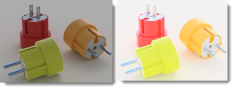

#  {{page.title}}
渲染窗口中可以调整曝光度与后处理设置， 渲染主窗口是 Rhino 渲染框架的一部分。了解渲染窗口功能表与图标的详情，请查阅[渲染窗口主题](http://docs.mcneel.com/rhino/5/help/en-us/index.htm#information/renderwindowpostprocess.htm)。此主题主要论述 Flamingo 具体的渲染过程。

## 管理正在进行的渲染
开始渲染后，将启动[渲染窗口](http://docs.mcneel.com/rhino/5/help/en-us/index.htm#information/renderwindowpostprocess.htm)开始渲染，Flamingo 是一个分阶段渲染图片的多队列系统，Flamingo 首先会查看模型是否有更改，然后开始初始化过程，此过程耗时从几秒钟到几分钟不等，程序在初始化过程中导入模型、从硬盘收集材质贴图以及创建图像缓存， 渲染过程有以下几个关键步骤:

>[多队列渲染](#multi-pass)
>[停止渲染](#stop-render)
>[调整图像](#adjusting)
>[保存图像](#saving)

### 多队列渲染
{: #multi-pass}
Flamingo nXt 是一个全新的渲染引擎， 使用多队列精炼运算，不用在繁琐的界面进行复杂的设置就可以获得更多的高级渲染效果。在前几次队列运算时就可以获得好的效果，例如，在渲染开始时，能够看到阴影是锐利且轮廓笔直的，每进行一次队列处理，阴影开始融合，变得更加柔和。还有许多其他效果可以提升每次队列处理后的结果，使用 [Flamingo 选项卡](#flamingo-tab)追踪渲染进程。

综上所述，可以看出 nXt 的渲染永远不会“完成”，何时停止渲染由您决定，您可以让程序继续渲染以获得更好的效果，但是如果您需要更改或保存一些内容，您可以随时停止渲染。

一些可以提升每次队列运算结果的效果:

>照明 (例如开启全局光照)
>柔和阴影
>反射 (模糊)
>折射
>抗锯齿
>景深

### 停止渲染
{: #stop-render}
您可以通过以下几种方式停止渲染:

 点击渲染窗口右上角的“X” 按钮立刻停止渲染并关闭渲染窗口，这是要停止渲染快速回到模型进行修改最好的方式。

 点击停止光线跟踪按钮，在本次队列处理完成后停止渲染，这是在保存图像之前停止渲染最好的方式。

 双击停止光线跟踪按钮，立刻停止渲染并保持渲染窗口的打开状态。

### 调整渲染
{: #adjusting}
停止渲染后，使用 [Flamingo 选项卡](#flamingo-tab)中的功能快速调整图像及亮度，这是生成高质量图像非常重要的设置工具。

调整图像的功能包括:

>[调整图像](#adjust-image)
>[通道](#channels)
>[后处理效果](#post-process-effects)

### 保存图像
{: #saving}
图像可以保存为多种格式以适用于各种不同的用途。通常推荐保存为 JPG 或 PNG 文件，但也有其他的选择。

####  保存图像
图像调整后通常保存为 JPG 或 PNG 图像文件。  

JPG 图像是一种非常高效小尺寸的文件格式，非常适合发布在互联网或通过电子邮件发送，但是高效的背后，牺牲了一些颜色信息。

PNG 是一种包含了全部颜色信息与 Alpha 通道信息的压缩格式，此格式是保存高质量图像的优秀格式。

#### 和背景 Alpha 通道一起保存
{: #save-with-alpha-channel}
将图像和背景 Alpha 通道一起保存为 32位 PNG、TIF、以及 BMP 格式。使用带有 Alpha 通道的文件版本以获得高质量的合成，当渲染连同 Alpha 通道一起保存时，背景将呈现为黑色。勾选 [Flamingo 选项卡](#flamingo-tab) 与 [保存对话框](#saving) 中的复选框，可以将图像连同 Alpha 通道一起保存，保存为 PNG 格式很适合获得 Alpha 信息。

#### 导出为原生 Flamingo nXt 文件 (.nXtImage)
{: #export-to-nxtimage}
保存未经压缩的亮度与颜色信息，保存包括 [alpha](environment-tab.html#alpha) 在内的所有渲染通道。nXt 图像文件可以在[图像编辑器](image-editor.html)中打开，可以在图像编辑器中调整[曝光度](#adjust-image)，添加[后处理效果](#effects)以及保存为其他的位图格式。

.nXtImage 格式是 nXt 渲染器原生的图像格式，推荐使用此格式保存您的渲染，因为此格式能保存您最多的渲染信息。保存为此格式的图像可以在 [nXt 图像编辑器](image-editor.html)中进行操作以及添加特殊效果，在此编辑器中，您可以将图像再保存为其他流行的标准格式，包括 nXt 中支持的所有格式，您也可以将图像保存为 [Piranesi EPix 文件 (.epx)](http://www.piranesi.co.uk/) 格式。

#### 导出为 HDR 文件
{: #export-to-hdr}
保存未经压缩的亮度与颜色信息，.hdr 格式直接将亮度信息保存为高动态范围格式 （HDR）。不发光的背景（如普通的照片作为背景）保存为这些格式的时候将呈现为黑色。

#### 导出为 EXR 文件
{: #export-to-exr}
一种高动态范围图像（HDRi）格式，由 Industrial Light and Magic (ILM) 公司连同多种软件一起发布的一种开放的图像格式标准， 依照自由软件许可协议发布。此文件格式支持每通道 16 位浮点值（半精密），包含一位正负值、五位指数以及十位尾数，共可以表示30阶的高动态范围曝光度。请参考[维基百科: OpenEXR](http://en.wikipedia.org/wiki/OpenEXR)。
.exr 格式直接将亮度信息保存为高动态范围格式 （HDR）。不发光的背景（如普通的照片作为背景）保存为这些格式的时候将呈现为黑色。

####  退出
关闭渲染窗口。

#### 折叠功能表
了解渲染窗口功能表与图标的详情，请查阅[渲染窗口主题](http://docs.mcneel.com/rhino/5/help/en-us/index.htm#information/renderwindowpostprocess.htm)。

## Flamingo 选项卡
{: #flamingo-tab}
渲染窗口中的 Flamingo 选项卡包含多种 Flamingo 渲染引擎的控制选项。理解这些控制选项是掌握 Flamigno 渲染的关键。

#### 和 Alpha 通道一起保存
将图像和背景 Alpha 通道一起保存为 32位 PNG、TIF、以及 BMP 格式。使用带有 Alpha 通道的文件版本以获得高质量的合成，当渲染连同 Alpha 通道一起保存时，背景将呈现为黑色。勾选[保存对话框](#saving)中的复选框，可以将图像连同 Alpha 通道一起保存，保存为 PNG 格式很适合获得 Alpha 信息。

## 进度
{: #progress}
查看 Flamingo 渲染进度。

#### 操作
显示当前渲染的状态、对模型所做的操作。

状态信息包括:

* 渲染已开始 - 渲染开始，做一些设置工作，包括转化模型以及设置渲染使用的内存。
* 操作已完成 - 点击停止按钮后，渲染引擎在计算完当前的队列后，完成停止操作。
* 队列完成 - 每个队列计算完成后显示此信息。
* 恢复渲染 - 如果恢复了渲染，显示此信息。
* 正在更新 - 渲染引擎正在队列之中，当前正在更新渲染。

#### 队列
这是 Flamingo 正在渲染的当前队列，Flamingo 是多队列渲染引擎，每执行一次队列计算就添加更多精细的照明效果，复合渲染效果也更加精细。

#### 扫描线
每个队列的计算沿着水平像素进行，每一行像素就是一个扫描线，此处显示渲染引擎当前返回的扫描线。

#### 耗时
从开始渲染所消耗的时间， 不包括进行渲染设置的时间。

#### 射线/秒
场景中每秒解算的光线数。

#### 像素/秒
每秒解算图像的像素数。

## 调整图像
{: #adjust-image}
这是 Flamingo 中最重要的控制，就像一台照相机，您可以调整它的曝光度。 是使渲染图像更亮、更暗、增加对比度或增加色彩饱和度的最佳手段。这个调整过程称之为[色调映射](https://en.wikipedia.org/wiki/Tone_mapping)。Flamingo 所工作的亮度范围，已经超出了显示器或打印机能够显示的颜色和亮度。色调映射就是把超出范围的亮度数据转化为可以显示和打印的红绿蓝（RGB）值。此设置也决定图像如何保存。

  
*左边为默认图像，正确的图像经过了修正：亮度 (0.20), 加亮 (0.16) ,饱和度(1.20)。*
通过此过程调整图像的亮度和整体颜色之后，就不用再重新进行渲染了。

### 亮度
{: #brightness}
调整图像的整体亮度，例如，如果一个白色的曲面渲染之后呈现出灰色，可以通过调整亮度使其呈现为白色，或，如果场景显得曝光过渡，可以降低亮度修复曝光。

*默认(左)与增加亮度后的效果*



### 加亮
{: #burn}
调整图像中的白点，这是调整图像中最亮的白色，些许加亮可以使图像更加生动，可以使画面更加锐利，增加更多与暗部形成对比的白色区域。
请参考[维基百科: 白点](http://en.wikipedia.org/wiki/White_point).

*加亮值调高前 (左) 后的差别。*

### 饱和度
{: #saturation}
饱和度控制图像中颜色的总数，饱和度为 0.00 得到灰色的图像，超过 1.00 可以获得丰富的色彩。

*饱和度调高前 (左) 后 (右) 的差别*

### 色阶分布图
{: #histogram}
以图形显示彩色图片里所有像素的明暗度分布，图表越靠左侧表示亮度越低，左侧边缘表示黑色，图表越靠右侧表示越亮，右侧边缘表示白色。用这种方式来展现图像中的明暗分布是非常有用的，理想的状态就是将图像调节到它的明暗数值占据整个亮度范围，例如，如果图像的色阶分布在距离右侧边缘很远的地方终止了，说明图像偏暗，这时可以通过增加亮度值和加亮使色阶分布达到右侧边缘。请参考: [维基百科: 色阶分布图](http://en.wikipedia.org/wiki/Histogram)， 网络上有许多关于如何使用色阶分布图分析数码照片曝光度的文章，这些文件也适用于渲染图片。
<!--'Use more brightness or burn will stretch the values' - This needs rewritten.-->

*图示中的色阶分布图所呈现出的信息显示，该图像暗色很少并且有大量的亮色，虽然有少许全白的像素，但在还未达到右侧边缘时已经衰减了。*

#### 色阶分布图选项
右键点击色阶分布图可以设置如下的选项， 通过这些选项可以简单的修改色阶分布图所显示的信息，但并不能真正修改色阶分布是数值。

* **匹配** - 将垂直方向的最高值显示在分布图中。
* **中值** - 此选项将垂直方向的中间值显示在分布图中，用它来查看图表的边缘是很不错的选择。
* **平均值** - 垂直方向的平均值显示在分布图中。
* **显示排序图形** - 按照存在于图像中总的比例来排列值。
* **显示比例** - 在底部显示对应的灰度值。
* **图形颜色...** - 设置图示的颜色。

### 锁定曝光度
{: #lock-exposure}
当曝光度锁定时，变更照明亮度时不会自动调整曝光补偿。

## 渲染约束
{: #number-of-passes}
{: #time}
{: #render-constraints}


## 信息
{: #information}

#### 分辨率
显示当前的[渲染分辨率](render-tab.html#resolution)。

#### 网格面
显示模型渲染时使用的网格面数，可以将它与 Rhino [渲染网格设置](http://docs.mcneel.com/rhino/5/help/en-us/index.htm#documentproperties/mesh.htm)中的数值进行比较。

#### 网格面(含图块引例)
当渲染的模型含有图块引例时，Flamingo nXt 可以使用单一图块定义的网格面渲染它的所有引例，因为参与渲染计算的网格面减少，可以缩短渲染时间，这个数值显示的是包含图块引例的网格面数。

#### 照明信息
这是当前渲染中的一些照明设置，这些照明信息有：

>[预设](lighting-tab.html)
>[太阳](sun-and-sky-tabs.html#sun)
>[天光](sun-and-sky-tabs.html#sky)
>[灯光](lights-tab.html)
>[间接照明](lighting-tab.html#indirect)
>[环境光 打开/关闭](lighting-tab.html#ambient)

## 通道
{: #channels}
使用这些设置实时来调整照明通道的亮度。将灯光赋予八个通道中的一个，调整设置即可更改已渲染图像中该灯光的照明。此功能非常强大，渲染中使用了多个光源需要调整这些光源的光照平衡时，可以用它来进行调整。了解更多详情请参考[渲染通道](render-channel.html#adjustng-channels)主题。

## 后处理效果
{: #post-process-effects}
在渲染图像之后可以使用后处理效果。这些效果可以打开/关闭，清单中的效果顺序可以调整，每一种效果都有自己的设置。
效果包括:

>雾气
>光晕
>光芒
>景深
>点物件
>曲线
>结构线
>注解

了解更多详情，请参考[图像后处理](http://docs.mcneel.com/rhino/5/help/en-us/index.htm#information/renderwindowpostprocess.htm)主题。
