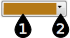

#  {{page.title}}
在很多材质及属性设置中都会用到颜色选择器，而且选择颜色的操作步骤都非常类似。

颜色选择器由两部分构成:

1. [色卡](#swatch) - 点击色卡可以打开选取颜色对话框。
1. [选项功能表](#options) - 点击箭头标记可以打开附加的颜色工具。

## 色卡 
{: #swatch}
点击色卡从“选取颜色”对话框中选取一个颜色。

##### 从颜色名称列表中选取
* 从左侧的颜色名称列表中选取一个颜色。

##### 从调色盘中选取
1. 拖动周围圆环中的标记可以更改色调。
1. 水平拖动中间方形区域中的标记可以更改饱和度。
1. 垂直拖动中间方形区域中的标记可以更改亮度。

##### 直接输入色调、饱和度与亮度
1. 色调是由 0 到 359 的分度来表示的，调色盘周围的“彩虹圆环”中，每间隔 60 度大约可以区分出红、橙、黄、绿、蓝、紫等几种颜色。选定基色调后，再配合饱和度与亮度值就可以确定最终的颜色了。
1. 饱和度指颜色的强度，可设置范围从 0 到 255，饱和度越大，含色成分越大。饱和度为 0 意味着颜色为介于黑与白之间非常中性的灰色，偏黑色还是偏白色由亮度决定。饱和度设置为 0 相当于饱和度在此颜色中不起任何作用，饱和度设置为 255，表示此颜色已达到最艳丽的程度。
1. 亮度表示颜色的明亮（或白）程度，亮度可设置范围从 0 到 255，亮度常常也被称为明度或明亮度。

#### 红，绿，蓝 (RGB)
{: #rgb}
这种记录颜色的方式用于计算机将颜色显示在显示器上。每个像素点的颜色都是将三种颜色值进行混合得到。纯粹的红色不含绿色和蓝色。纯黑色中红色、绿色、蓝色值都为 0，纯白色中红色、绿色、蓝色值都为 255。

## 功能表选项 
{: #options}

#### 调色盘
打开[选取颜色](#swatch)对话框，这和直接在色卡上点击是一样的。

#### 取色滴管
使用滴管工具可以在屏幕上任何一个地方取色。

#### 复制
复制当前色卡上的颜色，通过粘贴，可以将复制的颜色粘贴到其他色卡中。

#### 粘贴
粘贴由另一个色卡上复制而来的颜色。粘贴之前需要先复制颜色。
