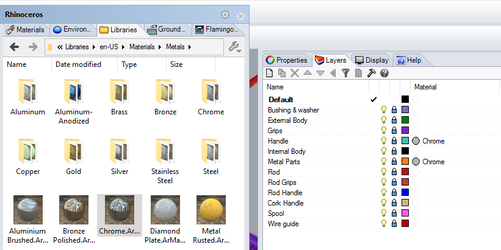
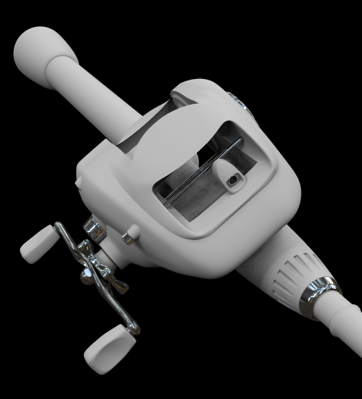
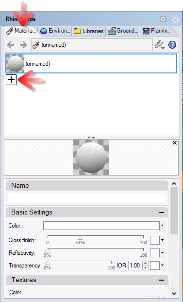

<!-- TODO: Make sure to update this page and get working in the guides section of the documentation. -->

# {{page.title}}
In diesem Tutorial wird das Rendern eines Rhino-Modells mit Flamingo nXt behandelt. Das Tutorial deckt die grundlegenden Schritte zum Rendern mit Flamingo nXt ab:

1. Öffnen eines Modells
1. Anlegen der Materialien
1. Bearbeiten der Materialien
1. Hinzufügen einer Grundebene

Laden Sie sich als erstes die Tutorial-Dateien herunter und entpacken Sie das Archiv. Alle erforderlichen Dateien sind im ZIP-Ordner [Fishing Reel.zip](files/nxt5%20fishing.zip) enthalten. Entpacken Sie die Dateien in einen Ordner Ihres Computers, den Sie sich gut merken können. Öffnen Sie die Datei *Fishing Reel.3dm* mit Rhino. Stellen Sie sicher, dass Flamingo nXt als die aktuelle Render Engine eingestellt ist.

## Flamingo nXt 5 als aktuelle Render Engine einstellen
{: #check-current}
In Rhino können mehrere Render Engines gleichzeitig installiert sein.  Um zu überprüfen, ob Flamingo nXt 5 als die aktuelle Render Engine eingestellt ist, gehen Sie im Menü **Rendern** auf **Aktueller Renderer** und wählen Sie gegebenenfalls **Flamingo nXt 5** aus.  Wenn dort bereits ein Haken oder Punkt vorhanden ist, bedeutet dies, dass Flamingo nXt 5 bereits als aktuelle Render Engine eingestellt ist.

## Renderprozess
{: #render_controls}
{: .float-img-right} Klicken Sie auf die Schaltfläche **Rendern**, um ein erstes Rendering Ihres Modells zu erstellen. Das Bild sollte der Abbildung rechts ähneln. Flamingo nXt funktioniert anders als frühere Versionen von Flamingo. Ein neues Modell verfügt bereits über eine standardmäßige HDRI-Beleuchtungseinstellung.  Neue Modelle verwenden für alle Objekte ein weißes Standardmaterial. Außerdem werden Schatten am Anfang sehr scharf und linear gerendert. Mit jedem Durchgang werden die Schatten durch weitere Überblendungen weicher. Viele weitere Effekte werden ebenfalls mit jedem weiteren Renderdurchgang verbessert.

Zu den Effekten, die bei jedem Durchgang verbessert werden, zählen

* Beleuchtung (wie beispielsweise die globale Beleuchtung)
* Weiche Schatten
* Reflexionen (Unschärfe)
* Lichtbrechung
* Antialiasing
* Schärfentiefe

Ein Flamingo-nXt-Rendering ist in diesem Sinne niemals "abgeschlossen", sondern Sie können vielmehr entscheiden, wann es gut genug für Sie ist. So kann ein Bild, das bereits gut aussieht, weiter verbessert werden. Auf der anderen Seite können Sie das Rendering auch jederzeit anhalten, wenn Sie etwas ändern oder speichern möchten. Das Rendering kann auf verschiedene Arten angehalten werden:
{: .clear-img}

* Klicken Sie auf die Schaltfläche mit dem roten Stoppsymbol, um das Rendering nach Abschluss des aktuellen Durchgangs zu beenden.
* Klicken Sie doppelt auf die Schaltfläche **Raytracing anhalten**, um das Rendering sofort anzuhalten.
* Klicken Sie auf das **X** in der oberen rechten Ecke des Renderfensters, um das Rendering sofort zu beenden und das Fenster zu schließen.

## Materialien aus der Bibliothek zuweisen
{: #materials}
Eine Grundbeleuchtung ist bereits in Flamingo nXt integriert, sodass die Einrichtung der richtigen Materialien normalerweise der erste Schritt eines Renderings ist. Materialien werden direkt im Rhino-Modell gespeichert. Um Materialsätze anzulegen, können Materialvorlagen verwendet werden, mit denen neue Materialien schnell angelegt werden können.

  1. Öffnen Sie Das Flamingo-nXt-Bedienfenster im Flamingo-nXt-Menü.
  1. Öffnen Sie zum Zuweisen eines vorhandenen Materials den Bibliothekenreiter im Bedienfenster.
  1. Materialien werden in Ordnern organisiert. Wechseln Sie in den Ordner mit den Flamingo-Materialien.
  
  1. Wechseln Sie in den Ordner Flamingo-Materialien > Metalle.
  {: .wide-img}
  1. Ziehen Sie ein Chrommaterial mittels Drag&Drop auf die Ebenen *Handle* und *Metal Parts*.
  1. Rendern Sie das Modell. Die Teile auf den Ebenen *Handle* und *Metal Parts* werden nun mit einem Chromfinish gerendert.
  
  1. Weisen Sie nun die restlichen Materialien wie folgt zu:

 | Bibliothek | Material | Ebene |
 |:-------|:------|:------|
 | Schiffsmaterial | Schwarzer Gummi | Bushing & Washer |
 | Schiffsmaterial | Schwarzer Gummi | Grips |
 | Schiffsmaterial | Schwarzer Gummi | Rod Grips |
 | Autofarben | Autofarbe Rot | External Body |
 | Metalle > Gold | Gold Satin, Eben | Internal Body |
 | Metalle > Aluminium, Eloxiert | Aluminum, Eloxiert Rot | Spool |
 | Plastik > Schwarz > Glatt | Plastik Schwarz, Glatt | Rod |
 | Plastik > Schwarz > Glatt | Plastik Schwarz, Glatt | Rod Handle |
 | Plastik > Schwarz > Glatt | Plastik Schwarz, Glatt | Wire Guide |
{: .grided-table}

##### Nach einem erneuten Rendern sollte das Bild ungefähr so aussehen:
 

## Anlegen eines neuen Materials
{: #new-material}
Oftmals werden Materialien benötigt, die noch nicht in der Bibliothek vorhanden sind. Der Griff der Angelrute sollte beispielsweise mit Kork ummantelt sein. In diesem Fall ist die Erzeugung eines neuen Materials die einzige Option. Als Korkmaterial verwenden wir ein neues Texturmaterial.

 1. Öffnen Sie den Materialreiter.
 1. Scrollen Sie ans untere Ende der Liste der Materialien.
 1. Klicken Sie auf die Plus-Schaltfläche zum Anlegen eines neuen Materials.
  
 1. Wählen Sie ein neues Flamingo-Texturmaterial.
 1. Sie werden aufgefordert, eine Textur auszuwählen.
 1. Wechseln Sie in das Verzeichnis, in das Sie die Tutorial-Dateien entpackt haben und wählen Sie die Datei *Cork.jp*.
 1. Nun verfügen Sie über ein einfaches Texturmaterial. Die Größe der Kacheln der Bitmap ist dabei oft von Bedeutung. Klicken Sie zu Ändern der Kachelgröße auf den Namen der Bitmap.

 1. Setzen Sie die Kachelbreite auf 100.

 1. Geben Sie im Feld für den Namen *Kork* ein und klicken Sie auf OK.

 1. Nachdem das Korkmaterial angelegt wurde, weisen Sie es der Ebene *Cork Handle* zu, indem Sie es per Drag&Drop auf die Ebene ziehen.

## Aktivieren der Grundebene
{: #groundplane}
Eine Grundebene ist hilfreich bei der Platzierung des Objekts in einer Szene.

1. Öffnen Sie den Grundebenenreiter.  Wenn dieser nicht sichtbar ist, öffnen Sie ein Kontextmenü durch einen Klick mit der rechten Maustaste auf einen beliebigen anderen Reiter und wählen Sie den Eintrag *Grundebene*.
1. Wählen Sie die Option *Ein*, um die Grundebene zu aktivieren.  In diesem Fall verwenden wir die Standardhöhe der Grundebene.
1. Wir benötigen ein neues Material für die Grundebene. Scrollen Sie ans untere Ende der Liste der Materialien und klicken Sie auf die Plus-Schaltfläche.

1. Wählen Sie ein neues Flamingo-Texturmaterial.
1. Sie werden aufgefordert, eine Textur auszuwählen.
1. Wechseln Sie in das Verzeichnis, in das Sie die Tutorial-Dateien entpackt haben und wählen Sie die Datei *Deckwood.jpg*.
1. Nun verfügen Sie über ein einfaches Texturmaterial. Die Größe der Kacheln der Bitmap ist dabei oft von Bedeutung. Klicken Sie zu Ändern der Kachelgröße auf den Namen der Bitmap.
1. Setzen Sie die Kachelbreite auf 125.
1. Geben Sie im Feld für den Namen *Boden* ein und klicken Sie auf OK.
1. Das Rendering sollte nun ungefähr so aussehen

## Anpassung des Renderbilds
{: #image-adjust}
Flamingo nXt bietet die Möglichkeit, ein fertig gerendertes Bild nachträglich weiter anzupassen. Dies kann vor dem Speichern des Bilds in Echtzeit gemacht werden. Oft ist es empfehlenswert, ein wenig nachzubelichten und etwas Helligkeit hinzuzufügen.

1. Öffnen Sie im Renderfenster den Flamingoreiter.
1. Halten Sie das Rendering durch Klick auf die Stoppschaltfläche an.
1. Wählen Sie im Abschnitt *Bild anpassen* den Wert für Nachbelichten auf 0,1.
1. Stellen Sie die Helligkeit ebenfalls auf 0,1 ein.

1. Das Rendering sollte nun ungefähr so aussehen:

*Beachten Sie die helleren Weißtöne (Nachbelichten) und die Gesamthelligkeit des Bilds.  Das Nachbelichten ist besonders effektiv zur Erzeugung eines höheren Dynamikumfangs.*

Das Einsteigertutorial endet hier. Wir hoffen, Ihnen damit für den Anfang weitergeholfen zu haben.