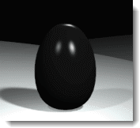
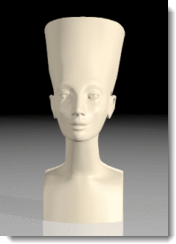

---
---
<!-- TODO: Make sure to update this page and get working in the guides section of the documentation. -->

# Grundlagen der Studiobeleuchtung
{: #studio-lighting-bascis}
Die Studiobeleuchtung muss ähnlich konfiguriert werden wie in einem Fotostudio. Um eine bessere Kontrolle zu haben, verwenden Sie Lichtquellen, um die Szene zu beleuchten.

Beim Beleuchten eines Studios ist eine dramatische Beleuchtung wichtig. Erzeugen Sie dramatische Beleuchtung, indem Sie viel Kontrast erstellen. Das bedeutet, dass dunkle Bereiche genauso wichtig sind wie helle Bereiche. Dramatische Beleuchtung benötigt eine Anzahl von Lichtquellen, die auf eine Art und Weise platziert sind, dass sie sehr helle und sehr dunkle Bereiche erzeugen.
Für die elementarste Studiobeleuchtung wird ein Haupt- (1), ein Füll- (2) und ein Hinterlicht (3) verwendet. Das ist die am meisten verwendete Beleuchtungskonfiguration für alleinstehende Personen und Objekte in einem Studio. Eine Dreipunkt-Konfiguration ergibt sofort gute Resultate und ist ein ausgezeichneter Startpunkt, um Spezialeffekte zu erzeugen. Spotlichter sind hilfreich, weil Sie deren Richtung und Einfallspunkt kontrollieren, um der Szene mehr Realismus zu verleihen.

## Kamerawinkel
{: #cameraangle}
Die Lichteinstellungen hängen immer vom Winkel der Kamera zum Objekt ab. Am besten beginnen Sie damit, den Kamerawinkel zu definieren. Verwenden Sie die Befehle **Kamera** oder **BenannteAnsicht**, um Position und Winkel der Kamera einzustellen. So können Sie die Position der Lichter bestimmen.

## Grundeinstellung mit drei Lichtern
{: basic-three-light-setup}
Eine grundlegende Studiobeleuchtungskonfiguration besteht aus drei Lichtern: Hauptlicht, Fülllicht, Hinterlicht.

### Hauptlicht
{: #keylight}
Das Hauptlicht ist das wichtigste Licht in der Szene. Es definiert die Atmosphäre, gibt die Richtung an, zeigt die Dimension und Textur an und erzeugt die dunkelsten Schatten. Ein Hauptlicht wird normalerweise 30 bis 45 Grad seitlich und oberhalb des Objekts platziert, je nach Sujet.
Je näher sich das Hauptlicht an der Kamera befindet, desto weniger Modellierung und Textur erzeugt es. Ein Hauptlicht befindet sich meistens höher als die Linse und wirft Schatten nach unten. Wenn das Hauptlicht auf die Seite verschoben wird, wird die dreidimensionale Qualität des Objekts erhöht. Bei einem klassischen Porträt wird das Licht in einem 45-Grad-Winkel zwischen dem Aufnahmegegenstand und der Kamera aufgestellt, hoch genug, um Schatten nach unten zu werfen, aber nicht so hoch, dass die Augen des Aufnahmegegenstands im Schatten liegen.
Wenn das Hauptlicht ein weiches Licht ist, wird wahrscheinlich nur ein kleines oder gar kein Fülllicht benötigt. Es handelt sich um eine grundlegende Lösung für die Beleuchtung kleiner Studioszenen.
Der vom Hauptlicht geworfene Schatten wird auf dem Aufnahmegegenstand sichtbar sein. Auf Bildern von Gesichtern erzeugt diese Technik oft einen starken von der Nase erzeugten Schatten.

### Fülllicht
{: #filllight}
Das Fülllicht wird genau oberhalb der Linse platziert, auf der entgegengesetzten Seite des Hauptlichts. Es reduziert den Kontrast und bringt mit Hilfe einer Simulation von Licht, das von nahegelegenen Objekten reflektiert wird, Details in den Schatten hervor. Haupt- und Fülllicht können dieselbe Intensität aufweisen, um einen schwachen Kontrast zu erzeugen, aber das Hauptlicht ist meistens heller und härter als das Fülllicht. Das Fülllicht ist die sekundäre Beleuchtung einer Szene. Es sollte keine weiteren dunklen Schatten in die Szene einbringen.
Auf dem Bild ist der Schatten links neben der Nase und entlang der linken Seite heller und weicher als auf dem Bild nur mit dem Hauptlicht.

### Hinterlicht
{: #backlight}
Der Hinterlichteffekt ist subtil, kann aber die Kanten von Objekten in der Szene definieren und dient zur Steigerung der Tiefe und Hintergrundabhebung der Objekte. Hinterlichter werden meistens hinter und oberhalb des Objekts platziert und sind gegen die Kamera gerichtet.
Die Wirksamkeit von Hinterlichtern hängt zum Teil vom Reflexionsvermögen der beleuchteten Flächen ab.
Im Bild hilft das Licht oberhalb der Schultern dabei, das Sujet vom Hintergrund abzuheben. Das Hinterlicht macht auch die Schatten weicher und erhellt die Fläche, auf der das Objekt liegt.

## Lichtqualitäten
{: #lightquality}
Bilder können mit scharfen Schatten, Glanzlichtern und Reflexionen erzeugt werden, aber ohne passende Beleuchtung werden Sie keine schönen Renderings erhalten. Bei der Konfiguration der Beleuchtung sollten Sie überlegen, welchen Effekt Sie erzielen wollen. Gute Bilder sind ausdrucksvoll, grafisch und einfach. Zu viele Glanzlichter auf Glasobjekten oder Schatten von Objekten könnten eine Szene unnötig komplex machen und das Wesentliche, das wir zu betonen versuchen, beeinträchtigen.
Qualitäten, die in Betracht gezogen werden müssen:

>Der Kontrastumfang der Szene
>Die Tiefe der Szene (die dreidimensionale Qualität)
>Abgrenzung von Objekten vom Hintergrund
>Weichheit oder Härte der Beleuchtung
>Wärme oder Kälte der Beleuchtungsfarbe

### Kontrastumfang
{: #contrastrange}
Der Kontrastumfang ist die Differenz zwischen den hellsten und dunkelsten Flächen in einer gegebenen Szene. Das menschliche Auge besitzt einen größeren Kontrastumfang als ein Film und kann lokal kompensieren, um Details in sehr hellen oder sehr dunklen Bereichen zu sehen. Dieser Effekt kann auf Schnappschüssen gesehen werden, die an einem sonnigen Tag gemacht wurden.
Eigentlich ist die beleuchtete Seite viel zu hell oder die Schattenseite viel zu dunkel, aber Sie werden kein Problem damit haben, die Details sowohl auf der hellen wie auf der dunklen Seite zu sehen. Der Kontrastumfang ist einfach viel zu groß und kann nicht auf Film aufgenommen werden. Dasselbe trifft auf gerenderte Bilder zu, weil der Computer bei der Farbenanzeige limitiert ist.

Ein Bild mit niedrigerem Kontrast verhindert, dass die Details in den hellen oder dunklen Bereichen verdunkelt werden.

### Dreidimensionale Qualität
{: #three-dimensional}
Damit drei Dimensionen in einem zweidimensionalen Raum dargestellt werden können, muss eine Tiefenillusion erzeugt werden. Ein undurchsichtiges, seitlich beleuchtetes Objekt deutet Tiefe an, weil es eine helle Glanzlichtseite und eine dunklere Schattenseite aufweist. Eine Box mit drei sichtbaren Seiten wird mehr Dimension haben, wenn jede Seite einen anderen Wert hat. Oft ist die oberste Ebene die hellste, weil das Licht in realen Situationen normalerweise von oben kommt.

### Abgrenzung vom Hintergrund
{: #separation}
Damit ein Produkt aus einer Seite hervorsticht, muss es sich gut vom Hintergrund trennen und zusätzlich über dreidimensionale Qualität verfügen. Mit anderen Worten, die Kanten des Aufnahmegegenstands müssen bedeutend heller oder dunkler als der Hintergrund sein. Ohne Trennung wird das Objekt in den Hintergrund überblenden.
Im Bild hilft das Glanzlicht oben am Objekt, das Sujet vom Hintergrund abzuheben.
Der Schatten des Objekts kann manchmal bei der Trennung helfen und manchmal dazu führen, dass Objekte sich mit dem Hintergrund mischen. Ein Hinterlicht kann die Trennung vereinfachen, weil es eine helle Kante um das Objekt erzeugt.

### Hartes oder weiches Licht
{: #hard-soft}
Licht kann in zwei Gruppen unterteilt werden: hartes (direktes) Licht und weiches (diffuses) Licht.
Ein hartes Licht wirft einen klar definierten, scharfkantigen Schatten.

Ein diffuses Licht wirft einen weichen, manchmal kaum erkennbaren Schatten.
Diffuses Licht erzeugt aufgrund seiner weichen Schatten oft ein attraktiveres Bild als hartes Licht. Je größer das Licht und je näher es sich am Objekt befindet, desto weicher ist es. Ein großes weiches Licht kann Licht von einem Fenster simulieren.

Diese Beleuchtungsart kann für dunkle Plastikobjekte nützlich sein, weil es ein breites Licht erzeugt, das die Form von schwarzen glänzenden Objekten definiert.

Beim Beleuchten eines Studios ist es wichtig, dramatisches Licht mit hohem Kontrast zu haben. Das bedeutet, dass dunkle Bereiche genauso wichtig sind wie helle Bereiche. Dramatische Beleuchtung benötigt eine Anzahl Lichter, die so angeordnet sind, dass sie helle und dunkle Flächen erzeugen.
Die Beleuchtungstechniken für Fotografie sind normalerweise die gleichen wie die Beleuchtung für das Rendering. Ein guter Start wäre also eines der vielen Bücher über fotografische Beleuchtung.
Flamingo nXt enthält vordefinierte [Beleuchtungsschemen](lighting-tab.html#lighting-presets), die Sie als Ausgangspunkt für die Beleuchtung Ihres Modells verwenden können. Die Einstellungen im Reiter [Erweitert](lighting-advanced-tab.html) sind für jede Beleuchtungsmethode optimiert.