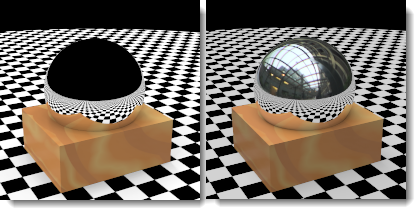

# {: .inline} {{page.title}}
In Rhino gibt es viele verschiedene [Umgebungstypen](http://docs.mcneel.com/rhino/5/help/de-de/commands/environmenteditor.htm). In diesem Abschnitt wird die Flamingo-Umgebung behandelt.

Die Umgebung hat Einfluss auf den sichtbaren Teil des Hintergrunds und auf Reflexionen.  Effekte für die Beleuchtung der Szene sind im Hilfethema [Himmel](sun-and-sky-tabs.html) beschrieben.

Flamingo verfügt über eine **Flamingo-Standardumgebung**.  Diese Umgebung wird mit den aktuellen [Beleuchtungsvoreinstellungen](lighting-tab.html) synchronisiert. Bei Verwendung der [Beleuchtungsvoreinstellungen](lighting-tab.html) werden sowohl die Beleuchtung als auch die Umgebung auf geeignete Standardwerte eingestellt.

Die einzustellenden Eigenschaften für eine Flamingo-Umgebung sind:

  * [Name](#name)
  * [Flamingo-Umgebung](#environment)
  * [Hintergrundfarbe](#color-backgrounds)
  * [Erweiterter Hintergrund](#advanced-background-reflected-sky)

## Name der Umgebung
{: #name}
Der Name der Umgebung im Rhino-Modell.  Umgebungen werden im Rhino-Modell gespeichert. Das bedeutet, dass derselbe Name in verschiedenen Modellen für unterschiedliche Umgebungen verwendet werden kann. Zur Verwendung einer Umgebung in einem anderen Modell muss sie zuerst in die [Bibliothek](libraries.html) exportiert werden. Der Name der Umgebung dient beim Export als Dateiname.

## Flamingo-Umgebung
{: #environment}
Für eine Umgebung gibt es in einem Rendering drei wesentliche Effekte:

  1. Sichtbarer Hintergrund
  1. [Reflektierter Hintergrund](#advanced-background-reflected-sky)
  1. [Gebrochener Hintergrund](#advanced-background-refracted-sky)

Der sichtbare Hintergrund ist die grundlegende Hintergrundfarbe der Szene.  Der sichtbare Hintergrund kann im Panel der allgemeinen Eigenschaften eingestellt werden. Der [reflektierte](#advanced-background-reflected-sky) und [gebrochene](#advanced-background-refracted-sky) Hintergrund kann abweichen und ist im Abschnitt des erweiterten Hintergrunds verfügbar.

#### Intensität
{: #background-intensity}
Ändert die relative Helligkeit des Hintergrunds. Der Wert für die Intensität wird verwendet, um die Farben im Hintergrund zu multiplizieren und so einen Beleuchtungswert zu erhalten.  Farben können je Kanal einen Wert von 0-255 haben. Die Intensität multipliziert diese Werte.  Dies ist wichtig, wenn der Hintergrund im Vergleich zum gerenderten Modell sehr dunkel erscheint.

#### Hintergrundtyp
{: #background-type}
Definiert das Farbschema, das den Hintergrund des gerenderten Bilds füllt. Für Hintergründe stehen die folgenden Typen zur Verfügung:

* [Himmel](#environment-sky)
* [Einfarbig oder Farbverläufe](#color-backgrounds)
* [Bild](#environment-image)
* [HDR- und planares HDR-Bild](#hdr-background)

## Himmel
{: #environment-sky}
Die Himmelsumgebung verwendet die Konfiguration von Sonne und Himmel aus den [Beleuchtungsvoreinstellungen](lighting-tab.html).  Dies ist die Standardvoreinstellung für Renderings mit einem Himmel.

*Automatisch (links) und HDR-Bild und Sonne (rechts).*

## Farbe
{: #color-backgrounds}
Es ist immer eine Steuerung für die Hintergrundfarbe vorhanden. Eine Hintergrundfarbe ist auch dann vorhanden, wenn diese komplett hinter einem Bild, HDRI-Bild oder Himmelshintergrund verborgen ist.

#### Einfarbig
{: #solid-color}
Ein einfarbiger Hintergrund besteht aus einer einzigen Farbe, die die Hintergrundkugel füllt.

*Einfarbiger Hintergrund.*
Weitere Infos zum Bearbeiten einer Farbe finden Sie im Hilfethema zu den [Farbsteuerungen](#enviroment-sky-color-controls) unten.

#### Zweifarbiger Farbverlauf
{: #two-color-gradient}
Zwei- und dreifarbige Farbverlaufshintergründe werden nur auf perspektivische Ansichten angewendet. Ein zweifarbiger Farbverlauf interpoliert die Hintergrundfarbe zwischen zwei ausgewählten Farben.

*Zweifarbiger Farbverlaufshintergrund: Blau und Gelb.*
Weitere Infos zum Bearbeiten eines zweifarbigen Farbverlaufs finden Sie im Hilfethema zu den [Farbsteuerungen](#enviroment-sky-color-controls) unten.

#### Dreifarbiger Farbverlauf
{: #three-color-gradient}
Dreifarbige Farbverlaufshintergründe interpolieren die Hintergrundfarbe zwischen drei ausgewählten Farben.

*Dreifarbiger Farbverlaufshintergrund: Blau, Weiß, Gelb.*
Weitere Infos zum Bearbeiten eines dreifarbigen Farbverlaufs finden Sie im Hilfethema zu den [Farbsteuerungen](#enviroment-sky-color-controls) unten.

### Farbsteuerungen
{: #enviroment-sky-color-controls}
Die Anzahl der Steuerelemente hängt von dem ausgewählten Farbhintergrundtyp ab. Farbverlaufshintergründe haben drei Farbwähler für die obere, mittlere und untere Farbe.



#### Farben austauschen
Durch Klick auf diese Schaltfläche werden die obere und untere Farbe des Farbverlaufs gegeneinander ausgetauscht.

#### Farbverlauf-Mapping
{: #gradient-mapping}
Die Farben eines Farbverlaufshintergrunds müssen auf die Umgebungskugel gemappt werden. Dies kann mit den Steuerelementen für das Farbverlauf-Mapping eingestellt werden.  Dieses ist nur dann aktiv, wenn ein zwei- oder dreifarbiger Farbverlauf ausgewählt wurde. Ein Farbverlauf kann nur auf perspektivische Ansichten angewendet werden.

#### Winkel aus Ansicht
{: #angle-from-views}
Wenn diese Option ausgewählt wurde, wird der aktuelle Farbverlauf mit der aktuell gerenderten perspektivischen Ansicht synchronisiert.  Die obere Farbe wird auf den oberen Bereich der Ansicht gemappt und die untere Farbe auf den unteren Bereich der Ansicht.  Alle anderen Farben werden gleichmäßig zwischen diesen Extremen verteilt.

#### Ansichtshöhenmapping
{: #colorrange}
Wenn das aktuelle Ansichtsfenster eine perspektivische Projektion ist, können die obere und untere Farbe sowie die Grenzen des Farbverlaufs eingestellt werden.

{: style="float: left; padding-right: 25px;padding-bottom: 15px;padding-top:15px;"}

* Die Steuerung zeigt die Umgebung in einer Schnittansicht.  Die 90-Grad-Markierung weist in die positive z-Richtung. Die 0-Koordinate entspricht der horizontalen Grundebene. Die -90-Grad-Markierung weist in die negative z-Richtung.
* Der graue Bereich zeigt die letzten Koordinaten der aktuellen perspektivischen Ansicht an.
* Der rote Pfeil zeigt die Grenze an, ab der die Ansicht nach oben hin mit der oberen Farbe gefüllt ist.
* Der grüne Doppelpfeil entspricht der Mitte des Farbverlaufs zwischen der oberen und der unteren Farbe.  Bei einem dreifarbigen Farbverlauf befindet sich hier die mittlere Farbe.
* Der blaue Pfeil zeigt die Grenze an, ab der die Ansicht nach unten hin mit der unteren Farbe gefüllt ist.

####  Winkel aus Ansicht ableiten
Mit dieser Schaltfläche kann die Verlaufssteuerung auf die Koordinaten der aktuellen perspektivischen Ansicht zurückgesetzt werden.

#### Winkel oben/Mitte/unten
Diese Winkel bestimmen die Einstellung für die obere, mittlere und untere Farbe im aktuellen Farbverlauf.  Sie entsprechen daher auch der Stellung des roten, grünen und blauen Pfeils in der Ansichtshöhenmapping-Steuerung.

## Bildhintergrund
{: #environment-image}

Ein Hintergrundbild wird auf den Hintergrund projiziert. Dies wird oftmals verwendet, um ein Modell in einen vorhandenen Kontext zu setzen oder eine Ansicht aus dem Fenster einzustellen. Als Quelle hierfür kann ein beliebiges digitales Bild verwendet werden. Je höher die Auflösung des Bilds, desto bessere Resultate können erzielt werden. Durch Weichzeichnen oder Aufhellen scharfer Bilder können natürliche Brennpunkte oder Vogelperspektiven simuliert werden. Das Hintergrundbild kann in einer planaren, zylindrischen oder kugelförmigen Projektion auf die Szene abgebildet werden.

*Ein planares Bild als Hintergrund.*

### Bilddatei
{: #image-properties}
Wählen Sie das Hintergrundbild durch Klick auf die große Schaltfläche mit dem Text *(leer - zum Zuweisen hier klicken)*.  Klicken Sie zum Zuweisen eines anderen Bilds auf die Miniaturansicht des aktuellen Bilds.

### Projektion
{: #backgroud-image-projection}
Wählen Sie eine Bildprojektion im Dropdownmenü aus:

* [Planar](#planar)
* [Zylindrisch](#cylindrical)
* [Kugelförmig](#spherical)

Jede Projektionsmethode verfügt über eigene Optionen zur Positionierung des Bilds.

### Planare Projektion
{: #planar}
Projiziert das Bild auf einen flachen Hintergrund in der aktuellen Ansicht. Die planaren Projektionskoordinaten sind immer relativ zur aktuellen Ansicht.

#### Winkel aus Ansicht ableiten
Diese Option sorgt dafür, dass das Bild stets mit der aktuellen Ansicht synchronisiert wird.  Dabei kann das Bild zur Anpassung gestreckt werden.

#### Steuerelement zur Bildpositionierung
Mit dieser Steuerung kann die Position des Bildes relativ zur aktuellen Ansicht eingestellt werden. Die Form des Ansichtsfensters wird dabei als dunkelgraues Rechteck wiedergegeben. Durch Ziehen des pinken Rechtecks oder Verwendung der numerischen Steuerung kann das Hintergrundbild relativ zur Ansicht verschoben oder skaliert werden.

*Hintergrundbereich (1), Bildgröße und Form (2).*

#### x-Skalierung / y-Skalierung
Damit wird die Größe des Hintergrundbilds skaliert, wobei der Wert 1.0 genau der Höhe bzw. Breite der Ansicht entspricht. Bei Eingabe einer x-Skalierung 1.0 beispielsweise nimmt das Hintergrundbild 100 % der Breite der Ansicht ein, während ein Wert von 0.5 bedeutet, dass es auf 50 % der Breite skaliert wird.

#### x-Versatz / y-Versatz
Damit kann das Hintergrundbild ausgehend von der linken unteren Ecke des Ansichtsfensters mit einem Wert bezüglich der Breite und Höhe des Ansichtsfensters versetzt werden, wobei der Wert 1.0 einem Versatz von 100 % entspricht. So wird das Hintergrundbild bei Eingabe eines x-Versatzes von 0.25 beispielsweise um 25 % der Breite des Ansichtsfensters versetzt, bei 0.5 sind es 50 % usw.

#### Steuerelement zur Bildpositionierung
Mit dieser Steuerung kann die Position des Bildes relativ zur aktuellen Ansicht eingestellt werden. Die Form des Ansichtsfensters wird dabei als dunkelgraues Rechteck wiedergegeben. Durch Ziehen des pinken Rechtecks oder Verwendung der numerischen Steuerung kann das Hintergrundbild relativ zur Ansicht verschoben oder skaliert werden.

*Hintergrundbereich (1), Bildgröße und Form (2).*

<!-- TODO: The next two sections are repeated. Maybe they belong to the "Cylindrical Projection" below? -->

#### x-Skalierung / y-Skalierung
Damit wird die Größe des Hintergrundbilds skaliert, wobei der Wert 1.0 genau der Höhe bzw. Breite der Ansicht entspricht. Bei Eingabe einer x-Skalierung 1.0 beispielsweise nimmt das Hintergrundbild 100 % der Breite der Ansicht ein, während ein Wert von 0.5 bedeutet, dass es auf 50 % der Breite skaliert wird.

#### x-Versatz / y-Versatz
Damit kann das Hintergrundbild ausgehend von der linken unteren Ecke des Ansichtsfensters mit einem Wert bezüglich der Breite und Höhe des Ansichtsfensters versetzt werden, wobei der Wert 1.0 einem Versatz von 100 % entspricht. So wird das Hintergrundbild bei Eingabe eines x-Versatzes von 0.25 beispielsweise um 25 % der Breite des Ansichtsfensters versetzt, bei 0.5 sind es 50 % usw.

### Zylindrische Projektion
{: #cylindrical}
Die zylindrische Projektion spannt das Bild auf einen imaginären, das Modell umgebenden Zylinder. Obwohl diese Projektion mit echten zylindrischen Bildern am besten funktioniert, kann sie auch mit von Fotos erzeugten Standardpanoramen effektiv verwendet werden.

Bestimmen Sie Größe und Position der Bild-Map in Höhen- und Breitenwinkeln. Verwenden Sie die grafischen Werkzeuge und die Maus, um das Bild zu positionieren und seine Größe zu ändern. Der aktuelle Sichtkegel wird in der Grafik als hellgrau schattierter Bereich angezeigt.

#### Winkel aus Ansicht ableiten
Diese Option sorgt dafür, dass das Bild stets mit der aktuellen Ansicht synchronisiert wird.  Dabei kann das Bild zur Anpassung gestreckt werden.

#### Plansteuerung
Definiert die Winkelbreite der Bild-Map. Geben Sie einen Winkel ein oder ziehen Sie die Pfeile im Steuerelement, um die Breite einzustellen. Der blaue Bereich entspricht den Abmessungen der Winkelbreite.

{: .float-img-left}

* Die Steuerung zeigt die Umgebung in einer Planansicht an.
* Der dunkelgraue Bereich zeigt die letzten Koordinaten der aktuellen perspektivischen Ansicht an.
* Der blaue Bereich zeigt den Winkelbereich des sichtbaren Bilds an.
* Der blaue Pfeil entspricht der linken Koordinate der Bild-Map.
* Der rote Punkt markiert die Bildmitte.
* Der violette Pfeil entspricht der rechten Koordinate der Bild-Map.

#### Vertikalsteuerung
{: .clear-img}
Damit werden die vertikalen Ausmaße der zylindrischen Projektion eingestellt. Geben Sie einen Winkel ein oder ziehen Sie die Pfeile im Steuerelement, um den oberen und unteren Winkel einzustellen. Die zylindrische Projektion ist auf 45 Grad ober- oder unterhalb des Horizonts limitiert.

{: .float-img-left}

* Die Steuerung zeigt den Zylinder in einer Schnittansicht.
* Der graue Bereich zeigt die letzten Koordinaten der aktuellen perspektivischen Ansicht an.
* Der blaue Pfeil entspricht dem unteren Rand der Bild-Map.
* Der rote Pfeil entspricht dem oberen Rand der Bild-Map.

#### Drehung
{: .clear-img}
Zur Bestimmung der Drehung des Bilds. Der rote Punkt markiert die Bildmitte.

#### Breite
Zur Bestimmung der Breite des Bilds in Grad bezüglich der Planansicht.

#### Oben / Unten
Zur Bestimmung der vertikalen Winkel des Bilds basierend auf der horizontalen Richtung der Grundebene im Modell.

####  Winkel aus Ansicht ableiten
Mit dieser Schaltfläche wird der Drehwinkel so eingestellt, dass er mit dem aktuellen perspektivischen Ansichtsfenster übereinstimmt.  Dies ist hilfreich, um die Projektionswerte wieder zurückzusetzen.

### Kugelförmige Projektion
{: #spherical}
Die kugelförmige Projektion mappt das Bild auf eine vollständige Kugel. Diese Methode erzeugt normalerweise gute Resultate, wenn Sie über ein Bild in Rektangularprojektion verfügen.  Eine Rektangularprojektion hat ein rechteckiges Seitenverhältnis von 2 zu 1.

#### Winkel aus Ansicht ableiten
Diese Option sorgt dafür, dass das Bild stets mit der aktuellen Ansicht synchronisiert wird.  Dabei kann das Bild zur Anpassung gestreckt werden.

#### Kugelsteuerung
Zur Einstellung der Richtung der Bild-Map. Geben Sie einen Winkel ein oder ziehen Sie den Pfeil im Steuerelement, um die Breite einzustellen. Der rote Punkt markiert die Bildmitte.

#### Drehung
{: .clear-img}
Zur Bestimmung der Drehung des Bilds. Der rote Punkt markiert die Bildmitte.

####  Winkel aus Ansicht ableiten
Mit dieser Schaltfläche wird der Drehwinkel so eingestellt, dass er mit dem aktuellen perspektivischen Ansichtsfenster übereinstimmt.  Dies ist hilfreich, um die Projektionswerte wieder zurückzusetzen.

## HDRi-Hintergrund
{: #hdr-background}
Wenn Sie ein HDR-Bild als Umgebung verwenden, haben Sie mehr Kontrolle über die Beziehung zwischen dem Licht im Hintergrund und anderen Lichtern im Bild. Dies ist vor allem hilfreich, um einen Innenraum mit einer hellen Außenszene darzustellen, die durch ein Fenster hindurch gesehen wird. Ein HDR-Umgebungsbild hat eine größere Helligkeitspalette als ein normales Bitmap-Bild und es kann ihm ein Kanal zur Verwaltung des Kontrasts in einem [Mehrkanal](lights-tab.html#channel)-Rendering zugewiesen werden.

#### Bilddatei
{: #hdri-image}
Wählen Sie das HDR-Hintergrundbild durch Klick auf die große Schaltfläche mit dem Text *(leer - zum Zuweisen hier klicken)*.  Klicken Sie zum Zuweisen eines anderen Bilds auf die Miniaturansicht des aktuellen Bilds.






## Optionen von planarem HDRi
{: #planar-hdr-options}

Planare HDR-Bilder werden selten verwendet, können aber sehr hilfreich sein.  Das HDR-Format bietet einen breiteren Bereich an Farbmöglichkeiten. Sehr geeignet sind planare HDR-Bilder für den Außenbereich hinter Fenstern in Architektur-Renderings, bei denen der Hintergrund zu hell oder dunkel ist.  Planare HDR-Bilder werden immer planar gemappt.

*Hintergrundbild (links) und planares HDR (rechts) zeigen feine Beleuchtungsunterschiede im Hintergrund.*

#### Bilddatei
{: #hdri-planar-image}
Wählen Sie das HDR-Hintergrundbild durch Klick auf die große Schaltfläche mit dem Text *(leer - zum Zuweisen hier klicken)*.  Klicken Sie zum Zuweisen eines anderen Bilds auf die Miniaturansicht des aktuellen Bilds.



## Erweiterter Hintergrund
{: #advanced-background}
Die erweiterten Hintergrundeinstellungen steuern Umgebungen, die im Rendering nicht sichtbar sind, aber in Reflexionen und Lichtbrechungen für die Objekte angezeigt werden. Dadurch kann die sichtbare Umgebung ein bestimmtes Aussehen haben, während Reflexionen und Lichtbrechungen auf eine andere Umgebung reagieren.  So erscheint der Hintergrund in der Abbildung unten beispielsweise schwarz, aber die reflektierte Umgebung ist ein HDR-Bild eines Gebäudes von Innen.

*Normale Umgebung (links) und reflektierte HDRI-Himmelsumgebung (rechts).*

### Reflektiert
{: #advanced-background-reflected-sky}
Eine reflektierte Umgebung ist im gerenderten Bild nicht sichtbar, aber sie wird in glänzenden Objekten reflektiert.

#### Himmel
Objekte spiegeln den Himmel, wie es in den Einstellungen für [Beleuchtung: Sonne und Himmel](sun-and-sky-tabs.html) festgelegt wurde.

#### Benutzerdefiniert
Objekte reflektieren einen durch eine [Farbe oder einen Farbverlauf](#color-backgrounds), ein [Bild](#environment-image) oder ein [HDR-Bild](#hdr-background) definierten Hintergrund.

#### Sichtbarer Hintergrund
Objekte reflektieren den sichtbaren Hintergrund, wie es in den Einstellungen für die [Umgebung](environment-tab.html) festgelegt wurde.

### Gebrochen
{: #advanced-background-refracted-sky}

#### Himmel
Objekte brechen den Himmel, wie es in den Einstellungen für [Beleuchtung: Sonne und Himmel](sun-and-sky-tabs.html) festgelegt wurde.

#### Benutzerdefiniert
Objekte brechen einen durch eine [Farbe oder einen Farbverlauf](#color-and-gradient-backgrounds), ein [Bild](#image) oder ein [HDR-Bild](#hdr-background) definierten Hintergrund.

#### Sichtbarer Hintergrund
Objekte brechen den sichtbaren Hintergrund, wie es in den Einstellungen für die [Umgebung](environment-tab.html) festgelegt wurde.

#### Kein transparentes Objekt-Alpha
{: #no-transparent-alpha-objects}
Verhindert, dass der Alphakanal durch transparente Objekte hindurch sichtbar ist und verhindert die Zusammensetzung des Alphakanals durch transparente Objekte.
Deaktivieren Sie diese Option, wenn Bilder in den Alphakanal eingefügt werden.