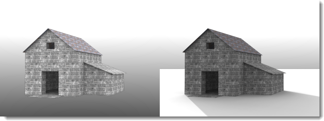

# {{page.title}}
{: #ground-plane}

Die Grundebene bietet dem Bild eine unendliche horizontale Plattform, die sich zum Horizont hin in alle Richtungen erstreckt und sich auf einer definierten Höhe befindet. Eine Grundebene wird viel schneller gerendert, als wenn Sie eine große planare Fläche als Basis verwenden.

### Aktiviert
{: #groundplane-enabled}
Aktiviert die Grundebene.

*Grundebene deaktiviert (links) und aktiviert (rechts).*

### Alpha
{: #groundplane-alpha}
Wendet einen transparenten Alpha-Kanal an die Grundebene an, so dass das Bild mit dem geworfenen Schatten in ein anderes Bild eingefügt werden kann. Weitere Infos: [Wikipedia-Artikel: Alpha-Blending](https://de.wikipedia.org/wiki/Alpha_Blending).

 *Die Grundebene zeigt Schatten an, ist aber sonst im Bild transparent.*

### Höhe
{: #groundplane-elevation}
Definiert die Höhe der Grundebene oberhalb von 0.

*Höhe der Grundebene über 0.*

### Material
{: #groundplane-material}
Weist der Grundebene ein [Material](simple-material-properties.html) zu.

*Höher angesetzte Grundebene und Wassermaterial.*