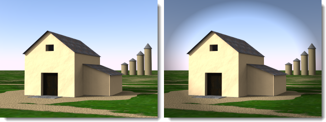

# {{page.title}}
Der nXt-Bildeditor kann native Bilddateien (.nXtImage), die von einer beliebigen nXt-Plattform erzeugt werden, bearbeiten. Diese nativen Dateien enthalten die gesamte Information, die während eines Renderings gesammelt wird.
Mit dem nXt-Bildeditor können Sie:

> die Einstellungen des [Tonreglers](image-editor.html#tone-mapping) anpassen.
> die Intensität eines beliebigen Beleuchtungskanals ändern.
> besondere, bildgestützte Effekte hinzufügen: [Dunst](image-editor.html#haze), [Tiefenschärfe](image-editor.html#depth-blur) und [Scheinen](image-editor.html#glare).
> ein Tone-Mapping-Bild in ein Bitmap-Format wie JPG oder PNG [speichern](image-editor.html#save-tonemapped-image-as).
> die Luminanzinformationen in einem [HDR-Format](image-editor.html#save-hdr-image-as) speichern.
> zusätzliche Kanäle ( [Alpha](image-editor.html#alpha-channel), [Abstand](image-editor.html#distance-channel), [Material](image-editor.html#material-channel) ) zur Verwendung in fortgeschrittenen Kompositionen anzeigen und speichern.
> ein [Piranesi©](http://www.piranesi.co.uk/)-Bild (*.epx) speichern, das für fotorealistischen Renderings verwendet werden kann.
> [Bildarithmetik](image-editor.html#arithmetic) für Aufgaben wie das Zusammenfügen eines Bilds verwenden, das mithilfe einer Renderfarm erzeugt wurde.
> die für das Rendering verwendeten [Beleuchtungseinstellungen](image-editor.html#save-lighting-settings-as) speichern. Diese Beleuchtungseinstellungen können verwendet werden, um weitere Renderings zu erzeugen.

Den Editor starten

> Klicken Sie im Menü **Flamingo nXt 5.0** auf **Weitere Werkzeuge &gt; Flamingo-nXt-Bildeditor**.

## Menü Datei
{: #file-menu}

### Öffnen
Öffnet eine im nXtImage-Format gespeicherte Datei zum Bearbeiten.

### Originalbild speichern
Speichert die nXtImage-Datei.

### Originalbild speichern unter
Speichert die nXtImage-Datei unter einem anderen Namen.

### Tonemapping-Bild speichern unter
{: #save-tonemapped-image-as}
Speichert das bearbeitete Bild als Bitmap-Datei.

 * JPEG (.jpg)
 * TIFF (.tif)
 * TIFF mit Alphakanal (.tif)
 * PNG (.png)
 * PNG mit Alphakanal (.png)
 * [Piranesi-EPix-Datei (.epx)](http://www.piranesi.co.uk/)

Piranesi ist ein 3D-Malprogramm, das Bilder erzeugt, die von Hand gezeichnet scheinen.

### HDR-Bild speichern unter
{: #save-hdr-image-as}

 * HDR-Datei (.hdr)
 * EXR-Datei (.exr)
 * EXR mit Alphakanal (.exr)

### Maske speichern
{: #save-mask}
nXtImage-Bilder enthalten drei zusätzliche Kanäle, die in den meisten Bitmap-Editoren als Masken für fortgeschrittene Komposition verwendet werden können. Diese Kanäle enthalten Alpha-, Abstands- und Materialinformationen für jedes Pixel, in einem Grauskalabild codiert. Jeder Kanal kann in eine .png Datei gespeichert und visualisiert werden.

##### Hinweise:

 1. Der Alpha-Kanal kann mit einem Tonemapping-Bild ausgestattet werden, indem ein Dateiformat mit Alpha ausgewählt wird, wenn ein Tonemapping-Bild gespeichert wird.
 1. Abstands- und Materialkanäle verfügen über kein Antialiasing und können hartkantige Artefakte aufweisen. Wenn Sie vor ihrer Verwendung einer Maske etwas Gaußsche Unschärfe hinzufügen, könnte dies diese Kanten etwas weicher gestalten.
 1. Der Materialkanal codiert nur 255 verschiedene Materialien. Wenn Ihr Modell über mehr Materialien verfügt, werden einige Maskenfarben wiederholt.

#### Materialkanal
{: #material-channel}
Speichert die Materialkanalmaske.

#### Alphakanal
{: #alpha-channel}
Speichert die die Alphakanalmaske.

#### Abstandskanal
{: #distance-channel}
Speichert die Abstandskanalmaske.

### Beleuchtungseinstellungen speichern unter
{: #save-lighting-settings-as}
Zum Speichern des [Beleuchtungsschemas](lighting-tab.html#open-lighting-scheme).

## Bildmenü
{: #renderwindowimage}

### Info
{: #info}
Zeigt Informationen über das Bild an.

### Arithmetik
{: #arithmetic}
Zum Zusammensetzen oder Überlappen von Bildsegmenten, die mit der Renderfarmfunktion [Einzelnes Bild](automate-rendering.html#single-images) gerendert wurden.

##### Bildersegmente zusammenfügen:

 1. Klicken Sie im Menü **Datei** auf **Öffnen**.
 1. Wählen Sie das erste Bild der Reihenfolge aus, zum Beispiel 000000.nXtImage.
 1. Klicken Sie im Menü **Bild** auf **Arithmetik** und dann **Hinzufügen**.
 1. Wählen Sie alle anderen Bilder in der Reihenfolge aus.

**Hinweis:** Wählen Sie das erste Bild (000000.nXtImage) nicht erneut aus, damit es nicht zweimal hinzugefügt wird.

#### Hinzufügen
Fügt Pixelwerte von einer Ebene in die andere Ebene ein. Bei Werten über 255 (im Falle von RGB) wird weiß angezeigt.

#### Subtrahieren
Extrahiert Pixelwerte einer Ebene aus einer anderen Ebene. Bei negativen Werten wird schwarz angezeigt.

#### Differenz
Subtrahiert die obere Ebene von der unteren Ebene oder umgekehrt, um immer einen positiven Wert zu erhalten. Eine Überblendung mit schwarz ergibt keine Änderung, da alle Farben einen Wert von 0 haben. Eine Überblendung mit weiß kehrt das Bild um.

#### Maske hinzufügen
Berücksichtigt bei der Überblendung die transparente Alpha-Kanal-Maske.

#### Pfadverfolgung kombinieren
Zur Kombination von Bildern, die mit der Pfadverfolgung gerendert wurden, so dass beispielsweise bei der Kombination von zehn Bildern mit je 20 Durchgängen das Äquivalent eines Bilds mit 200 Durchgängen erzielt wird.

*Mit 20 Durchgängen (links) gerendert; zehn Bilder mit je 20 Durchgängen gerendert, kombiniert, um ein mit 200 Durchgängen gerendertes Bild zu erzeugen (rechts).*

### Patch anwenden
{: #apply-patch}
Fügt ein Bild in das gerenderte Bild ein, das als ausgewählter Teil gerendert wurde.

### Animation
Eine Animation kann durch Änderung der Bildinformation erstellt werden.

##### Bildeffekte animieren

 1. Konfigurieren Sie das erste Bild. Klicken Sie auf die Schaltfläche **Plus (+)** neben dem Bearbeitungskästchen **Frame**.
 1. Bearbeiten Sie das Bild und fügen Sie Frames hinzu.
 1. Klicken Sie auf **Bild > Animation** und anschließend im Dialogfenster auf **Vorschau**.
 1. Wenn alles in Ordnung ist, klicken Sie auf **Animation**.

### Legen Sie einen Ordner an.
Es wird eine Sequenz von Bildern erstellt, die für die Erzeugung einer Animation anhand von entsprechender Software verwendet werden kann.

## Menü Ansicht
{: #view-menu}
Definiert, was im Bild angezeigt wird.

### Bild
Zeigt das gerenderte Originalbild an.

### Bild und Alphamaske
Zeigt das Bild und die Alpha-Kanal-Maske zusammen an.

### Materialmaske
Zeigt die [Materialmaske](image-editor.html#material-channel) an.

### Abstandsmaske
Zeigt die [Abstandsmaske](image-editor.html#distance-channel) an.

## Verwendung des Bildeditors

##### Bild laden

 1.  [Speichern](render-window.html#export-to-nxtimage) Sie Ihr Renderbild als **.nXtImage**-Bild.
 1. Klicken Sie im Menü **Flamingo nXt** auf **Werkzeuge &gt; Flamingo-nXt-Bildeditor**.
 1. Klicken Sie im **nXt-Bildeditor** im Menü **Datei** auf **Öffnen**, um das Bild in den Editor zu laden.

## Tone-Mapping
{: #tone-mapping}
Tone-Mapping ist der Prozess zur Umwandlung der von Flamingo nXt verwendeten Luminanzdaten in RGB-Pixel, die angezeigt oder gedruckt werden können.

#### Helligkeit
{: #brightness}
Weitere Informationen unter [Renderfenster: Helligkeit](render-window.html#brightness).


#### Nachbelichten
Weitere Informationen unter [Renderfenster: Nachbelichten](render-window.html#burn).

#### Sättigung
Weitere Informationen unter [Renderfenster: Sättigung](render-window.html#saturation).

#### Histogramm
Weitere Informationen unter [Renderfenster: Histogramm](render-window.html#histogram).

## Statusfelder
Die Statusfelder befinden sich oberhalb des Bildschirms. Wenn Sie den Cursor über das Bild verschieben, zeigen diese Felder Informationen über jedes Pixel an.

#### Pixel
{: #pixel}
Die Pixelkoordinate, von der unteren linken Ecke gemessen.

#### Farbe
{: #color}
Die ersten drei Felder zeigen die RGB-Farben an, die nach dem Tone-Mapping im Bild angezeigt werden. Das vierte Feld zeigt den Alpha-Kanal (Transparenz) an, der für Komposition verwendet wird.

#### Wert
{: #value}
Der Luminanzwert für den roten, grünen und blauen Unterkanal.

#### Lum
{: #lum}
Gewichteter Durchschnitt der Luminanzwerte, die in jedem Pixel gespeichert sind.

#### Tiefe
{: #depth}
Abstand jedes Pixels zum Betrachter in Metern. Negative Werte deuten auf einen Hintergrundpixel.

#### Material
{: #material}
Name des Materials, das für das Rendering des Pixels verwendet wurde.

## FX-Einstellungen
Einem Bild können Spezialeffekte hinzugefügt werden.  Viele dieser Effekte verwenden die Zusatzinformationen des nXtImage-Formats.  Für das Scheinen wird beispielsweise der Luminanzbereich zur Anwendung auf tatsächliche Lichtwerte und für den Dunst der Abstand im Bild verwendet.

### Dunst
{: #haze}
Fügt den Pixeln, die sich weiter von der Kamera entfernt befinden, Farbe hinzu. Dieser Effekt kann verwendet werden, um einer Szene Dunst oder Nebel hinzuzufügen, einen Hintergrund mit Farbe zu maskieren oder die Hintergrundfarbe zu ändern.

*Originalbild (links) und mit Dunst (rechts).*

#### Intensität
Legt die Intensität der Dunstfarbe fest.

#### Nah
Abstand von der Kamera, wo der Dunst beginnt, jedem Pixel Farbe hinzuzufügen.

#### Wählen
Punkt auf dem Bild wählen, um den Abstand zu definieren.

#### Weit
Der Abstand, an dem der Dunsteffekt sein Maximum hat. Allen Pixeln jenseits dieses Punkts wird der maximale Dunsteffekt hinzugefügt.
Die Dunstwerte der Pixel zwischen *Nah* und *Fern* steigen linear an.

#### Wählen
Punkt auf dem Bild wählen, um den Abstand zu definieren.

#### Farbe
Dunstfarbe.

#### Wählen
Punkt auf dem Bild wählen, um die Farbe zu definieren.

### Tiefenschärfe
{: #depth-blur}
Da jedes Pixel im Bild über einen Abstandswert verfügt, kann dies verwendet werden, um das Bild zwischen den definierten Abständen unscharf zu machen.

*Originalbild (links) und mit Tiefenschärfe (rechts).*

#### Intensität
Definiert den Unschärfegrad.

#### Brennpunkt
{: #depthblurfocus}
Definiert einen Abstand im Bild, der scharf erscheint.

#### Wählen
Punkt auf dem Bild wählen, um den Brennpunktabstand zu definieren.

#### Scharf eingestellte Zone
{: #in-focus-zone}
Abstand um den **Brennpunkt**, der scharf erscheint. Dieser Wert wird in Meter gemessen. Alle Pixel innerhalb dieses Abstands erscheinen scharf und werden vom Unschärfefilter ignoriert. Pixel über diesen Abstand hinaus werden progressiv mit angrenzenden Pixeln unscharf gemacht, um die Illusion von Tiefenschärfe zu erzeugen.

#### Weichzeichner
Steuert die Richtung des Unschärfefilters. Der Standardwert ist **Hintergrund**. Das bedeutet, dass alle Pixel, die sich weiter von der Kamera entfernt befinden als die **Scharf eingestellte Zone**, progressiv unscharf erscheinen.

*Unscharfer Vordergrund (links) und Hintergrund (rechts).*

#### Hintergrund
Macht Pixel unscharf, die sich weiter von der Kamera entfernt befinden als die **Scharf eingestellte Zone**.

#### Vordergrund
Macht Pixel unscharf, die sich näher an der Kamera befinden als die **Scharf eingestellte Zone**.

#### Beide
Macht Pixel sowohl vor als auch hinter der **Scharf eingestellten Zone** unscharf. Es handelt sich um eine schnelle Methode, um einen Tiefenschärfeeffekt zu erhalten. Dies ist nicht so präzise wie bei Verwendung der eingebauten [Schärfentiefe](render-tab.html#depthoffieldoption).

### Scheinen
{: #glare}
Scheinen beeinflusst Pixel, die heller sind als der Grenzbereich in Lumen, indem ein Lichthofeffekt auf den umgebenden Pixeln erzeugt wird. Nur die hellsten Pixel im Bild werden beeinflusst.
Halten Sie den Cursor über den Pixeln, um die Option Scheinen zu sehen und die totale Lumen dieses Pixels zu lesen.

*Originalbild (links) und mit Scheinen (rechts).*

#### Intensität
Passt den Lichthofgrad an, der die umgebenden Pixel beeinflusst.

#### Grenzbereich
Die untere Limite des Werts, der durch den Scheinfilter beeinflusst wird. Alle Pixel heller als dieser Wert werden beeinflusst.

#### Wählen
Punkt auf dem Bild wählen, um den Helligkeitswert zu definieren.

### Vignette
{: #vignette}
Macht die Farben an den Kanten des Bilds unscharf und überblendet sie, um einen Lichthofeffekt zu erzeugen.

*Originalbild (links) und mit Vignette (rechts).*