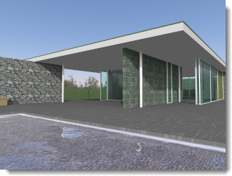
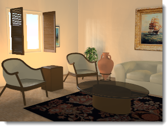

# {: .inline} {{page.title}}
Die Beleuchtung ist der wichtigste Faktor bei der Erzeugung von Bildern und auch der, der am meisten vernachlässigt wird. Es handelt sich nicht nur um eine Beleuchtungsmethode für das Modell. Die Beleuchtung definiert die Stimmung und ist Hauptbestandteil beim Festlegen der Zusammensetzung.

*Bild von Christopher Soto Gutiérrez.*

#### Wo befindet sich die Flamingo-Beleuchtungssteuerung?

* {: .inline} Menü > Flamingo nXt 5.0 > Bedienfenster anzeigen > Flamingo nXt.
* Klicken Sie mit der rechten Maustaste auf einen beliebigen Reiter und wählen Sie im Kontextmenü Flamingo nXt aus.

Verwenden Sie die folgenden Richtlinien bei der Beleuchtung Ihres Modells:

* Wählen Sie eine Beleuchtungsvoreinstellung aus.
* Da Flamingo nXt reale Lichtverhältnisse simuliert, sollten Sie so präzise Informationen wie möglich angeben.
* Vermeiden Sie unrealistische Intensitätsgrade für Lichtquellen.
* Stellen Sie die Einheiten für Ihr Modell korrekt ein. Die Beleuchtung ist nicht korrekt, wenn die Einheiten nicht richtig sind. Stellen Sie daher beispielsweise die Modelleinheiten auf Millimeter ein, wenn Ihr Modell ebenfalls Millimeter verwendet.
* Passen Sie die allgemeine Helligkeit Ihres Renderings mithilfe der Steuerung für die [Helligkeit](render-window.html#brightness) der Renderanzeige an. Versuchen Sie nicht, die allgemeine Helligkeit der Szene anzupassen, indem Sie die Intensität aller Lichtquellen ändern, da die automatische [Helligkeitsanpassung](render-window.html#brightness) dies verhindert.

Um die Beleuchtungstechniken zu verbessern, seien Sie sich über das Licht bewusst und wie es verschiedene Flächen beeinflussen kann. Materialien können einige Schatten- und Reflexionseffekte maskieren, deshalb fügen einige Rendering-Experten Ihren Modellen Beleuchtung hinzu, bevor Sie die Materialien anwenden. Versuchen Sie, die Beleuchtung objektiv zu sehen, so wie es eine Kamera tut.

## Beleuchtungseinstellungen
{: #lighting-presets}
Ein guter Ausgangspunkt für die Beleuchtung sind die Beleuchtungsvoreinstellungen, die realen Beleuchtungssituationen entsprechen. Flamingo nXt enthält Beleuchtungseinstellungen, die Ihnen dabei helfen, Ihr Modell zu beleuchten. Es stehen viele weitere Beleuchtungsoptionen zur Verfügung, wobei die Voreinstellungen für die meisten Renderings ausreichend sind. Wählen Sie das voreingestellte Schema aus, das Ihrer Szene am nächsten kommt.

Für die Beleuchtung in Flamingo nXt gibt es vier voreingestellte Kategorien:

* [Studiobeleuchtung](lighting-tab.html#studio-lighting)
* [Tageslicht außen](lighting-tab.html#exterior-daylight)
* [Tageslicht innen](lighting-tab.html#interior-daylight)
* [Künstliche Beleuchtung](lighting-tab.html#artificial-lighting)

### Studiobeleuchtung
{: #studio-lighting}
Dieses Schema ahmt die Beleuchtung eines Fotostudios nach. Es eignet sich am besten für das Rendering kleiner bis mittelgroßer, freistehender Objekte.  Es kann außerdem gut für alle Szenen verwendet werden, die durch eine HDRi-Umgebung gut beleuchtet sind.

{: .float-img-left} Die primäre Beleuchtung wird aus einem HDR-Bild abgeleitet. Das Licht aus dem HDR-Bild ähnelt der internen Beleuchtung des Studios. Die HDRI-Einstellungen befinden sich im Reiter [Himmel](sun-and-sky-tabs.html#sky). Über den Lichter-Reiter können Sie können Ihrer Szene auch künstliche Lichter hinzufügen. Der sichtbare Hintergrund in der Studio-Voreinstellung ist schwarz.

Die Studiobeleuchtung ist für Tischinstallationen mit kleinen Artikeln wie Schmuckstücken optimiert. Im voreingestellten Schema ist die Sonne deaktiviert und ein HDR-Bild als Himmel liefert etwas, worauf glänzende Objekte reflektieren können.

Um eine bessere Kontrolle zu haben, verwenden Sie Lichtquellen, um die Szene zu beleuchten. Beim Beleuchten eines Studios ist eine dramatische Beleuchtung wichtig. Erzeugen Sie dramatische Beleuchtung, indem Sie viel Kontrast erstellen. Das bedeutet, dass dunkle Bereiche genauso wichtig sind wie helle Bereiche. Eine dramatische Beleuchtung benötigt mehrere Lichtquellen, die so platziert werden müssen, dass sehr helle und sehr dunkle Bereiche erzeugt werden.

Für das Rendering gelten normalerweise dieselben Beleuchtungstechniken wie für die Fotografie, weswegen eines der vielen Bücher zur fotografischen Beleuchtung ein guter Ausgangspunkt für die Beschäftigung mit diesem Thema ist. Für weitere Informationen über die Konfiguration von Studiobeleuchtung werfen Sie einen Blick auf: [Grundlagen der Studiobeleuchtung](../guides/studio-lighting-basics.html).

### Tageslicht außen
{: #exterior-daylight .clear-img}
Dieses Schema simuliert Tageslicht für Architektur-Außenszenen anhand natürlicher Sonnen- und Himmelseinstellungen.

{: .float-img-right} Diese können in den Reitern für [Sonne](sun-and-sky-tabs.html#sun) und [Himmel](sun-and-sky-tabs.html#sky) festgelegt werden. Dabei kann der [Sonnenwinkel](sun-and-sky-tabs.html#set-azimuth-and-altitude) direkt oder unter Verwendung einer [geografischen Position](sun-and-sky-tabs.html#set-location-on-earth), eines Datums und einer Zeit eingestellt werden. Der standardmäßige sichtbare Hintergrund für diese Voreinstellung ist der simulierte Himmel.

Die Beleuchtung eines Gebäudes ist das einfachste Beleuchtungsmodell. Außenbeleuchtung benötigt meistens nur die standardmäßige [Sonnenlichtquelle](sun-and-sky-tabs.html#sun).

Wenn die [Sonne](sun-and-sky-tabs.html#sun) aktiviert ist, muss die Szene als [Innen](#interior)- oder [Außenszene](#exterior) eingestellt werden. Der Grund dafür ist, dass die Verteilung des Himmelslichts, vom Boden reflektiertes Licht und von anderen Flächen reflektiertes Licht innen anders als außen ist. Die Verwendung der korrekten [Innen- und Außeneinstellungen](#indirect) ergibt eine effektive und realistische Beleuchtung.

Manchmal ist es einfach zu bestimmen, ob es sich um eine Innen- oder Außenszene handelt. Wenn sich der Blickpunkt außerhalb eines Gebäudes befindet, ist es eine Außenszene. Wenn sich der Blickpunkt in einem Raum befindet, ist es eine Innenszene. Bei einigen Szenen ist das nicht so klar. Dazu gehören Innenhöfe, Terrassen, zerlegte Ansichten und Querschnitte. Wenn ein Innenhof viel breiter als hoch ist und sehr viel Himmelslicht hereinlässt, können Sie versuchen, ihn als Außenszene zu beleuchten. Wenn er höher als breit ist, kann eine Innenszene die ideale Beleuchtung sein. Eine Möglichkeit in diesem Fall ist das Hinzufügen von Tageslichtportalen im oberen Bereich des Innenhofs, die das Himmelslicht in die Szene lenken.

Lichter dienen auch der Simulation von Landschaftsbeleuchtungen. Verwenden Sie Spotlichter, um architektonische Eigenschaften und Bäume hervorzuheben. Dies funktioniert sehr gut für Nacht- oder Dämmerungsszenen. Während des Tages ist die Sonne normalerweise stärker als die künstliche Beleuchtung in einer Außenszene, so wie es auch in der realen Welt geschieht.

Zerlegte Ansichten, Querschnitte und axonometrische Zeichnungen sind ebenfalls eine besondere Herausforderung. Die Entscheidung hängt vom gewünschten Resultat ab. Verwenden Sie für eine Außenszene mit dem schnellsten Rendering die Außenrendering-Methode. Sollte diese Methode kein interessantes Bild erzeugen, verwenden Sie ein Innenrendering. Dadurch wird der Innenbereich interessanter, wobei die Konfiguration der Beleuchtung mehr Zeit in Anspruch nimmt.

### Tageslicht innen
{: #interior-daylight .clear-img}
Dieses Schema simuliert eine Innenszene, die von natürlichem Licht beleuchtet wird.

{: .float-img-left} Es besteht aus zwei Komponenten: direktem Sonnenlicht von der [Sonne](sun-and-sky-tabs.html#sun) und indirektem Sonnenlicht über den [Himmel](sun-and-sky-tabs.html#sky), den Grund und andere Außenobjekte.

Die Einstellungen für [Sonne](sun-and-sky-tabs.html#sun) und [Himmel](sun-and-sky-tabs.html#sky) ähneln denen der Voreinstellung für die [Außenbeleuchtung](lighting-tab.html#exterior-daylight).
Bei der direkten Sonnenlichtkomponente des Tageslichts wird eine direkte Berechnung verwendet - normalerweise müssen Sie nur Zeit, Datum und Ort angeben, damit die Genauigkeit garantiert ist.

Hinweis zu Innenrenderings:
{: .clear-img}

* Verwenden Sie nach Möglichkeit präzise Werte für Ihre [Lichter](lights-tab.html), [Himmelseinstellungen](sun-and-sky-tabs.html#sky) und Fensterglasmaterialien.
* Da Sonne und Himmel viel heller als andere Lichter sind, werden Sie vielleicht keinen großen Unterschied bemerken, wenn Sie bei aktivierter Sonne künstliche Beleuchtung hinzufügen. Das ist normal. Verstärken Sie die Intensität Ihrer Lichtquellen nicht künstlich.
* Die Intensität der [Sonne](sun-and-sky-tabs.html#sun-intensity) oder des [Himmels](sun-and-sky-tabs.html#sky-intensity) kann auf einen niedrigeren Wert eingestellt werden. Da diese Einstellungen einen klaren Himmel simulieren, werden bei Reduzierung der Intensität bewölkte oder dunklere Tageslichtbedingungen simuliert.
* Ein [Mehrkanal](lights-tab.html#channel)-Rendering ist eine gute Möglichkeit zur Erzielung des gewünschten Ergebnisses unter Beibehaltung präziser Daten.

### Künstliche Beleuchtung
{: #artificial-lighting}
{: style="float: right; padding-left: 25px;"} Dieses Schema liefert die Simulation einer nächtlichen Architekturinnenszene, die mit Lampen beleuchtet wurde. Im Reiter [Lichter](lights-tab.html) oder mit den Rhino-Befehlen für [Lichter](lights-tab.html#rhino-light-commands) können Lichtobjekte ins Modell eingesetzt und verwaltet werden.

Die indirekte Beleuchtung (die Beleuchtung, die von Flächen reflektiert wird) ist bei Auswahl einer der beiden Voreinstellungen für Innen aktiviert und für die Studio- und Außenvoreinstellung deaktiviert. Diese Beleuchtungsart ist eine wichtige Komponente für die Simulation einer Innenszene. Für Außenszenen und Studiomodelle ist der Effekt von indirekter Beleuchtung subtiler und erscheint deshalb standardmäßig deaktiviert.

### Benutzerdefinierte Beleuchtung
{: #custom  style="clear:both;"}
Im Reiter für benutzerdefinierte Beleuchtung können verschiedene Beleuchtungsvoreinstellungen kombiniert werden.  Wenn die Szene beispielsweise auf *Tageslicht außen* eingestellt und zusätzlich mit einer HDRI-Umgebung beleuchtet wird, können im Reiter für benutzerdefinierte Beleuchtung Teile des Beleuchtungsmodells de-/aktiviert werden.  Wenn die Voreinstellungswerte eines Schemas verändert werden, wird aus diesem automatisch ein benutzerdefiniertes Schema.

####  [Sonne](sun-and-sky-tabs.html#sun)
{: #sun}
Zum De-/Aktivieren der Sonne mithilfe eines Dropdownmenüs. Im [Sonnenreiter](sun-and-sky-tabs.html#sun) können die Einstellungen der Sonnenposition verändert werden.

*Sonne ein und aus.*
Die Sonne ist ein sehr helles Richtungslicht, das unendlich weit vom Modell entfernt ist. Die Steuerungen für die Sonne definieren ihre Richtung anhand von kugelförmigen Koordinaten. Weitere Informationen finden Sie im Hilfethema zum [Sonnenreiter](sun-and-sky-tabs.html#sun).

####  [Himmel](sun-and-sky-tabs.html#sky)
{: #sky}
Für den Himmelskanal kann eine der folgenden Optionen ausgewählt werden:

* Auto
* HDRI
* Farbe
* Bild

Weitere Infos finden Sie im Hilfethema zum [Himmelsreiter](sun-and-sky-tabs.html#sky).
Definiert ein halbkugelförmiges Licht, das unendlich weit vom Modell entfernt ist.

#### Aus
{: #off}
Deaktiviert den Himmel.

#### Auto
{: #auto}
Liefert ein analytisches Modell, das sich auf tatsächliche Himmelsbedingungen stützt. Die Darstellung und Lichtqualität des Himmels kann mit den Steuerelementen für die [Sonne](sun-and-sky-tabs.html) eingestellt werden.

#### HDRi
{: #hdri}
Ein HDR-Bild wird auf glänzenden Objekten reflektiert.

#### Farbe
{: #color}
Zur Einstellung des Himmels in einer einzelnen Farbe oder einem zwei- bzw. dreifarbigen Farbverlauf unter Verwendung von Einstellungen, die denen unter [Umgebung: Farb- und Farbverlaufshintergrund](environment-tab.html#color-and-gradient-backgrounds) ähneln.

#### Bild
{: #image}
Verwendet einen Bildhintergrund mit einer planen, zylindrischen oder kugelförmigen Projektion ähnlich wie bei [Umgebung: Bild](environment-tab.html#image).

### Studio-Helligkeit
{: #studio-brightness}
Reduziert die Helligkeit der [Sonne](sun-and-sky-tabs.html) und des Himmels, um die Beleuchtung in einem Fotostudio nachzuahmen.

*Studio-Helligkeit aus (links) und ein (rechts).*

### Lichter
{: #lights}
Aktiviert und deaktiviert künstliche Beleuchtung.

*Lichter ein (links) und aus (rechts).*

### Indirekt
{: #indirect}
Definiert die Beleuchtung, die von Flächen reflektiert wird. Standardmäßig ist es für Innenbeleuchtung aktiviert und für vordefinierte Schemen von Außen- und Studiobeleuchtung deaktiviert. Es ist möglich, die indirekte Beleuchtung für Außenrenderings zu aktivieren.

#### Methode
Definiert die Berechnungsmethode für indirekte Beleuchtung.

#### Aus
Deaktiviert die Berechnung von indirekter Beleuchtung.

#### Innen
{: #interior}
Optimiert die indirekte Beleuchtung für Innensituationen.

#### Außen
{: #exterior}
Optimiert die indirekte Beleuchtung für Außensituationen.

Von anderen Flächen reflektierte indirekte Beleuchtung kann ein Außenrendering subtiler und realistischer erscheinen lassen. Vor allem die Unterseiten von hervorstehenden Elementen wie Dachrinnen oder Balkonen können mit indirekter Beleuchtung präziser gerendert werden.

#### Rückwurf
{: #bounces}
Definiert die Anzahl von Reflektionslinien, die von einem indirekten Licht verursacht werden.

### Ambiente
{: #ambient}
Das Ambiente ist ein konstantes Licht, das dem Rendering hinzugefügt wird. Diese Einstellungen steuern die Intensität des Ambientes als Prozentsatz des insgesamt berechneten Ambientes in der Szene.

Die Reduzierung dieses Lichts erzeugt normalerweise Bilder mit mehr Kontrast. Zuviel davon lässt das gerenderte Bild flach und uninteressant aussehen; zu wenig Ambiente erzeugt übermäßigen Kontrast.

#### Nichts
Kein Umgebungslicht.

#### Außen
Optimiert das Umgebungslicht für Außenszenen.

#### Innen
Optimiert das Umgebungslicht für Innenszenen.

#### Studio
Optimiert das Umgebungslicht für Studioszenen.

## Speichern einer benutzerdefinierten Beleuchtung

### Speichern des Beleuchtungsschemas
{: #save-lighting-scheme}
{: .inline} Speichert das aktuelle Beleuchtungsschema.

### Öffnen eines Beleuchtungsschemas
{: #open-lighting-scheme}
{: .inline} Öffnet ein gespeichertes Beleuchtungsschema.