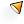
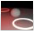

# {: .inline} {{page.title}}
Künstliche Lichtquellen verwenden zur Steuerung der Lichtverteilung normale Rhino-Lichter mit zusätzlichen Flamingo-Eigenschaften. Wenn Lichtquellen für die Beleuchtung verwendet werden, sollte der Typ verwendet werden, der der modellierten Lampe am meisten entspricht.

## Lichter-Reiter
{: #light-tab}
Der Reiter für Lichter enthält eine Liste mit allen künstlichen Lichtern der Szene. In diesem Hilfethema wird der Lichter-Reiter von Flamingo beschrieben.  Es gibt außerdem einen [Rhino-Lichter-Reiter](http://docs.mcneel.com/rhino/5/help/de-de/index.htm#commands/lights.htm).  Flamingo und Rhino synchronisieren die Einstellungen der beiden Reiter.  Der Flamingo eigene Reiter ist dank zusätzlicher [Lichteigenschaften](#light-properties) etwas flexibler.

Der Reiter für Lichter kann über die [Beleuchtungsvoreinstellungen](lighting-tab.html#lighting-presets) oder die [benutzerdefinierten Beleuchtungseinstellungen](lighting-tab.html#sun) geöffnet werden.

<!-- #### Is this supposed to be a code? It's showing up as ####. To fix this, there needs to be a new line above the headline for the markdown to work.-->

#### Wo befindet sich die Flamingo-Beleuchtungssteuerung?
Wenn der Lichter-Reiter über die [Beleuchtungsvoreinstellungen](lighting-tab.html#lighting-presets) oder [benutzerdefinierte Beleuchtungseinstellungen](lighting-tab.html#sun) geöffnet wird, ist der Lichter-Reiter hier zu finden:

 1. {: .inline} Werkzeugleisten >{: .inline} Flamingo nXt
 1. {: .inline} Menü > Flamingo nXt 5.0 > Bedienfenster anzeigen > Flamingo-Reiter > Lichter

In diesem Reiter können Lichter eingesetzt, ein- und ausgeschaltet sowie ihre Stärke und der Kanal angepasst werden.

Flamingo unterstützt die folgenden Lichttypen:

* [Objekte als Lichter markieren](#tag-objects-as-lights)
* [Spotlicht](#spotlight)
* [Punktlicht](#pointlight)
* [Rechteckiges Licht](#rectangularlight)
* [Lineares Licht](#linearlight)

**Hinweis:** Gerichtete Rhino-Lichter {: .inline} werden nicht unterstützt. Sie erscheinen nicht in der Lichterliste und können keine Flamingo-nXt-Eigenschaften annehmen.

Einige Lichteigenschaften werden in der Tabelle im Lichter-Reiter angezeigt und können so einfach bearbeitet werden.

Zu den in der Tabelle vorhandenen Eigenschaften gehören:

* [Ein/Aus](#on)
* [Name](#name)
* [Verteilung](#light-distribution)
* [Richtung](#aim-light)
* [Watt](#watts)
* [Kanal](#channel)

Durch Klick mit der rechten Maustaste auf die Lichtertabelle wird das Kontextmenü mit [zusätzlichen Optionen](#additional-options) geöffnet.

Auf die [Lichteigenschaften](#light-properties) kann auch zugegriffen werden, indem das Licht ausgewählt wird und im [Objekteigenschaften-Panel](http://docs.mcneel.com/rhino/5/help/de-de/commands/properties.htm) die Lichteigenschaften {: .inline} ausgewählt werden.

## Lichttypen
{: #light-types}
Lichter können aus der Rhino-Werkzeugleiste oder dem Flamingo-Lichter-Reiter aus eingesetzt werden. Objekte können mit Flamingo als Lichter markiert werden.

#### {: .inline} Objekte als Lichter markieren
{: #tag-objects-as-lights}
Ein beliebiges renderbares Objekt (Fläche, Volumenkörper, etc.) kann als Lichtquelle markiert werden und Lichteigenschaften zugeordnet bekommen. Zusätzliche Eigenschaften wie [Verteilung](#light-distribution), [Richtung](#aim-light) und [Stärke](#watts) können zugewiesen werden. Als Lichter markierte Objekte zeigen ein Vorschau-Widget mit der Richtung des Lichts und seines Mittelpunkts an.

*Als Lichtquellen markierte Scheinwerfer und Fernlichter*

#### {: .inline} Spotlicht
{: #spotlight}
Ein Spotlicht ist eine konische Lichtverteilung mit einer Richtung.  Zu den Lichteigenschaften gehören ein [Quellenradius](#radius), ein [Strahlwinkel](#beam-angle), ein Falloff-Radius und eine Richtung. Je größer der Quellenradius, desto sanfter sind die vom Licht erzeugten Schatten. Standardmäßig ist an der Position des Lichts eine sichtbare Scheibe. Weitere Informationen zum Bearbeiten der Position, Richtung und des Strahlwinkels auf dem Bildschirm mithilfe von Kontrollpunkten finden Sie im Hilfethema zum [Rhinoceros-Spotlicht](http://docs.mcneel.com/rhino/5/help/de-de/commands/spotlight.htm).

*Ein auf den roten Quader gerichtetes Spotlicht*

#### {: .inline} Punktlicht
{: #pointlight}
Punktlichter sind kleine Kugeln, die ihr Licht in alle Richtungen gleichmäßig verteilen. Für dieses Licht kann der [Radius](#radius) eingestellt werden. Je größer der Radius, desto sanfter sind die vom Licht erzeugten Schatten. Standardmäßig ist an der Position des Lichts beim Rendern eine sichtbare Lichtkugel vorhanden. Wenn das Punktlicht teilweise von einem Objekt verdunkelt wird, das es schneidet, können ungewöhnliche Effekte auftreten.

*Ein kleines Punktlicht nahe der rechten Wand*

#### {: .inline} Rechteckiges Licht
{: #rectangularlight}
Liefert eine Annäherung an eine Einbauleuchte mit einem Diffusor oder Umlenkblech. Das Licht wird dabei in einem diffusen Muster basierend auf der Ausrichtung des Rechtecks gestreut. Im Zentrum des Lichts zeigt ein Pfeil die Richtung an. Die volle Stärke des Lichts entfaltet sich direkt vor dem Rechteck.  Von dort aus nimmt die Intensität je nach Winkel ab. Beim Rendern wird standardmäßig ein weißes Rechteck angezeigt. Ein häufiger Fehler ist es, diese Rechtecke genau auf der Höhe der Decke anzubringen. Um ein konsistentes Ergebnis zu erhalten, sollten Sie die Lichter etwas unter der Decke anbringen. Weitere Informationen zum Bearbeiten der Position, Richtung und des Strahlwinkels auf dem Bildschirm mithilfe von Kontrollpunkten finden Sie im Hilfethema zum [Rechteckigen Licht in Rhinoceros](http://docs.mcneel.com/rhino/5/help/de-de/commands/rectangularlight.htm).

*Ein rechteckiges Licht direkt unter der Decke*

#### {: .inline} Lineares Licht
{: #linearlight}
Verteilt Licht in einem zylindrischen Muster, das eine Leuchtstoffröhre imitiert. Zu den einstellbaren Eigenschaften dieses Lichts gehören der [Radius](#radius) und die Länge der Lichtquelle. Je größer der Radius, desto sanfter sind die vom Licht erzeugten Schatten. Standardmäßig wird an der Position des Lichts beim Rendern ein Lichtzylinder angezeigt. Wenn das Licht teilweise von einem Objekt verdunkelt wird, das es schneidet, können ungewöhnliche Effekte auftreten. Mit den Rhino-Kontrollpunkten kann das Licht auf dem Bildschirm angepasst werden.

## Lichteigenschaften
{: #light-properties}
Wenn Flamingo der aktuelle Renderer in Rhino ist, können zusätzliche Eigenschaften für die Lichter definiert werden. Lichter haben einige gemeinsame Eigenschaften.

#### Name
{: #name}
Der Name des Lichtobjekts. Dieser dient der einfachen Unterscheidung von Lichtern desselben Typs im Modell.

#### {: .inline} Ein/Aus
{: #on}
Schaltet das Licht ein und aus. Ein gelbes Glühbirnensymbol in der Lichttabelle bedeutet, dass das Licht eingeschaltet ist. Erscheint das Symbol grau, ist das Licht im Rendering deaktiviert. Durch einen Doppelklick auf das Symbol kann das Licht ein- bzw. ausgeschaltet werden. Im Eigenschaftendialog gibt es ein Kontrollkästchen zum Ein- und Ausschalten des Lichts.

#### Sichtbar
{: #visible}
Standardmäßig werden Lichter im Rendering als helle Lichtquellen dargestellt.  Durch Deaktivieren der Option *Sichtbar* wird das Lichtobjekt selbst im Rendering unsichtbar.  Das von ihm ausgehende Licht wird aber dennoch in die Szene projiziert.

#### Lichtverteilung *([Nur markierte Objekte](#tag-objects-as-lights))*
{: #light-distribution}
Wenn ein Objekt als Licht markiert wird, kann über die Verteilung das Muster eingestellt werden, das vom Licht in die Szene geworfen wird. Durch einen Doppelklick auf die Zelle mit der Verteilungseinstellung kann ein Dropdownmenü mit den entsprechenden Optionen geöffnet werden. Zu den Verteilungstypen gehören: [Alle Richtungen](#pointlight), [Spotlicht](#spotlight) und [Diffus](#rectangularlight). Für das Spotlicht und das diffuse Licht muss eine [Richtung](#aim-light) eingestellt werden.

#### Richtung des Lichts *([Nur markierte Objekte](#tag-objects-as-lights))*
{: #aim-light}
Für markierte Lichter mit einer Verteilung als Spotlicht oder diffuses Licht muss eine Richtung angegeben werden.  Klicken Sie dazu doppelt auf die Zelle mit der Angabe "Richtung >>" und folgen Sie den Anweisungen der Befehlszeile.

#### Watt
{: #watts}
Dieser Wert bestimmt die elektrische Leistung des Lichts.  Nach Möglichkeit sollte dabei mit einem realistischen Wert für die Szene begonnen werden. Um den Wert zu ändern, klicken Sie doppelt auf die entsprechende Zelle.

#### Strahlwinkel *([Nur Spotlichter](lights-tab.html#spotlight))*
{: #beam-angle}
Der Winkel in Grad, der die Breite einer Lichtquelle bestimmt. Dieser kann auch durch Verwendung von Kontrollpunkten auf dem Bildschirm verändert werden.  Weitere Informationen zum Bearbeiten mit Kontrollpunkten finden Sie im Hilfethema zum [Rhinoceros-Spotlicht](http://docs.mcneel.com/rhino/5/help/de-de/commands/spotlight.htm).

#### Radius
{: #radius}
Die Größe der sichtbaren Lichtquelle. Kleinere Lichter werfen schärfere Schatten.

#### Farbe
{: #color}
Die Farbe des von der Lichtquelle ausgestrahlten Lichts.

#### Materialfarbe verwenden *([Nur markierte Objekte](#tag-objects-as-lights))*
Als Lichtfarbe wird die Farbe des dem Lichtobjekt zugeordneten Materials verwendet.

#### Kanal
{: #channel}
Lichter können einem von acht Kanälen zugewiesen werden. Mit dieser Eigenschaft können Sie die Beleuchtung in Ihrem gerenderten Bild in Echtzeit anpassen, nachdem das Rendering erzeugt wurde. Dies ist eine sehr mächtige Funktion zur Ausbalancierung mehrerer Lichtquellen in einem Rendering. Weitere Informationen finden Sie im Hilfethema zum [Rendering von Kanälen](render-channel.html).

#### IES-Datei
{: #iesfile}
IES-Dateien (Illuminating Engineering Society) sind Photometrie-Dateien, die die Verteilung von Licht aus einer Lichtquelle definieren. Lichtvorrichtungshersteller liefern oft diese Dateien. Durch die Verwendung von IES-Dateien zur Bestimmung der Verteilung kann die Lichtquelle präziser dargestellt werden. Die Geometrie des markierten Lichtobjekts weist keine Beziehung zur Verteilung des Lichts auf. Die Definition der Lichtverteilung stammt allein aus der Photometrie-Datei.

Hinweise:

* Flamingo nXt unterstützt Goniometrie-Dateien vom Typ C, worunter die meisten IES-Dateien fallen. Dateien vom Typ A, die manchmal von der Automobilindustrie für Scheinwerfer verwendet werden, und Dateien vom Typ B, die manchmal für Flutlichtbeleuchtung verwendet werden, werden nicht unterstützt.
* IES-Verteilungen beinhalten die Effekte von Lichtvorrichtungselementen wie Reflektoren, Umlenkblechen und Diffusoren.
* IES-Verteilungen sind oft asymmetrisch, der Prozess der Quellenrichtung beinhaltet also nicht nur ein Ziel, sondern auch einen Rotationswinkel.

#### Helligkeit aus Datei
Verwendet die Intensität, die in der IES-Datei gespeichert ist. Bei Deaktivierung dieser Option wird die Helligkeit aus den eingestellten [Watt](lights-tab.html#watts) berechnet.

## Zusätzliche Optionen
{: #additional-options}
Durch Klick mit der rechten Maustaste auf ein Licht in der Lichttabelle können zusätzliche Optionen aufgerufen werden.

####  Ein
Schaltet das Licht [ein und aus](#on).

#### Löschen
Löscht das ausgewählte Licht.

#### Lichtmarkierung entfernen
Entfernt die [Lichtmarkierung](#tag-objects-as-lights) eines Objekts.

#### Eigenschaften
Die [Lichteigenschaften](#light-properties) dieses Lichts.

#### Objekte und passende Listenelemente auswählen
Wählt das Licht im Ansichtsfenster aus.