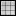
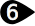

#  {{page.title}}
Materialien enthalten die Spezifikationen für Farbe, Reflexionsvermögen, Transparenz, Texturen und Bump-Maps eines Flächen-Finish. Alle Materialien verfügen über Grundeinstellungen. Das Standardmaterial ist weiß und matt, ohne Reflexionsvermögen oder Transparenz. Die besten Resultate erzielen Sie mit Flamingo-spezifischen Materialien.

Materialien können Ebenen, Objekten und Blöcken zugewiesen werden. Diese Zuweisungen können durch Drag&Drop auf Objekte oder verschiedene Steuerelemente definiert werden. Weitere Informationen finden Sie im Hilfethema zur [Materialzuweisung](material_assignment.html).

Nach der Zuweisung werden Materialien im Modell gespeichert. Mit den korrekt eingestellten [Rendering-Optionen](http://docs.mcneel.com/rhino/5/help/de-de/index.htm#options/rendering.htm) können das Material, die Texturen und alle Render-Unterstützungsdateien im Rhino-Modell gespeichert werden.

Materialien, Umgebungen und Texturen werden im Modell gespeichert, der Renderinhalt kann aber auch in Dateien gespeichert werden, die von mehreren Modellen gemeinsam genutzt werden. Der Inhalt kann zwischen Rhino-Sitzungen und in einen Ordner gezogen werden. Farbräder können auf die gleiche Art und Weise per Drag&Drop abgelegt werden. Das [Bibliotheken-Panel](libraries.html) zeigt den standardmäßigen Inhaltsordner an. Verwenden Sie dies, um Inhalt in das Modell zu ziehen und abzulegen oder um Modellinhalt in eine externe Datei zu ziehen und abzulegen.

{:  #panel_map .float-img-right}

##### Wo befindet sich dieser Befehl?
Auf den Materialreiter können Sie auf mehrere Arten zugreifen.

*  Materialreiter
*  Werkzeugleiste Rendern >  Materialeditor
* Menü > Rendern > Materialeditor
* Durch Eingabe des Befehls Materialeditor in der Befehlszeile

Das Materialeditor-Panel ist in mehrere Abschnitte unterteilt.  Je nach Materialtyp werden andere erweiterte Optionen angezeigt.

Farben und Texturen können per Drag&Drop aus dem Farbenrad in ein anderes Farbenrad oder eine sonstigen Steuerung im Materialeditor, der [Texturenpalette](texturepalette.html) oder dem [Umgebungseditor](environmenteditor.html) gezogen werden.

##### Material-Panel

 1. [Einstellungsleiste](#Einstellungen)
 1. [Liste der Materialien](#material_list)
 1. [Fensterteiler](#divider)
 1. [Materialeigenschaften](#properties)
 1. [Name](#name)
 1. [Materialeigenschaften-Panels](#panels)

## [Einstellungsleiste](#panel_map) 
{: #settings .clear-img}
In dieser Leiste können Sie durch die Liste der Materialien navigieren.

####  Pfeil zurück
Zum Zurückblättern durch das aktuelle Material oder die bereits vorher ausgewählten Materialien.  Materialien mit Texturen haben beispielsweise mehrere Ebenen.  Mit diesem Pfeil können Sie von den Texturdetails zum übergeordneten Material zurückkehren.

####   Pfeil vorwärts
Zum Vorwärtsblättern durch das aktuelle Material oder die bereits vorher ausgewählten Materialien.  Materialien mit Texturen haben beispielsweise mehrere Ebenen.  Mit diesem Pfeil können Sie vom übergeordneten Material zur zuletzt verwendeten Textur zurückkehren.

####  Aktuell ausgewählter Materialname
Zeigt den Namen und die Ebene des aktuellen Materials an.  Wenn beispielsweise eine Textur oder eine prozedurale Materialebene vorhanden ist, wird ein ">" angezeigt. Hier können Sie nachsehen, in welchem Bereich eines Materials sich der Editor befindet.

####  Werkzeugmenü
Zeigt das [Werkzeugmenü](#tools-menu) an.  Dies ist ein umfassendes Menü mit Befehlen, Einstellungsmöglichkeiten und Werkzeugen für Materialien.

## [Liste der Materialien](#panel_map) 
{: #material_list}
Die Liste aller im Modell verwendeten Materialien. Funktionen dieser Liste:

* Sie können durch die Liste scrollen und sich so alle Materialien im Modell ansehen.
* Sie können ein Material dieser Liste per Drag&Drop auf eine Ebene im [Ebenenpanel](http://docs.mcneel.com/rhino/5/help/de-de/index.htm#commands/layer.htm) oder direkt auf ein Objekt ziehen, um es zuzuweisen. Weitere Informationen finden Sie im Hilfethema zur [Materialzuweisung](material_assignment.html).
* Durch Klick auf die Plus-Schaltfläche  am Ende der Liste kann ein neues Material hinzugefügt werden.

* Klicken Sie auf ein Material, um es auszuwählen. Nach Auswahl einer Umgebung werden ihre Materialeigenschaften in den Panels unten angezeigt. Weitere Informationen finden Sie im Hilfethema [Rendermaterialeigenschaften](#properties).
* Durch Klick mit der rechten Maustaste auf ein Material wird das Kontextmenü des Materials angezeigt.
* Durch Klick mit der rechten Maustaste in den leeren Bereich der Liste wird das Kontextmenü für ein neues Material angezeigt.

###   Hinzufügen eines neuen Materials
{: #add_material}
Scrollen Sie ans untere Ende der Liste der Materialien und klicken Sie auf die Plus-Schaltfläche.

Dadurch wird die [Bibliothek](libraries.html) der Renderumgebungen angezeigt.
Die Materialien in der Bibliothek verhalten sich wie Vorlagen, um Materialien im Modell zu erzeugen.

### Kontextmenü des Materials
{: material_context}
Dieses Menü wird durch Klick mit der rechten Maustaste auf ein Material geöffnet.  Weitere Infos zu den zahlreichen Optionen in diesem Menü finden Sie im Hilfethema zum [Werkzeugmenü](#tools_menu).

### Kontextmenü für ein neues Material
{: new_material_context}
Dieses Menü kann durch einen Rechtsklick in den leeren Bereich der Materialliste geöffnet werden.

####  Neues Material anlegen
Erzeugt ein neues grundlegendes mattes weißes Material.

####  Einfügen
Zur Einfügen eines Materials aus der Zwischenablage.

####  Als Instanz einfügen
Erzeugt ein neues Material aus dem Inhalt der Zwischenablage, das mit dem Originalmaterial verknüpft ist.

####  Raster
Zeigt die Vorschau als Raster von Miniaturansichten an.

####  Liste
Zeigt die Vorschau als Liste von Miniaturansichten an.

####  Baum
Zeigt die Vorschau als verzweigtes Baumverzeichnis an.

####  Horizontales Layout
Zeigt die Vorschau auf der linken Seite der Steuerungen an.

####  Vorschaufenster anzeigen
Zeigt die Vorschaueigenschaften für die zur Zeit ausgewählte Miniaturansicht an. Definiert Vorschau-Geometrie, Größe, Hintergrund, Drehverhalten.

####  Schweben
Lässt das Vorschaubild in einem Fenster, dessen Größe angepasst werden kann, schweben.

#### Miniaturansichten

#####  Klein
Miniaturansichten werden sehr klein angezeigt.

#####  Mittel
Miniaturansichten werden in mittlerer Größe angezeigt.

#####  Groß
Miniaturansichten werden groß angezeigt.

#####  Labels anzeigen
Zeigt im Rastermodus Labels mit den Namen der Miniaturansichten an.
Im Listenmodus werden immer Labels angezeigt.

#####  Einheiten anzeigen
Zeigt die Größe in Modelleinheiten an.

#####  Vorschau mit autom. Aktualisierung
Alle Vorschauansichten werden bei Änderungen der Einstellungen aktualisiert.

#####  Alle Vorschauansichten aktualisieren
Zur manuellen Aktualisierung der Vorschauen, wenn die Option Vorschau mit autom. Aktualisierung deaktiviert ist.

## [Fensterteiler](#panel_map) 
{: #divider}
Durch Ziehen an diesem Element kann die Länge der Materialliste angepasst werden. Wenn die Materialliste verlängert wird, wird dementsprechend der Abschnitt der Materialeigenschaften verkürzt.

## [Materialeigenschaften](#panel_map) 
{: #properties}

#### [Name des Materials](#panel_map) 
{: #name}
Der Name des Materials. Der Name des Materials wird beim Export des Materials in eine Bibliothek als Dateiname verwendet. Hinweis: Materialien werden im Rhino-Modell gespeichert. Verschiedene Materialien in unterschiedlichen Modellen können daher denselben Namen haben.

#### [Materialpanels](material-editor.html#panel_map) 
{: #panels}
Im Abschnitt der Materialeigenschaften gibt es mehrere Panels mit Einstellungsmöglichkeiten. Durch Klick auf die Titelleiste eines Panels kann dieses zu- bzw. aufgeklappt werden.

Je nach Art des Materials und der aktuell eingestellten Materialebene werden andere Panels angezeigt. Weitere Informationen zu den einzelnen Materialpanels finden Sie im Hilfethema [Flamingo-Materialien](material-type-simple.html).

## Werkzeugmenü 
{: #tools-menu}
<!-- This comes from the page http://docs.mcneel.com/rhino/5/help/en-us/popup_moreinformation/materialthumbnail_contextmenu.htm -->
Diese Einstellungen erscheinen auch auf Kontextmenüs (Klick mit der rechten Maustaste) für Miniaturansichten und Miniaturansichtshintergründe.

####  Der Auswahl zuordnen
Ordnet den ausgewählten Objekten das aktuelle Material zu.

##### Objekten ein Material zuweisen
 1. Klicken Sie auf *Der Auswahl zuordnen*.
 1. Wählen Sie im Rhino-Ansichtsfenster die Zielobjekte aus.

##### Objekte vorauswählen
 1. Wählen Sie im Rhino-Ansichtsfenster die Zielobjekte aus.
 1. Klicken Sie auf *Der Auswahl zuordnen*.
Die Zielobjekte können ausgewählt werden, bevor oder nachdem Sie auf Der Auswahl zuordnen klicken.

##### Drag & Drop von Materialien auf Objekte
 * Ziehen Sie das Material aus den Miniaturansichten oder aus der Liste auf die Zielobjekte.
Drag & Drop funktioniert jeweils nur für ein Objekt gleichzeitig.

####  Den Ebenen zuordnen
Ordnet das aktuelle Material den Ebenen zu.

##### Zuweisung eines Materials zu einer Ebene
 1. Klicken Sie auf *Den Ebenen zuordnen*.
 1. Wählen Sie im Dialogfenster *Ebenen auswählen* die entsprechenden Ebenen aus.

##### Materialien aus dem Ebenen-Panel zuordnen
 1. Wählen Sie im [Ebenen](http://docs.mcneel.com/rhino/5/help/de-de/index.htm#commands/layer.htm)-Panel eine oder mehrere Ebenen und klicken Sie auf die Spalte  [Material](http://docs.mcneel.com/rhino/5/help/de-de/commands/layer.htm#Material).
 1. Wählen Sie im Dialogfenster *Ebenenmaterial* das zuzuweisende Material aus.

##### Drag & Drop eines Materials auf eine Ebene
 * Ziehen Sie das Material aus der Miniaturansicht oder Liste auf die Zielebene.
Drag & Drop funktioniert nur für jeweils eine Ebene.

####  Objekte auswählen
Objekte im Modell für die Materialzuordnung auswählen.

####  Neues Material anlegen
Dadurch wird die [Bibliothek](libraries.html) der Renderumgebungen angezeigt.
Die Materialien in der Bibliothek verhalten sich wie Vorlagen, um Materialien im Modell zu erzeugen.

####  Material aus Datei importieren
Importiert Materialien aus einer gespeicherten .rmtl Rhino-Datei.

####  In Datei speichern
Speichert ein Material in eine .rmtl Rhino-Datei.

####  Typ ändern
Wechselt den Materialtyp.

####  Typ ändern (ähnliche Einstellungen kopieren)
Wechselt den Materialtyp.
Das Standardverhalten hängt vom aktuellen Status der [Renderoptionen](http://docs.mcneel.com/rhino/5/help/de-de/index.htm#popup_moreinformation/materialpanel_toolsmenu.htm) >  [Ähnliche Einstellungen kopieren, wenn Inhaltstyp geändert wird](http://docs.mcneel.com/rhino/5/help/de-de/index.htm#popup_moreinformation/materialpanel_toolsmenu.htm) ab. Wenn aktiviert, werden kompatible Eigenschaften vom alten Inhalt in den neuen Inhalt kopiert.

####  Auf Standard zurücksetzen
Alle Materialeinstellungen werden gleichzeitig auf ein standardmäßiges weißes, mattes, nicht reflektierendes und nicht texturiertes Material zurückgesetzt.

####  Kopieren
Kopiert das ausgewählte Material in die Windows Zwischenablage. Der Inhalt der Zwischenablage kann dann in den Editor zur Erzeugung eines neuen Materials oder direkt in einen Ordner zur Erzeugung einer [Bibliotheksdatei](libraries.html) eingefügt werden.

####  Einfügen
Zur Einfügen eines Materials aus der Zwischenablage.

####  Als Instanz einfügen
Erzeugt ein neues Material aus dem Inhalt der Zwischenablage, das mit dem Originalmaterial verknüpft ist.

####  Löschen
Löscht das ausgewählte Material.

####  Umbenennen...
Benennt das ausgewählte Material um.

####  Duplizieren
Kopiert das ausgewählte Material in ein neues Material mit den gleichen Einstellungen.

####  Instanziierung entfernen
Dadurch wird die Verbindung zwischen [instanziierten](http://docs.mcneel.com/rhino/5/help/en-us/index.htm#popup_moreinformation/materialpanel_toolsmenu.htm) Materialien entfernt.


####  Inhaltsfilter
Öffnet das Dialogfenster der [Inhaltsfilter](content_filters.html).

####  Eigenschaften
Dadurch wird das Dialogfenster der [Vorschaueigenschaften](http://docs.mcneel.com/rhino/5/help/de-de/index.htm#popup_moreinformation/materialpanel_toolsmenu.htm) geöffnet.