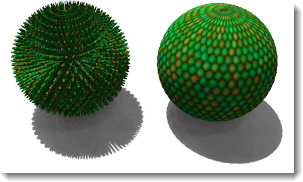
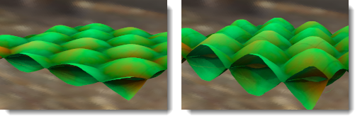

#  {{page.title}}

Materialien können aus Bildern erzeugt werden. Sie können Fotos und echte Materialien (wie Tapete und Teppich) einscannen, Muster in einem Malprogramm erstellen oder Bilder aus anderen Bildquellen verwenden.

Stellen Sie sich vor, dass das Material unendlich in alle Richtungen gestreckt wird. Das Material wird nur dort sichtbar, wo ein Objekt hindurch verläuft. Muster werden unendlich in vier Richtungen in einer bestimmten Skalierung wiederholt (gekachelt).

Kleine Bilder, die nahtlos aneinander gekachelt werden können, eignen sich am besten. Wenn die Bitmap nicht gut gekachelt werden kann, verwenden Sie die Funktion, um die Kacheln zu spiegeln. Dies garantiert passende Kanten.

**Hinweis:** Wenn ein Bild nur einen Teil eines Objekts abdecken soll (wie ein Etikett auf einer Weinflasche oder ein Logo auf einem Produkt), verwenden Sie stattdessen die [Decal](properties-decal.html)-Funktion.

Bild-Maps können auf viele Arten verwendet werden. Eine übliche Methode ist die Verwendung eines Bildes eines realen Materials als Materialfarbe.

## Name
Bildtexturen können benannt werden.  Dieser Name wird von der Texturbibliothek des RDK verwendet und hat keine wirkliche Funktion in Flamingo.

## Flamingo-Bild

### Bildvorschau
{: #image-preview}
Zeigt eine Vorschau der ausgewählten Bilddatei an. Lassen Sie den Mauszeiger über dem Bild schweben, um ein Pop-up des Bilddateinamens anzeigen zu lassen.  Klicken Sie auf das Bild, um ein anderes auszuwählen.

#### Bildauflösung
{: #image-resolution}
Zeigt die Auflösung der aktuellen Bilddatei in Pixel an.

### Kacheln
{: #tiles}
In Materialdefinitionen verwendete Bild-Maps werden immer wiederholt (gekachelt). Diese Einstellung definiert die Größe jeder Instanz (Kachel) in den aktuellen Modelleinheiten.

#### Höhe/Breite
{: #width-height}
Zur Einstellung der Größe der Kacheln in Modelleinheiten.




### Mapping-Typ
{: #mapping-type}
Bilder werden normalerweise auf den Farbkanal angewandt. Aber es gibt auch andere Möglichkeiten zur Verwendung von Bildern.  Bilder können eingestellt werden als:

> [Standard](#standard)
> [Normal](#normal)
> [Displacement](#displacement)

### Standard
{: standard}
Farbe und visuelle Reliefs des Bilds werden auf das Material übertragen. Mit den Einstellungsmöglichkeiten für Farb- und Bump-Intensität kann festgelegt werden, wie das Bild das Material beeinflusst.

#### Farbintensität
{: #color}
Bestimmt, wie stark die Bild-Map die Darstellung des Materials beeinflusst. Im Beispiel unten erscheint das darunter liegende Material in der Farbe Magenta. Die Farbintensität wird erhöht, bis die darunter liegende Farbe vollständig von der schwarzen und weißen Textur maskiert ist.

*Farbintensität von 0.2, 0.5, 1.0.*

#### Bump-Intensität
{: #bump}
Simuliert Bumps und Falten auf der Fläche eines Objekts, indem die Flächennormalen auf dem Objekt geändert werden. Das darunter liegende Objekt wird nicht geändert. In der Abbildung verwendet das Material links Displacement-Mapping, während das Material rechts Bump-Mapping mit den höchsten eingestellten Werten verwendet. Negative Bump-Zahlen haben den umgekehrten Effekt. Kanten und Schatten sind bei einem Material mit Bump-Mapping glatt. Weitere Infos: [Wikipedia-Artikel: Bumpmapping](https://de.wikipedia.org/wiki/Bumpmapping).

*Bump-Intensität, 0.5 (links) und 1.0 (rechts).*

### Normal
{: #normal}
Wird dazu verwendet, größeren Detailreichtum in Schattierungen zu erzielen, ohne die Zahl der Polygone im Rendernetz zu erhöhen. Weitere Infos: [Wikipedia-Artikel: Normal Mapping](https://de.wikipedia.org/wiki/Normal_Mapping).

Normal-Maps funktionieren ähnlich wie Bump-Maps und ändern wie diese die Normale der Fläche. Der Effekt ist im Grunde der gleiche wie bei einem Bump, wobei Normal-Maps jedoch mehr Kontrolle über die Normale erlauben als eine Bump. Eine Bump-Map verwendet den Graudurchschnitt der RGB-Werte einer Bitmap. Die RGB-Werte einer Normal-Map entsprechen den Änderungen der XYZ der Normalen. Da der blaue Kanal des Bilds die Z-Richtung der Normalen steuert, haben Normal-Maps einen hohen Blauanteil.

### Displacement
{: #displacement}
Beim Displacement-Mapping wird das Rendernetz der Fläche den Farbwerten im Bild entsprechend verschoben. Dieser Effekt bedeutet eine Änderung in der tatsächlichen geometrischen Position der Fläche. Die Verschiebung geschieht oftmals entlang der lokalen Flächennormalen. Weitere Infos: [Wikipedia-Artikel: Displacement Mapping](https://de.wikipedia.org/wiki/Displacement_Mapping).

 **Hinweis:** Verwenden Sie das Displacement-Mapping für kleine Objekte sparsam. Displacement erhöht die Rendering-Zeit beträchtlich.

#### Höhe
{: #height}
Höhe des höchsten Verschiebungspunkts.

#### Versatz
{: #offset}
Definiert den Startpunkt der Verschiebung bezüglich der Flächennormalen. Ein Displacement kann außerhalb, innerhalb oder teilweise inner- und außerhalb des Teils stattfinden.

*Z-Versatz = -1.0*

*Z-Versatz = -0.5*

*Z-Versatz = -0.0*

#### Facettengröße
{: #facet-size}
Die Größe der Facetten des Displacement-Polygonnetzes. Je größer dieser Wert, desto detailreicher ist das Displacement, desto größer werden aber auch das Rendering und der Speicherverbrauch.

## Erweiterte Einstellungen
{: #advanced}
Ein Flamingo-Bild wird normalerweise auf den Hauptfarbkanal eines Materials angewandt. In den erweiterten Einstellungen für das Flamingo-Bild können weitere Kanäle ausgewählt werden, auf die das Bild angewandt werden soll.  Diese werden für besondere Effekte verwendet.

####  Grundfarbe
Dies ist die Standardeinstellung.  Das Bild hat Einfluss auf die [Farbe](advanced-material-properties-main.html#color) eines Materials.

####  Spiegelfarbe
Diese beeinflusst die Farbe des [Reflexionskanals](advanced-material-properties-main.html#highlight-color) basierend auf der Farbe des Bilds an diesem Punkt.

####  Spiegelintensität
Dadurch wird der [Reflexionsbetrag](advanced-material-properties-main.html#intensity) basierend auf dem Graustufenwert des Bilds an diesem Punkt bestimmt.  Dies wird in Texturensätzen oft als Spiegel-Map verwendet.

####  Glanzlichtschärfe
Dadurch wird die Schärfe und Unschärfe des [Glanzlichts](advanced-material-properties-main.html#intensity) basierend auf dem Graustufenwert des Bilds an diesem Punkt angepasst.

#### Glanzlichtform
{: #advanced-highlight-shape}
Beeinflusst die Form des Glanzlichts.

####  Transparenz
Dies beeinflusst den Umfang der [Transparenz](advanced-material-properties-main.html#intensity) des Materials basierend auf dem Graustufenwert des Bilds.

####  Transluzenz
Dies beeinflusst den Betrag der [Transluzenz](advanced-material-properties-transparency.html#translucency) des Materials basierend auf dem Graustufenwert des Bilds.

####  Lichtabnahme
Dadurch wird die [Lichtabnahme](advanced-material-properties-transparency.html#attenuation) des Materials basierend auf dem Graustufenwert des Bilds beeinflusst.

#### x-/y-Versatz
{: #advanced-x-y-offset}
Versetzt das Material entlang der x- bzw. y-Achse.

#### Drehung
Dadurch wird die Bild-Map gedreht.  Dies kann verwendet werden, um das Bild bei Bedarf um beispielsweise 90 oder 180 Grad zu drehen.