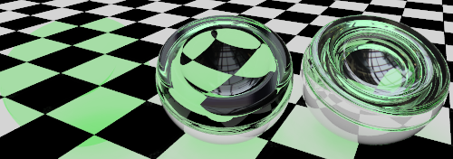
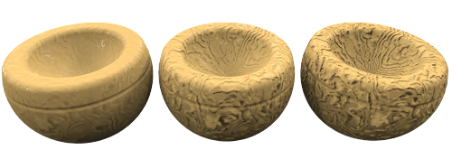

#  {{page.title}}

Flamingo hat sowohl [einfache](material-type-simple.html) als auch erweiterte Materialtypen.  In den erweiterten Materialeinstellungen stehen alle Eigenschaftsgruppen für ein Material zur Verfügung.  Diese können verwendet werden, um die maximale Flexibilität und Kontrolle über ein Material zu erhalten.

Zu den einstellbaren Eigenschaften gehören:

> [Name](#name)
> [Materialprozeduren](#procedures)
> [Erweiterte Materialeigenschaften](#advanced-materials-properties)
> [Reflektierendes Finish](#reflective-finish-and-highlight)
> [Transparenzeigenschaften](#transparency)
> [Prozedurale Texturen](#bump-patterns)
> [Bitmap-Texturen](#textures)
> [Bemerkungen](#notes)

## Materialname
{: #name}
Der Name des Materials im Rhino-Modell.  Materialien werden im Rhino-Modell gespeichert. Das bedeutet, dass derselbe Name in verschiedenen Modellen für unterschiedliche Materialien verwendet werden kann. Zur Verwendung eines Materials in einem anderen Modell muss es zuerst in die [Bibliothek](libraries.html) exportiert werden. Der Name des Materials dient beim Export als Dateiname.

## Materialprozeduren
{: #procedures}
Der Prozeduren-Baum kombiniert ein oder mehrere Materialien unter Verwendung einer Reihe von Regeln zur Interaktion der Materialien. Das Verzeichnis zeigt die Komponenten an, die zur Erzeugung dieses Materials verwendet werden, und erlaubt Ihnen, Prozeduren hinzuzufügen. Einfache Materialien haben nur eine Komponente in der Liste: Basis.

Jede Prozedur besteht aus zwei untergeordneten Materialien, wobei eine spezifische Methode verwendet wird. Jedes dieser untergeordneten Materialien kann selbst aus einer Prozedur bestehen und zwei eigene untergeordnete Materialien besitzen. Auf diese Weise können aus einfacheren Komponenten sehr komplizierte Materialien geformt werden. Zu den Prozeduren zur Kombination von Materialien gehören: [Winkelüberblendung](procedural-materials.html#angular-blend), [Überblendung](procedural-materials.html#blend), [Marmor](procedural-materials.html#marble), [Granit](procedural-materials.html#granite), [Kachel](procedural-materials.html#tile) und [Holz](procedural-materials.html#wood).

Eine [Marmor](procedural-materials.html#marble)-Prozedur beispielsweise kombiniert ein Grundmaterial und ein Adermaterial in einem verwirbelten Muster.

##### Eine Prozedur hinzufügen
1. Klicken Sie im Prozeduren-Fenster mit der rechten Maustaste auf den Eintrag *Basis*.
1. Klicken Sie im Menü auf einen Prozedurentyp.
  * [Basis](procedural-materials.html#base)
  * [Winkelüberblendung](procedural-materials.html#angular-blend)
  * [Überblendung](procedural-materials.html#blend)
  * [Granit](procedural-materials.html#granite)
  * [Marmor](procedural-materials.html#marble)
  * [Kachel](procedural-materials.html#tile)
  * [Holz](procedural-materials.html#wood)

##### Eine Prozedur entfernen
 1. Klicken Sie im Prozeduren-Fenster mit der rechten Maustaste auf den Namen einer Prozedur.
 2. Klicken Sie im Menü auf **Entfernen**.

## Erweiterte Materialeigenschaften
{: #advanced-materials-properties}



#### Reflektierendes Finish und Glanzlicht
{: #reflective-finish-and-highlight}
Diese Einstellungen variieren die Art und Weise, wie ein Material Licht und Objekte reflektiert. Der Glanzlichteffekt wird normalerweise mit beleuchteten Flächen auf glänzenden Materialien in Verbindung gebracht, wo das Licht auf das Objekt trifft. Der reflektierende Effekt hat normalerweise spiegelartige Reflexionen zur Folge, die Objekte in der Szene reflektieren. In diesem Zusammenhang wichtig ist die Tatsache, dass Chrom und andere reflektierende Materialien nur dann ein interessantes Bild ergeben, wenn es etwas gibt, das sich darin spiegelt. Denken Sie daher bei der Arbeit mit reflektierenden Materialien auch an eine interessante Umgebung und andere Objekte, die vom reflektierenden Material gespiegelt werden können.
 Hinweis: Um diese Einstellungen zu aktivieren, muss der Intensitätswert größer als Null sein.

#### Glanzlichtfarbe
{: #highlight-color}
Die Glanzlichtfarbe ist diejenige, die ein Material zu Reflexionen hinzufügt. Für diese Steuerung gibt es drei Einstellungsmöglichkeiten: weiß, metallisch und benutzerdefiniert.

#### Weiß
Materialien mit weißer Glanzlichtfarbe fügen der Reflexion keine Farbe hinzu.  Dadurch können Materialien wie Standardfarbe, Plastik oder Spiegelflächen simuliert werden.

#### Metallisch
{: #metallic}
Stellt die Glanzlichtfarbe so ein, dass sie mit der Grundfarbe übereinstimmt. Oftmals wird dabei die Grundfarbe als Reflexionsfarbe verwendet.  Für die Option *Metallisch* wird die Materialfarbe als Reflexionsfarbe verwendet.

#### Benutzerdefiniert
Für einige sehr spezielle Finishs hat die Reflexion des Objekts eine andere Farbe als die Grundfarbe des Materials.  Dies gilt normalerweise für Materialien, die aus mehreren Ebenen bestehen. Mit der Option *Benutzerdefiniert* kann eine beliebige Farbe für das Glanzlicht festgelegt werden. Verwenden Sie den [Farbwähler](select-color.html)  zur Auswahl einer Reflexionsfarbe.

#### Intensität
{: #intensity}
Zur Anpassung der Intensität des Glanzlichts. Niedrigere Werte haben meist glänzende Objekte zur Folge, die zwar Licht, nicht aber die umgebenden Objekte reflektieren. Höhere Werte erhöhen Größe und Intensität des Glanzlichts und der Reflexionen.  Werden die Werte sehr hoch angesetzt, wird das Material spiegelartig, wobei andere Objekte und die Umgebung reflektiert werden.

#### Fresnel
{: #fresnel}
Aussprache: "Fre-nell". Damit wird das Reflexionsvermögen von undurchsichtigen Materialien gesteuert, einem Phänomen, das als [Fresnel-Reflexion](https://de.wikipedia.org/wiki/Fresnelsche_Formeln) bekannt ist. Mit der Fresnel-Einstellung werden viele Materialien mit zunehmendem Blickwinkel (d.h. je schräger man schaut) reflektierender (spiegelähnlicher) und mit abnehmendem Blickwinkel (d.h., je senkrechter man darauf schaut) matter.

Reduzieren Sie den Wert für sehr dunkle Materialien, um eine zu große Reflexion zu verhindern. Erhöhen Sie den Wert für Materialien wie lackiertes Holz, bei denen die Fresnel-Reflexion deutlicher ist.

#### Schärfe
{: #sharpness}
Definiert die Größe des Glanzlichts. Je kleiner die Zahl, desto breiter das Glanzlicht; größere Zahlen konzentrieren das Glanzlicht auf einen kleineren Bereich.  Bei Anwendung auf ein Reflexionsvermögen mit höherer Intensität werden die Reflexionen unscharf oder scharf.

#### Typ
{: #type}
Ändert die Art und Weise, wie Reflexionen berechnet werden, wenn künstliche Lichtquellen reflektiert werden. Reflexionen werden anhand von zwei Methoden berechnet: *Raycasting* und *Glanzlicht*. Diese zwei Methoden erzeugen identische Resultate; in gewissen Situationen werden Sie jedoch feststellen, dass eine der beiden Methoden schneller ein gutes Resultat erzeugt. Es kann beispielsweise vorkommen, dass Objekte nicht gut aussehen, weil die Reflexion einer Lichtquelle die Darstellung des Materials verdeckt.

In der Abbildung unten des Typs *Ausgeglichen* weist das Objekt auf der linken Seite eine helle weiße Reflexion auf, die die Darstellung des Materials überdeckt.

Innen-Renderings mit kleinen Lichtquellen können fleckige Artefakte auf Flächen zur Folge haben. Die Flächen mit den Artefakten weisen normalerweise unscharfe Reflexionen auf. Durch Änderung des Reflextionstyps auf [Glänzend](advanced-material-properties-main.html#glossy), [Keine Reflexionen von Lichtquellen](advanced-material-properties-main.html#no-light-source-reflection) oder [Monte Carlo](advanced-material-properties-main.html#monte-carlo) kann das Problem gelindert oder behoben werden.

#### Ausgeglichen
{: #balanced}
Mit dieser Option werden Raycasting und Glanzlicht basierend auf der Einstellung für die Schärfe automatisch ausgeglichen. Dabei werden sowohl die tatsächliche Reflexion der Lichtquelle als auch das künstliche Glanzlicht berechnet.

#### Glänzend
{: #glossy}
Erhöht die Unschärfe des Glanzlichts und vermeidet Raycasting. Es werden weder Objekt- noch Lichtreflexionen berechnet. Daher kann die Leistung verbessert und Artefakte für Materialien mit sehr unscharfen Reflexionen verhindert werden. Allerdings kann es zu einem gewissen Verlust im Detailgrad der Reflexionen führen.

#### Monte Carlo
{: #monte-carlo}
Es wird nur Raycasting verwendet, um Reflexionen von Lichtquellen zu berechnen. Das Raycasting enthält anfänglich viele Störungen und nähert sich stufenweise der richtigen Lösung. Es ist sehr hilfreich, wenn das Glanzlicht nicht unscharf ist.

#### Kein Glanzlicht
{: #no-highlight}
Es wird nur Raycasting verwendet, um Reflexionen von Lichtquellen zu berechnen. Dies ist hilfreich, wenn die Lichtquellen groß sind und das Material nicht unscharf ist. In diesem Fall kann die Glanzlichtberechnung sehr lange dauern. Die Reflexionen der Lichtquellen laufen stufenweise zusammen.

#### Keine Reflexionen von Lichtquellen oder Kein Glanzlicht
{: #no-light-source-reflection-and-no-highlight}
Schließt alle Reflexionen von künstlichen Lichtquellen und den künstlichen Glanzlichteffekt aus. Die Objektreflexionen werden berechnet.

#### Keine Reflexionen von Lichtquellen
{: #no-light-source-reflection}
Schließt Raycasting-Reflexionen von Lichtquellen aus. Es wird nur das Glanzlicht verwendet. Dies ist manchmal hilfreich, um Fleckenartefakte zu umgehen, wenn das Material unscharf ist und die Szene kleine, helle Lichtquellen enthält.

## Transparenz
{: #transparency}
Die Einstellung für die Transparenz steuert die Eigenschaften, die mit dem Licht zusammen hängen, das durch ein Material scheint.

#### Transparenzintensität
Ändert das Decal von undurchsichtig auf transparent. Transparente Materialien erhöhen die Rendering-Zeit.

#### Brechungsindex
{: #index-of-refraction}
Bestimmt den Lichtbrechungswert, wenn Objekte durch das Material hindurch betrachtet werden.

In der folgenden Tabelle sind einige reale Brechungsindexwerte aufgelistet:

 | Material      |     | IOR         |
 |:--------------|:---:|:------------|
 | Vakuum        |     | 1,0         |
 | Luft           |     | 1,0029      |
 | Eis           |     | 1,309       |
 | Wasser         |     | 1,33        |
 | Glas         |     | 1,52 bis 1,8 |
 | Smaragd       |     | 1,57        |
 | Rubin/Saphir |     | 1,77        |
 | Diamant       |     | 2,417       |
{: .grided-table}

#### Transluzenz
{: #translucency}
Ein Diffusionsmaß. Eine hohe Transluzenz erzeugt einen "sandgestrahlten" Effekt, da mehr Licht willkürlich durch das Modell zerstreut wird. Dies ist ein sehr empfindlicher Effekt. Kleine Anpassungen können einen großen Unterschied machen.

#### Streuung
{: #scattering}
Steuert die Wahrscheinlichkeit, dass das Licht auf ein Partikel pro Einheitslänge trifft. Für diesen Effekt wird die [Pfadverfolgung](render-tab.html#path-tracer) benötigt. 

Durch Unterflächenstreuung kann das Licht die Fläche des Objekts durchdringen und in eine beliebige Richtung streuen. Mit diesem Effekt können viele durchsichtige Materialien modelliert werden. Bestimmte Flächen wie Stein oder Haut können realistisch "aufgeweicht" werden, indem man dem Licht das Eindringen über eine kurze Distanz erlaubt.

Das Material muss Transparenz aufweisen, damit eine Unterflächenstreuung stattfinden kann. Es handelt sich um einen volumetrischen Effekt. Die Objekte mit diesem Material müssen solide sein oder ein Volumen umgeben, damit dies richtig funktioniert.

####  Lichtabnahme
{: #attenuation}
Bestimmt, wie viel Licht absorbiert wird, wenn es durch ein Objekt verläuft. Größere Werte führen zu einer wolkigeren Darstellung. Die Lichtabnahme bietet sich für die Modellierung von Flüssigkeiten an. Klare Flüssigkeiten haben eine niedrige Lichtabnahme. Trübe Flüssigkeiten haben eine hohe Lichtabnahme.

#### Dispersion
{: #dispersion}
Steuert, wie viel Licht in seine entsprechenden Wellenlängen unterteilt wird.

#### Sättigung
{: #saturation}
Bestimmt den Unschärfewert.

#### Unscharfe Transparenz
{: #blurry-transparency}
Wenn ein Material teilweise transparent ist, wird ein geringes Rauschen in die Transparenz eingefügt, damit das Material natürlicher aussieht.

#### Unschärfe
Steuert die Intensität des Rauschens.

#### Leuchten
{: #glow}
Erzeugt die Illusion von Beleuchtung.

## Texturen
{: #textures}
Einem Material können zwei Arten von Texturen hinzugefügt werden: Bildtexturen und Bump-Muster. Bildtexturen basieren auf Bitmaps, Fotos oder eingescannten Bildern.  Bump-Muster sind zufällige oder sich wiederholende Muster, die von Flamingo erzeugt wurden.

### Bilder
{: #images}
Es können bis zu vier Bitmap-Bilder verwendet werden, um das Material detailreicher zu gestalten. Bild-Maps können auf viele Arten verwendet werden, wie beispielsweise für die Oberflächenfarbe oder die scheinbare dreidimensionale Flächenqualität. Bild-Maps sind zweidimensionale Muster, die mit Hilfe von rasterbasierten Malprogrammen oder durch Scannen von Fotos oder anderen Materialien erzeugt werden. Üblicherweise wird dabei das Bild eines realen Materials als Materialfarbe verwendet. Bilder können aus bis zu vier Bildern bestehen. So kann beispielsweise ein Bild die Farbe und ein weiteres die Bump-Eigenschaften der Textur steuern. In den [Bildeigenschaften](material-image-properties.html) kann eingestellt werden, welchen Einfluss ein Bild auf ein Material hat.



### Bump-Muster
{: #bump-patterns}
Mit Bump-Mustern wird die Darstellung eines speziellen Oberflächentyps ohne Displacement-Maps oder sonstige zusätzliche Maps erzeugt. Bumps verwenden mathematische Regeln, um auf der Fläche des Materials den Eindruck von Unebenheit zu erwecken. Zu den Mustern zählen:

> [Sandpapier](#sandpaper)
> [Schotter](#rubble)
> [Pyramide](#pyramid)
> [Faltig](#wrinkled)
> [Marmoriert](#marbled)

Materialien wie Stuck, Beton und Ton haben eine feine Textur. Es lohnt sich wahrscheinlich nicht, einen Teil des Materials zu scannen, um eine Bitmap zu erzeugen, außer sie wird aus der Nähe betrachtet. Die Verwendung einer prozeduralen Sandpapier-Bump-Map auf einer [Grundfarbe](advanced-material-properties-main.html#color) simuliert diese Art feines Muster. Erzeugen Sie eine [Grundfarbe](advanced-material-properties-main.html#color) für das Material. Fügen Sie dann dem Material eine prozedurale Bump hinzu. Verwenden Sie Sandpapier für eine feine und Schotter für eine grobe Textur.

Bei Auswahl einer Bump-Map werden weitere Steuerelemente verfügbar. Einem Material kann mehr als ein Bump-Muster hinzugefügt werden.

#### Sandpapier
{: #sandpaper}
Ergibt eine zufällige, fein texturierte Darstellung. Zum Bearbeiten des Sandpapiers können die [Skalierung](#scale), [Stärke](#strength) und [Drehung](#rotation) eingestellt werden.

*Entwicklung von Sandpapier von niedriger bis hoher [Skalierung](#scale) und [Stärke](#strength).*

#### Schotter
{: #rubble}
Erzeugt die Erscheinung einer klumpigen, körnigen Fläche. Es kann vergrößert und für Wasser, Schmutz und Flecken auf Flächen verwendet werden. Mit einer großen [Skalierung](#scale) und einer sehr kleinen [Stärke](#strength) entstehen bei Verwendung von Schotter schwarze Flecken. Schotter weist einen größeren Umfang auf als Sandpapier.

*Entwicklung von Schotter von niedriger bis hoher [Skalierung](#scale) und [Stärke](#strength).*

#### Pyramide
{: #pyramid}
Erzeugt den Anschein pyramidenförmiger Vorsprünge wie bei einem Rändelmuster.  Über die [Skalierung](#scale) wird die x-/y-Grundfläche der Pyramide gesteuert. Über die [Stärke](#strength) wird der Höheneffekt der Pyramide geregelt.

*Entwicklung eines Pyramidenmusters mit immer größerer [Skalierung](#scale).*

#### Faltig
{: #wrinkled}
Erzeugt ein faltiges Muster. Die Darstellung kann durch Anpassung der [Skalierung](#scale), [Stärke](#strength) und [Drehung](#rotation) eingestellt werden.

*Entwicklung eines Faltenmusters mit immer größerer [Skalierung](#scale). Die [Stärke](#strength) ist konstant.*

#### Marmoriert
{: #marbled}
Erzeugt eine Marmordarstellung.  Dies ist ein verwirbeltes Muster. Die Darstellung kann durch Anpassung der [Skalierung](#scale), [Stärke](#strength) und [Drehung](#rotation) eingestellt werden.

*Entwicklung eines Marmormusters mit immer größerer [Skalierung](#scale). Die [Stärke](#strength) ist konstant.*

### Skalierung
{: #scale}
Steuert die proportionale Größe der Bumps.

#### X/Y/Z
Zur spezifischen Einstellung der Skalierung für jede Richtung.

#### Sperren
Zur Beibehaltung des Seitenverhältnisses.

### Stärke
{: #strength}
Zur Einstellung der Tiefendarstellung.

### Drehung
{: #rotation}
Zur Einstellung des Drehwinkels des Musters. Änderungen der Ausrichtung sind normalerweise nur sichtbar, wenn die prozedurale Map über ein offensichtliches Muster verfügt oder wenn die Bump-Map mit verschiedenen x-, y- und z-Komponenten skaliert wurde, um ein Richtungsmuster zu erhalten.
