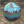
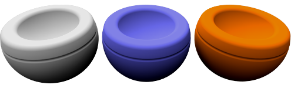
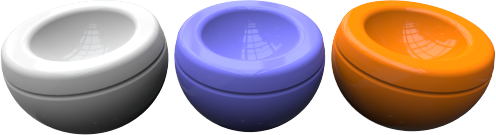

#  {{page.title}}
Flamingo-Materialien werden über eine Reihe von Eigenschaftsgruppen eingestellt. Im Folgenden werden einige einfache Materialtypen vorgestellt.  Diese Materialien verfügen nur über eine begrenzte Anzahl Steuerelemente. Dadurch können Sie diese Materialien auf eine einfache Art verändern, ohne durch die Komplexität zusätzlicher Steuerelemente behindert zu werden. Für die meisten Materialien ist die Änderung der Farbe ausreichend, um eine andere Darstellung zu erzielen.

#### Einfache Materialtypen:

> [Einfarbig](#solid-color)
> [Plastik](#plastic)
> [Metall](#metal)
> [Glas](#glass)
> [Glänzend](#glossy)
> [Klarlack](#clearfinish)
> [Flamingo-Texturenmaterial](#flamingo-textured)
> [Texturensatz](#texture-set)

Jedes beliebige Material kann in ein erweitertes Material umgewandelt werden.  Erweiterten Materialien stehen alle verfügbaren Steuerelemente zur Einstellung eines Materials in Flamingo nXt zur Verfügung.  Wenn Sie eine detaillierte Kontrolle über ein Material benötigen, verwenden Sie ein erweitertes Material oder wandeln Sie ein vorhandenes Material in ein erweitertes Material um.

#### Erweiterte Materialien verfügen über die folgenden Eigenschaftsgruppen:

> [Name](material-type-advanced.html#name)
> [Prozedurales Material](material-type-advanced.html#procedures)
> [Erweiterte Materialeigenschaften](material-type-advanced.html#advanced-materials-properties)
> [Reflektierendes Finish](material-type-advanced.html#reflective-finish-and-highlight)
> [Transparenzeigenschaften](material-type-advanced.html#transparency)
> [Prozedurale Texturen](material-type-advanced.html#bump-patterns)
> [Bitmap-Texturen](material-type-advanced.html#textures)
> [Bemerkungen](material-type-advanced.html#notes)

Materialien werden im Rhino-Modell gespeichert. Verschiedene Materialien in unterschiedlichen Modellen können daher denselben Namen haben.

## Einfarbig
{: #solid-color}
Einfarbige Materialien verfügen über einen [Namen](material-type-advanced.html#name) und eine [Farbe](material-type-advanced.html#color).





## Plastik
{: #plastic}
Plastikmaterialien haben eine leichte Reflexion mit einem weißen [Glanzlicht](material-type-advanced.html#highlight-color).



 Verwenden Sie den Erweiterten Editor, um die Voreinstellungen für [Glanzlichtfarbe](material-type-advanced.html#highlight-color), [Intensität](material-type-advanced.html#intensity), [Fresnel](material-type-advanced.html#fresnel) und [Schärfe](material-type-advanced.html#sharpness) zu überschreiben.

## Metall
{: #metal}
Metallische Materialien haben ein Glanzlicht, dessen Farbe mit der [Grundfarbe](material-type-advanced.html#color) des Materials übereinstimmt. Es kann außerdem die [Schärfe](material-type-advanced.html#sharpness) der Reflexion eingestellt werden.



#### Schärfe
Zur Einstellung der Schärfe und Unschärfe der Reflexion. Weitere Informationen finden Sie im Hilfethema zur erweiterten Einstellung der [Schärfe](material-type-advanced.html#sharpness).

 Verwenden Sie den Erweiterten Editor, um die Voreinstellungen für [Glanzlichtfarbe](material-type-advanced.html#highlight-color), [Intensität](material-type-advanced.html#intensity), [Fresnel](material-type-advanced.html#fresnel) und [Typ](material-type-advanced.html#type) zu überschreiben.

## Glas
{: #glass}
Glasmaterialien haben eine [Farbe](material-type-advanced.html#color) und einen [Brechungsindex](advanced-material-properties-main.html#index-of-refraction) (IOR).



#### Brechungsindex
Zur Einstellung der Lichtbrechung bei Durchquerung des Materials. Weitere Informationen finden Sie im Hilfethema zum [Brechungsindex](advanced-material-properties-main.html#index-of-refraction).

 Verwenden Sie den Erweiterten Editor, um die Voreinstellungen für [Glanzlichtfarbe](material-type-advanced.html#highlight-color), [Intensität](material-type-advanced.html#intensity), [Fresnel](material-type-advanced.html#fresnel), [Schärfe](material-type-advanced.html#sharpness) und [Transparenz](material-type-advanced.html#transparency) zu überschreiben).

## Glänzend
{: #glossy}
Bei glänzenden Materialien sind in der Regel [Intensität](material-type-advanced.html#intensity) und [Schärfe](material-type-advanced.html#sharpness) des Glanzlichts niedrig eingestellt.



#### Intensität
Zur Einstellung der Stärke des Glanzlichts von Lichtern auf der Fläche. Weitere Informationen finden Sie im Hilfethema [Intensität](material-type-advanced.html#intensity).

#### Glanzlichtschärfe
Zur Einstellung von Schärfe und Unschärfe des Glanzlichts von Lichtern auf der Fläche. Weitere Informationen finden Sie im Hilfethema [Glanzlichtschärfe](material-type-advanced.html#sharpness).

 Verwenden Sie den Erweiterten Editor, um die Voreinstellungen für [Fresnel](material-type-advanced.html#fresnel) und [Typ](material-type-advanced.html#type) zu überschreiben.

## Klarlack
{: #clearfinish}
Mit Klarlackmaterial kann Autolack, Porzellan, Keramik, lackiertes Holz oder eine andere Kunststoff- oder Klarlackbeschichtung simuliert werden. Mit der [Fresnel](material-type-advanced.html#fresnel)-Steuerung kann Klarlack so eingestellt werden, dass sich die Materialfarbe je nach Ansichtswinkel ändert. Bei direkter Draufsicht haben diese Materialien tendenziell eine dunklere Farbe, während sie bei einem größeren Neigungswinkel bezüglich der Ansicht zusehends reflektierender werden. Gute Beispiele dafür sind Autofarben mit einem Klarlack- oder lackiertem Finish.



 Verwenden Sie den Erweiterten Editor, um die Voreinstellungen für [Glanzlichtfarbe](material-type-advanced.html#highlight-color), [Intensität](material-type-advanced.html#intensity), [Fresnel](material-type-advanced.html#fresnel) und [Schärfe](material-type-advanced.html#sharpness) zu überschreiben.

## Flamingo-Texturmaterial
{: #flamingo-textured}
Texturmaterialien verwenden Bilder zur Erzeugung von Farben und Mustern. Bei diesem einfachen Material können Name, Auflösung, Kachelgröße, Glanzlichtintensität und Schärfe eingestellt werden.



#### Intensität
Zur Einstellung der Stärke der Spiegelreflexionen auf der Fläche. Weitere Informationen finden Sie im Hilfethema [Intensität](material-type-advanced.html#intensity).

#### Schärfe
Zur Einstellung der Schärfe und Unschärfe der Reflexion. Weitere Informationen finden Sie im Hilfethema zur erweiterten Einstellung der [Schärfe](material-type-advanced.html#sharpness).

#### Bild
Zur Einstellung der Bild-Map und der Eigenschaften des Materials. Dafür stehen viele Optionen zur Verfügung. Weitere Informationen dazu finden Sie im Hilfethema zu [Bildern](material-type-advanced.html#texture).


 Verwenden Sie den Erweiterten Editor, um die Voreinstellungen für dieses Material zu überschreiben.

## Texturensatz
{: #texture-set}
[Texturensetmaterialien](material-type-texture-set.html) bestehen aus einem aufeinander abgestimmten Texturensatz, der das Material definiert.  Diese Materialien können mit Textur-Maps erstellt werden, die Informationen wie Displacement, Normal- oder Bump-Maps enthalten. Displacement-Maps verleihen dem Material Tiefe. Durch Kombination dieser Texturen-Maps können sehr realistische Materialien erzeugt werden. Mit dem Programm [PixPlant](http://www.pixplant.com/) kann aus einer normalen Bitmap ein Texturensatz erzeugt werden.


#### Breite und Höhe
Zur Einstellung der Größe aller Texturen eines Satzes.  Mit dieser Steuerung kann die Größe und Ausrichtung aller Bitmaps synchron eingestellt werden.

#### Intensität
Zur Einstellung der Stärke der Spiegelreflexionen auf der Fläche. Weitere Informationen finden Sie im Hilfethema [Intensität](material-type-advanced.html#intensity).

#### Schärfe
Zur Einstellung der Schärfe und Unschärfe der Reflexion. Weitere Informationen finden Sie im Hilfethema zur erweiterten Einstellung der [Schärfe](material-type-advanced.html#sharpness).

#### Typen
Dadurch wird der Reflexionstyp auf der Fläche gesteuert.  Weitere Informationen finden Sie im Hilfethema [Typ](material-type-advanced.html#type).

### Textur-Maps
In der Textur-Map-Tabelle sind die Texturen aufgelistet, die Teil des Texturensets sind.  Durch Klick mit der rechten Maustaste auf die Tabelle können Texturen hinzugefügt, entfernt oder geändert werden.

#### Maps hinzufügen...
Mit dieser Option im Kontextmenü können neue Texturen zur Liste hinzugefügt werden.  Es kann mehr als eine Textur auf einmal hinzugefügt werden. Wenn ein Name einer Textur ein Suffix mit einem der Mapping-Typen enthält, wird der Textur automatisch dieser Mapping-Typ hinzugefügt.  Wenn eine Map beispielsweise *-normal* im Namen trägt, wird sie automatisch als Normal-Map getaggt.

#### Map entfernen
Zum Entfernen einer Textur-Map aus der Tabelle.

#### Farbe
Mit dieser Option wird die sichtbare Farbe einer Textur eingestellt. Weitere Informationen finden Sie im Hilfethema zum [Standard-Mapping-Typ](material-image-properties.html#standard)

#### Bump
Eine Bump-Map verwendet die Graustufenwerte einer Textur, um eine reliefartige Höhenänderung der Textur zu simulieren. Weitere Informationen finden Sie im Hilfethema zur [Bump-Map](material-image-properties.html#bump)

#### Normal
Normal-Maps sind spezielle Bump-Maps, die den roten, grünen und blauen Kanal der Bitmap verwenden, um die Bump-Richtung der Pixel anzupassen.  Da der blaue Kanal die Z-Richtung einer Bump-Map bestimmt, tendieren diese Bilder dazu, einen blauen Farbton anzunehmen. Weitere Informationen finden Sie im Hilfethema zur [Normal-Map](material-image-properties.html#normal)

#### Spiegelnd
Eine Spiegel-Map verwendet die Graustufenwerte des Materials zur Einstellung des Reflexionsbetrags des Bilds an der jeweiligen Stelle. Weitere Informationen finden Sie im Hilfethema zur [Transparenz-Map](material-image-properties.html#transparency)

#### Deckkraft
Eine Deckkraft-Map bestimmt die Transparenz eines Materials basierend auf den Graustufenwerten des Bilds. Weitere Informationen finden Sie im Hilfethema zur [Normal-Map](material-image-properties.html#normal)

#### Displacement
Eine Displacement-Map versetzt das Rendernetz des Modells basierend auf den Graustufenwerten der Map. Weitere Informationen finden Sie im Hilfethema zur [Displacement-Map](material-image-properties.html#displacement)

### Erweitertes Material
Das [Erweiterte Flamingo-Material](material-type-advanced) enthält einen kompletten Satz an Eigenschaften für ein Flamingo-Material.  Wenn die einfachen Materialien nicht ausreichen, bietet das [Erweiterte Flamingo-Material](material-type-advanced) ein benutzerdefiniertes Material mit der größtmöglichen Flexibilität für die Erstellung und Bearbeitung eines Materials.