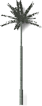

<!-- TODO: This could use an update. But the material is a start.  Let's localize what is here.  We can fill in the details later.-->

# {: .inline} {{page.title}}
{: #tree-editor}

### Menü Datei

#### Neu
Zum Anlegen einer neuen Pflanzendefinition ausgehend von einer Vorlage.

 | {: .inline} | {: .inline} | {: .inline} |
 |:-------------------------------------------:|:-----------------------------------------:|:-------------------------------------:|
 | **Standard**                                |   **Nadelbaum**                             | **Breite Krone**                       |
 | {: .inline}         | {: .inline} | {: .inline} |
 | **Palme**                                    |  **Bodenbewuchs**                          | **Komplex**                                  
{: .plant-table}

#### Öffnen
Öffnet eine vorhandene Baumdefinition.

#### Speichern
Speichert die aktuelle Baumdefinition.

#### Speichern unter
Speichert die aktuelle Baumvorlage unter einem anderen Namen.

### Menü Raytracing
Rendert das Vorschaubild.

*Standard (links) und Raytracing (rechts).*

#### Start
Beginnt mit dem Rendering des Vorschaubilds.

#### Stopp
Stoppt das Rendering des Vorschaubilds.

### Ansicht
Durch Ziehen mit der linken Maustaste kann die Ansichtskamera um das Ziel herum gedreht werden.
Durch Ziehen mit der rechten Maustaste kann das Ziel um die Kamera herum gedreht werden.
Mit dem Mausrad kann in die Ansicht hinein- und herausgezoomt werden.

#### Standard wiederherstellen
Stellt die standardmäßige schattierte Ansicht wieder her.

#### Blätter anzeigen
Zeigt die Baumvorschau mit Blättern an.

*Ohne Blätter (links) und mit Blättern (rechts).*

### Einstellungen
Zur Einstellung der Einheiten des Editors zur Übereinstimmung mit den Arbeitseinheiten.