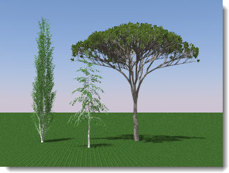

#  {{page.title}}
Flamingo nXt enthält einen leistungsstarken Pflanzengenerator, der während eines Renderings komplexe Pflanzenformen auf effiziente Weise erzeugt. Diese Pflanzen haben keinen großen Einfluss auf die Modellgröße, da nur ein Platzhalter in das Modell platziert wird.

*Flamingo-nXt-Pflanzen.*

### Einfügen einer nXt-Pflanze
{: #insert:}
Flamingo-Pflanzen werden als Block eingesetzt.  Diese Blöcke enthalten die Punkte, aus denen die allgemeine Form der Pflanze abgeleitet wird.

1. Klicken Sie im Flamingo-nXt-Menü auf *Pflanzen* > *Pflanze einfügen*.
1. Klicken Sie im Dialogfenster *Flamingo nXt Pflanze* auf einen Pflanzennamen und dann auf *Öffnen*.
1. Wählen Sie die Position der Pflanze im Modell aus.

Hinweise:

* Vergewissern Sie sich, dass die Einheiten für Ihr Modell richtig eingestellt sind.
* Pflanzen können skaliert, kopiert und gedreht werden.

### Bearbeiten einer Pflanze
{: #edit}
Pflanzen können nach dem Einsetzen verschoben, kopiert und skaliert werden. Die Größe der Pflanze wird dabei entsprechend geändert. Verwenden Sie für detailliertere Änderungen an der Pflanzenstruktur den Befehl **Pflanze bearbeiten**. Kleine Änderungen an der Pflanzenstrukur können schnell vorgenommen werden.  Für umfangreichere Änderungen am Pflanzenalgorithmus ist etwas mehr Übung erforderlich.

1. Klicken Sie im Flamingo-nXt-Menü auf *Pflanzen > Pflanze bearbeiten*
1. Wählen Sie die zu bearbeitende Pflanze aus.
1. Nehmen Sie die gewünschten Änderungen vor.
1. Speichern Sie die Pflanze und schließen Sie den Editor.  Die Pflanze wird daraufhin in Rhino automatisch aktualisiert.

### Verwendung von Flamingo-2-Pflanzen
{: #using-flamingo-2-plants}
1. Klicken Sie im Flamingo-nXt-Menü auf *Pflanzen > Flamingo-2-Pflanze einfügen*.
1. Klicken Sie im Dialogfenster *Flamingo nXt Pflanze* auf einen Pflanzennamen und dann auf *Öffnen*.
1. Wählen Sie die Position der Pflanze im Modell aus.

Hinweise:

* Modelle mit bereits eingefügten Flamingo-2-Pflanzen sollten ohne Einschränkungen funktionieren.
* Flamingo-2-Pflanzen unterscheiden sich von den neuen Pflanzen. Zur Zeit können Sie keine Flamingo 2 Pflanzen bearbeiten oder sie in Flamingo nXt Pflanzen umwandeln.

### Pflanzeneditor
{: plant-editor}
Flamingo wird mit einem Pflanzeneditor zur Erzeugung von benutzerdefinierten Pflanzen geliefert.  Es sind ein paar grundlegende Pflanzenvorlagen vorhanden, die als Ausgangspunkt für einen neuen Pflanzentyp verwendet werden können.  Weitere Informationen finden Sie im Hilfethema zum [Pflanzeneditor](plant-editor.html).