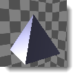

# {{page.title}}
Sowohl die Bilder der Vorschauminiaturansichten wie der Hintergrundbereich zwischen den Miniaturansichtsbildern verfügen über Kontextmenüs.

#### Funktionen der Miniaturansichtsvorschau

>Durch Klick mit der rechten Maustaste und Ziehen kann die Ansicht geändert werden.

Dies hat keinen großen Einfluss, wenn das Vorschauobjekt eine Kugel ist, aber wenn es sich um einen Würfel oder Kegel oder eine andere Form handelt, wird beim Drehen der Ansicht oder des Objekts das Vorschauobjekt aus verschiedenen Blickwinkeln aus angezeigt.

>Durch Klick mit der rechten Maustaste wird ein Kontextmenü angezeigt.
>Durch einen Doppelklick wird ein größeres Vorschaufenster unter den Miniaturansichten angezeigt.
>Durch Ziehen der Vorschauminiaturansichten kann die Liste neu geordnet werden.
>Durch Drücken der Strg-Taste beim Ziehen wird ein Material dupliziert.
>Durch einen Doppelklick auf die größere Vorschau wird ein Dialogfenster geöffnet, das eine Vorschauansicht in höherer Auflösung anzeigt.

Dieses Fenster verfügt über die gleichen Funktionen wie das Originalvorschaubild, einschließlich Kontextmenü und die Fähigkeit von Drag&Drop auf andere Materialien oder Objekte im Modell.

### Geometrie

#### Materialien
Materialien können verschiedene Geometrietypen verwenden.
 *Kugel*
 *Pyramide*
 *Würfel*
 *Torus*
 *Kegel*
 *Ebene*

#### Umgebungen
Umgebungen verwenden nur Kegel und Kugel.
 *Kegel und Kugel* 

#### Texturen
Texturen werden nur als zweidimensionale, flache Fläche angezeigt, die auf die Kamera gerichtet ist.

#### Größe
Definiert die Einheitsgröße für die Miniaturansicht.

### Ansicht
Steuert das Ziehen des Objekts oder die Kamerarotation anhand der rechten Maustaste.

#### Ein Objekt drehen
Ziehen mit der rechten Maustaste dreht das Objekt.

#### Kamera drehen
Ziehen mit der rechten Maustaste dreht die Kamera.

#### X-Winkel
Definiert den horizontalen Rotationswinkel für Objekt oder Kamera.

#### Y-Winkel
Definiert den vertikalen Rotationswinkel für Objekt oder Kamera.

### Hintergrund
Steuert die Erscheinung des Miniaturansichtshintergrunds.

#### Nichts
Es wird die graue Standardumgebung verwendet.

#### Kariert
Ein grauer karierter Hintergrund wird verwendet.

#### Benutzerdefiniert
Beliebige Materialien oder Texturen können als benutzerdefinierter Hintergrund verwendet werden.

#### **Als Standard speichern** 
Speichert die Miniaturansichtseigenschaften als Standardeinstellungen.

#### **Von Standardwerten laden** 
Lädt die Miniaturansichtseigenschaften aus den Standardeinstellungen.