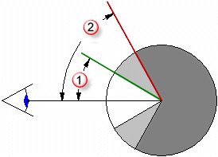
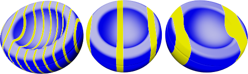
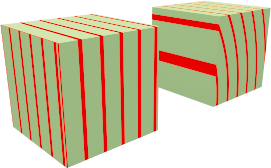

#   {{page.title}}
Der Prozeduren-Baum kombiniert ein oder mehrere Materialien unter Verwendung einer Reihe von Regeln zur Interaktion der Materialien. Das Verzeichnis zeigt die Komponenten an, die zur Erzeugung dieses Materials verwendet werden, und erlaubt Ihnen, Prozeduren hinzuzufügen. Für einfache Materialien gibt es nur eine Komponente in der Liste: Basis.

Jede Prozedur besteht aus zwei *untergeordneten* Materialien, die nach einer bestimmten Methode kombiniert werden. Jedes dieser untergeordneten Materialien kann selbst aus einer Prozedur bestehen und zwei eigene untergeordnete Materialien besitzen. Auf diese Weise können aus einfacheren Komponenten sehr komplizierte Materialien geformt werden. Prozeduren zur Kombination von Materialien:

> [Basis](#base)
> [Winkelüberblendung](#angular-blend)
> [Überblendung](#blend)
> [Marmor](#marble)
> [Granit](#granite)
> [Kachel](#tile)
> [Holz](#wood)

##### Eine Prozedur hinzufügen
1. Klicken Sie mit der rechten Maustaste irgendwo in das Fenster der Prozeduren.
1. Klicken Sie im Menü auf einen Prozedurentyp.

##### Eine Prozedur entfernen
 1. Klicken Sie im Fenster der Prozeduren mit der rechten Maustaste auf einen Prozedurennamen.
 2. Klicken Sie im Menü auf **Entfernen**.

## Basis
{: #base}
Dies ist das einfache Grundmaterial ohne Ebenen. Dies ist die Standardprozedur.

## Winkelüberblendung
{: #angular-blend}
Viele Materialien ändern ihre Farbe, Reflexion oder Transparenz basierend auf dem Ansichtswinkel. Mit der Winkelüberblendungsprozedur kann die Überblendung zwischen zwei Materialien basierend auf dem Ansichtswinkel bezüglich der Objektfläche eingestellt werden.

Die Winkelüberblendungsprozedur überblendet zwischen zwei unterschiedlichen Materialien und erzeugt so Spezialeffekte. Die beiden Ebenen der Prozedur sind die innere und die äußere Ebene.

#### Innen
Von 0 Grad vom Ansichtsfenster bis zum Startwinkel ist die innere Komponente vollständig sichtbar. Stellen Sie sich das als Grundmaterial vor.

#### Außen
Vom Endwinkel bis zu 90 Grad von der Ansicht ist die äußere Komponente das einzige sichtbare Material. Stellen Sie sich das als Verkleidung vor.

#### Startwinkel
Der Winkel vom Blickpunkt, an dem das äußere Komponentenmaterial beginnt.

#### Endwinkel
Der Winkel vom Blickpunkt, an dem das äußere Komponentenmaterial endet.
Zwischen Startwinkel und Endwinkel werden die innere und äußere Komponente überblendet.

In der Abbildung unten liegt der Startwinkel  bei 30 Grad (was im Rendering dem grünen Kreis auf der rechten Seite entspricht) und der Endwinkel  bei 60 Grad (was im Rendering dem roten Kreis enspricht).

Im Bild rechts ist das innere Material weiß und das äußere Material schwarz.

 

* Zwischen 0 und 30 Grad vom Blickpunkt aus ist das Material komplett weiß.
* Zwischen 30 und 60 Grad vom Blickpunkt aus ist ein Farbverlauf von weiß nach schwarz zu sehen.
* Zwischen 60 und 90 Grad vom Blickpunkt aus ist das Material komplett schwarz.

## Überblendung
{: #blend}
Mit einer Überblendungsprozedur können zwei Basiskomponenten kombiniert und ihre Proportionen eingestellt werden. Alle Holzmaterialien in der Standardbibliothek verwenden eine Überblendungsprozedur, um das Holz-Finish von hell und matt auf dunkel und glänzend zu ändern.

Überblendungen eignen sich zum Ändern ganzer Materialdefinitionen, indem eine Farbe einem Basismaterial hinzugefügt wird.

#### Überblendung
Zur Einstellung der prozentualen Verteilung der Komponentenmaterialien. Das Material unten beispielsweise besteht aus einer Überblendung aus einem gestreiften Material und grüner Farbe. Im linken Bild wurde der Schieberegler weit nach links geschoben, sodass das Material starke Streifen und ein schwaches Grün aufweist.  Das mittlere Bild zeigt die mittlere Stellung des Schiebereglers, wobei 50 % gestreiftes und 50 % grünes Material überblendet wurden.  Im rechten Bild wurde der Schieberegler weit nach rechts geschoben, sodass das Ergebnis ein schwach gestreiftes Material mit einer starken grünen Farbe ist.

#### Bild verwenden
Mit einem Bild kann eingestellt werden, wie zwei Materialien interagieren. Bei Verwendung eines Bitmap-Bilds bestimmen die Graustufenwerte der Pixel die Überblendung der beiden Komponentenmaterialien. Sie können daher ein Schwarzweißbild zur Vermittlung zwischen der ersten und zweiten Komponente verwenden. Die erste Komponente wird dort platziert, wo das Bitmap-Muster schwarz ist und die zweite Komponente, wo das Bitmap-Muster weiß ist.

Im Bild werden die gleichen Materialien für die erste und zweite Komponente verwendet, aber die Überblendung wird von drei verschiedenen Bitmaps gesteuert.

Die Auflösung der Masken-Bitmap beeinflusst die Materialqualität. Bitmaps mit höherer Auflösung erlauben einen Blickwinkel näher am Material mit weniger Qualitätsproblemen, benötigen aber auch mehr Speicher.

#### Alphakanal verwenden
Wenn das Bild über einen Alphakanal verfügt, kann dieser statt der Bitmap-Graustufen verwendet werden, um zu bestimmen, an welchem Punkt die Farben überblendet werden.

#### Umkehren
Die erste Komponente wird dort platziert, wo das Bitmap-Muster weiß ist und die zweite Komponente, wo das Bitmap-Muster schwarz ist.

#### Kacheln
Die Skala des Materials hängt nicht von der Auflösung der Bitmap ab. Damit das Material richtig skaliert wird, bestimmen Sie die Größe des Bereichs in echten Einheiten, die eine Bitmap-Kopie darstellt. Wenn die Bitmap die Höhe von sechs Kacheln à 4 Einheiten darstellt und die Länge zwölf Kacheln à 4 Einheiten, beträgt die Skala 48 Einheiten in x-Richtung und 24 Einheiten in y-Richtung. Das passt die Bitmap an die angemessene Größe für das Muster an.

#### Breite
Die Breite in Pixel einer einzelnen Instanz des Bildes.

#### Höhe
Höhe in Pixel einer einzelnen Instanz des Bildes.

## Granit
{: #granite}
Erzeugt ein 3D-Material mit Teilen eines zweiten Materials, die in die Basiskomponente eingebettet werden. Die Granit-Prozedur verbindet eine willkürlich verteilte Komponente mit Flecken in einer Basiskomponente. Die Granit-Prozedur definiert, wie die Basis- und Fleckenkomponenten kombiniert werden. Granit-Prozeduren können für verschiedene Materialien verwendet werden, wie Rost, glänzendes Plastik und andere willkürlich gefleckte Materialien.

#### Basis/Flecken
Die Basis- und Fleckenkomponente sind zwei Materialien. Ihre Eigenschaften werden wie bei einem beliebigen Material definiert.



#### Dichte
Ein Bruchteil des ganzen Musters. Wenn diese Einstellung erhöht wird, wird auch die relative Größe der Flecken erhöht.



## Marmor
{: #marble}
Erzeugt alternierende Streifen von Basis und Maserkomponenten. Die Marmor-Prozedur bestimmt, wie die Basis- und Maserkomponenten kombiniert werden. Die Streifen sind unendlich lang und die Ausrichtung des Objekts beeinflusst, wie die Streifen in Bezug auf das Objekt ausgerichtet werden.

Das [Texturmapping](properties-object.html#mapping) für die Objekte steuert die Ausrichtung des Materials auf dem Objekt. 

*Kein Texturmapping (links). Mit Texturmapping (rechts).*

#### Basis/Maser
Die Basis- und Masekomponente sind zwei Materialien. Ihre Eigenschaften werden wie bei einem beliebigen Material definiert.


#### Maserbreite
Ändert die relative Größe der Streifen zueinander. Die Maserbreite beträgt einen Bruchteil des Abstands von einem Basisstreifen zum nächsten. Die Werte reichen von 0 für keine Maserkomponente bis 1 für keine Basiskomponente.




*Verkleidung (links); Normal (rechts).*

## Kachel
{: #tile}
Bei Kachel handelt es sich um ein 2D-Material. Das [Texturmapping](properties-object.html#mapping) für die Objekte steuert die Ausrichtung des Materials auf dem Objekt. Das Kachelmaterial vereint eine Basiskomponente und eine Verbindungskomponente. Jedes dieser Materialien kann auch andere Materialien enthalten.

Für Spezialeffekte skalieren Sie die Kachel unterschiedlich in jede Richtung. Verwenden Sie eine Kachelprozedur, die in eine Richtung extrem lang ist, um ein "Seiten"material zu erzeugen.

#### Kachel
Definiert die gesamte Kachelgröße. Breite und Höhe können unabhängig voneinander eingestellt werden.

#### Höhe/Breite
Definiert die Breite und Höhe der Kacheln.


#### Verbindung
Ändert die Größe des Verbindungsmaterials.

#### Horizontale Verbindung/Vertikale Verbindung
Definiert die Breite und Höhe des Verbindungsmaterials.

#### Sperren
Behält das Seitenverhältnis zwischen horizontaler und vertikaler Verbindung bei.

#### Versatz
Liefert einen relativen horizontalen Versatz pro vertikale Kachel. Verwenden Sie z.B. eine Einstellung von .5, um einen standardmäßigen Läuferverband zu erzeugen. So können Sie Materialien wie Marmorkachel modellieren, ohne das Gefühl zu haben, dass der ganze Boden aus dem gleichen Marmorblock erzeugt wurde.

#### Kacheln variieren
Fügt der Materialfarbe für jede Kachel Willkürlichkeit hinzu. Auf diese Weise kann Material wie ungleichmäßige Ziegel modelliert werden.

#### R/G/B
Ändert die rote, grüne oder blaue Farbkomponente. Dadurch wird das Grundmaterial einer Kachel auf eine zufällige Weise leicht modifiziert.

#### X/Y/Z
Dadurch wird das Material vom Weltursprung aus für jede Kachel zufällig versetzt. Dies ist hilfreich, wenn eine Naht am Anfang eines Materials an einem falschen Ort auftaucht.

## Holz
{: #wood}
Holz besteht aus konzentrischen Zylindern alternierender Basis- und Ringkomponenten. Die Holzeinstellungen bestimmen, wie sich die Basis- und Ringkomponenten zusammensetzen.

Verwenden Sie diese Methode, wenn Ihre Holzmaterialien nicht aus der Nähe betrachtet werden. Wenn Sie ein detailliertes Holz benötigen, verwenden Sie ein [Texturmaterial](material-type-simple.html#textured).  Wenn der Blickpunkt nicht nahe am Holz liegt, kann eine solide Farbe Holz ersetzen, ohne dadurch die Bildqualität zu schmälern. Das Rendering ist damit schneller. Ein Vorteil des Holzmaterials ist, dass die Holzmaserung richtig aussieht, wenn verschiedene Seiten eines Objekts gerendert werden. Die Endmaserung wird an den Enden und die parallele Maserung an den Seiten eines Objekts sichtbar sein.

#### Basis/Ring
Die Basis- und Ringkomponente sind zwei Materialien. Ihre Eigenschaften werden wie bei einem beliebigen Material definiert.


#### Ringbreite
Ein Bruchteil des Abstands zwischen einem Basisstreifen zum nächsten. Die Werte reichen von 0 für keine Ringkomponente bis 1 für keine Basiskomponente.




Verkleidung (links); Normal (rechts).