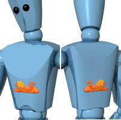

<!-- This is an old page, I am not sure it needs to be updated or translated,  The new Flamingo products used Rhino decals documented in Rhino help. -->

# {{page.title}}
Decals sind nicht-kachelbare Bild-Maps, die direkt auf Objekte angewendet werden, anstatt dass indirekt ein Material verwendet wird. Verwenden Sie Decals, um einen begrenzten Teil einer Objektfarbe, Reflexionsvermögen oder Bumps zu ändern.
Decals bestehen aus einer einzigen Instanz des Bildes und werden nicht wie in einer [Materialdefinition](materials-tab.html) gekachelt.
Einige Anwendungsbeispiele für Decals:

>Kunstwerke an Innenwänden
>Etikette oder Logos auf Produkten
>Zeichen in einem Modell
>Bunte Glasfenster

 **Hinweis:** Eine Decal-Vorschau wird in der Gitternetzansicht nur dann angezeigt, wenn OpenGL für den Gitternetzmodus aktiviert ist.  Die Einstellung für **Pipeline** unter **Optionen**  &gt; **Ansicht**  &gt; **Anzeigemodi**  &gt; **Gitternetz**  &gt; **Andere Einstellungen**  &gt; **Pipeline-Zuordnung anzeigen** muss auf **OpenGL** eingestellt sein.

## Decal-Platzierung
{: #decal-list}
{: #decal-placement}

###  **Hinzufügen**
{: #add-decal}
1. Wählen Sie ein oder mehrere Objekte aus.
1. Klicken Sie im Menü **Bearbeiten** auf **Objekteigenschaften**.
1. Klicken Sie in der Liste der **Eigenschaften** auf **Flamingo nXt Decals**.
1. Klicken Sie auf die Schaltfläche **Hinzufügen**.
1. Wählen Sie im Dialogfenster **Bitmap öffnen** eine Bitmap aus und klicken Sie auf **Öffnen**
1. Wählen Sie in den **Decal-Eigenschaften** die gewünschten Optionen aus und klicken Sie auf **Platzieren**.
1. Wählen Sie an den Eingabeaufforderungen für Punkte die Punkte auf dem Modell aus, wo Sie das Decal platzieren möchten.
Die genaue Sequenz hängt vom ausgewählten Decal-Typ ab: [Planar](#decal-planarmapping), [Zylindrisch](#decal-cylindricalmapping) oder [UVMap](#decal-uvmapping).

###  **Platzierung bearbeiten**
{: #decal-edit-placement}
1. Klicken Sie auf die Schaltfläche **Platzierung bearbeiten**.
1. Verwenden Sie an der Eingabeaufforderung **Kontrollpunkt auswählen** den Grafikeditor, um die Platzierung des Decals zu ändern.
1. Drücken Sie zum Abschließen des Vorgangs die **Eingabetaste**.

###  **Eigenschaften**
{: #decal-properties}
1. Klicken Sie auf die Schaltfläche **Eigenschaften**.
1. Verwenden Sie im Dialogfenster **Decal-Eigenschaften** die Steuerungen, um die Decal-Eigenschaften zu ändern.

###  **Löschen**
{: #decal-delete}

>Klicken Sie auf die Schaltfläche **Löschen**.

###  **Aufwärts** / **Abwärts**
{: #decal-movedown}
{: #decal-moveup}
Wenn mehrere überlappende Decals einem einzigen Objekt angewendet werden, kann die Reihenfolge, in der sie angewendet werden, wichtig sein. Decals werden in der Reihenfolge, in der sie in der Liste erscheinen, angewendet. Das letzte Decal in der Liste erscheint zuoberst.

>Klicken Sie auf **Aufwärts** oder **Abwärts**, um die Position des Decals in der Liste zu ändern.

##### Platzierung eines planaren Decals
1. Wählen Sie an den Eingabeaufforderungen die Positionen für **Breiten- und Höhenrichtung** des Decals aus.
1. Wählen Sie an der Eingabeaufforderung **Kontrollpunkt auswählen...** einen Kontrollpunkt aus, um Bildgröße, Rotation oder Standort anzupassen.
Oder drücken Sie die **Eingabetaste**, um die Platzierung des Decals abzuschließen.

### Optionen

#### Verschieben
Verschiebt das Decal. Geben Sie an der Eingabeaufforderung für **Startpunkt** und **Neuer Standort** die gewünschte Position ein, wie Sie es auch beim Rhino-Befehl **Verschieben** machen würden.

#### SeitenverhältnisBildVerwenden
Stellt das Seitenverhältnis der Original-Bitmap eines gedehnten Decals wieder her.

##### Platzierung eines zylindrischen Decals
1. Geben Sie an der Eingabeaufforderung eine Position für den Mittelpunkt des Zylinders ein.
1. Wählen Sie an der Eingabeaufforderung **Kontrollpunkt auswählen...** einen Kontrollpunkt aus, um Bildgröße, Rotation oder Standort anzupassen.
Oder drücken Sie die **Eingabetaste**, um die Platzierung des Decals abzuschließen.

## Festlegen oder Ändern der Decal-Platzierung mithilfe des Steuerungs-Widgets
Hinweis: Wenn das planare Mapping an ein gewölbtes Objekt angewendet wird, muss die gesamte Bitmap hinter der Fläche des Objekts liegen. Bitmap-Ausschnitte, die vor der Fläche liegen, werden nicht sichtbar sein.

#### Gleichzeitige Änderung der Breite und Höhe des Decals

>Ziehen Sie die Kontrollpunkte an den Ecken des Steuerungs-Widgets.

#### Änderung der Höhe des Decals

>Ziehen Sie den mittleren Kontrollpunkt auf der oberen und unteren Kante des Steuerungs-Widgets.

#### Änderung der Breite des Decals

>Ziehen Sie den mittleren Kontrollpunkt auf der linken und rechten Kante des Steuerungs-Widgets.

#### Verschieben des Decals

>Ziehen Sie den Kontrollpunkt in der Mitte des Steuerungs-Widgets.

#### Drehen des Decals

>Ziehen Sie den x-, y- oder z-Achsenkontrollpunkt auf dem Widget-Achsensymbol.

## Decal-Eigenschaften
{: #dialogbox-editdecal}
Die Informationen aus der Bitmap ersetzen oder überblenden die Objektfarbe mit der Farbe des Decals. Das ist die üblichste Verwendung von Decals.

## Projektion
{: #projection}
Der Mapping-Stil bestimmt, wie das Decal auf das Objekt projiziert werden soll. Es ist eine gute Idee, Konstruktionslinien in der Szene zu zeichnen, die beim genauen Platzieren des Decals behilflich sind. Ein hinter einer Fläche gezeichnetes Rechteck kann die Platzierung eines Standard-Decals führen. Verwenden Sie Objektfänge für eine genaue Platzierung.

### Zylindrisch
{: #decal-cylindricalmapping}
Die zylindrische Mapping-Art ist hilfreich, wenn Sie Decals auf Objekte platzieren wollen, die sich in eine Richtung wölben, wie Weinflaschenetiketten.
Die zylindrische Projektion mappt die Bitmap auf den Zylinder, mit der vertikalen Achse entlang der Zylinderachse und der horizontalen Achse um den Zylinder herum.

### Planar
{: #decal-planarmapping}
Planares Mapping ist der geläufigste Mapping-Stil. Er ist angebracht, wenn Sie an flachen oder leicht gewölbten Objekten mappen.
Die Ecken definieren Standort und Größe der Bitmap. Wenn das Rechteck nicht die gleichen Ausmaße wie die Bitmap hat, wird die Bitmap gedehnt oder komprimiert.
Wenn ein planares Mapping an ein gewölbtes Objekt angewendet wird, muss die gesamte Bitmap-Projektion hinter der Fläche des Objekts liegen. Bitmap-Ausschnitte, die vor der Fläche liegen, werden nicht sichtbar sein.

### UV-Map
{: #decal-uvmapping}
Decals, die UV-Mapping verwenden, sind hilfreich für Objekte wie Haare oder Baumrinde, bei denen das Decal zur Anpassung an die Fläche gedehnt und bearbeitet wird.
Das Decal überdeckt das gesamte Objekt, man hat keine Kontrolle über die Decalplatzierung.
UV-Mapping verwendet die U- und V-Parametrisierung der Fläche, um das Bild zu biegen und dehnen; eine Platzierung von Hand ist deshalb nicht nötig.

### Durchsuchen
{: #file-browse}
Ändern der Bilddatei.



## Stärke
{: #decalmappingstrength}

### Farbe
{: #decal-color}
Variiert die relative Intensität der Bildfarbe in Bezug auf das darunter liegende Material. Weitere Informationen finden Sie im Hilfethema zur [Farbintensität von Materialtexturen](texture-properties-main.html#color).

### Bump
{: #decalmappingbump}
Bump-Maps erzeugen simulierte Schatten und Glanzlichter auf der Fläche. Weitere Informationen finden Sie im Hilfethema zur [Bump-Intensität von Materialtexturen](texture-properties-main.html#bump).

## Reflektierendes Finish
{: #reflective-finish-and-highlight}
Steuert die gleichen Eigenschaften, die durch eine Materialdefinition gesteuert werden. Sie können diese Eigenschaften an bestimmte Bereiche des Objekts anwenden, die durch das Decal beeinflusst werden. Decals verfügen standardmäßig über ein mattes Finish.

### Intensität
Reguliert die Intensität des Glanzlichts. Größere Werte bedeuten größere und intensivere Glanzlichter. Weitere Informationen finden Sie unter [Erweiterte Materialeigenschaften, Intensität](advanced-material-properties-main.html#intensity).

### Schärfe
Definiert die Größe des Glanzlichts. Je kleiner die Zahl, desto breiter das Glanzlicht; größere Zahlen konzentrieren das Glanzlicht auf einen kleineren Bereich. Weitere Informationen finden Sie unter [Erweiterte Materialeigenschaften, Schärfe](advanced-material-properties-main.html#sharpness).

### Metallisch
Stellt die Glanzlichtfarbe so ein, dass sie mit der Grundfarbe übereinstimmt. Weitere Informationen finden Sie unter [Erweiterte Materialeigenschaften: Metallisch](advanced-material-properties-main.html#metallic).


## Weitere Einstellungen
{: #advanced}

### Zweiseitig
{: #double}
Das Decal erscheint auf der Hinterseite sowie auf der Frontseite der Fläche, auf der es platziert wurde.

### Gespiegelt
{: #mirror}
Spiegelt das Decal-Bild.

## Projektionsrichtung
{: #projection-direction}

### Rückwärts
Projiziert das Decal weg von der Hinterseite des Decal-Bilds.
Front (links), hinten (rechts).

### Vorwärts
Projiziert das Decal weg von der Vorderseite des Decal-Bilds.
Front links), hinten (rechts).

### Vorwärts / Rückwärts
Projiziert das Decal weg von der Hinterseite und der Vorderseite des Decal-Bilds.
Front (links), hinten (rechts).

### Transparenz
Definiert die Transparenz für das Decal. Weitere Informationen finden Sie im Hilfethema zur [Transparenz](advanced-material-properties-transparency.html).
IOR
Definiert den Brechungsindex für das transparente Decal. Weitere Informationen finden Sie im Hilfethema zum [Brechungsindex](advanced-material-properties-transparency.html#index-of-refraction)