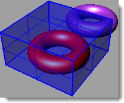

#   {{page.title}}
Die Flamingo nXt Objekteigenschaften beeinflussen nur die Art und Weise, wie Objekte in Flamingo nXt gerendert werden.

###  Materialquelle
{: #material-source}
Ein Material kann einer Ebene, einem Objekt oder Block zugewiesen werden.  Weitere Informationen finden Sie im Hilfethema [Materialzuweisung](material_assignment.html). Wenn das Material auf *Nach Objekt* eingestellt ist, werden die Materialeigenschaften auch in diesem Dialog angezeigt.  Weitere Informationen zum Bearbeiten eines Materials finden Sie unter [Materialeigenschaften](material-type-simple.html).

###  Texturmapping
{: #texture-mapping}
Das Mapping bestimmt, wie ein Material auf ein bestimmtes Objekt abgebildet wird. Die Methode zur Zuweisung eines Materials auf eine Ebene oder ein Objekt hat keinen Einfluss auf das Mapping. Für Materialien, die über kein bemerkenswertes Muster verfügen, ist es normalerweise nicht nötig, das Mapping zu steuern. Verwenden Sie Mapping, wo das Material eine Richtung oder ein offensichtliches Muster hat. Sogar in diesen Fällen könnte das Standard-Mapping passend sein. Das Mapping wird im Objekt gespeichert und bleibt auch beim Verschieben, Drehen oder Skalieren erhalten. Weitere Informationen zu den Mappingtypen finden Sie im Rhino-Hilfethema zum [Texturmapping](http://docs.mcneel.com/rhino/5/help/de-de/index.htm#properties/texturemapping.htm).

 
*Zwei verschiedene Mapping-Richtungen*

###  Decals
{: #decals}
Decals sind nicht-kachelbare Bild-Maps, die direkt auf Objekte angewendet werden, anstatt dass indirekt ein Material verwendet wird. Decals werden verwendet, um einen begrenzten Bereich der Farbe, des Reflexionsvermögens oder des Bumps eines Objekts zu ändern. Weitere Informationen zum Erzeugen und Platzieren eines Decals finden Sie im Rhino-Hilfethema zu [Decals](http://docs.mcneel.com/rhino/5/help/de-de/index.htm#properties/decal.htm).

 
 
*Vier Beispiele für Decals*

###  Benutzerdefinierte Polygonnetze
{: #custom-meshes}
In Rhino können verschiedene benutzerdefinierte Polygonnetzparameter zur Einstellung des gerenderten Modells verwendet werden. Damit können Ecken abgerundet, Schließlinien hinzugefügt oder Kabel aus Kurven erzeugt werden.

Weitere Infos finden Sie in den Hilfethemen unten:

>[Kantenrundung](http://docs.mcneel.com/rhino/5/help/en-us/index.htm#commands/applyedgesoftening.htm)
>[Kurven-Piping](http://docs.mcneel.com/rhino/5/help/en-us/index.htm#commands/applycurvepiping.htm)
>[Schließlinien](http://docs.mcneel.com/rhino/5/help/en-us/index.htm#commands/applyshutlining.htm)
>[Displacement](http://docs.mcneel.com/rhino/5/help/en-us/index.htm#commands/applydisplacement.htm)

###  Flamingo-Eigenschaften
{: #flamingo-properties}

#### Alphakanal
{: #alpha-channel}
Macht das Objekt unsichtbar. Durch das Objekt und auf dem Objekt erzeugte Schatten werden gerendert. Das Bild kann dann auf ein anderes Bild gelegt werden und die Schatten werden im zusammengesetzten Bild sichtbar sein.

Im Beispiel oben wurden ein paar einfache planare Flächen verwendet, die mit dem Bild übereinstimmen und die Schatten der Bäume auf dem Gebäude aufnehmen. Für die Flächen wurde ein Alphakanal definiert, sodass sie beim Rendern unsichtbar waren, die geworfenen Schatten aber dennoch angezeigt wurden. Dieses teilweise transparente Bild wurde dann auf das andere Bild gelegt.

#### Kaustiken
{: #caustics}
Kaustiken sind die Lichtstrahlen, die durch ein gewölbtes Objekt reflektiert oder gebrochen werden, oder die Projektion dieser Strahlen auf einer anderen Fläche. Sie sollten in sehr spezifischen Situationen verwendet werden. Kaustiken werden nur mit der [Pfadverfolgungs-Engine](render-tab.html#path-tracer) oder der [Hybrid-Engine](render-tab.html#hybrid) gerendert.  Kaustische Berechnungen benötigen viele Durchgänge, bis sie konvergieren. Weitere Informationen finden Sie im Wikipedia-Artikel zu [Kaustik](https://de.wikipedia.org/wiki/Kaustik_(Optik)).

*Durch ein Glas Wasser erzeugte Kaustiken.*

*Ohne Kaustik (links) und mit Kaustik (rechts).*

#### Dünn
{: #thin}
Ein raumeinschließendes, transparentes Objekt wird für eine transparente Lichtbrechung normalerweise als Volumenkörper gehandhabt. Bei Einstellung der Eigenschaft *Dünn* wird jede Fläche als zweiseitiges Objekt für die Lichtbrechung gehandhabt. Diese Einstellung bietet sich an, wenn einzelne Flächen wie Glas für Architekturmodelle verwendet werden.

 
*Rhino-Grundmodell (links), Normal (Mitte) und Dünn (rechts)*

#### Tageslichtportal
{: #daylight-portal}
Ein Tageslichtportal ist eine Öffnung für [Sonne und Himmelsbeleuchtung](lighting-tab.html#interior-daylight) für ein Innen-Rendering. Ein Tageslichtportal bringt auf natürliche Weise Sonnen-, Himmels- und Bodenlicht in einen Innenraum ein. Tageslichtportale haben nur dann einen Effekt, wenn die [Sonne](sun-and-sky-tabs.html#sun) eingeschaltet ist. Wenn das Beleuchtungsschema auf [Tageslicht innen](lighting-tab.html#interior-daylight) eingestellt ist, verhalten sich alle transparenten Flächen automatisch wie Tageslichtportale. Nur wenn das Beleuchtungsschema auf *Studio* oder *Tageslicht außen* eingestellt ist und Sie noch Sonnen- und Himmelslicht von außen in die Innenszene einbringen möchten, müssen Sie die Fenster manuell als Tageslicht-Portale markieren.

*Mit Tageslichtportal (links), ohne Tageslichtportal (rechts).*