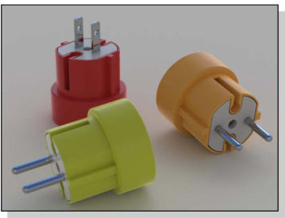

#  {{page.title}}
Im Renderfenster finden Sie Optionen für die Belichtungsanpassung und das Hinzufügen von Nachbearbeitungseffekten. Das Grundgerüst des Renderfensters ist Teil von Rhinos Rendering-Framework.  Weitere Infos zum Renderfenstermenü und den Schaltflächen finden Sie in der Rhino-Hilfe zum Thema [Renderfenster](http://docs.mcneel.com/rhino/5/help/de-de/index.htm#information/renderwindowpostprocess.htm).  Im folgenden Abschnitt werden die Flamingo-spezifischen Elemente des Rendervorgangs beschrieben.

## Verwaltung eines aktiven Renderings
Nach dem Start des Rendervorgangs wird das [Renderfenster](http://docs.mcneel.com/rhino/5/help/de-de/index.htm#information/renderwindowpostprocess.htm) geöffnet und der Rendervorgang ausgeführt.  Flamingo ist ein Rendersystem mit mehreren Durchgängen, bei dem das Renderbild nach jedem Durchgang aktualisiert wird. Flamingo sucht zuerst nach Änderungen im internen Modell und beginnt dann mit der Initialisierung.  Dieser Vorgang kann einige Sekunden oder mehrere Minuten dauern.  Dabei wird das Modell importiert, Material-Bitmaps von der Festplatte eingesammelt und der Puffer für das Renderbild erstellt. Die wichtigsten Schritte zur Verwaltung eines Rendervorgangs sind die folgenden:

>[Rendering mit mehreren Durchgängen](#multi-pass)
>[Anhalten des Renderings](#stop-render)
>[Bildanpassung](#adjusting)
>[Speichern des Bilds](#saving)

### Rendering mit mehreren Durchgängen
{: #multi-pass}
Flamingo nXt ist eine komplett neue Render Engine. Durch die Verwendung einer Methode mit mehreren Durchgängen können fortgeschrittene Rendereffekte ohne den Mehraufwand einer komplizierten Benutzeroberfläche erzielt werden. In den ersten Durchgängen kommt es zu ungewöhnlichen Artefakten.  So werden Schatten beispielsweise am Anfang sehr scharf und linear angezeigt. Mit jedem Durchgang werden die Schatten durch weitere Überblendungen weicher. Viele weitere Effekte werden ebenfalls mit jedem weiteren Renderdurchgang verbessert.  Im [Flamingo](#flamingo-tab)-Reiter kann der Rendervorgang überwacht werden.

Ein Flamingo-nXt-Rendering ist in diesem Sinne niemals "abgeschlossen", sondern Sie können vielmehr entscheiden, wann es gut genug für Sie ist. Gut aussehende Bilder können auch weiter verbessert werden. Wenn Sie aber etwas ändern oder speichern möchten, können Sie ein Bild auch jederzeit anhalten.

Zu den Effekten, die bei jedem Durchgang verbessert werden, zählen:

>Beleuchtung (wie beispielsweise die globale Beleuchtung)
>Weiche Schatten
>Reflexionen (Unschärfe)
>Lichtbrechung
>Antialiasing
>Schärfentiefe

### Anhalten eines Renderings
{: #stop-render}
Das Rendering kann auf verschiedene Arten angehalten werden:

 Klicken Sie auf das **X** in der oberen rechten Ecke des Renderfensters, um das Rendering sofort zu beenden und das Fenster zu schließen. Dies ist die einfachste Methode, wenn Sie wieder schnell zu Ihrem Modell zurückkehren möchten.

 Klicken Sie auf die Schaltfläche mit dem roten Stoppsymbol, um das Rendering nach Abschluss des aktuellen Durchgangs zu beenden. Diese Methode wird empfohlen, wenn Sie das Bild speichern möchten.

 Klicken Sie doppelt auf die Schaltfläche mit dem roten Stoppsymbol, um das Rendering sofort abzuschließen und das Renderfenster geöffnet zu lassen.

### Anpassen eines Renderings
{: #adjusting}
Verwenden Sie nach Abschluss eines Renderings die Steuerelemente im [Flamingo-Reiter](#flamingo-tab), um das erhaltene Bild und die Beleuchtung anzupassen. Diese Werkzeuge sind wichtig für die Erzeugung von qualitativ hochwertigen Bildern.

Zu den Optionen zur Bildanpassung gehören:

>[Bild anpassen](#adjust-image)
>[Kanäle](#channels)
>[Nachbearbeitungseffekte](#post-process-effects)

### Speichern des Bilds
{: #saving}
Zum Speichern eines Bilds gibt es zahlreiche Möglichkeiten für verschiedene Vorhaben.  Normalerweise wird das JPG- oder PNG-Format für die meisten Bilder empfohlen.  Es gibt allerdings auch andere Möglichkeiten.

####  Bild speichern
Nach der Anpassung des Bilds wird dieses normalerweise als JPG- oder PNG-Datei abgespeichert.  

Ein JPG-Bild ein sehr effizientes, kleines Bildformat, das sich besonders für Bilder anbietet, die ins Internet hochgeladen oder per E-Mail verschickt werden.  Diese Effizienz hat den Haken, dass einige Farben aus dem Bild entfernt werden.

PNG ist ein komprimiertes Format, das die vollständigen Farbinformationen sowie einen Alphakanal enthält. Dieses Format eignet sich sehr gut für qualitativ hochwertige Bilder.

#### Mit Hintergrund-Alphakanal speichern
{: #save-with-alpha-channel}
Zum Speichern als 32-Bit-PNG-, -TIF- oder -BMP-Bild einschließlich des Alphakanals. Bilder mit Alphakanal werden für qualitativ hochwertige Bilder verwendet. Beim Speichern des Renderings mit Alphakanal erscheint der Hintergrund schwarz.  Im [Flamingo-Reiter](#flamingo-tab) und dem [Speichern-Dialog](#saving) ist jeweils ein Kontrollkästchen zur Auswahl der Speicheroption mit Alphakanal vorhanden. Wenn Sie ein Bild mit Alphakanal abspeichern möchten, ist das PNG-Format die richtige Wahl.

#### Als native Flamingo-nXt-Datei exportieren (.nXtImage)
{: #export-to-nxtimage}
Dieses Format speichert unkomprimierte Luminanz- und Farbinformationen. Alle Renderkanäle und der [Alphakanal](environment-tab.html#alpha) werden ebenfalls gespeichert. nXt-Bilddateien können mit dem [Bildeditor](image-editor.html) geöffnet, ihre [Belichtung](#adjust-image) und [Nachbearbeitungseffekte](#effects) angepasst und anschließend in einem anderen Bitmap-Format gespeichert werden.

Das .nXtImage-Format ist das native Bildformat der nXt-Renderer. Es ist das empfohlene Format zum Speichern Ihrer Renderings, da es die meisten Informationen über das Rendering beibehält. Die in diesem Format gespeicherten Bilder können im [nXt-Bildeditor](image-editor.html) bearbeitet und mit Spezialeffekten versehen werden. In diesem Editor können die Bilder anschließend in vielen bekannten Standardformaten inklusive der in nXt unterstützten Formate gespeichert werden. Außerdem steht das [Piranesi-EPix-Format (.epx)](http://www.piranesi.co.uk/) zur Verfügung.

#### Als HDR-Datei exportieren
{: #export-to-hdr}
Speichert unkomprimierte Luminanz- und Farbinformationen. Das HDR-Format speichert Luminanzdaten direkt in ein Hochkontrastbild (HDRI). Hintergründe ohne Luminanz wie normale Fotos erscheinen schwarz, wenn sie in einem dieser Formate gespeichert werden.

#### Als EXR-Datei exportieren
{: #export-to-exr}
OpenEXR ist ein HDR-Grafikformat, welches als offener Standard durch Industrial Light and Magic unter einer Open-Source-Lizenz herausgegeben wurde. Dieses Dateiformat unterstützt Gleitkommazahlen mit 16 Bit pro Kanal (halbe Genauigkeit) mit einem Vorzeichenbit, fünf Bit Exponent und 10 Bit Mantisse. Dies erlaubt eine dynamische Reichweite von über dreißig Belichtungsstopps. Weitere Informationen finden Sie im [Wikipedia-Artikel zu OpenEXR](https://de.wikipedia.org/wiki/OpenEXR).
Das exr-Format speichert Luminanzdaten direkt in ein HDR-Format. Hintergründe ohne Luminanz wie normale Fotos erscheinen schwarz, wenn sie in einem dieser Formate gespeichert werden.

####  Schließen
Schließt das Renderfenster.

#### Rendermenü
Weitere Infos zum Renderfenstermenü und den Schaltflächen finden Sie in der Rhino-Hilfe zum Thema [Renderfenster](http://docs.mcneel.com/rhino/5/help/de-de/index.htm#information/renderwindowpostprocess.htm).

## Flamingo-Reiter
{: #flamingo-tab}
Im Flamingo-Reiter im Renderfenster finden Sie zahlreiche Steuerelemente für die Flamingo-Render-Engine.  Das Verständnis dieser Steuerelemente ist der Schlüssel zur Verwaltung eines Flamingo-Renderings.

#### Mit Alphakanal speichern
Zum Speichern als 32-Bit-PNG-, -TIF- oder -BMP-Bild einschließlich des Alphakanals. Bilder mit Alphakanal werden für qualitativ hochwertige Bilder verwendet. Beim Speichern des Renderings mit Alphakanal erscheint der Hintergrund schwarz.  Mithilfe dieses Kontrollkästchens und dem [Speichern-Dialog](#saving) kann der Alphakanal gespeichert werden. Wenn Sie ein Bild mit Alphakanal abspeichern möchten, ist das PNG-Format die richtige Wahl.

## Fortschritt
{: #progress}
Der Fortschritt gibt den aktuellen Status und den Stand des Flamingo-Renderings wieder.

#### Aktion
Zeigt den aktuellen Status des Renderings an.

Mögliche Statusmeldungen sind:

* Rendering wurde gestartet - Nach dem Start eines Renderings müssen einige Konfigurationen wie die Umwandlung des Modells oder die Reservierung von Speicherplatz für das Rendering durchgeführt werden.
* Fertiggestellt - Nach dem Drücken der Stopp-Schaltfläche wird der aktuelle Durchgang beendet und das Rendering fertiggestellt.
* Durchgang vollständig - Diese Meldung wird jedes Mal ausgegeben, wenn ein Durchgang fertiggestellt wurde.
* Rendering fortführen - Wenn ein Rendering fortgeführt werden kann, wird diese Meldung angezeigt.
* Wird aktualisiert - Die Render Engine befindet sich mitten in einem Durchgang und das Rendering wird gerade aktualisiert.

#### Durchgang
Der aktuelle Durchgang, der von Flamingo gerendert wird.  Flamingo ist ein Rendersystem mit mehreren Durchgängen.  Bei jedem Durchgang werden Licht- und komplexe Rendereffekte verfeinert.

#### Abtastlinie
Ein Durchgang wird entlang einer Zeile horizontaler Pixel durchgeführt.  Jede Pixelzeile ist eine Abtastlinie.  Hier wird die aktuelle Abtastlinie zurückgegeben, die gerade von der Render Engine bearbeitet wird.

#### Verstrichene Zeit
Die Zeit, die seit Beginn des Renderings verstrichen ist.  Die für die Konfiguration des Renderings benötigte Zeit wird hierbei nicht einbezogen.

#### Strahlen / Sekunde
Die Anzahl der Strahlen, die pro Sekunde in die Szene aufgelöst werden.

#### Pixel / Sekunde
Die Anzahl der Pixel, die pro Sekunde in das Bild berechnet werden.

## Bild anpassen
{: #adjust-image}
Dies ist eines der wichtigsten Steuerelemente in Flamingo. Die Belichtung des Bilds kann wie bei einer Kamera angepasst werden.  Dies ist die beste Methode, um Renderings heller, dunkler, kontrastreicher oder gesättigter einzustellen. Dieser Anpassungsprozess wird [Tone-Mapping](https://en.wikipedia.org/wiki/Tone_mapping) genannt. Flamingo arbeitet im Luminanzbereich, der einen weitaus größeren Farb- und Helligkeitsbereich umfasst, als auf einem Bildschirm oder Druck angezeigt werden kann.  Tone-Mapping ist der Umwandlungsprozess von Luminanzdaten in rote, grüne und blaue (RGB) Pixel, die auf einem Bildschirm angezeigt bzw. gedruckt werden können. Mit diesen Einstellungen kann auch bestimmt werden, wie Bilder gespeichert werden.

  
*Links das Standardbild. Rechts das verbesserte Bild nach Anwendung von Helligkeit (0,20), Nachbelichten (0,16) und Sättigung (1,20).*
Mit diesem Prozess können Sie die Helligkeit und Farbe eines Bilds anpassen, ohne erneut rendern zu müssen.

### Helligkeit
{: #brightness}
Passt die allgemeine Helligkeit des Bilds an. Wenn z.B. eine weiße Fläche im Modell grau gerendert wird, erhöhen Sie die Helligkeit, bis die Fläche weiß erscheint. Oder wenn die Außenszene überbelichtet zu sein scheint, reduzieren Sie die Helligkeit, bis das Resultat "richtiger" erscheint.

*Standardhelligkeit (links) und erhöhte Helligkeit (rechts).*



### Nachbelichten
{: #burn}
Passt den weißen Punkt des Bilds an. Es handelt sich um die hellste weiße Farbe im Bild. Mit ein wenig Nachbelichten kann ein Rendering etwas dramatischer, lebendiger und schärfer aussehen, indem mehr weiße Bereiche hinzugefügt werden, die mit den dunklen Bereichen in Kontrast stehen.
Weitere Informationen finden Sie im [Wikipedia-Artikel zu Weißpunkt](https://de.wikipedia.org/wiki/Weißpunkt).

*Standardbelichtung (links) und erhöhte Belichtung (rechts).*

### Sättigung
{: #saturation}
Ändert die Farbintensität in einem Bild. Eine Sättigung von 0,00 erzeugt ein Graustufenbild. Bei Werten über 1,00 sehen Farben satter aus.

*Standardsättigung (links) und um 3 erhöhte Sättigung (rechts).*

### Histogramm
{: #histogram}
Zeigt die Verteilung von hellen und dunklen Bereichen im Bild grafisch an, nachdem das Bild angepasst wurde. Die linke Kante des Diagramms zeigt dunkle und schwarze Töne an.  Auf der rechten Seite des Graphen werden helle bis weiße Farben angezeigt. Dies ist eine gute Methode zur Bestimmung der wichtigen Teile eines Bilds. Ziel sollte hierbei sein, das Bild so anzupassen, dass der ganze Wertbereich im Bild vorhanden ist.  Wenn das Histogramm beispielsweise aufhört, bevor es das rechte Ende des Diagramms erreicht, können durch Erhöhung der Helligkeit oder Belichtung die helleren Renderanteile mehr in Richtung weiß verschoben werden. Weitere Infos: [Wikipedia-Artikel: Histogramm](https://de.wikipedia.org/wiki/Histogramm). Im Internet sind viele Artikel über die Verwendung von Histogrammen erhältlich, um die Belichtung in digitaler Fotografie auszuwerten. Die Prinzipien sind die gleichen wie für das Rendering.

*Ein Beispielhistogramm mit Anzeige der Farbverteilung in einem Bild. Der graue Graph hat ein paar dunkle Bereiche (linke Seite) und einen großen Bereich heller Farben (rechte Seite).  Der Graph zeigt außerdem einige komplett weiße Pixel, da er auf der rechten Seite steil abfällt (helle Farben befinden sich auf der rechten Seite).

#### Histogrammoptionen
Durch Klick mit der rechten Maustaste auf das Histogramm wird ein Kontextmenü mit den folgenden Optionen geöffnet.  Damit kann eingestellt werden, wie das Histogramm die Informationen darstellt. Die tatsächlichen Werte im Histogramm werden dadurch nicht geändert.

* **Anpassen** - Der größte y-Wert schließt mit der oberen Kante des Diagramms ab.
* **Median** - Der Medianwert wird vertikal eingepasst. Dies ist eine gute Methode, um die Details an den Diagrammkanten zu sehen.
* **Mittelwert** - Der Mittelwert wird vertikal eingepasst.
* **Sortierten Graph anzeigen** - Alle Werte werden basierend auf ihrem Wert im Bild sortiert.
* **Skalierung anzeigen** - Zeigt die entsprechenden Werte entlang der Unterseite des Diagramms an.
* **Farbe des Graphs...** - Zur Einstellung der Farbe des Graphs.

### Belichtung sperren
{: #lock-exposure}
Wenn die Belichtungseinstellungen gesperrt werden, wird bei Änderung der Beleuchtung die zu kompensierende Belichtung nicht angepasst.

## Renderbeschränkungen
{: #number-of-passes}
{: #time}
{: #render-constraints}


## Informationen
{: #information}

#### Auflösung
Zeigt die aktuelle [Renderauflösung](render-tab.html#resolution) an.

#### Seiten
Zeigt die Anzahl der Polygonnetzseiten an, die verwendet werden, um das Modell zu rendern.  Dieser Wert dient zum Vergleich mehrerer [Rendernetzeinstellungen](http://docs.mcneel.com/rhino/5/help/de-de/index.htm#documentproperties/mesh.htm) in Rhino.

#### Sichtbare Seiten
Wenn Blöcke im Modell vorhanden sind, kann Flamingo nXt die Blockdefinition verwenden, um Blockinstanzen zu rendern, ohne jede Instanz neu zu vermaschen. Die Anzeige der sichtbaren Seiten gibt an, wie viele zusätzliche temporäre Seiten erzeugt werden würden, wenn die Blockinstanzen nicht vorhanden wären.

#### Beleuchtungsinformation
Informationen zur aktuellen Beleuchtungseinstellung des Renderings.  Dies sind die dargestellten Informationen:

>[Voreinstellungen](lighting-tab.html)
>[Sonne](sun-and-sky-tabs.html#sun)
>[Himmel](sun-and-sky-tabs.html#sky)
>[Lichter](lights-tab.html)
>[Indirekt](lighting-tab.html#indirect)
>[Umgebung ein/aus](lighting-tab.html#ambient)

## Kanäle
{: #channels}
Mit diesen Steuerelementen können die Lichtkanäle in Echtzeit angepasst werden. Lichter können einem von acht Kanälen zugewiesen werden. Damit kann die Beleuchtung des gerenderten Bilds nach Abschluss des Rendervorgangs angepasst werden. Wenn mehrere Lichtquellen in einem Rendering vorhanden sind, können diese so sehr gut ausbalanciert werden. Weitere Informationen finden Sie im Hilfethema zum [Rendering von Kanälen](render-channel.html#adjusting-channels).

## Nachbearbeitungseffekte
{: #post-process-effects}
Nachbearbeitungseffekte können nach dem Rendering des Bildes angewandt werden. Diese können ein- und ausgeschaltet und in der Liste neu geordnet werden. Jeder Effekt hat seine eigenen Einstellungen. Zu den Effekten zählen:

>Nebel
>Leuchten
>Scheinen
>Schärfentiefe
>Punkte
>Kurven
>Isokurven
>Anmerkungen

Weitere Informationen zu den einzelnen Filtern finden Sie in der Rhino-Hilfe zum Thema [Nachbearbeitung von Bildern](http://docs.mcneel.com/rhino/5/help/de-de/index.htm#information/renderwindowpostprocess.htm).