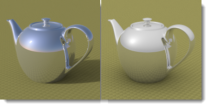

# {: .inline} {{page.title}}
[Sonne](#sun) und [Himmel](#sky) sind eng miteinander verwandt. Die Sonne kann die Helligkeit des Himmels im automatischen Modus ändern. Wenn die Sonne aktiviert ist und es sich beim Himmel um ein HDR-Bild handelt, ist es wichtig, die Intensität der beiden auszubalancieren.

## Sonne
{: #sun}
Die Sonne ist ein starkes, unsichtbares, paralleles Licht. Faktoren, die Bedingungen der realen Welt wie Breiten- und Längengrad, Tageszeit und Jahreszeit simulieren, steuern die Sonnenrichtung und -helligkeit.

Im folgenden Hilfethema wird die Flamingo-Sonnensteuerung beschrieben.  Zur Einstellung der Sonne kann auch die [Rhinoceros-Sonne](http://docs.mcneel.com/rhino/5/help/de-de/commands/sun.htm) verwendet werden.  Flamingo synchronisiert die beiden Sonnensteuerungen.

##### Wo befindet sich die Flamingo-Sonnensteuerung?

Die Sonne kann über die [Beleuchtungsvoreinstellungen](lighting-tab.html#lighting-presets) oder die [benutzerdefinierten Beleuchtungseinstellungen](lighting-tab.html#sun) aktiviert werden.

* {: .inline} Werkzeugleisten >{: .inline} Flamingo nXt
* {: .inline} Menü > Flamingo nXt 5.0 > Bedienfenster anzeigen > Flamingo-nXt-Reiter > Sonne

**Hinweis:** Der Sonnenreiter ist nur dann verfügbar, wenn die Sonne über eine Beleuchtungsvoreinstellung aktiviert wurde.

Zur Berechnung von Sonnenlicht sind Sonnenwinkel erforderlich. Man kann die Richtung der Sonne auf zwei Arten definieren: nach Datum, Zeit und Ort oder durch den direkten Winkel. Verwenden Sie Datum, Zeit und Ort, wenn Sie die echte Sonne in einer Studie zum Standort Ihres Modells simulieren wollen. Der direkte Sonnenwinkel steuert den Lichtwinkel ohne Referenz auf eine echte Sonne. Verwenden Sie den direkten Sonnenwinkel, um Lichteffekte auszuprobieren.

  
*Sydney, Australien, 21. Juni, 9.30 Uhr (links). Stockholm, Schweden, 21. Juni, 9.30 Uhr (rechts).*

### Azimut und Höhe festlegen
{: #set-azimuth-and-altitude}
Verwenden Sie Sonnenwinkel, um die Sonnenrichtung manuell einzustellen. Aktiviert die Steuerungen für [Azimut](#azimuth) und [Höhe](#altitude).

#### Azimut
{: #azimuth}
Zur Einstellung der Richtung der Sonne in Winkelgrad von Norden (0) aus in der horizontalen Ebene.  Die kreisförmige Steuerung zeigt die Welt in einer Planansicht an.

#### Höhe
{: #altitude}
Definiert die Sonnenhöhe am Himmel in Winkelgrad vom Äquator (0) aus.  Die halbkreisförmige Steuerung simuliert einen Schnitt durch die vertikale Richtung der Weltkoordinaten.

### Erdstandort festlegen
{: #set-location-on-earth}
Die Position der Sonne kann basierend auf der Eingabe von Datum, Zeit und Ort automatisch berechnet werden.  **Hinweis:** Die Genauigkeit der Sonnenposition kann wie bei allen automatischen Berechnungen variieren. Wenn eine absolute Genauigkeit nötig ist, wird empfohlen, die Position der Sonne manuell zu überprüfen.  

#### Datum
{: #date}
Definiert das Datum.

#### Zeit
{: #time}
Definiert die lokale Tageszeit.

#### Sommerzeit
{: #daylight-savings-time}
Stellt die Zeit eine Stunde vor.

#### Breitengrad/Längengrad
{: #latitude-longitude}
Der Breiten- und Längengrad kann eingegeben oder mit dem Mauszeiger auf der Karte ausgewählt werden.
Die Zahlen werden dabei aktualisiert, um den Breiten- und Längengrad eines auf der Karte ausgewählten Standorts anzuzeigen.

#### Zeitzone
{: #time-zone}
Zeigt die Zeitzone des aktuellen Standorts basierend auf seinem Breiten- und Längengrad an.

#### Städteliste
{: #city-list}
Durch Auswahl einer Stadt dieser Liste wird diese als aktueller Standort ausgewählt.

#### Karte
{: #map}
Durch Klick auf die Karte wird die entsprechende Position als Standort ausgewählt. Ziehen Sie mit der linken Maustaste, um die Karte zu verschieben.

### Sonnenintensität
{: #sun-intensity}
Ändert die Helligkeit der (direkten) Tageslichtkomponente (Sonne). Die Intensität der Sonne wird automatisch auf Grund von Sonnenwinkeln und Himmelsbedingungen berechnet, kann aber geändert werden, um einen Ausgleich zu anderen Lichtern zu finden.

### Sonnenglanz
{: #sun-highlight}
Intensität des Sonnenglanzes.

*Sonnenglanz=0 (links) und 1 (rechts).*

**Hinweis:** Wenn die Einstellung *Sonnenglanz* verwendet wird, sind manchmal Sonnenglanzartefakte auf Außen-Renderings sichtbar. Stellen Sie den Sonnenglanz auf einen kleineren Wert ein, um diese Artefakte abzuschwächen oder zu entfernen.
{: #speckle-artifacts}



#### Nordrichtung
{: #north}
**Hinweis:** Norden ist die Welt-y-Richtung.

## Himmel
{: #sky}
Der Himmel ist eine große Kugel rund um das Rendering, die zur Beleuchtung verwendet werden kann. Der Himmel ist etwas anderes als eine Umgebung.  Der Himmel wird zur Beleuchtung verwendet. Eine Umgebung steuert hingegen, was im Hintergrund reflektiert und was unsichtbar ist. Es gibt zahlreiche Situationen, in denen Himmel und Umgebung unterschiedlich eingestellt werden können.

#### Wo befindet sich die Flamingo-Himmelssteuerung?
Der Himmel kann über die [Beleuchtungsvoreinstellungen](lighting-tab.html#lighting-presets) oder die [benutzerdefinierten Beleuchtungseinstellungen](lighting-tab.html#sun) aktiviert werden.

 1. {: .inline} Werkzeugleisten >{: .inline} Flamingo nXt
 1. {: .inline} Menü > Flamingo nXt 5.0 > Bedienfenster anzeigen > Flamingo-nXt-Reiter > Himmel

Die vordefinierten Beleuchtungsschemen für Tageslicht [außen](lighting-tab.html#exterior-daylight) und [innen](lighting-tab.html#interior-daylight) verwenden standardmäßig den automatischen Himmel. Die Voreinstellung für [Studiobeleuchtung](lighting-tab.html#studio-lighting) verwendet standardmäßig eine HDR-Bildbeleuchtung.

Für den Himmel gibt es fünf verschiedene Einstellungsmöglichkeiten:

* [Aus](lighting-tab.html#off)
* [Auto](#automatic-sky)
* [High Dynamic Range Image (HDRi)](#high-dynamic-range-image-sky)
* [Farbe](#color-sky)
* [Bild](#image-sky)

Die beiden empfohlenen Himmelsbeleuchtungstypen sind [HDRi](#high-dynamic-range-image-sky) und [Auto](#automatic-sky). Himmel aus HDR-Bildern verwenden ein Bild mit Beleuchtungswerten für jeden Pixel, aus denen Licht und Reflexion abgeleitet werden. Der automatische Himmel verwendet einen Sonnenstandort in der realen Welt und Bewölkung, um einen Himmel zu simulieren.  Mit diesen Optionen können die dynamischsten Renderings erzeugt werden.

### Auto
{: #automatic-sky}
Automatische Himmel verwenden die Einstellungen aus dem [Sonnenreiter](sun-and-sky-tabs.html), um den Farbbereich und die Intensität des Himmelslichts zu bestimmen.  Wenn die Sonne beispielsweise hoch am Himmel steht, sind Beleuchtung und Farben des Himmels anders, als wenn die Sonne niedrig steht.

*Automatischer Himmel: Sonne hoch (links) und tief (rechts) am Himmel.*

#### Bewölkung
{: #sky-cloudiness}
Wenn die Bewölkung deaktiviert ist, werden ein klarer Himmel und starke Schatten erzeugt. Je stärker die Bewölkung, desto weniger Kontrast entsteht zwischen Licht und Schatten. Eine stärkere Bewölkung hat leichtere Schatten und einen ausgeglicheneren Beleuchtungseffekt zur Folge. Die Bewölkung beeinflusst viele Aspekte der Tageslichtberechnung, unter anderem die relative Menge von direkter vs. indirekter Beleuchtung, die Berechnungsart von indirektem Licht und die Hintergrundfarbe, falls der automatische Modus ausgewählt wurde. Für die Bewölkung kann ein Wert zwischen 0 (klar) und 1 (geschlossene Wolkendecke) ausgewählt werden. Für einen dynamischen Effekt werden Werte zwischen 0,35 und 0,50 empfohlen.

*Bewölkung 0 (links) und 1 (rechts).*

#### Himmelsintensität
{: #sky-intensity}
Ändert die Helligkeit der (indirekten) Tageslichtkomponente (Himmel). Die Intensität des Himmelslichts wird automatisch auf Grund von Sonnenwinkeln und Himmelsbedingungen berechnet, kann aber geändert werden. **Hinweis:** Diese Einstellung ist nur wichtig, wenn keine anderen Lichter in der Szene vorhanden sind, die kompensiert werden müssen. Wenn keine anderen Lichter vorhanden sind, kompensiert der Tonregler die Belichtung und das gerenderte Bild wird auf Grund dieser Einstellung weder heller noch dunkler.



### Himmel aus HDR-Bild
{: #high-dynamic-range-image-sky}
Ein [HDR-Bild (High Dynamic Range Image)](https://de.wikipedia.org/wiki/High_Dynamic_Range_Image) ist eine spezielle 2D-Bilddatei. Diese Bilder weisen einen höheren Dynamikumfang pro Pixel auf als Standardbildformate wie JPG oder PNG. Diese zusätzlichen Daten können verwendet werden, um Modelle zu beleuchten. Wenn die Werte im HDR-Bild präzise sind, ist auch die Beleuchtung präzise. Dadurch kann eine sehr dynamische Beleuchtung einer Szene erreicht werden. Das vordefinierte Studiobeleuchtungs-Schema verwendet HDR-Bilder für den Himmel. Sie können sich die Studiobeleuchtung als Innenraum-Szene denken, bei der das HDR-Bild als Decke fungiert, von der Licht in den Farben des Bilds ausgeht. 

*HDRi-Beleuchtung.*

Es wird davon ausgegangen, dass die Leuchtwerte von HDR-Bildern in Watt angegeben sind. Wenn dies nicht der Fall ist, müsste die Intensität der HDR-Bilder angepasst werden, um angemessene Beleuchtungswerte zu erhalten.

Außer für den Himmel kann auch für jeden der drei sichtbaren Hintergrundkanäle ein anderes HDR-Bild verwendet werden: [Sichtbarer](environment-tab.html#advanced-background), [reflektierter](environment-tab.html#advanced-background) und [gebrochener](environment-tab.html#advanced-background) Hintergrund.

#### HDR-Bild
Zur Angabe eines HDR-Bilds (HDR und HDRI entsprechen demselben Dateityp). Klicken Sie auf das Bild, um ein anderes auszuwählen.

*Rektangularprojektion.*

Für HDR-Bilder gibt es zwei Projektionstypen, die festlegen, wie das Bild um die Himmelskugel gespannt wird. Die beliebteste ist die Rektangularprojektion.  Diese Bilder sind rechteckig mit einem Seitenverhältnis von 2:1. Ihre Auflösung ist über das gesamte Bild hinweg ähnlich. Der zweite Projektionstyp ist kugelförmig. Kugelförmige HDR-Bilder haben ein quadratisches Seitenverhältnis und das Bild weist eine hohe Krümmung auf. Bei kugelförmigen Projektionen ist die Auflösung am Rand niedriger.

#### Intensität
Ändert die Helligkeit des HDR-Bildlichts. Diese Einstellung ist nur wichtig, wenn keine anderen Lichter in der Szene vorhanden sind, die kompensiert werden müssen. Wenn keine anderen Lichter vorhanden sind, kompensiert der Tonregler die Belichtung und das gerenderte Bild wird auf Grund dieser Einstellung weder heller noch dunkler.

*Niedrige und hohe HDR-Intensität.*

{: .inline} In der Abbildung wurde das Bild so gedreht, dass die Reflexion der Sonne auf dem Objekt sichtbar ist. Zur Bestimmung der Drehung können Gradwerte eingegeben oder der Drehregler des Widgets interaktiv verschoben werden.

*Gedrehtes Bild. Die Sonne ist auf dem Objekt sichtbar.*

#### Sättigung
Farbsättigung für das Licht. Da das Licht aus einem HDR-Bild der Farbe der Pixel im Bild entspricht, entstehen manchmal unerwünschte Farbeffekte. Stellen Sie die Sättigung auf einen niedrigen Wert ein, wenn Sie nur das Licht ohne die Farbe des Bilds erhalten möchten.

*Niedrige (links) und hohe (rechts) Sättigung.*





### Farbe
{: #color-sky}
Zur Beleuchtung der Szene kann auch eine Farbe oder ein Farbverlauf verwendet werden. Die Farben des Himmels werden mit dem Intensitätswert multipliziert, um ihnen einen Beleuchtungswert zuzuweisen.

#### Intensität
Zur Zuweisung eines Beleuchtungswerts werden die Farben im Himmel mit dem Intensitätswert multipliziert.  Farben können je Kanal einen Wert von 0-255 haben. Dieser wird durch den Intensitätswert multipliziert.

#### Farbtyp
Es gibt drei Möglichkeiten zur Einstellung der Farbe des Himmels.  Diese ähneln den Steuerelementen für die Farbumgebung.  Weitere Informationen finden Sie im Hilfethema zum [Farbhintergrund](environment-tab.html#environment-color-and-gradient-backgrounds).

### Bild
{: #image-sky}
Zur Beleuchtung der Szene kann ein Bild verwendet werden. Zur Zuweisung eines Beleuchtungswerts werden die Farben des Bilds mit dem Intensitätswert multipliziert.

#### Intensität
Zur Zuweisung eines Beleuchtungswerts werden die Farben im Himmel mit dem Intensitätswert multipliziert.  Farben können je Kanal einen Wert von 0-255 haben. Dieser wird durch den Intensitätswert multipliziert.

#### Bildprojektion
Es gibt viele Möglichkeiten zur Einstellung, wie ein Bild auf den Himmel gespannt wird.  Dies geschieht auf eine ähnliche Weise wie beim Bildhintergrund.  Weitere Informationen finden Sie im Hilfethema zum [Farbhintergrund](environment-tab.html#environment-image).