---
---
# Introduction to Flamingo nXt 5
This tutorial shows how to render a standard Rhino model using nXT. This tutorial requires the sample 3DM file to start. You can download the file from this link.

The Tutorial covers the basic steps of rendering with nXt which include:

 1. Opening a model
 1. Creating materials
 1. Editing materials
 1. Adding a ground plane

The first step is to download and unzip the tutorial files. To download the zip file, click on the Fishing Reel.zip link. Unzip these files into their own folder somewhere memorable on your computer. Open the Fishing Reel.3dm file in Rhino. Check that Flamingo nXt is the current renderer in the render drop down menu.

## Render Controls
{: .float-img-right} For your first rendering of the model, click on the render button. Your image should look like the one on the right. nXt works differently than previous versions of Flamingo. A new model in nXt will use a default HDRI lighting set up and will also use a white default material for all objects.

As a render starts, the shadows may start out very sharp and linear. With each pass, the shadows will get softer as they blend together. There are many other effects that will also improve with each render pass. In this way, an nXt rendering is never "finished"; you merely decide when it is good enough to stop. This allows you to let images that are looking good to continue to improve. But you can also stop an image at any time, if you would like to change or save something.

##### Some of the effects that improve on each pass are:
{: .clear-img}

* Lighting (such as global illumination if enabled)
* Soft Shadows
* Reflections (blurry)
* Refraction
* Anti-aliasing
* Depth of field

##### A rendering can stopped in a number of ways:

* Click the Stop Raytrace button to stop the rendering at the end of the current pass.
* Double-click the Stop Raytrace to stop the rendering immediately.
* Click the “X” button in the upper right of the render window to stop the rendering immediately and close the render window.

## Materials
Because basic lighting is already built into nXt, making the right materials is normally where most of the work lies. Materials are stored directly in each model. To create a set of materials, we can use material templates that assist you in creating new materials quickly.

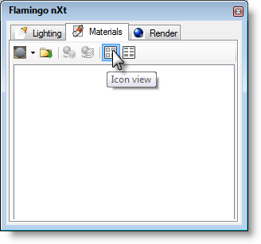{: .float-img-right} Open the Flamingo nXt control panel from the Flamingo nXt drop down menu in Rhino. Then expand the Materials section.

To Make a metal material:{: .clear-img}
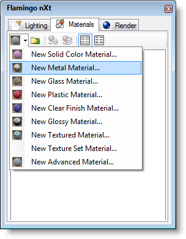{: .float-img-right} First, you will need a metal material. Select the New Metal Material in the templates drop down.

A dialog will pop up with a simplified interface for metal materials. In this case, the default properties will work great for Chrome.
In the material name field, type "Chrome". Press OK to make the material.
You'll now see the new material thumbnail image in the material browser.

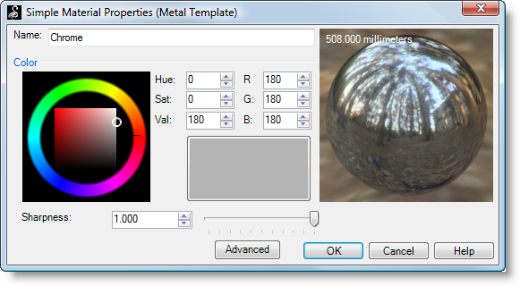
One of the most interesting materials in this model is the gold satin metallic finish at the top of the reel. Here you will start with the New Metal Material template.
Slide the sharpness slider left to 0.150. Also, set the material color to gold as shown.
In the name field, type "Gold Satin Metal" and press OK.

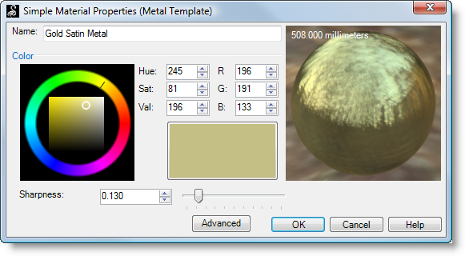
The next material in this model is the anodized aluminum material for the reel spool. Here you will start with the Metal template. But slide the sharpness slider left to 0.110. Also, set the material color to red as shown.
In the name field, type "Red Anodized Aluminum" and press OK.

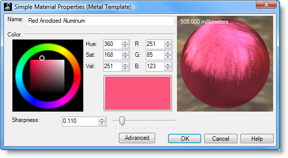

##### To make a plastic material:
Next you will need a black plastic. Select the New Plastic Material in the templates drop down. A dialog will pop up with a simplified interface for plastic materials.
Drag the color to black. The fastest way to do this is to grab the small white dot on the color square and drag it down toward black.
Type in the Name field, "Black Plastic" and press OKto make the material.

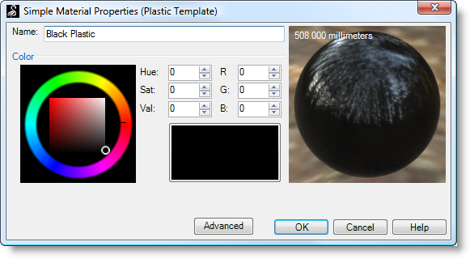
To make a clear finish material:
The red body color of the reel is a Clear finish material. This is a car paint style material. Select the New Clear Finish Material in the templates drop down.
Drag the color to a bright red. Notice that with this material we only have to select the color.
In the name field, type "Red Clear Finish" and press OK.

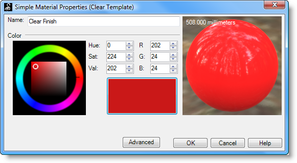
To make a rubber material:
The next material you will make for the reel is a black rubber. Rubber is slightly reflective; you can simulate this with a New Glossy Material.
Select the black diffuse color as shown.
In the name field, type "Black Rubber"and press OK.

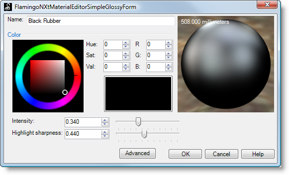

To make textured materials:
The next material you will make for the rod handle is cork. For the cork material we will use a texture. Select a New Textured Material. Here you are prompted to pick a texture.
Navigate to the directory that you created when you unzipped the tutorials files and select the Cork.jpg and click Open. You can see you have a simple textured material. The tile size of the bitmap is often important. In this case we will accept the default tiling.
In the name field, type "Cork"and press OK.

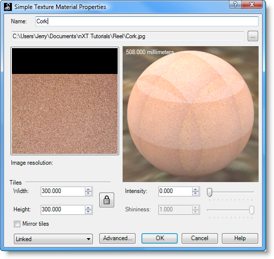
The last material in this model is a wood material that we will use later for a ground plane. Wood materials are best done with an image or photograph of wood. To create the wood material, select a New Textured Material.
Open the DeckWood.png file.
In the name field, type "Deck Wood" and press OK.

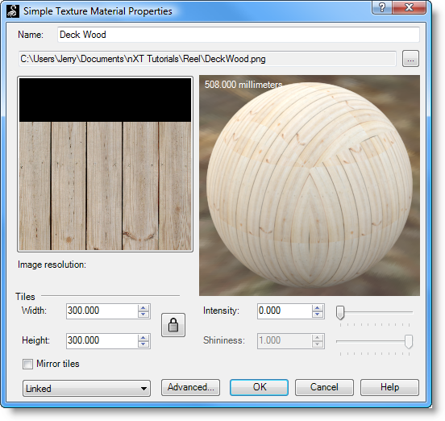

Your material browser panel should look like this:

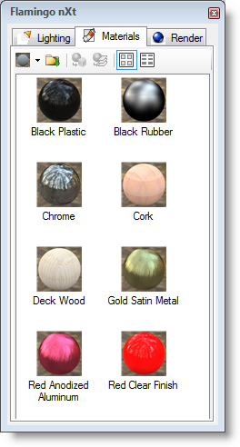
To assign the materials to a layer: Now you will assign these materials to the model. In this case, we will assign the materials to the layers in the model. This means all objects on those layers will use the render material assigned.

 1. Open the layers dialog.
 1. Drag the material swatch from the material panel over the name for the layer and drop. You should see the name of the material show up in the column just past the layer color square.

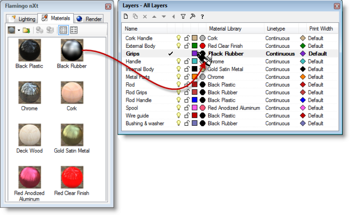

 1. Once you've assigned all the materials click the Render button.
Flamingo nXt will take multiple passes at an image. With each pass many subtle effects will continue to improve.

Look at the Gold Satin material on the top of the reel. You will see the reflections are pronounced and sharp at first. As the passes progress, you will see the reflections continue to blur creating the satin effect. The longer you let nXt render, the more detailed this material quality will become.

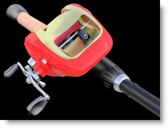
We're getting closer to the final rendering and just need to add a few more details. Next, you will add a ground plane.

## To turn on the Ground plane:
Open the Render panel. Check the Ground planecheck box.

Press the Renderbutton again.

By default, nXt uses a grey ground plane. Here again you can see the multi-pass rendering in action.

In the first passes, you will see that the shadows are sharp and that there are many shadows going in multiple directions. As the passes progress, the shadows will get softer and softer. Soft shadows are automatic in nXt, but they do take multiple passes to generate. So, when you are rendering your own images, do not be alarmed at the multiple shadows on the first few passes.

The grey ground plane is OK, but you’ll see a difference when you use the wood deck material you created for the reel to sit on.
In the Render panel, assign the wood deck material to the ground plane. Do this by clicking on the Material button...in the ground plane section of the nXt control panel. Browse to select your textured material.

Press the Render button again.

This render's already looking pretty good, but for small objects adding Depth of Field will add increase realism. This will make the foreground and background out of focus and draw attention towards the model itself.

## Enable depth of field:
In the Render panel, Depth of Field section, click the Enabledcheck box.

The focal distance and strength of depth of field is critical.

To set the Focal distance, click on the ... button.
In the perspective view, snap to a point on the reel. This selects the focal point from the camera to the object in the scene.
Then set the Strength between the first and second lines. You can see in the image above an example of where the slider should be.
Press the Render button again.
You should see an image that is similar to this:

This is the end of the tutorial. I hope you find this helpful.
