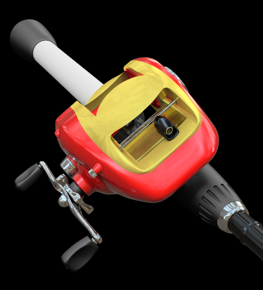
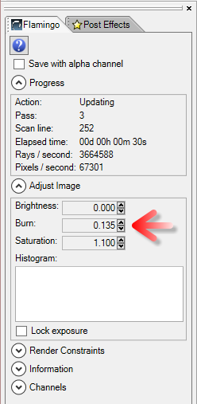
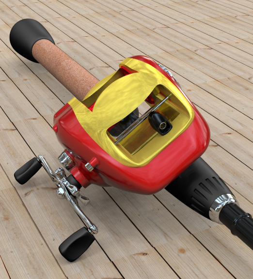

<!-- TODO: Make sure to update this page and get working in the guides section of the documentation. -->

# {{page.title}}
This tutorial shows how to render a standard Rhino model using nXt. The Tutorial covers the basic steps of rendering with nXt which include:

1. Opening a model
1. Creating materials
1. Editing materials
1. Adding a ground plane

The first step is to download and unzip the tutorial files. To download the zip file, click on the [Fishing Reel.zip](files/Mulinello.zip) link. Unzip these files into their own folder somewhere memorable on your computer. Open the Fishing Reel.3dm file in Rhino. Check that Flamingo nXt is the current renderer in the render drop down menu.

## Check the current render engine
{: #check-current}
Rhino may have multiple render engines installed.  To check that Flamingo nXt 5 is the current render engine, go to the Render Pulldown > Current Renderer > Flamingo nXt 5.  If there is a checkmark next to Flamingo nXt 5, then it is the current render engine.

## Render Process
{: #render_controls}
{: .float-img-right} For your first rendering of the model, click on the render button. Your image should look like the one on the right. nXt works differently than previous versions of Flamingo. A new model will include a default HDRI light set-up.  New models will use a white default material for all objects. Also, you may notice that shadows start out very sharp and linear. With each pass, the shadows will get softer as they blend together. There are many other effects that will also improve with each render pass.

Some of the effects that improve on each pass are

* Lighting (such as global illumination if enabled)
* Soft Shadows
* Reflections (blurry)
* Refraction
* Anti-aliasing
* Depth of field

In this way, an nXt rendering is never "finished"; you merely decide when it is good enough to stop. This allows you to let images that are looking good to continue to improve. But you can also stop an image at any time, if you would like to change or save something. You can stop the rendering in a number of ways:
{: .clear-img}

* Click the Stop Raytrace button to stop the rendering at the end of the current pass.
* Double-click the Stop Raytrace to stop the rendering immediately.
* Click the “X” button in the upper right of the render window to stop the rendering immediately and close the render window.

## Assign Materials from the Library
{: #materials}
Basic lighting is already built into nXt, so making the right materials is normally where most the setup of renderings start. Materials are stored directly in each model. To create a set of materials, we can use material templates that assist you in creating new materials quickly.

  1. Open the Flamingo nXt control panel from the Flamingo nXt drop down menu in Rhino.
  1. To Assign an existing material. Go to the Library Tab in the Control Panel.
  1. Materials are organized in folders. Go to the Flamingo Materials folder.
  
  1. Go to the Flamingo Materials > Metals Folder.
  {: .wide-img}
  1. Drag and drop the Chrome material onto the Handle and Metal Parts layer.
  1. Render the results. The parts that lie on the Handle and Metal Parts layer now render with a Chrome finish.
  
  1. Now assign the rest of these materials to these layers:

 | Library | Material | Layer |
 |:-------|:------|:------|
 | Marine | Black Rubber | Bushing & Washer |
 | Marine | Black Rubber | Grips |
 | Marine | Black Rubber | Rod Grips |
 | Car Paint | Car Paint Red | External Body |
 | Metals > Gold | Gold Satin-Plain | Internal Body |
 | Metal > Anodized | Aluminum - Anodized Red | Spool |
 | Plastic > Black > Smooth | Plastic Black - Smooth | Rod |
 | Plastic > Black > Smooth | Plastic Black - Smooth | Rod Handle |
 | Plastic > Black > Smooth | Plastic Black - Smooth | Wire Guide |
{: .grided-table}

##### Render to see these results:
 

## Create new material
{: #new-material}
Often you will need a material that is not pre-made in the Library. For instance the handle of the fishing rod should be covered with cork. Creating a new material is the only option. For the cork material we will create a new texture material type.

 1. Go to the Materials tab.
 1. Scroll down to the bottom of the material list.
 1. Select the New Material button (plus symbol)
  
 1. Select a new Flamingo Textured material.
 1. Here you are prompted to pick a texture.
 1. Navigate to the directory that you created when you unzipped the tutorials files and select the Cork.jpg and click Open.
 1. You can see you have a simple textured material. The tile size of the bitmap is often important. To change the tile size, click on the bitmap name.

 1. Adjust the tile size of 100 in width.

 1. In the name field, type "Cork"and press OK.

 1. Once created, assign the Cork material the the Cork Handle layer by dragging the material over the layer.

## Turn on the Groundplane
{: #groundplane}
Adding a groundplane can help set the object into a scene.

1. Go to the Groundplane panel.  If it is not visible, right-click on another panel tab and select Ground Plane
1. Click on the Enable to activate the groundplane.  In this case we will use the default ground plane height.
1. In this case, a new material for the groundplane needs to be created. Scroll to the bottom of the materials list, click on the plus symbol.

1. Select a new Flamingo Textured material.
1. Here you are prompted to pick a texture.
1. Navigate to the directory that you created when you unzipped the tutorials files and select the Deckwood.jpg and click Open.
1. You can see you have a simple textured material. The tile size of the bitmap is often important. To change the tile size, click on the bitmap name.
1. Adjust the tile size of 125 in width.
1. In the name field, type "Floor"and press OK.
1. The render should look like this

## Rendering Image Adjustment
{: #image-adjust}
Adjusting the rendered image after rendering is very important to getting the most out of Flamingo. This can be done real-time before saving the image. Many times it is reccomended to add a little burn and perhaps a little brightness.

1. In the render Window go to the Flamingo tab.
1. Make sure the rendering is Stopped by clicking on the Stop icon.
1. Under Adjust Image, change Burn to 0.1
1. Under Adjust Image, change Brightness to 0.1

1. The result should look like this:

*Notice the brighter whites (Burn) and the overall brightness (brightness) of the image.  The Burn is especially effective in producing a more dynamic image.*

This is the end of the tutorial. I hope you find this helpful.
