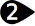
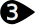
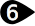

#  {{page.title}}
{: #environment-tab}
Environments are not only what can be seen in the background of a rendering, but control an infinite sphere surrounding the model. Objects within the scene will reflect and refract the environment. The environment sphere is not an object that you can select, but a reference surface for background effects.

The Environment affects the visible part of the background and reflections.  For effects that affect lighting the scene, see the [Sky](sun-and-sky.html) help topic.

Flamingo comes with a special environment called *[Default Flamingo Environment](environment.html)*.  This environment will sync to the current [Lighting Preset](lighting-tab.html). By using [Lighting presets](lighting-tab.html), both the Lighting and environment will be set to appropriate scene defaults.

{:  #panel_map height="600px" style="float: right"}

##### Where can I find this command?
 1. Environment Tab
 1. Render Tools Toolbars >  Environment Editor
 1. Menus > Render Pulldown > Environments Editor
 1. Command > EnvironmentEditor

The Environment Editor Panel is split into discrete sections.  Based on the environment type, the advanced panels may vary.

Colors and textures can be dragged from the color swatch and dropped onto any other color swatch or control in the Material Editor, [Texture Palette](texturepalette.html), or [Environment Editor](environmenteditor.html).
Environment Panel

 1. [Background Type](#type)
 1. [Settings Bar](#settings)
 1. [Environment List](#environment_list)
 1. [Window Divider](#divider)
 1. [Environment Properties Section](#properties)
 1. [Name](#name)
 1. [Environment Property Panels](#panels)

## [Background Type](#panel_map) 
{: #type style="clear: both;"}
Select the type of background for the model.  [Environment](#flamingo-environment) is an all inclusive rendering environment and should be the default setting for Flamingo.  The other three settings present a much more simplified set of settings that reflect older ways of defining backgrounds. For more information see the [Rhinoceros Simple Background](http://docs.mcneel.com/rhino/5/help/en-us/commands/environmenteditor.htm#Basic_settings) topic

The reset of this help topic covers the Environment type.

## [Settings Bar](#panel_map) 
{: #settings}
Use this bar to help navigate the Environment list.

####  Back Arrow
Walks back through the current environment or the previously selected environments.  For instance an environment with reflective or refractive layers.  Use this arrow to get back to the parent environment from the reflection or refraction details.

####   Forward Arrow
Walks forward through the previously selected environments.  For instance an environment with reflective or refractive layers.  Use this arrow to get forward to the parent environment from the reflection or refraction details.

####  Currently selected environment name
Displays the current environment name and edit level.  For instance, if there is a reflective or refractive level a ">" is shown. A good place to see where the environment is current.

####  Tools Menu
Displays the [Tools menu](#tools-menu).  This is an extensive menu of commands, settings and utilities related to environments.

####  Help

## [Environment List](#panel_map) 
{: #environment_list}
This lists all the environments contained in the model. One Environment will be selected as the current environment. The current environment is used in the rendering. Yellow corners will show up surrounding the current Environment.

From this list:

* Click on an Environment to make it current. Once selected the environment's properties will show in the panels below. See [Render Materials Properties](#properties) for more information
* Scroll up and down in the list to see all the environments in the model.
* Drag and drop an environment from this list onto any viewport to set it current.
* Add a new Environment using the Add New Button  at the bottom of the list.
* Right-click a thumbnail to display the Environment context menu
* Right-click the blank area to display the New Environment Context Menu

###   Add new environment
{: #add_environment}
Scroll down to the bottom of the Environment list to see the add icon.

Opens the Render Content [library](libraries.html) of environments.
The environments in the library act as templates for creating environments in the model.

### Environment Context Menu
{: environment_context}
This menu is available by right click on a environment listing.  See the [Tools Menu](#tools_menu) for details on the many options in this menu.

### New Environment Context Menu
{: new_envrionment_context}
This menu is available by right-clicking on a blank area of the Environment List.

####  Create New Environment
Creates a new Flamingo Environment.

####  Import Environment from File...
Use this command to select a previously exported Environment.

####  Paste
Creates a new environment based on the contents of the Clipboard.

####  Paste as Instance
Creates a new environment based on the contents of the Clipboard that is linked to the original through instancing.

####  Grid
Displays the previews as a grid of thumbnails.

####  List
Displays the previews as a list of thumbnails.

####  Tree
Displays the previews as a tree showing nesting.

####  Horizontal Layout
Displays the previews to the left of the controls.

####  Show Preview Pane
Displays the preview properties for the currently-selected thumbnail. Set the preview geometry, size, background, rotation behavior.

####  Float
Floats the preview image in a re-sizable window.

#### Thumbnails

#####  Small
Sets the thumbnail size to the smallest size.

#####  Medium
Sets the thumbnail size to medium size.

#####  Large
Sets the thumbnail size to large size.

#####  Show Labels
Displays thumbnail name labels when in Grid mode.
List mode always displays labels.

#####  Show Units
Displays size in model units.

#####  Auto-Update Preview
Automatically updates all previews as settings change.

#####  Update All Previews
Update previews manually when Auto-Update Preview is off.

## [Window Divider](#panel_map) 
{: #divider}
Drag on this divider to change the length of the Environment List versus the length of the Environment Properties Section.

## [Environment Properties Section](#panel_map) 
{: #properties}

### [Environment Name](#panel_map) 
{: #name}
This is the name of the environment. The environment name is also saved as the file name when exporting the environment to the library. **Note:** Environments are stored in the Rhino model, unique environments can have the same name in different Rhino models.

### [Environment Panels](l#panel_map) 
{: #panels}
The Environment Properties section is filled with a number of direct Environment panels. Clicking on the grey title bar will rollup the environment panel, hiding the contents of that panel.  Click on the title bar again to show contents.

Environment Panels will vary based on the type of environment and the current active environment level. For more information on specific environment panels see [Flamingo Environment](environment.html)

## Tools Menu 
{: tools_menu}
These settings also appear on right-click context menus for the thumbnail previews and the thumbnail background.

####  Set as Current Environment
This sets the target environment current.  The current environment will be used in the next rendering.

####  Create New Environment
Creates a new Flamingo Environment.
<!-- This comes from the page http://docs.mcneel.com/rhino/5/help/en-us/popup_moreinformation/materialthumbnail_contextmenu.htm -->
These settings also appear on right-click context menus for the thumbnail previews and the thumbnail background.

####  Import Environment from File
Imports environments from a saved Rhino .renv file.

####  Save to File
Saves an environment to a Rhino .renv file.

####  Change Type
Changes the environment to a different type.

####  Change Type (Copy Similar Settings)
Changes the environment to a different type.
The default behavior depends on the current state of the [Rendering Options](http://docs.mcneel.com/rhino/5/help/en-us/options/rendering.htm) >  [Copy similar settings when content type is changed](http://docs.mcneel.com/rhino/5/help/en-us/options/rendering.htm#Copy_similar_settings_when_content_type_is_changed)  box. If checked, compatible settings from the old content will be copied to the new one.

####  Reset to Defaults
Changes all the environment settings to the default Solid color background (Black), reflected background, Sky and Refracted Background visible.

####  Copy
Copies the selected environment to the Windows Clipboard. The Clipboard can then be pasted into the editor to create a new environment or pasted directly into a folder to create a [library](libraries.html) file.

####  Paste
Creates a new environment based on the contents of the Clipboard.

####  Paste as Instance
Creates a new environment based on the contents of the Clipboard that is linked to the original through instancing.

####  Delete
Deletes the selected environment.

####  Rename...
Renames the selected environment.

####  Duplicate
Copies the selected environment to a new environment with the same settings.

####  Remove Instancing
Removes the connection between [instanced](#paste-as-instance) environments.



####  Content Filter
Opens the [Content Filters](content_filters.html) dialog box.

####  Properties
Opens the [Preview Properties](previewproperties.html) dialog box.
