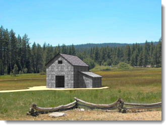
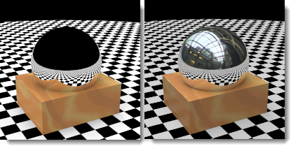

#  {{page.title}}
There are many types of [environments in Rhino](http://docs.mcneel.com/rhino/5/help/en-us/commands/environmenteditor.htm). This topic will address the Flamingo Environment type.

The Environment affects the visible part of the background and reflections.  For effects that affect lighting the scene, see the [Sky](sun-and-sky-tabs.html) help topic.

Flamingo comes with a special environment called **Default Flamingo Environment**.  This environment will sync to the current [Lighting Preset](lighting-tab.html). By using [lighting presets](lighting-tab.html), both the Lighting and Environment will be set to appropriate scene defaults.

The complete set of property groups in the Flamingo Environment are:

> [Name](#name)
> [Flamingo Environment](#environment)
> [Background Color](#color-backgrounds)
> [Advanced Background](#advanced-background-reflected-sky)

## Environment Name
{: #name}
This is the name of the environment in the Rhino model.  Environments are stored in the Rhino model. That means that the same name in the library or a different model will not be affected by edits to the environment in the current model. To use any environment in another model it must be exported to the [Library](libraries.html) first. The Name of the environment will also serve as its exported file name.

## Flamingo Environment
{: #environment}
There are three major effects of environment in a rendering:

>Visible Background
>[Reflective Background](#advanced-background-reflected-sky)
>[Refractive Background](#advanced-background-refracted-sky)

The Visible Background is the basic background color of the scene.  The visible background is in the general properties panel. The [Reflective](#advanced-background-reflected-sky) and [Refractive](#advanced-background-refracted-sky) backgrounds can differ and are available in the Advanced Background section.

#### Intensity
{: #background-intensity}
Modifies the relative brightness of the background. The Intensity value is used to multiply the colors in the background and result in a lighting value.  Colors can range from 0 - 255 per channel. Intensity will multiply those values.  This becomes important if the background looks very dark compared to the rendered model.

#### Background type
{: #background-type}
Specifies the color scheme that will fill the background of the rendered image. Backgrounds can be the following types:

> [Sky](#environment-sky)
> [Solid and gradient color](#color-backgrounds)
> [Image](#environment-image)
> [HDR and planar HDR images](#hdr-background)

## Sky Background
{: #environment-sky}
The Sky environment uses the sun and sky settings from the [Lighting](lighting-tab.html) tabs for settings.  It is the default setting for the renderings that see the sky in the renderings.

*Automatic (left) and HDR image and sun (right).*

## Color Background
{: #color-backgrounds}
Background color controls are always present. There is always a color background even if the color is completely obscured by an image, HDRi, or Sky background.

#### Solid Color
{: #solid-color}
A solid color background consists of a single color that fills the background.

*Solid color background.*
See [Color Controls](#enviroment-sky-color-controls) below for more details on editing the Solid Color.

#### Two-Color Gradient
{: #two-color-gradient}
Two- and three-color gradient backgrounds only apply to perspective views. Two-color gradient backgrounds interpolate the background color between two selected colors.

*Two-color gradient background: blue and yellow.*
See [Color Controls](#enviroment-sky-color-controls) below for more details on editing a two-color gradient.

#### Three-Color Gradient
{: #three-color-gradient}
Three-color gradient backgrounds interpolate the background color between three selected colors.

*Three-color gradient background: blue, white, yellow.*
See [Color Controls](#enviroment-sky-color-controls) below for more details on editing the Three-color Gradient.

### Color controls
{: #enviroment-sky-color-controls}
The number of controls available may change based on the Color Background type that is currently selected. Gradient backgrounds will have up to three color selectors that may include a top, middle, and bottom color.



#### Swap Colors
Use this button to rearrange the color in the gradient from top to bottom.

#### Gradient mapping control
{: #gradient-mapping}
The colors in a gradient color background need to be mapped to the environment sphere. Use the Gradient mapper to do this.  The Gradient mapping controls will activate only when a two- or three-color gradient is selected. Gradients can only be mapped to perspective views.

#### Angles from View
{: #angle-from-views}
If Angles from View is checked, the current color gradient syncs with the current rendered perspective view.  The top color will map to the top of the view and the bottom color will map to the bottom of the view.  All other colors will evenly distribute between those extremes.

#### View Altitude Mapper
{: #colorrange}
If the current viewport is a perspective projection, the top and bottom colors and the extents of the gradient relative to the view can be controlled.

{: style="float: left; padding-right: 25px;padding-bottom: 15px;padding-top:15px;"}

* The control shows the environment in section view.  The 90 degree marker is the Z-up coordinate. The 0 coordinate represents the horizontal ground plane. The -90 degree marker is the Z-down coordinate.
* The grey cone of vision shows the last coordinates of the current perspective view.
* The Red arrow represents the location of the top color. At this angle and above will be the top color.
* The Green double-arrow represents the middle of the gradient blend between the top and bottom colors.  If it is a three color gradient this is also the location of the middle color.
* The Blue arrow represents the location of the bottom color.  Below this angle there will only be bottom color.

####  Get angles from View Button
Use this button to reset the Gradient mapping control to the current perspective view coordinates.

#### Top/Middle/Bottom Angles
These are angle readouts of the Top, Middle, and Bottom colors in the current gradients.  They correspond to the location of the Red, Green, and Blue arrows in the View altitude mapper.

## Image Background
{: #environment-image}

A background image is projected onto the background. Many times this is used to place a model in an existing context or set a view out some windows. A photograph, a scanned artwork, or an image created with an paint program may be used as the image. For best results, use high-resolution images for background images. It is also a good idea to blur and lighten sharp images to simulate natural focus and aerial perspective. The background image can be mapped to the background in a planar, cylindrical, or spherical projection into the scene.

*A planar image set as a background.*

### Image File
{: #image-properties}
Set the background image by clicking on the large button that reads *(empty - click here to assign)*, then select a bitmap.  To assign a different image, click on the button thumbnail image.

### Projection
{: #backgroud-image-projection}
Select one of three image projections from the drop-down control:

>[Planar](#planar)
>[Cylindrical](#cylindrical)
>[Spherical](#spherical)

Each projection method has its own set of controls for positioning the image.

<!-- TODO: The hierarchy of the following section is inconsistent. "Planar Projection", "Cylindrical Projection" and "Spherical Projection" should be parent elements of the  respective following topics like "Angle from View", "Image Placement Control" etc. -->

#### Planar Projection
{: #planar}
Projects the image to a flat background in the current view. The planar projection coordinates are always relative to the current view.

#### Angle from view
The angle from view checkbox will keep the image in sync with the current view.  This will stretch the image to fit the current view.

#### Image Placement Control
Use the placement control to place the image relative to the current view. The viewport shape shows up as a dark grey rectangle. Drag the pink rectangle or use the numerical controls to move or scale the background image relative the view.

*Current viewport area (1), image size and shape (2).*

#### X Scale / Y Scale
Specifies the size of the background image in the 0 - 1.0 scale of the view width and height. For instance a value of 1.0 is 100% of the view size, a value of 0.5 is 50 % of the view width, etc...

#### X Offset / Y Offset
Specifies the offset of the background image from the lower left corner of the viewport in a 0 - 1.0 scale of the view width and height. For instance a value of 0.25 is offset 25% of the view size, a value of 0.5 is 50 % of the view width, etc...

#### Image Placement Control
Use the placement control to place the image relative the to current view. The viewport shape shows up as a dark grey rectangle. Drag the pink rectangle or use the numerical controls to move or scale the background image relative the view.

*Current viewport area (1), image size and shape (2).*

#### X Scale / Y Scale
Specifies the size of the background image in the 0 - 1.0 scale of the view width and height. For instance a value of 1.0 is 100% of the view size, a value of 0.5 is 50 % of the view width, etc...

#### X Offset / Y Offset
Specifies the offset of the background image from the lower left corner of the viewport in a 0 - 1.0 scale of the view width and height. For instance a value of 0.25 is offset 25% of the view size, a value of 0.5 is 50 % of the view width, etc...

#### Cylindrical Projection
{: #cylindrical}
Cylindrical projection maps the image to an imaginary cylinder that surrounds the model. While this projection works best with true cylindrical images, it can also be used effectively with standard panoramas built from photographs.

Specify the size and position of the image map in height and width angles. Use the graphical tools and the mouse to position and size the image. The current cone of vision is displayed in the graphic as a light gray shaded region.

#### Angle from view
The angle from view checkbox will keep the image in sync with the current view.  This will stretch the image to fit the current view.

#### Plan control
Specifies the angular width of the image map. Enter an angle or drag the flags in the control widget to set the width. The blue area indicates the extents of the angular width.

{: .float-img-left}
<!--TODO: Image doesn't show up in file. -->

* The control shows the environment in plan view.
* The dark grey cone of vision shows the last coordinates in the current perspective view.
* The blue cone shows the range of angles the image will be visible.
* The blue arrow represents the left coordinate of the image map.
* The red dot represents the middle of the background image.
* The purple arrow represents the right coordinate of the image map.

#### Vertical control
{: .clear-img}
Specifies the vertical extents of the cylindrical projection. Enter an angle or drag the flags in the control widget to set the top and bottom angles. The cylindrical projection is limited to 45 degrees above or below the horizon.

{: .float-img-left}

* The control shows the cylinder in section view.
* The grey cone of vision shows the last coordinates in the current perspective view.
* The blue arrow represents the bottom border of the image map.
* The red arrow represents the top border of the image map.

#### Rotation
{: .clear-img}
Specifies the image rotation. The red dot indicates the center of the image.

#### Width
Specifies the width of the image in degrees relative the the plan view.

#### Top/Bottom
Specifies the vertical angles of the image based on horizontal groundplane direction in the model.

####  Get Angles From View button
Sets the rotation angle to match the current perspective viewport.  Good for resetting the values of the projection.

#### Spherical Projection
{: #spherical}
Spherical projection maps the image to a complete sphere. This method generally produces good results only if with an equirectangular spherical image is used.  An equirectangular image has an aspect ratio of a 2:1 rectangle.

#### Angle from view
The angle from view checkbox will keep the image in sync with the current view.  This will stretch the image to fit the current view.

#### Spherical control
Specifies the direction of the image map. Enter an angle or drag the flag in the control widget to set the width. The red dot represents the middle of the background image.

#### Rotation
{: .clear-img}
Specifies the image rotation. The red dot indicates the center of the image.

####  Get Angles From View button
Sets the rotation angle to match the current perspective viewport.  Good for resetting the values of the projection.

## HDRi Background
{: #hdr-background}
Using an HDR image as an environment allows more control over the relationship between the light in the background and other light in the image. This is especially useful for depicting an interior space with a bright exterior space showing through a window. An HDR environment image has more range of light than a normal bitmap image and can be assigned a channel so the contrast can be managed in a [multi-channel](lights-tab.html#channel) rendering.

#### Image File
{: #hdri-image}
Set the background HDRi image by clicking on the large button that reads *(empty - click here to assign)*, then select a bitmap.  To assign a different image, click on the button thumbnail image.






## Planar HDRi options
{: #planar-hdr-options}

Planar high-dynamic-range images are seldom used, but can be very useful.  And HDRi provides a wider range of color possibilities. A good use of planar HDRi files is used outside windows in architectural renderings where the background may be too light or too dark.  Planer HDRi files are always mapped planar.

*Background image (left) and Planar HDR (right) shows subtle lighting difference in background.*

#### Image File
{: #hdri-planar-image}
Set the background HDRI image by clicking on the large button that reads *(empty - click here to assign)*, then select a bitmap.  To assign a different image, click on the button thumbnail image.



## Advanced Background
{: #advanced-background}
The Advanced Background settings control environments that are not visible in the rendering, but show in reflections and refractions for the objects. This lets the visible environment look one way, while reflections and refractions might be reacting to a different environment.  For instance, in the illustration below the background is black, but the reflected environment is an HDR image of a building interior.

*Normal environment (left) and reflected HDR sky environment (right).*

### Reflected
{: #advanced-background-reflected-sky}
A reflected environment is not visible in the rendered image, but it reflects in shiny objects.

#### Sky
Objects reflect the sky as specified in the [Lighting: Sun and Sky](sun-and-sky-tabs.html) settings.

#### Custom
Objects reflect a [Color or gradient](#color-backgrounds), [Image](#environment-image), or [HDR](#hdr-background) background.

#### Visible Background
Objects reflect the visible background as specified in the [Environment](environment-tab.html) settings.

### Refracted
{: #advanced-background-refracted-sky}

#### Sky
Objects refract the sky as specified in the [Lighting: Sun and Sky](sun-and-sky-tabs.html) settings.

#### Custom
Objects refract a [Color or gradient](#color-and-gradient-backgrounds), [Image](#image), or [HDR](#hdr-background) background.

#### Visible Background
Objects refract the visible background as specified in the [Environment](environment-tab.html) settings.

#### No Transparent Object Alpha
{: #no-transparent-alpha-objects}
Prevents seeing alpha channel through transparent objects and will prevent alpha channel compositing through transparent objects.
If images will be pasted into the alpha channel, turn this setting off.
