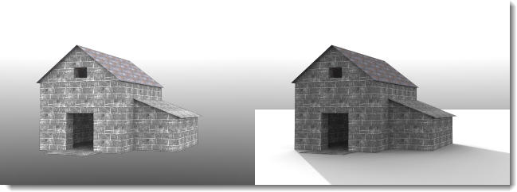

---
title: Ground plane
---

# {{page.title}}
{: #ground-plane}

The ground plane provides an infinite horizontal platform for the image that stretches to the horizon in all directions positioned at a defined elevation. The ground plane renders much faster than using a large planar surface as a base.

### Enabled
{: #groundplane-enabled}
Turns the ground plane on.

*Ground plane disabled (left) and enabled (right).*

### Alpha
{: #groundplane-alpha}
Applies a transparent alpha channel to the ground plane so the image can be composited with the cast shadow into another image. See: [Wikipedia article: Alpha compositing](http://en.wikipedia.org/wiki/Alpha_compositing).

 *Ground plane shows shadow, but is otherwise transparent in the image.*

### Elevation
{: #groundplane-elevation}
Specifies the ground plane's height above zero.

*Ground plane elevation above zero.*

### Material
{: #groundplane-material}
Assigns a [material](simple-material-properties.html) to the ground plane.

*Ground plane with raised elevation and water material.*
