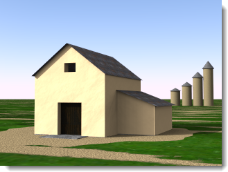
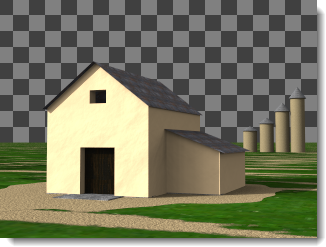
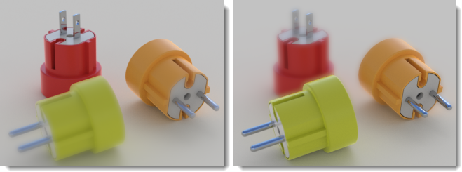

# {{page.title}}
The nXt Image Editor can edit native image files (.nXtImage) produced by any of the nXt platforms. These native files retain all of the information gathered during rendering.
By using the nXt Image Editor, you can:
<!-- TODO: This page needs to be updated.  One of the last we will work on. The image editor is not used much.-->

>Adjust the [tone operator](image-editor.html#tone-mapping) settings.
>Change the intensity of any lighting channel.
>Add special image-based effects: [Haze](image-editor.html#haze), [Depth Blur](image-editor.html#depth-blur), and [Glare](image-editor.html#glare).
> [Save](image-editor.html#save-tonemapped-image-as) a tone-mapped image in a bitmap format such as .jpg or .png.
>Save the luminance information to an [HDR format](image-editor.html#save-hdr-image-as).
>View and save additional masked channels ( [alpha](image-editor.html#alpha-channel), [distance](image-editor.html#distance-channel), [material](image-editor.html#material-channel) ) for use in advanced compositing.
>Save a [Piranesi©](http://www.piranesi.co.uk/) file format (*.epx) which can be used to create non photorealistic rendering.
>Use Image [Arithmetic](image-editor.html#arithmetic) for tasks such as stitching together an image that has been generated by separate nodes on the render farm.
>Save the [Lighting Settings](image-editor.html#save-lighting-settings-as) used to generate this rendering. These Lighting Settings can then be used to generate more renderings.

To launch the editor

>On the **Flamingo nXt 5.0** menu, click **More Tools &gt; Flamingo nXt Image Editor**.

## File menu
{: #file-menu}

### Open
Opens a file saved in nXtImage format for editing.

### Save Source Image
Saves the nXtImage file.

### Save Source Image As
Saves the nXtImage file under a different name.

### Save Tonemapped Image As
{: #save-tonemapped-image-as}
Saves the edited image as a bitmap image file.

>JPEG (.jpg)
>TIFF (.tif)
>TIFF with Alpha Channel (.tif)
>PNG (.png)
>PNG with Alpha Channel (.png)
> [Piranesi EPix file (.epx)](http://www.piranesi.co.uk/)

Piranesi is a 3-D painting tool that creates images with a hand-painted appearance.

### Save HDR Image As
{: #save-hdr-image-as}
HDR File (.hdr)
EXR File (.exr)
EXR with Alpha Channel (.exr)

### Save Mask
{: #save-mask}
nXtImage files contain three additional channels that can be used as masks for advanced compositing in most bitmap editors. These channels carry alpha, distance, and material information for each pixel, encoded in a gray-scale image. Each channel can be viewed and saved to a .png file.

## Notes:

>The alpha channel can be included with a tone-mapped image by selecting a file format with Alpha when saving a tone-mapped image.
>Distance and Materials channels are not antialiased and may show some hard-edged artifacts. Adding a small amount of Gaussian blur to a mask before using it may help soften these edges.
>The Materials channel will only uniquely encode 255 different materials. If your model contains more materials than that, some mask colors will repeat.

#### Materials Channel
{: #material-channel}
Saves the material channel mask.

#### Alpha Channel
{: #alpha-channel}
Saves the alpha channel mask.

#### Distance Channel
{: #distance-channel}
Saves the distance channel mask.

### Save Lighting Settings As
{: #save-lighting-settings-as}
Saves the [lighting scheme](lighting-tab.html#open-lighting-scheme).

## Image menu
{: #renderwindowimage}

### Info
{: #info}
Displays information about the image.

### Arithmetic
{: #arithmetic}
Allows piecing together or overlaying segments of images rendered using the [Render Farm Single Image](automate-rendering.html#single-images) function.

To piece image segments
1. On the **File** menu, click **Open**.
Select the first image of the sequence, for example, 000000.nXtImage.
1. On the **Image** menu, click **Arithmetic**, and then click **Add**.
1. Select all of the other images in the sequence.
 **Note:** Do not select the first image (000000.nXtImage) again or it will be added twice.

#### Add
Adds pixel values of one layer to the other. When values are above 255 (in the case of RGB), white is displayed.

#### Subtract
Subtracts pixel values of one layer from the other. When values are negative, black is displayed.

#### Difference
Subtracts the top layer from the bottom layer or the other way round, to always get a positive value. Blending with black produces no change, as values for all colors are 0. Blending with white inverts the picture.

#### Masked Add
Takes the transparent alpha-channel mask into account when blending.

#### Combine Path Tracings
Combines images rendered using the Path Tracer engine so that, for example, when you combine ten images rendered with 20 passes each becomes the equivalent of an image rendered with 200 passes.
* *Rendered with 20 passes (left), ten 20-pass images combined to create a 200-pass image (right).* *

### Apply Patch
{: #apply-patch}
Inserts an image rendered as a selected portion into the rendered image.

### Animation
You can animate by changing the image information.

To animate image effects
1. Set up the first image.
&#160;
Click the **Plus (+)** button next to the **Frame** edit box.
1. Edit the image and add frames.
1. Click **Image &gt; Animation**, and in the dialog box, click **Preview**.
1. If all is well, click **Animate**.
Create a folder.
A sequence of images will be created that can be used to create an animation using software designed for this purpose.

<!-- TODO: I'm not sure, but you may be missing an image here. The &#160 shows up as a blank space. -->
<!-- TODO: This may be wrong, but I've been removing the ####. It shows up as a font smaller than the rest of the page. It seems off to me. -->

## View menu
{: #view-menu}
Specifies what to display in the image.

### Image
Displays the original rendered image.

### Image and Alpha Mask
Displays the image and the alpha channel mask together.

### Material Mask
Displays the [material mask](image-editor.html#material-channel).

### Distance Mask
Displays the [distance mask](image-editor.html#distance-channel).

## Using the image editor

##### Load an Image
1.  [Save](render-window.html#export-to-nxtimage) your rendering results as an **.nXtImage**.
1. On the **Flamingo nXt** menu, click **Utilities &gt; Flamingo nXt Image Editor**.
1. In the **nXt Image Editor**, on the File menu, click **Open** to load the image into the editor.

<!-- TODO: OK, this time I didn't remove the #### -->

## Tone mapping
{: #tone-mapping}
Tone mapping is the process of converting the luminance data used by nXt into&#160;RGB pixels that can be displayed or printed.

## Tone mapping controls

### Brightness
{: #brightness}
See [Render Window: Brightness](render-window.html#brightness).

### Burn
See [Render Window: Burn](render-window.html#burn).

### Saturation
See [Render Window: Saturation](render-window.html#saturation).

### Histogram
See [Render Window: Histogram](render-window.html#histogram).

## Status Fields
The status fields are located at the bottom of the screen. As you move your cursor over the image, these fields display information about each pixel.

### Pixel
{: #pixel}
The pixel coordinate, measured from the lower left corner.

### Color
{: #color}
The first three fields display the RGB colors&#160;displayed in the image after tonemapping. The fourth field shows the alpha (transparency) channel, which is used for compositing.

### Value
{: #value}
The luminance value for each of the red, green, and blue sub-channels.

### Lum
{: #lum}
A weighted average of the luminance values stored in each pixel.

### Depth
{: #depth}
The distance of each pixel from the viewer in meters. Negative values indicate a background pixel.

### Material
{: #material}
The name of the material used to render the pixel.

## FX Settings
<!-- TODO: Do we want some information here? -->

## Haze
{: #haze}
Adds color to pixels farther from the camera. This effect can be used to add a haze or fog effect to a scene or to mask a background with color or change the background color.
*Original image (left) and with haze (right).*

### Strength
Specifies the intensity of the haze color.

### Near
The distance from the camera where haze will start adding color to each pixel.

#### Pick
Pick a point on the image to specify the distance.

### Far
The distance where the haze effect is at its maximum.&#160;All pixels beyond this point have the maximum haze effect added to each pixel.
Pixels between near and far have haze added in a linear fashion from the near to the far pixels.

#### Pick
Pick a point on the image to specify the distance.

### Color
The haze color.

#### Pick
Pick a point on the image to specify the color.

## Depth Blur
{: #depth-blur}
Since each pixel in the image contains a distance value, this can be used to blur the image between specified distances.

*Original image (left) and with depth blur (right).*

### Strength
Specifies the amount of blur.

### Focus
{: #depthblurfocus}
Specifies a distance in the image that will be in focus.

#### Pick
Pick a point on the image to specify the focus distance.

### In-Focus Zone
{: #in-focus-zone}
The distance around the **Focus** that is sharp.&#160;This value is in meters.&#160;All pixels within this distance will be sharp and will be ignored by the Blur filter.&#160;Pixels beyond this distance will be progressively blurred with neighboring pixels to give the illusion of depth of field.

### Blur
Controls which direction the blur filter will work.&#160;The default value is **Background**.&#160;This means all pixels farther away from the camera than the **In-Focus Zone** will progressively blur.
*Blur foreground (left) and background (right).*

#### Background
Blurs pixels farther away from the camera than the **In-Focus Zone** range.

#### Foreground
Blurs pixels that are closer to the camera than the **In-Focus Zone** range.

#### Both
Blur pixels both in front and behind the **In-Focus Zone** range. This is a quick way to get a depth-of-field effect.&#160;It is not as accurate as using the built-in pre-render [Depth of field](render-tab.html#depthoffieldoption).

## Glare
{: #glare}
Glare affects pixels that are brighter than the Threshold in lumens by creating a halo effect on the surrounding pixels.&#160;Only the brightest pixels in the image are affected.
Hold the cursor over the pixels to see glare and read the total lumens of that pixel.
*Original image (left) and with glare (right).*

### Strength
Adjusts the amount of halo that affects the surrounding pixels.

### Threshold
The lower limit of&#160;the&#160;value affected by the glare filter.&#160;All pixels brighter than this value will be affected.

#### Pick
Pick a point on the image to specify the brightness value.

## Vignette
{: #vignette}
Blurs and blends the colors on the edges of the image to create a halo effect.
*Original image (left) and with vignette (right).*
<!-- TODO: The captions for pictures under Glare and Vignette are starting to the right of the pictures, not under the pictures. -->
