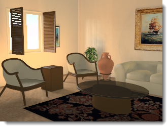

---
---

# Lighting
Lighting is the most important and most neglected consideration when creating images. It is not just a way to illuminate the model. Lighting sets the mood and is a key ingredient in determining the composition.

*Image by Christopher Soto Gutiérrez.*
Use the following guidelines when lighting your model:

>Provide accurate information whenever possible.
>Avoid using unrealistic intensity levels for light sources.
>Set the units correctly for your model. The lighting will not be correct unless the units are correct. For example, if your model is in millimeters, set the model units to millimeters.
>Adjust the overall brightness of your rendering by using the [Brightness](render-window.html#brightness) control on the rendering display. Do not attempt to adjust the overall scene brightness by changing the intensity of all of the light sources; the automatic [exposure](render-window.html#brightness) adjustment will defeat this.

Since Flamingo nXt simulates real-world lighting, it includes presets that correspond to real-world lighting situations. Lighting in Flamingo nXt uses four broad methods:

> [Studio lighting](lighting-tab.html#studio-lighting) 
> [Exterior daylight](lighting-tab.html#exterior-daylight) 
> [Interior daylight](lighting-tab.html#interior-daylight) 
> [Artificial lighting](lighting-tab.html#artificial-lighting) 

The lighting tabs that control the settings are visible depending on which preset you choose.
To improve lighting techniques, be aware of the light and how it affects various surfaces. Materials can mask some of the effects of shadows and reflections, so some rendering experts apply lighting to their models before applying materials. Try to see light objectively, the way a camera does.

### Save lighting scheme
{: #save-lighting-scheme}
Saves the current lighting scheme.

### Open lighting scheme
{: #open-lighting-scheme}
Opens a saved lighting scheme.

## Lighting Presets
{: #lighting-presets}
Flamingo nXt provides lighting presets that can help get you started lighting your model. There are many more lighting options available, but the presets are often sufficient for many different renderings.
Indirect lighting, the lighting reflected off surfaces, is on when one of the two interior presets are selected and off for studio and exterior. This type of lighting is a very significant component of an interior simulation. For exteriors and studio models the effects of indirect lighting is more subtle and is therefore turned off by default.
Choose the Preset scheme that most closely resembles your scene.

## Studio lighting
{: #studio-lighting}

This scheme mimics the lighting found in a photographer's studio. It is most useful for rendering small-to-medium-sized objects in isolation. A high-dynamic-range (HDR) image file provides the primary lighting. The light from the HDR image resembles the interior lighting levels of the studio. The HDR settings are on the [Sky tab](lighting-advanced-tab.html#sky). You can also add artificial lights to your scene using the Lights tab. The visible background in the Studio preset is black.
Studio lighting is optimized for tabletop setups for small design articles such as jewelry and product designs.
In the preset scheme, the sun is off and an HDR image sky provides something for shiny objects to reflect.
For greater control, use light sources to light the scene. When lighting a studio setup, dramatic lighting is important. Create dramatic ligshting by producing a lot of contrast. This means that dark areas are just as important as light areas. Dramatic lighting requires a number of light sources placed in a way to create very light and very dark areas.
Lighting techniques for photography are generally the same as lighting for rendering, so a good place to start learning is one of the many books on the subject of photographic lighting. For more information about setting up studio lighting, see: [Studio Lighting Basics](studio-lighting-basics.html).

## Exterior daylight
{: #exterior-daylight}

This scheme simulates daylight for architectural exteriors using a natural sun and sky.
Specify settings on the [Sun](sun-and-sky-tabs.html#sun) and [Sky](sun-and-sky-tabs.html#sky) tabs. Set [sun angles](sun-and-sky-tabs.html#set-azimuth-and-altitude) directly or use [geographical location](sun-and-sky-tabs.html#set-location-on-earth), date, and time. The default visible background for this preset is the simulated sky.
Lighting a building exterior is the most straightforward lighting model. Most exterior lighting will need no more than the default [Sun](sun-and-sky-tabs.html#sun) light source.
When the [Sun](sun-and-sky-tabs.html#sun) is turned on, the scene must be designated as an [interior](lighting-advanced-tab.html#interior) or an [exterior](lighting-advanced-tab.html#exterior). This is because the contribution of the sky light, reflected light from the ground, and light reflected off other surfaces is much different when inside as opposed to outside. Using the correct [Interior/Exterior](lighting-advanced-tab.html#indirect) setting results in effective and realistic lighting.
Sometimes it is easy to determine if a scene is an interior or an exterior. If the viewpoint is outside a building, it is an exterior scene. If the viewpoint is inside a room, it is an interior. Some kinds of scenes are not so clear. This includes courtyards, gazebos, exploded views, and sections. If a courtyard is much wider than it is tall, thereby letting in a lot of skylight, try lighting it as an exterior scene. If it is taller than it is wide, try lighting the scene as an interior. In this case, one of the tricks is to add daylight portals at the top of the courtyard to help direct the skylight into the scene.
Lights can also simulate landscape lighting. Use spotlights to highlight architectural features and trees. This works well for night or twilight scenes. During the day, the sun normally will overpower any artificial lighting in an outdoor scene, just as it will in the real world.
Exploded views, sections, and axonometric drawings from above also pose a special challenge. The decision depends on the desired results. For an exterior scene with the quickest rendering, use the exterior rendering method. If this method is not producing an interesting enough image, try using an interior rendering. This may make the interior more interesting, but it takes more time to set up the lighting.

## Interior daylight
{: #interior-daylight}

This scheme simulates an interior lit by natural light. It consists of two components: direct sunlight transmitted from the [Sun](sun-and-sky-tabs.html#sun) and indirect sunlight transmitted via the [Sky](sun-and-sky-tabs.html#sky), the ground, and other exterior objects.
The [Sun](sun-and-sky-tabs.html#sun) and [Sky](sun-and-sky-tabs.html#sky) settings are similar to the [Exterior](lighting-tab.html#exterior-daylight) preset.
The direct sunlight component of day lighting involves a straightforward calculation -- normally simply specify the time, date, and location to ensure accuracy.

## Notes

>Use accurate values for your [lights](lights-tab.html), [sky settings](sun-and-sky-tabs.html#sky), and window glass materials if possible.
>Because the sun and sky are much brighter than other lights, you may not see much effect from adding artificial lighting when the sun is on. This is normal. Avoid artificially boosting the power of your light sources.
>You can set the [Sun](sun-and-sky-tabs.html#sun-intensity) or [Sky](sun-and-sky-tabs.html#sky-intensity) intensity to a lower value. Since these settings simulate a clear sky, reducing their intensity will simulate cloudy or darker day lighting conditions.
>A [multi-channel](lights-tab.html#channel) rendering may help you get the picture you want, while still preserving accurate data.

## Artificial lighting
{: #artificial-lighting}
This scheme provides a simulation of an architectural interior at night, lit by lamps. Use the [Lights tab](lights-tab.html) or [Rhino light commands](lights-tab.html#rhino-light-commands) to insert and manage light objects in your model.

## Custom
{: #custom-lighting}
When the values on the [Advanced tab](lighting-advanced-tab.html) change from the defaults for the presets, the scheme becomes a custom scheme.

## Lighting controls

###  [Sky](sun-and-sky-tabs.html#sky) 
The [Sky tab](sun-and-sky-tabs.html#sky) has one mode for HDR image sky (studio lighting) and one for daylight lighting modes.

###  [Sun](sun-and-sky-tabs.html#sun) 
The [Sun tab](sun-and-sky-tabs.html#sun) contains the controls for altering the parameters of the automatic sky. The sun is a very bright directional light source infinitely far from the model. The controls for the sun specify its direction using spherical coordinates.

###  [Advanced](lighting-advanced-tab.html) 
The [Advanced tab](lighting-advanced-tab.html) lets you override all of the preset scheme settings to create custom lighting conditions.

