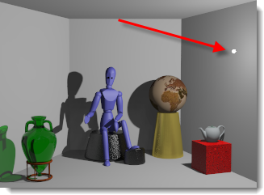

---
---

# {:height="75px" width="75px"} Lights
Artificial light sources use normal Rhino lights with added Flamingo properties to control the light distribution. When using light sources, choose the type that most closely represents the real-world lamp being modeled.

## Lights Tab
{: #light-tab}
The Lights tab will list all the artificial lights in the scene. This topic covers the Flamingo specific Lights tab.  There is also a [Rhino Lights Tab](http://docs.mcneel.com/rhino/5/help/en-us/index.htm#commands/lights.htm).  Flamingo and Rhino will keep the lights settings in sync between the two tabs.  The Flamingo Lights tab is a bit more flexible in the way it works.

#### Where can I find Flamingo Lighting control?
The Lights tab must be activated through the [Lighting Pre-set](lighting-tab.html#lighting-presets) or the [Custom Lighting settings](lighting-tab.html#sun).

 1. Toolbars >Flamingo nXt Toolbar
 1. Menus > Flamingo nXt 5.0 Pulldown > Show Control Panel > Flamingo Tab > Lights

From the Lights tab lightscan be inserted, turned off/on, changed the strength and channel of each light.

##### Flamingo supports these light types:

> [Tag objects as Lights](#tag-objects-as-lights)
> [Spotlight](#spotlight)
> [Point light](#pointlight)
> [Rectangular Light](#rectangularlight)
> [Linear Light](#linearlight)

 **Note:** Rhino Directional Lights  are not supported. They do not appear in the list of lights and cannot carry Flamingo nXt properties.

## Light Types
{: #light-types}
Lights can be inserted from the Rhino toolbars or the Flamingo Lights Tab. Objects can be tagged as lights with Flamingo.

####  Tag objects as lights
{: #tag-objects-as-lights}
<!-- TODO: Add the distribution types on this page?-->
Any renderable object (surface, solid, etc.) can be tagged as a light source and given light properties. Additional properties such as distribution, direction and strength can be assigned. Objects tagged as lights may display a preview widget showing direction of the light and were its center is location.

*LED driving lights and headlights tagged as light sources*

####  Spotlight
{: #spotlight}
SpotLight is a conical light distribution with a specific direction.  The light properties include a [source radius](#radius), [beam angle](#beam-angle), falloff radius and direction. The larger the source radius, the softer the shadows will be from the light. By default there is a visible disk at the light location. For information on editing the location, direction, beam angle on the screen using grips can be found in the [Rhinoceros Spotlight](http://docs.mcneel.com/rhino/5/help/en-us/commands/spotlight.htm) help topic.

*A Spotlight pointed at the red box.*

####  PointLight
{: #pointlight}
Point lights are a small sphere that distributes light equally in all directions. Light properties for this light include [source radius](#radius). The larger the radius, the softer the shadows it will cast from the light. By default there is a visible light sphere at the light location when rendering. Note that unusual effects can happen if the pointlight is partially obscured by an object that intersects the light.

*A small pointlight close to the right wall.*

####  RectangularLight
{: #rectangularlight}
Provides an approximation of a recessed light with a diffuser or baffles. The light distributes light in a diffuse pattern based on the orientation of the rectangle. An direction arrow is drawn at the center point of the light. Directly in front of the rectangle is full strength.  Then the light falls off as the objects are at an angle to the rectangle. By default a white rectangle will be visible when rendering. A common mistake is to insert these rectangles at exactly the same height as a ceiling plane. For consistent results, make sure the lights are slightly below the ceiling. For information on editing the location, direction, beam angle on the screen using grips can be found in the [Rhinoceros Rectangular Light](http://docs.mcneel.com/rhino/5/help/en-us/commands/rectangularlight.htm) help topic.

*A rectangular light just below the ceiling*

####  LinearLight
{: #linearlight}
Distributes light in a cylindrical pattern that imitates a fluorescent tube. Light properties for this light include [source radius](#radius) and length. The larger the radius, the softer the shadows it will cast from the light. By default there is a visible light cylinder at the light location when rendering. Note that unusual effects can happen if the cylindrical light is partially obscured by an object that intersects the light. Use Rhino Control points to activate the grips on the light to edit on the screen.

## Light Properties
{: #light-properties}
When Flamingo is the current rendering application in Rhino, additional properties can be set for lights. Lights have some but not all properties in common.
Some light properties are displayed on the Lights tab as a matrix: [On/Off](lights-tab.html#on), [Name](lights-tab.html#name), [Distribution](lights-tab.html#light-distribution), [Aim](lights-tab.html#aim-light), [Watts](lights-tab.html#watts), and [Channel](lights-tab.html#channel).

### Name
{: #name}
The name of the light object.

### On
{: #on}
Toggles the light on and off.

### Visible
{: #visible}
The light object itself will be visible in the rendered image.

### Light distribution *( [Tagged objects only](#tag-objects-as-lights) )*
{: #light-distribution}
Specifies the light distribution pattern.

#### All Directions
Simulates a point light.

#### Diffuse
Simulates a rectangular light.

#### Spot
Simulates a spotlight.

### Aim light *( [Tagged objects only](#tag-objects-as-lights) )*
{: #aim-light}
Drag the light target into position.

### Watts
{: #watts}
Specifies the electrical power usage.

### Beam angle *( [Spotlights only](lights-tab.html#spotlight) )*
{: #beam-angle}
The degree of width that light emanates from a light source.

### Radius
{: #radius}
The size of the light. Smaller lights cast sharper shadows.

### Color
{: #color}
The color for the light.

#### Use material color *( [Tagged objects only](#tag-objects-as-lights) )*
Uses the color of the material assigned to the light object for the light it produces.

### Channel
{: #channel}
Specifies one of eight channels for the light.
This controls the number of channels for multi-channel rendering.
This feature lets you adjust the lighting in your rendered image in real time, after the rendering has been produced. Each light source in the drawing, including the sun and sky, can be assigned to a channel. Once this image is rendered, each channel can be individually scaled either in the Render Window before saving or it can be saved to an .nXtImage file for later editing. Using this capability, you can produce day and night interiors with a single rendering.
Click to play video clip.
The following conditions are necessary to produce and manipulate a multi-channel image:

>All participating lights must be on.
>Each light source must be assigned a channel. By default, Sun and Sky are set to channel 0.
>The only saved format that preserves this channel information is the .nXtImage format. Lighting can be adjusted there and then the image saved to a bitmap format.

## Additional options
{: #additional-options}

> [id="a13" style="position: relative;">Right-click]() a light in the Lights tab for additional options

####  [On](lights-tab.html#on)

#### Delete
Deletes the selected light.

#### Remove light tag
Removes the [tag](lights-tab.html#tag-objects-as-lights) that makes an object a light.

####  [Properties](lights-tab.html#light-properties)

#### Select objects and matching items
Selects the light in the viewport.

## IES File
{: #iesfile}
IES (Illuminating Engineering Society) files are photometry files that define the distribution of light from a light source. Light fixture manufacturers often provide these files. By using the IES file to define your distribution, you can more accurately depict your light source. The geometry of the tagged light object has no relationship to the distribution of light. The definition of the light distribution comes from the photometry file alone.

## Notes:

>Flamingo nXt supports Type C goniometry files, which includes the majority of IES files. Type A, which are occasionally used by the automobile industry to define headlights, and Type B files, which are sometimes used to define floodlighting, are not supported.
>IES distributions include the effects of light fixture elements such as baffles, reflectors, and diffusers.
>IES distributions are often asymmetrical, so the process of aiming the source includes not just a target, but a rotation angle as well.

### Brightness from file
Use the intensity stored in the IES file. If this is not checked, the  [Watts](lights-tab.html#watts)  setting is used.
