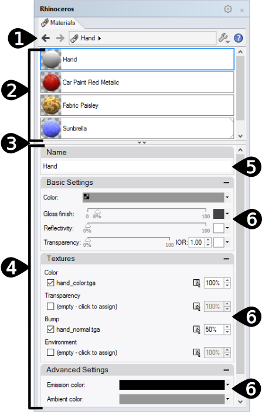

---
---

# {:height="75px" width="75px"} Material Editor Panel
Materials contain the specification of color, reflectivity, transparency, textures, and bump-maps of a surface finish. All materials have basic settings. The default material is white and matte, with no reflectivity or transparency. For best result use Flamingo specific materials.

Materials can be assign to layer, objects and blocks. Assignments can be made by dragged and dropped onto objects or various controls. See [Material Assignments](material_assignment.html) for more information.

Once assigned, materials are stored in the model. The material, textures and all support files for rendering can be stored within the Rhino model with properly set [Rendering Options](http://docs.mcneel.com/rhino/5/help/en-us/index.htm#options/rendering.htm).

Materials, environments, and textures are stored in the model, but render content can also be saved to files that can be shared between models. Content can be dragged between Rhino sessions and into a folder. Color swatches can be dragged and dropped in the same way. The [Libraries Panel](libraries.html) displays the default content folder. Use this to drag and drop content into the model or to drag and drop model content to an external file.

{:  #panel_map height="600px" style="float: right"}

#### Where can I find this command?
 1. Materials Tab
 1. Render Tools Toolbars >  Material Editor
 1. Menus > Render Pulldown > Materials Editor
 1. Command > MaterialEditor

The Material Editor Panel is split into discrete sections.  Based on the material type, the advanced panels may vary.

Colors and textures can be dragged from the color swatch and dropped onto any other color swatch or control in the Material Editor, [Texture Palette](texturepalette.html), or [Environment Editor](environmenteditor.html).
Materials Panel

 1. [Settings Bar](#settings)
 1. [Material List](#material_list)
 1. [Window Divider](#divider)
 1. [Material Properties Section](#properties)
 1. [Name](#name)
 1. [Material Properties Panels](#panels)

## [Settings Bar](#panel_map) 
{: #settings}
Use this bar to navigate the material during its development.
<!-- TODO: This content is from the old source.  It needs heavy editing-->

####  Back Arrow
Walks back though the current material or the previously selected materials.  For instance materials with textures have multiple layers.  Use this arrow to get back to the parent material from the texture details.

####   Forward Arrow
Walks back though the current material or the previously selected materials.  For instance materials with textures have multiple layers.  Use this arrow to get back to the recently used texture from the parent material.

####  Currently selected material name
<!-- TODO: Add a texture image image and a procedural icon-->
Displays the current material name and level.  For instance, if there is a texture or a material procedural level the ">" will be shown. A good place to see where the editor is in a material.

####  Tools Menu
Displays the [Tools menu](material_editor.html#tools-menu).  This is an extensive menu of commands, settings and utilities related to materials.

####  Help

## [Materials List](#panel_map) 
{: #material_list}
This lists all the materials contained in the model. From this list:

* Scroll up and down in the list to see all the material in the model.
* Drag and drop a material from this list onto a layer in the [Layer Panel](http://docs.mcneel.com/rhino/5/help/en-us/index.htm#commands/layer.htm) or directly onto and Object to assign it to an Object. See [Material Assignments](material_assignment.html) for more information.
* Add a new Material using the Add New Button  at the bottom of the list.
* Click on each material to select it. Once selected the material's properties will be shown in the panels below. See [Render Materials Properties](#properties) for more information
* Right-click a thumbnail to display the Material context menu
* Right-click the blank area to display the New Material Context Menu

###   Add new material
{: #add_material}
Scroll down to the bottom of the Material list to see the add icon.

Opens the Render Content [library](libraries.html) of materials.
The materials in the library act as templates for creating materials in the model.

### Material Context Menu
{: material_context}
This menu is available by right click on a material listing.  See the [Tools Menu](#tools_menu) for details on the many options in this menu.

### New Material Context Menu
{: new_material_context}
This menus is available by right-clicking on a blank area of the Material List.

####  Create New Basic Material
Creates a new basic matte white material.

####  Paste
Creates a new material based on the contents of the Clipboard.

####  Paste as Instance
Creates a new material based on the contents of the Clipboard that is linked to the original through instancing.

####  Grid
Displays the previews as a grid of thumbnails.

####  List
Displays the previews as a list of thumbnails.

####  Tree
Displays the previews as a tree showing nesting.

####  Horizontal Layout
Displays the previews to the left of the controls.

####  Show Preview Pane
Displays the preview properties for the currently-selected thumbnail. Set the preview geometry, size, background, rotation behavior.

####  Float
Floats the preview image in a re-sizable window.

#### Thumbnails

#####  Small
Sets the thumbnail size to the smallest size.

#####  Medium
Sets the thumbnail size to medium size.

#####  Large
Sets the thumbnail size to large size.

#####  Show Labels
Displays thumbnail name labels when in Grid mode.
List mode always displays labels.

#####  Show Units
Displays size in model units.

#####  Auto-Update Preview
Automatically updates all previews as settings change.

#####  Update All Previews
Update previews manually when Auto-Update Preview is off.

## [Window Divider](#panel_map) 
{: divider}
Drag on this divider to change the length of the Material List versus the length of the Material Properties Section.

## [Material Properties Section](#panel_map) 
{: properties}

### [Material Name](#panel_map) 
{: #name}
This is the name of the material. The material name is also saved as the file name when exporting the material to the library. note: - materials are stored in the Rhino model, unique materials can have the same name in different Rhino models.

### [Material Panels](material-editor.html#panel_map) 
{: #panels}
The Materials Properties section is filled with a number of direct Material panels. Clicking on the grey title bar will rollup the material panel, hiding the contents of that panel.  Click on the title bar again to show contents.

Material Panels will vary based on the type of material and the current active material level. For more information on specific material panels see [Flamingo Materials](material-type-simple.html)

## Tools menu 
{: #tools_menu}
<!-- TODO: This comes from the page http://docs.mcneel.com/rhino/5/help/en-us/popup_moreinformation/materialthumbnail_contextmenu.htm -->
These settings also appear on right-click context menus for the thumbnail previews and the thumbnail background.

####  Assign to Selection
Assigns the current material to selected objects.

##### To assign a material to objects
 1. Click Assign to Selection.
 1. In the Rhino viewport, select the target objects.

##### To pre-select objects
 1. In the Rhino viewport, select the target objects.
 1. Click Assign to Selection.
The target objects can be selected either before or after clicking Assign to Selection.

##### To drag and drop materials to objects
 * Drag the material from the thumbnails or list onto the target objects.
Drag and drop works for only one object at a time.

####  Assign to Layers
Assigns the current material to layers.

##### To assign a material to layers
 1. Click Assign to Layers.
 1. In the Choose Layers dialog box, check the boxes for the material assignment.

##### To assign materials from the Layers panel
 1. In the  [Layer](layer.html)  panel, select one or more layers and click the  [Material](layer.html#material)  column.
 1. In the Layer Material dialog box, select the material to assign.

##### To drag and drop materials to objects
 * Drag the material from the thumbnails or list onto the target layer.
Drag and drop works for only one layer at a time.

####  Select Objects
Select objects in the model for material assignment.

####  Create New Material
Opens the Render Content [library](libraries.html) of materials.
The materials in the library act as templates for creating materials in the model.

####  Import Material from File
Imports materials from a saved Rhino .rmtl file.

####  Save to File
Saves a material to a Rhino .rmtl file.

####  Change Type
Changes the material to a different type.

####  Change Type (Copy Similar Settings)
Changes the material to a different type.
The default behavior depends on the current state of the [Rendering Options](rendering.html) &gt;  [Copy similar settings when content type is changed](rendering.html#copy-similar-settings-when-content-type-is-changed)  box. If checked, compatible settings from the old content will be copied to the new one.
<!--TODO: The links above need to be updated.-->

####  Reset to Defaults
Changes all of the material settings to the default white, matte, non-reflective, untextured material.

####  Copy
Copies the selected material to the Windows Clipboard. The Clipboard can then be pasted into the editor to create a new material or pasted directly into a folder to create a [library](libraries.html) file.

####  Paste
Creates a new material based on the contents of the Clipboard.

####  Paste as Instance
Creates a new material based on the contents of the Clipboard that is linked to the original through instancing.

####  Delete
Deletes the selected material.

####  Rename...
Renames the selected material.

####  Duplicate
Copies the selected material to a new material with the same settings.

####  Remove Instancing
Removes the connection between [instanced](#paste-as-instance) materials.

####  Content Filter
Opens the [Content Filters](content_filters.html) dialog box.

####  Properties
Opens the [Preview Properties](previewproperties.html) dialog box.
