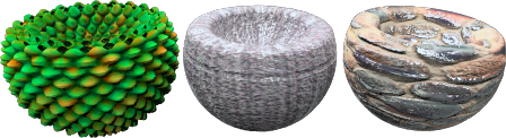
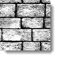
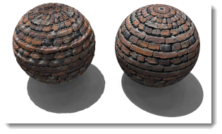
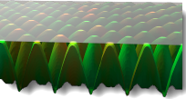
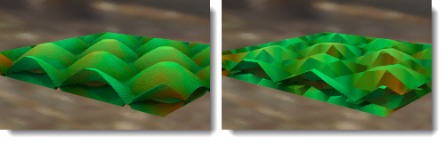

---
---

# {:height="75px" width="75px"} Material Image Properties

Materials can be created from images. Scan photographs and real materials like wallpaper and carpet, create patterns in a paint program, or use images from other sources of bitmap.
Imagine that the material stretches infinitely in all directions in space. The material becomes visible only where an object passes through it. Patterns are repeated infinitely (tiled) in four directions at a specified scale.
Small images that can be seamlessly tiled tend to work best. If the bitmap does not tile well, use the option to mirror the tiles. This guarantees matched edges.
 **Note** : To make a bitmap image cover only part on the object (like a label on a wine bottle or a logo on a product), use the [Decal](properties-decal.html) feature instead.
Image maps can be used many ways. A common method is to use a picture of a real-world material as the materials color.

## Name
Image Textures can be named.  This name is used by the Texture library of the RDK and has no real impact on Flamingo.

## Flamingo Image

### Image preview
{: #image-preview}
Displays a preview of the selected image file. Hold the mouse over the image to a see a pop-up of the image file name.  Click on the image to select a different image.

#### Image resolution
{: #image-resolution}
Displays the resolution in pixels of the current image file.

### Tiles
{: #tiles}
Image maps used in material definitions are always repeated (tiled). These settings specify how large each instance (tile) will be in current model units.

#### Width/Height
{: #width-height}
Sets the tile size in model units.




### Mapping type
{: #mapping-type}
Images normally apply to the color channel. But there are other ways to use images.  Images can be set as:

> [Standard](#standard)
> [Normal](#normal)
> [Displacement](#displacement)

### Standard
{: standard}
The image provides color and visual bump to the material. Use the Strength and Bump values to control how the bitmap will influence the material.

#### Color Strength
{: #color}
Determines how much the image map influences the appearance of the material. In the example below, the underlying material is magenta colored. The color strength increases until the underlying color is completely masked by the black and white texture.
 *Color strength 0.2, 0.5, 1.0.*

#### Bump Strength
{: #bump}
Simulates bumps and wrinkles on the surface of an object by perturbing the&#160;surface normals&#160;of the object. The underlying object is not changed.&#160;In the illustration, the material on the left uses displacement mapping, while the material on the right uses bump mapping set at its highest value. The edge and shadow are smooth for the bump-mapped material. See: [Wikipedia article: Bump mapping](http://en.wikipedia.org/wiki/Bump_mapping).
 *Bump strength, 0.5 (left) and 1.0 (right).*

### Normal
{: #normal}
Fakes the lighting of bumps and dents without using more&#160;polygons to the render mesh. See: [Wikipedia article: Normal mapping](http://en.wikipedia.org/wiki/Normal_mapping).
Normal maps work similar to bump maps, in that they modify the normal of the surface. The effect is essentially the same as bump; but normal maps allow more control over the normal than a bump. A bump map uses the grey average of the RGB in a bitmap. The RGB of a normal map corresponds to the modification of the XYZ of the normal.

### Displacement
{: #displacement}
Causes an effect where the actual geometric position of the surface isdisplaced, often along the&#160;local&#160;surface normal. See: [Wikipedia article: Displacement mapping](http://en.wikipedia.org/wiki/Displacement_mapping).
Displaces the material using the color values to move points on the render mesh.
 **Note** : Use displacement mapping sparingly for small objects. Displacement increases rendering time considerably.

#### Height
{: #height}
The height of the highest point of displacement.

#### Offset
{: #offset}
Sets the starting point of the displacement with reference to the surface normal.

Z-offset = -1.0

Z-offset = -0.5

Z-offset = 0.0

#### Facet size
{: #facet-size}
The size of the facets of the displacement mesh.

## Flamingo Image Advanced
{: #advanced}
Normally a Flamingo Image will apply to the main color channel of a material. The Flamingo Advanced dialog specifies other channels that the bitmap can effect.  These are used for very special effects.

####  [Base color](advanced-material-properties-main.html#color)

####  [Specular color](advanced-material-properties-main.html#highlight-color)

####  [Specular intensity](advanced-material-properties-main.html#intensity)

####  [Highlight sharpness](advanced-material-properties-main.html#sharpness)

#### Highlight shape
{: #advanced-highlight-shape}
Affects the shape of the highlight.

####  [Transparency](advanced-material-properties-transparency.html)

####  [Translucency](advanced-material-properties-transparency.html#translucency)

####  [Attenuation](advanced-material-properties-transparency.html#attenuation)

### Offsets X/Y
{: #advanced-x-y-offset}
Offsets the material from the x- and y-axis.

###  [Rotation](advanced-material-properties-textures.html#rotation)
