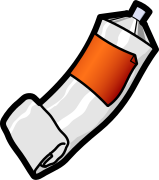
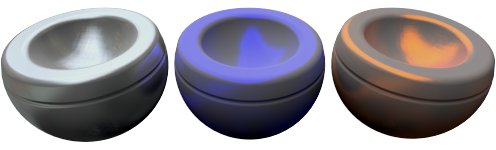
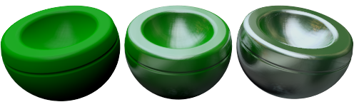
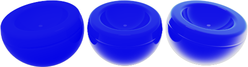
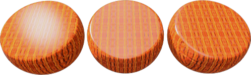
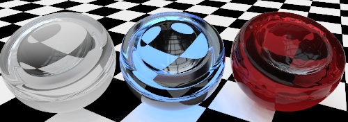
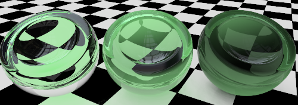
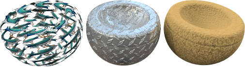
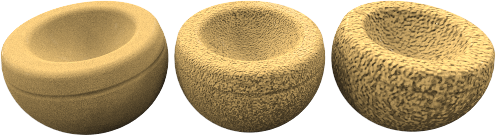
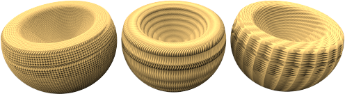

---
---

# {:height="75px" width="75px"} Advanced Material Properties

Flamingo has both [Simple Material](material-type-simple.html) Types and an Advanced Material type.  The Advanced Material contains the complete series of property groups for a material.  Use the Advanced Material type for the maximum flexibility and control of a material.

The complete set of property groups in the Advanced Material are:

> [Name](#name)
> [Material Procedure](#proceedures)
> [Advanced Material Properties](#advanced)
> [Reflective Finish](#reflective)
> [Transparency Properties](#transparent)
> [Procedural Textures](#texture_procedural)
> [Bitmap Textures](#texture_bitmap)
> [Notes](#notes)

## Material Name
{: #name}
This is the name of the material in the Rhino model.  Materials are stored in the Rhino model. That means a with the same name in the library or a different model will not be affected by edits to the material in the current model. To use any material in another model it must be exported to the [Library](libraries.html) first. The Name of the material will also serve as its exported file name.

## Material Procedures
{: #procedures}
The Procedures tree combines one or more materials using a set of rules for how the materials interact. The tree displays the components used to create the material and lets you add components. For standard materials, there will be only one component in the list: Base.

Each procedure combines two "child" materials using a specific method. Each of these child materials can in turn consist of a procedure, combining two children of its own. In this way, extremely elaborate materials can be built from simpler constituents. Procedures for combining materials include angular blend, blend, marble, granite, tile, and wood.

As an example, the Marble Procedure combines a Base material and Vein Material in a swirling pattern.

<!-- TODO: We need an diagram describing the Proceedure Hirarchyarchy. -->

##### To add a procedure
1. Right-click on **Base** the **Procedures** window.
1. On the menu, click a procedure type.
> [Angular Blend](procedural-materials.html#angular-blend)
> [Blend](procedural-materials.html#blend)
> [Granite](procedural-materials.html#granite)
> [Marble](procedural-materials.html#marble)
> [Tile](procedural-materials.html#tile)
> [Wood](procedural-materials.html#wood)

##### To remove a procedure
 1. In the **Procedures** window,right-click the procedure name.
 2. On the menu, click **Remove**.

## Basic material properties
{: #basic-materials-properties}


## Reflective Finish and Highlight
{: #reflective-finish-and-highlight}
These settings vary the way a material reflects light and objects. The highlight effect is normally associated with light areas on glossy materials where the light hits the object.
 **Note** : To activate these settings, the **Intensity** value must be greater than zero.

### Highlight color
{: #highlight-color}

#### White
Materials with a white highlight tend to resemble plastics.

#### Metallic
{: #metallic}
Sets the highlight color to match the base color.
 **Note** : Chrome and other reflective materials do not make an interesting image unless they have something to reflect. Simply applying a reflective metal material to an object is not enough.

#### Custom
Specify any color for the highlight.

### Intensity
{: #intensity}
Adjusts the strength of the highlight. Larger values increase the size and strength of the highlight.

### Fresnel
{: #fresnel}
Pronounced (fray-NELL) Controls the reflectivity of opaque materials, a phenomenon known as [Fresnel reflection of conductors](http://en.wikipedia.org/wiki/Fresnel_equations) .The Fresnel setting &#160;models the tendency of many materials to become more specular (mirror-like) at glancing angles while retaining more matte properties at perpendicular viewing angles.
Reduce the value for very dark materials to prevent too much reflection.&#160;Increase the value for materials like varnished wood, where the Fresnel reflectivity is more pronounced.

### Sharpness
{: #sharpness}
Sets the size of the highlight. Lower numbers specify a broader highlight; higher numbers focus the highlight in a smaller area.

### Type
{: #type}
Changes how reflections are calculated when artificial light sources are reflected.
Reflections are calculated using two methods: *raycasting* and *highlight*. These two methods will eventually produce identical results; however, in certain situations, you will find that one method gets a good result more quickly. For example, objects might not look good because a light source reflection hides the material's appearance.
In the illustration below for **Balanced** type, the object on the left has a bright white reflection that overpowers the material's appearance.
 **Note** : Blurry reflections of light sources can be associated with interior renderings where the light sources are small. The surfaces exhibiting the artifact typically have blurry reflections. Changing the type to [Glossy](advanced-material-properties-main.html#glossy), [No Light Source Reflections](advanced-material-properties-main.html#no-light-source-reflection), or [Monte Carlo](advanced-material-properties-main.html#monte-carlo) can help alleviate this problem.

#### Balanced
{: #balanced}
Automatically balances raycasting and highlight based on the **Sharpness** setting. Both the actual reflection of the light source and the artificial highlight are calculated.

#### Glossy
{: #glossy}
Increases the blurriness of the highlight and prevents raycasting. No object or light reflections are calculated, therefore performance is increased, and artifacts for materials with very blurry reflections are prevented. Some reflective subtlety may be lost.

#### Monte Carlo
{: #monte-carlo}
Only raycasting is used to calculate reflections of light sources. The raycasting is initially very noisy and gradually converges to the correct solution. It is most useful when the highlight is not blurry.

#### No Highlight
{: #no-highlight}
Only raycasting is used to calculate reflections of light sources. This is useful when light sources are large and the material is not blurry; in which case, the highlight calculation can take a long time. The light source reflections gradually converge.

#### No Light Source Reflection or No Highlight
{: #no-light-source-reflection-and-no-highlight}
Excludes all reflections of artificial light sources and the artificial highlight effect. Object reflections are still calculated.

#### No Light Source Reflections
{: #no-light-source-reflection}
Excludes raycast reflections of light sources, only the highlight is used. This is sometimes useful for preventing speckle artifacts if the material is blurry and the scene contains small, bright, light sources.

## Transparency
{: transparncy}
The Transparency settings control&#160;properties associated with light passing through a material.

### Transparency Intensity
Changes the material from opaque to transparent. Transparent materials increase rendering time.

### Index of Refraction
{: #index-of-refraction}
Determines how much refraction occurs when looking through the material at objects beyond.

The following table shows some examples of index of refraction:

### Material

### IOR
Vacuum
1. Air
1. Ice
1. Water
1. Glass
1. Emerald
1. Ruby/Sapphire
1. Diamond
1.
### Translucency
{: #translucency}
A measure of diffusion. High translucency produces a “sandblasted” effect, since more light is scattered randomly through the material.

### Scattering
{: #scattering}
Controls the probability of the light encountering a particle per unit length.
 **Note** : The&#160; [Path Tracer](render-tab.html#path-tracer) &#160;is required for this effect.
Subsurface scattering permits light to penetrate the object's surface and scatter in any direction. Many translucent materials can be modeled using this effect. Certain surfaces, such as stone or skin can be realistically “softened” by allowing the light to penetrate a short distance.
The material must have some transparency in order for sub-surface scattering to take place. This is a volumetric effect. The objects with this material attached must be solid or “space enclosing” for this to work properly.

### Attenuation
{: #attenuation}
Determines how much light is absorbed as it passes through the object— greater values produce a more cloudy appearance. Use **Attenuation** to model liquids. Clear liquids have low **Attenuation** ; murky liquids have higher **Attenuation** values.

### Dispersion
{: #dispersion}
Controls how much light is split into its component wavelengths.

### Saturation
{: #saturation}
Determines the amount of dispersion.

### Blurry Transparency
{: #blurry-transparency}
When a material is partially transparent, a little noise is introduced into the transparency, to make the material look more natural.

#### Blurriness
Controls the amount of noise added.

### Glow
{: #glow}
Creates the illusion of illumination.

## Textures
{: #textures}
Two types of maps can be added to a material: image maps and bump patterns. Image mapping uses bitmap images to add detail to the material. Images can alter many attributes of the materials surface including its color and apparent three-dimensional surface quality (bump). Bumps add a random roughness or knurled quality to the surface.

Image maps are two-dimensional patterns created using raster-based paint programs or by scanning photographs or other materials. Image maps can be used many ways. A common method is to use a picture of a real-world material as the materials color.

Buttons display previews of the specified image files.

>Click a button with an image to edit its [texture properties](texture-properties-main.html). Click a blank image button to apply a new image.

Textures can consist of more than one image. Sometimes one image controls the color and another controls the bump properties of the texture.

### Bump Patterns
{: #bump-patterns}
Bumps create the appearance of a specific kind of surface without using displacement maps or requiring additional maps. When one of the bump maps is checked, additional controls become available. Bumps use mathematical rules to provide the illusion of surface bumpiness in the material. More than one bump pattern can be added to a material.
Materials like stucco, concrete, and clay have a fine texture. It is probably not worth scanning a piece of the material to make a bitmap for it unless it will be viewed at close range. Using a **Sandpaper** procedural bump on a ** [Base Color](advanced-material-properties-main.html#color) ** emulates this kind of fine pattern. Create a ** [Base Color](advanced-material-properties-main.html#color) ** that is the color of the material. Then add a procedural bump to the material. Use **Sandpaper** for a fine texture and **Rubble** for a coarser texture.

#### Sandpaper
{: #sandpaper}
Provides a random, finely textured appearance.

#### Rubble
{: #rubble}
Gives the appearance of a lumpy, pitted surface. It can be scaled up and used for water, dirt, and smudges on surfaces. **Rubble** bump has a larger size range than **Sandpaper**.

#### Pyramid
{: #pyramid}
Gives the appearance of small pyramidal protrusions like a knurl pattern.

#### Wrinkled
{: #wrinkled}
Gives a wrinkled appearance.

#### Marbled
{: #marbled}
Gives a marbled appearance

### Scale
{: #scale}
Scale controls the proportional size of the bumps.

#### X/Y/Z
Specifies scale in each direction separately.

#### Lock
Maintains the aspect ratio.

### Properties

#### Strength
{: #strength}
Controls the appearance of depth.

#### Rotation
{: #rotation}
Sets the rotation angle for the pattern.
Changes to the orientation are normally apparent only if the procedural map has an obvious pattern or if the bump map has been scaled with different x, y and z components to produce a directional pattern.

