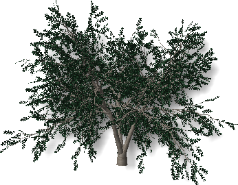
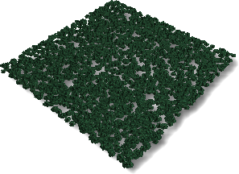
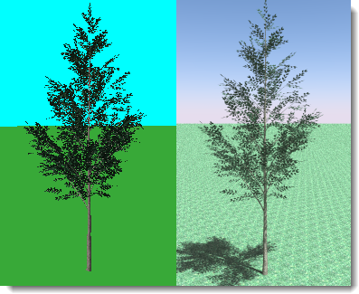

# {: .inline} {{page.title}}
{: #tree-editor}

### File Pulldown

#### New
Create a new plant definition based on a template.

 | {: .inline} | {: .inline} | {: .inline} |
 |:-------------------------------------------:|:-----------------------------------------:|:-------------------------------------:|
 | **Standard**                                |   **Conifer**                             | **Broad Crown**                       |
 | {: .inline}         | {: .inline} | {: .inline} |
 | **Palm**                                    |  **Groundcover**                          | **Complex**                                  
{: .plant-table}

#### Open
Opens an existing tree definition.

#### Save
Saves the current tree definition.

#### Save As
Saves the current tree definition to a different name.

### Raytrace Pulldown
Renders the preview image.

*Default (left) and raytraced (right) view.*

#### Start
Start rendering the preview image.

#### Stop
Stop rendering the preview image.

### View Pulldown
Drag with the left mouse button to rotate the view camera around the target.
Drag with the right mouse button to rotate the target around the camera.
Scroll with the mouse wheel to zoom in and out.

#### Restore Default
Restores the default shaded view.

#### Show Leaves
Shows the tree preview with leaves.

*Without leaves (left) and with leaves (right).*

### Settings pulldown
Set the units in the editor to match the working units.
