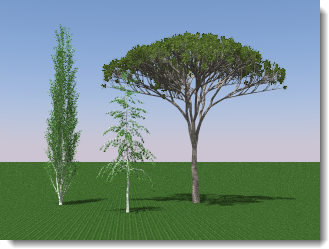

#  {{page.title}}
Flamingo nXt includes a fun and powerful plant generator that efficiently generates complex plant forms during rendering. These plants have little impact on model size, since only a placeholder is kept in the model.

*Flamingo nXt trees.*

### Insert an nXt Plant
{: #insert:}
Flamingo Plants are inserted as a block.  These blocks contains points that represent the general shape of the tree.

1. On the Flamingo nXt menu, click Plants > Insert Plant.
1. In the Flamingo nXt Plant dialog box, click a plant name, and click Open.
1. At the prompt, pick a location for your plant in the model.

Notes:

* Make sure the units are set correctly for your model.
* Plants can be scaled, copied, and rotated.

### Edit a plant
{: #edit}
Once inserted, a tree can be moved, copied, and scaled.  The tree will resize appropriately. For more advanced edits to that structure of the tree, use the Edit plant command. Making small changes to the structure of the trees can be quick.  Larger changes to the tree algorithms can take more experimentation.

1. On the Flamingo nXt menu, click Plants > Edit Plant.
1. Select the plant to edit.
1. Make the correct edits to the plant.
1. Save the tree, then close the editor.  The plant in Rhino will automatically update.

### Using Flamingo 2 plants
{: #using-flamingo-2-plants}
1. On the Flamingo nXt menu, click Plants > Insert Flamingo 2 Plant.
1. In the Flamingo nXt Plant dialog box, click a plant name, and click Open.
1. At the prompt, pick a location for your plant in the model.

Notes:

* Models with Flamingo 2 plants already inserted should work with some restrictions.
* Flamingo 2 plants are different from the new plants. Currently you cannot edit Flamingo 2 plants or convert them to Flamingo nXt plants.

### Plant Editor
{: tree-editor}
Flamingo includes a tree editor to create custom trees.  There are a few basic tree templates that can be used as a starting point for a new plant type.  For details see the [Plant Editor](tree-editor.html) topic.
